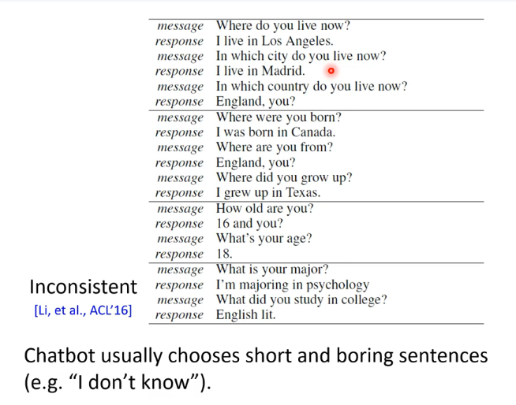
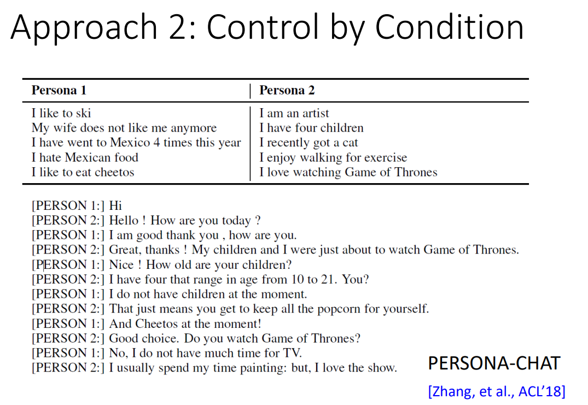

## 背景

同样的输入，可以有不同的回复，比如视聊天对象而定

训练数据中也存在这种情况：同样的输入对应着不同的回复

会有Inconsistent的问题，并且模型可能更倾向于boring的通用回复

能否给Chatbot一个人设，让它根据人设生成合适的回复？

## 方法

### 直接Finetune

MAML: https://www.youtube.com/watch?v=EkAqYbpCYAc

### 条件控制

训练时，将1和0作为decoder的输入（可以用情感分类获取数据）；测试时，由你来决定生成正面还是负面的回复

这是一篇经典的条件控制生成的文章。

将每个人用向量表示（自动学习到的），将人物的向量作为decoder的输入，生成合适的输出。

一些例子：

控制情感：

如何用某种条件操控Chatbot的输出呢？

举例说明（红色的是control code，蓝色是文本开头）

网址其实代表一段文字，修改日期可以改变文章内容。

PERSONA-CHAT数据集：

实现这种方法的模型TransferTransfo

### 只有某个角色的独白

比如没有Trump跟别人的对话，只有他的演讲等

有3种方法：Rank, Multiply, Pseudo Data

Rank

- 回复只从独白里面选

Multiply

- 在beam search的时候，用训练的语言模型去微调生成的词

Pseudo Data

- 只有独白数据，训练一个反向的Chatbot，给定回复，预测输出。这样就能获取对话数据，就能用之前的方法训练了。

decoder用一样的参数，会使得输出跟monologue类似的回复

训练一个分类器，判断一句话像不像monologue。

训练一个Chatbot，使得输出骗过分类器，更像monologue。可能会用到RL或GAN

可能出现的问题：不会管对话了，只需要生成独白就好了。

需要做一些限制

- 限制参数更新次数
- 训练另一个模型，来保证回复的句子跟输入是有关联的，合理的

也可以训练一个seqGAN

训练模型，使得输出的句子更正面

举例：

另一个模型：PPLM

训练一个Attribute Model（类似前面的Classifier），但是只通过改变Latents来改变输出，不改变模型本身的参数。

落在蓝色区域里，不像RL那样训练，容易坏掉

## Future

Chatbot本身说的句子是否正面不重要，对方看到这个回复是否变得更正面才重要（看用户的下一句回复是否正面）

## 相关论文

Yi Luan, Chris Brockett, Bill Dolan, Jianfeng Gao, Michel Galley, Multi-Task Learning for Speaker-Role Adaptation in Neural Conversation Models, IJCNLP, 2017 

• Thomas Wolf, Victor Sanh, Julien Chaumond, Clement Delangue, TransferTransfo: A Transfer Learning Approach for Neural Network Based Conversational Agents, NeurIPS Workshop, 2018 

• Di Wang, Nebojsa Jojic, Chris Brockett, Eric Nyberg, Steering Output Style and Topic in Neural Response Generation, EMNLP, 2017 

• Zhaojiang Lin, Andrea Madotto, Chien-Sheng Wu, Pascale Fung, Personalizing Dialogue Agents via Meta-Learning, ACL, 2019 

• Nitish Shirish Keskar, Bryan McCann, Lav R. Varshney, Caiming Xiong, Richard Socher, CTRL: A Conditional Transformer Language Model for Controllable Generation, arXiv, 2019 

• Saizheng Zhang, Emily Dinan, Jack Urbanek, Arthur Szlam, Douwe Kiela, Jason Weston, Personalizing Dialogue Agents: I have a dog, do you have pets too?, ACL, 2018 

• Feng-Guang Su, Aliyah Hsu, Yi-Lin Tuan and Hung-yi Lee, "Personalized Dialogue Response Generation Learned from Monologues", INTERSPEECH, 2019

Sumanth Dathathri, Andrea Madotto, Janice Lan, Jane Hung, Eric Frank, Piero Molino, Jason Yosinski, Rosanne Liu, Plug and Play Language Models: A Simple Approach to Controlled Text Generation, ICLR, 2020 

• Jamin Shin, Peng Xu, Andrea Madotto, Pascale Fung, Generating Empathetic Responses by Looking Ahead the User’s Sentiment, ICASSP, 2020 

• Hao Zhou, Minlie Huang, Tianyang Zhang, Xiaoyan Zhu, Bing Liu, Emotional Chatting Machine: Emotional Conversation Generation with Internal and External Memory, AAAI, 2018 

• Jiwei Li, Michel Galley, Chris Brockett, Georgios Spithourakis, Jianfeng Gao, Bill Dolan, A Persona-Based Neural Conversation Model, ACL, 2016

## 参考资料

[李宏毅老师的《深度学习与人类语言处理》课程](http://speech.ee.ntu.edu.tw/~tlkagk/courses_DLHLP20.html)

