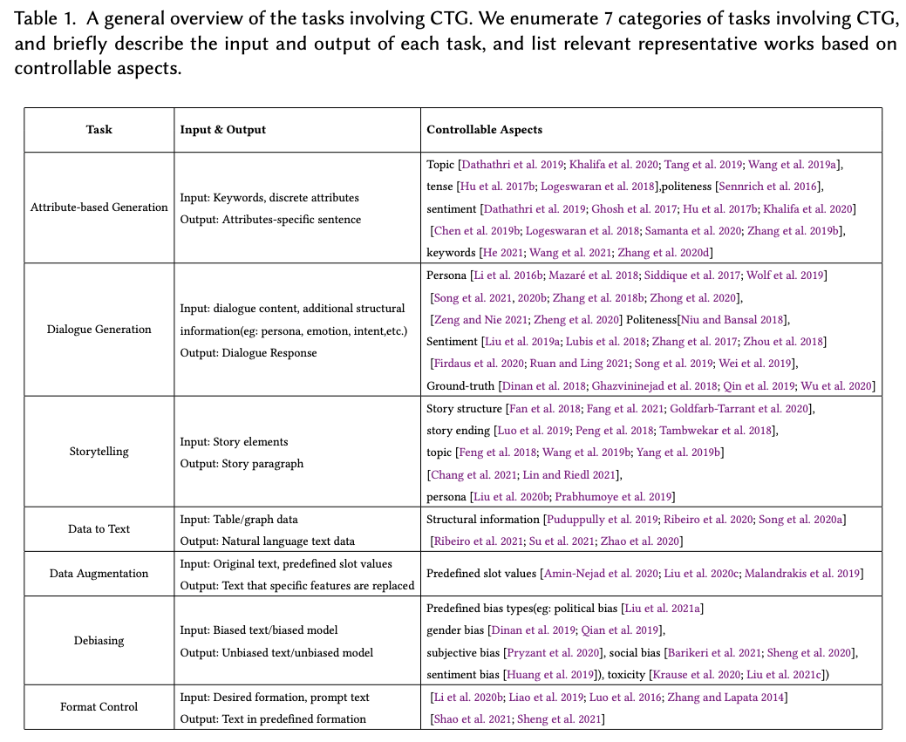
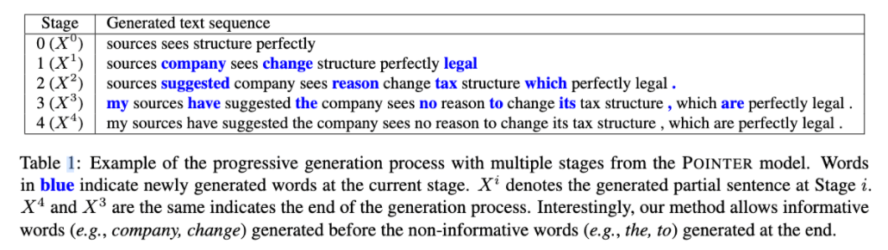

Controlable Text Generation，可控制的文本生成，就是能够在传统的文本生成的基础上，增加对生成文本一些属性、风格、关键信息等等的控制，从而使得生成的文本符合我们的某种预期。

## 应用场景
-   **Attribute-based Generation**，基于某种属性的自然语言生成，比如生成特定情感/口吻/风格的文本
    
-   **Dialogue Generation**，对话系统对NLG有更高的要求，因此CTG的应用就不言而喻了
    
-   **Storytelling**，用CTG来辅助文学创作，想想就很爽，而传统的NLG，基本给了开头你就无法控制了
    
-   **Data to Text**，使用一些结构化数据（table，graph）来生成自然语言，可用于给定每天的天气数据，来自动生成天气播报，或者把老板看不懂的表格数据用CTG技术翻译成人话给他听
    
-   **Data Augmentation**，使用CTG可以把已有的文本的某些信息给重新生成，变成我们想要的属性
    
-   **Debiasing**，这也非常重要，可以帮助我们把带有某些偏见的文本转化成无偏见的文本，让机器也符合伦理道德
    
-   **Format Control**，风格、格式的转换，比如中国古诗词就有明确的格式，这就需要在生成的时候加以控制

## CTG使用的主要PLM结构

## CTG的不同方法流派

其它方法包括：

**“调整解码策略”**。比如在解码端加入一些限制词，增加目标词汇的概率。

**“调整训练目标函数”**。比如可以学习面向情感分类任务的目标，这样可以使得模型学习到情感信息。

### Fine-tuning

- Adapted Module方式，通过额外添加一个控制模块，用于添加属性控制，然后连同PLM一起进行训练。代表方法包括 Auxiliary Tuning[2]，DialGPT[3]。
- Prompt方式，包括prompt Learning、prompt tuning[4]等方法，实际上基于prompt的方法，本身就是对PLM的生成加入了额外的控制，如果使用有监督的风格、属性数据集进行训练，就可以直接得到基于prompt的CTG模型。也有更新的工作Inverse Prompt[5]，用模型生成的句子来反过来去预测代表风格、主题等的prompt，从而让prompt对文本生成的控制力更强。
- 基于强化学习RL的方法。

在 GPT 前面加入提示信息很难做一些长文本的生成或者是更加细粒度的控制。所以出现了基于 GPT 的细粒度可控文本生成模型研究:

这篇论文的工作首先是单独对提示进行编码（上图红色部分），右侧是解码模块，主要是对历史文本进行建模，采用非残差注意力机制，同时关注 Prompting 信息和文本信息。这样做的好处是在不同生成时刻都可以替换 Prompting，实现更加细粒度的控制。

**我们可以采用自监督的方法实现细粒度可控文本生成模型训练。首先是用语言模型初始化 Prompting，然后再经过自监督训练，主要分为两个阶段，最后如果我们有一些下游任务的训练数据，可以再做一个比较好的精调。**

尽管 GPT 能够生成一些长文本，但还存在一些生成挑战。主要的问题是长文本需要的显存更大，硬件难以支持。同时计算复杂度更高，不利于模型训练和推理。

**另一个比较好的方法是基于记忆网络的模型。**

**它会把历史生成信息存到一个记忆单元，这个记忆单元是个向量矩阵的形式。在生成新段落的时候会基于当前的一些提示信息结合记忆单元的历史信息去做一个生成。**

这样做的好处是我们对历史生成信息做了一个压缩，就不必再用到每个历史的Token 信息，从而实现长本文的生成。

总之，这些基于finetuning的方法，基本都要求我们有一个下游任务的有监督数据集，从而帮助我们学习某种控制性，比如你希望控制生成文本的情感属性，那么就需要你有情感分类的数据集，让模型去学习[指定情感]——>[该情感的文本]的映射。

### Retrain/Refactor

代表性方法之一是**CTRL**[6]，由Salesforce团队带来，背后是Richard Socher大佬。CTRL收集了140GB的数据，涵盖了很多个domain的语料（百科、reddit、影评、新闻、翻译、问答...），每个domain都设置有一个control code，从而训练一个大型的包含1.63B参数量的conditional language model

具体训练上，CTRL使用的是经典的Transformer结构，那些control code是预定义好的，直接插入在sequence的开头。

另一个由南洋理工大学带来的工作**Content-Conditioner (CoCon)** [10]既改造了GPT模型，并在250K个样本上进行了对GPT进行了微调。CoCon跟CTRL和PPLM的区别在于：

以CTRL为代表的方法只能从一个总体的层面对生成文本增加限制，比如某种风格主题，但无法对具体内容进行精细控制，CoCon则是直接以原文中的部分内容作为condition，来预测下文，CoCon的结构图如下：

然后为了训练这个模型，作者设计了多种自监督的loss：Self Reconstruction Loss, Null Content Loss, Cycle ReconstructionLoss,  Adversarial Loss. 核心思想就是**使用文本的一部分作为condition，让模型对剩余部分进行复原，具体方法如下图**：

最终也取得了比较优秀的控制效果，并且支持多个控制：

上面列举的CTRL和CoCon的对NLG添加的实际上是比较soft的限制，并不强制要求模型一定要输出什么元素，而有一些工作则会使用hard的限制，要求模型必须输出给定的某些关键词。

代表性工作之一是**POINTER**[7]，出自MSR。POINTER的主要目的是训练根据指定词汇然后生成包含这些词汇的模型，采用的是一种基于插入的、渐进生成的方法：

POINTER的生成是一种迭代式地生成，先生成给定的关键词，然后每一轮都按照重要性不断插入新的词，直到把句子给补齐。POINTER中使用的一种Transformer结构叫做**Insertion Transformer**[8]，下图则展示了POINTER是如何渐进生成的：

类似的一个受限生成的工作是**Constrained BART (CBART)** [9]，来自香港大学，对BART进行了改造，通过在encoder上面添加一个token-level classifier来指导decoder在生成的时候应该进行replace还是insert，最终取得了比POINTER更好的效果:

### Post-Process

最知名的工作，要数来自Uber AI的**Plug and Play Language Models (PPLM)**[11]了:

PPLM不希望去训练PLM，而是通过额外的一个attribute model来对PLM的输出加以修正，从而符合某种预期。这里的attribute model，既可以是一个bag of words来代表某个topic，也可以是一个训练好的小模型来对某个topic进行打分，然后通过这个attribute model向PLM的hidden states传递梯度，从而对hidden states进行一定的修正，然后PLM的输出就会往我们希望的topic倾斜了。

基于PPLM，Stanford CS224N的一个project作业中，某学生提出了**Ranked Keywords to Story Generation**，该工作的目标是给定一个排序的关键词，让模型能够按照重要性在生成句子的时候把这些关键词都包括在内，具体则是在PPLM的基础上进行了改进：

具体方式是构造`<s>keywords<sep>sentence`这样的语料，然后对GPT-2进行finetune，然后再利用PPLM的思想，使用改进的BoW的方法来控制生成，也得到了比较好的效果：

**MEGATRON-CNTRL**[13]则选择利用外部知识库来辅助生成，给定一个context，MEGATRON-CNTRL会首先使用一个predictor生成一批关键词，然后通过一个retriever从知识库中找到跟这些关键词匹配的句子，然后通过一个ranker进行筛选，最后再输入PLM进行句子的生成：

还有工作比如**PAIR**[14]则是先生成一个包含关键词和位置信息的模板，然后对模板进行填空，从而进行控制性生成；**GeDi**[15]则是训练一个小型的discriminator来引导PLM的生成。

### 总结

## 评价

## 未来方向

- Prompt-based Learning
- Fine-grained Decoding Control
- Integration with Classic Generative Theory and Linguistic Knowledge
- Integration with Classic Generative Theory and Linguistic Knowledge
- Novel Evaluation Metrics and Methods
- New CTG tasks

## 涉及论文

[1] Exploring Controllable Text Generation Techniques (2020)
[2] Technical report: Auxiliary tuning and its application to conditional text generation (2020)
[3] DialoGPT: Large-Scale Generative Pre-training for Conversational Response Generation (ACL-20)
[4] The Power of Scale for Parameter-Efficient Prompt Tuning (EMNLP-21)
[5] Controllable Generation from Pre-trained Language Models via Inverse Prompting (KDD-21)
[6] CTRL: A Conditional Transformer Language Model for Controllable Generation (2019)
[7] POINTER: Constrained Text Generation via Insertion-based Generative Pre-training (EMNLP-20)
[8] Insertion Transformer: Flexible Sequence Generation via Insertion Operations (2019)
[9] Parallel Refinements for Lexically Constrained Text Generation with BART (EMNLP-21)
[10] CoCon: A Self-Supervised Approach for Controlled Text Generation (ICLR-21)
[11] Plug and Play Language Models: A Simple Approach to Controlled Text Generation (ICLR-20)
[12] Ranked Keywords to Story Generation (2021, Stanford Student Project)
[13] MEGATRON-CNTRL: Controllable Story Generation with External Knowledge Using Large-Scale Language Models (EMNLP-20)
[14] PAIR: Planning and Iterative Refinement in Pre-trained Transformers for Long Text Generation （EMNLP-20）
[15] GeDi: Generative Discriminator Guided Sequence Generation (EMNLP-21-findings)

## 参考资料

[盘点Controllable Text Generation(CTG)的进展](https://mp.weixin.qq.com/s/bSp9iWFlhmC-yB--3lxuLA)

[基于预训练语言模型的可控文本生成](https://mp.weixin.qq.com/s/Cb2LjA629J6_kHPbnEYY_w)

