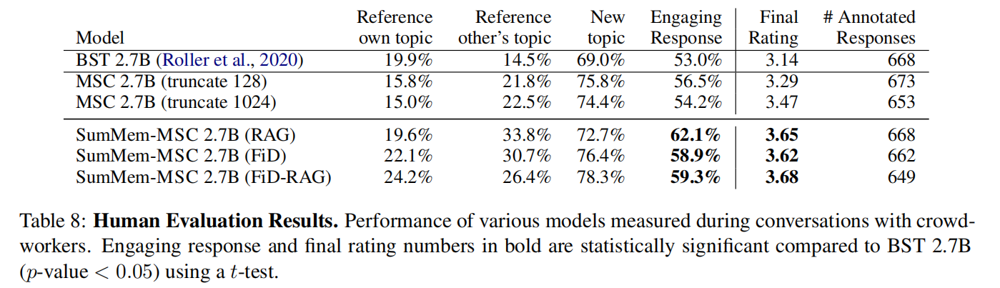

# 概述

数据集

Blended Skill Talk(BST)：5千条会话数据，目的是把knowledge、empathy、persona这三种特征汇集在一起

**BlenderBot 1本身，主要就是在Reddit预训练之后，在BST上精调，证明了当训练数据和生成策略选择得当时，大模型可以学习到这种复杂技能。**

BlenderBot 2：输入Query，先用一个Seq2Seq模型生成搜索语句，调用API得到N个返回结果，再用一个Seq2Seq模型结合上面的信息生成最终回复，训练期间这两个模型是独立的。

这个方法跟同时期的谷歌LaMDA是很像的，不同的是[LaMDA](https://mp.weixin.qq.com/s?__biz=MzAxMTk4NDkwNw==&mid=2247490295&idx=1&sn=c6a697cd25aa656b09d8d054dd23dfb0&scene=21#wechat_redirect)是用一个模型完成了搜索和最终生成。

BlenderBot 3：**加入持续学习计划**

并行地选择去搜索、还是读取记忆。对于系统中的各个模型，作者利用了20个不同特性的对话数据集来对这些算法模块做训练

同时，作者对系统的持续学习(Continual Learning)进行了一些实验，**主要是通过用户的反馈作为监督数据来精调系统中的模块**，用户可以提供如下反馈：

1.  对于BlenderBot的某个回复点赞/点踩
    
2.  点踩之后会出一个问卷，用户可以反馈点踩原因
    
3.  反馈之后，机器人会进一步问用户自己哪里错了，从而继续聊天。

最终实验发现，用户对于某个模块的反馈越精细，训练效果越好。未来作者会继续收集用户的数据优化系统，**但持续学习的方式是否能一直提升效果还有待探索**。

参考资料：
https://mp.weixin.qq.com/s/dEqiKVP2SYoojSfpL8t96A

# BlenderBot2

[https://parl.ai/projects/blenderbot2/](https://parl.ai/projects/blenderbot2/ "https://parl.ai/projects/blenderbot2/")

分为两个部分：Internet-Augmented Dialogue Generation和Beyond Goldfish Memory∗: Long-Term Open-Domain Conversation

## Internet-Augmented Generation

整体流程：Utilizing encoder-decoder architectures, we consider models that, given a dialogue context, first generate a **search query**. The queries are then used to **retrieve relevant knowledge** that is prepended to the conversational history, which is encoded using the **Fusion-in-Decoder** method. Taking into account this encoded knowledge, a response is finally generated using the **decoder**

### FAISS-based methods

首先，documents用DPR编码成dense vectors存到FAISS里，对话context也用DPR编码，然后最近邻搜索topN个文档。然后如何使用呢？

*   RAG

*   FiD：每个文档单独encoder，然后拼起来，decoder attends to这些encodings来生成回复

*   FiD-RAG

*   FAISS + Search Query-based Retrieval：用一个encoder-decoder模块生成search-query，然后再用DPR模型得到dense vector，去检索documents

FiD-RAG、搜索表现更好

### Search Engine-Augmented Generation(SEA)

一个search query generator：用一个encoder-decoder模块生成search-query，然后调用搜索引擎接口获取N个document

一个FiD-style encoder-decoder model：encode每个文档，把它们拼接到context encoding上，然后生成下一条回复

### Knowledge Response Regularization

解决模型的参数化权重知识和检索文档中的知识之间的权衡问题。

方法：多任务

*   原本的回复生成任务

*   新的任务：从检索文档（人类标注）中生成selected knowledge

### 实验结果

## Memory

两种结构

*   retrieval-augmented generative models

    *   RAG，FiD，FiD-RAG

    *   memory包括对话历史中的回复

    *   可以encoding每个回复，也可以encoding整个session（或者session summaries）

*   read-write memory-based model

    *   一个encoder-decoder abstractive summarizer，总结上一个对话轮次中的关键信息

    *   一个memory-augmented generator，根据context和memory生成回复

### 实验

## 代码

### BB2

projects.blenderbot2.agents.blenderbot2

*   BlenderBot2ModelTypeMixin(RagModelInterface)：knowledge\_access\_method如果是all的话，同时从memory和search中retrieve（n\_docs\*2）

*   BlenderBot2RagSequence(BlenderBot2ModelTypeMixin, RagSequence)：augment\_batch\_for\_generation

*   BlenderBot2RagToken(BlenderBot2ModelTypeMixin, RagToken)：pass

*   BlenderBot2RagTurn(BlenderBot2ModelTypeMixin, RagTurn)：pass

*   **BlenderBot2RagAgent(RagAgent)**：

    *   一些参数设置

    *   根据rag\_model\_type确定使用哪种rag

    *   build\_model分为T5BlenderBot2RagModel和BlenderBot2RagModel

    *   query, memory等的tokenize

*   **BlenderBot2FidAgent(FidAgent, BlenderBot2RagAgent)**：build\_model分为T5BlenderBot2FidModel和BlenderBot2FidModel

*   **BlenderBot2SearchQueryFiDAgent(BlenderBot2FidAgent)**：rag\_retriever\_type使用搜索引擎

projects.blenderbot2.agents.modules

*   **BlenderBot2RagModel(RagModel)：retrieve, memory**

    *   Classify retrieval type, if necessary

    *   retrieve from faiss or search

    *   memory search

*   T5BlenderBot2RagModel(T5RagModel, BlenderBot2RagModel)：pass

*   DummyRetriever(RagRetriever)：returns blank documents, and equal scores.用来pad document

*   LongTermMemory(RagRetriever)：writes document embeddings to a memory，retrieve\_and\_score

*   BlenderBot2Fid(Fid)：FiD Interface for BB2.

*   BlenderBot2FidModelMixin：\_rag\_model\_interface = BlenderBot2Fid

*   **BlenderBot2FidModel(BlenderBot2FidModelMixin, BlenderBot2RagModel, FidModel)**：pass

*   T5BlenderBot2FidModel(BlenderBot2FidModelMixin, T5FidModel, T5BlenderBot2RagModel)：pass

parlai.agents.fid.fid

*   Fid(RagToken)：调整decoder inputs to no repeat, as FiD attends over all encoder outputs jointly.

*   **FidModel(RagModel)**

*   T5FidModel(FidModel, T5RagModel)

*   **FidAgent(RagAgent)**

*   SearchQueryFiDAgent(FidAgent)

*   SearchQuerySearchEngineFiDAgent(SearchQueryFiDAgent)

parlai.agents.rag.rag

*   BaseGenerationAgentMixin(ABC)：没什么用，就定义了个方法build\_rag\_model

*   TransformerGeneratorRagAgent(TransformerGeneratorAgent, BaseGenerationAgentMixin)：build\_rag\_model是RagModel

*   BartRagAgent(BartAgent, BaseGenerationAgentMixin)同上

*   T5RagAgent(T5Agent, BaseGenerationAgentMixin)：build\_rag\_model是T5RagModel，重写\_generate函数

*   RagAgent(TransformerGeneratorRagAgent, BartRagAgent, T5RagAgent)：

*   RagAgent

*   **RagModel(TorchGeneratorModel)**

parlai.agents.rag.model\_types

*   RagTurn, 

*   RagSequence, 

*   RagToken, 

*   RagModelInterface,

parlai.agents.rag.dpr

*   DprQueryEncoder

*   DprDocumentEncoder

parlai.agents.rag.retrievers

### MSC

parlai.projects.msc.agents

*   MemoryRagAgent(BlenderBot2RagAgent)

    *   *set\_query\_vec(self, observation: Message)：* filter\_text过滤文本中存在retriever\_ignore\_phrases的句子，然后tokenize\_query文本，得到observation\['query\_vec']

    *   \_set\_memory\_vec(self, observation: Message)：对memory\_extractor\_phrases进行tokenize\_memory，得到observation\['memory\_vec']

*   MemoryLongRagModel(BlenderBot2RagModel)

*   MemoryLongRagAgent(MemoryRagAgent, LongRagAgent)

*   MemoryLongFidModel(BlenderBot2FidModelMixin, MemoryLongRagModel, LongFidModel)

*   MemoryLongFidAgent(LongFidAgent, MemoryRagAgent)：build\_model分为T5BlenderBot2FidModel, MemoryLongFidModel, BlenderBot2FidModel

## 复现

transformer

*   RagSequenceForGeneration，RagModel，RagRetriever，Generator

*   RagSequenceForGeneration的rag就是RagModel，重写了generate等函数

*   RagModel包括question\_encoder，retriever, generator, ctx\_encoder

*   RagRetriever包括question\_encoder\_tokenizer, generator\_tokenizer，ctx\_encoder\_tokenizer

*   RagRetriever：prefix + doc\_title + self.config.title\_sep + doc\_text + self.config.doc\_sep + input\_string得到generator的输入

parlai

*   RagModel类似于transformer的RagSequenceForGeneration和RagTokenForGeneration？（还多了个ragturn）把两个并到一起，通过参数去控制用哪个

*   rag.modules.py里RagModel(TorchGeneratorModel)包括retrieve，expand，encode，decoding，marginalize这5个步骤

*   rag.rag.py里的RagAgent

## 用法

transformers

多轮对话时候的分隔符讨论：
https://github.com/huggingface/transformers/issues/9365

https://github.com/huggingface/transformers/issues/9457

## 数据
