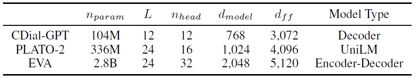
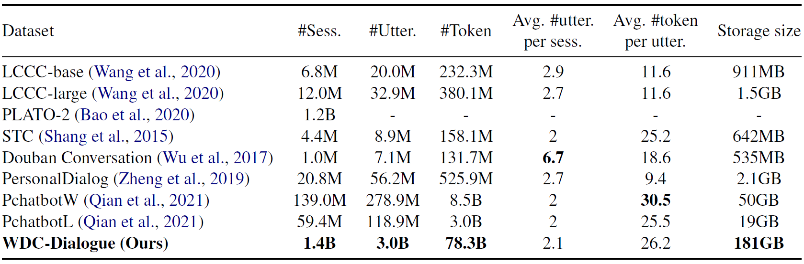
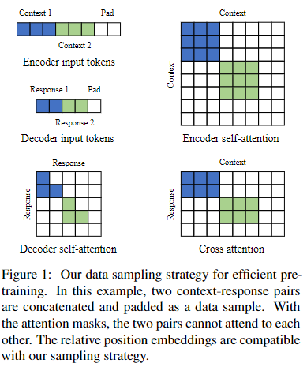

# EVA模型

EVA: An Open-Domain Chinese Dialogue System with Large-Scale Generative Pre-Training

[https://arxiv.org/pdf/2108.01547.pdf](https://arxiv.org/pdf/2108.01547.pdf)

[https://github.com/thu-coai/EVA](https://github.com/thu-coai/EVA)

CDial-GPT (Wang et al., 2020)  (with 104M parameters) is pre-trained on 12M Chi-  

nese dialogues from Weibo2. PLATO-2 (Bao et al.,  2020) (with 336M parameters) is pre-trained on  1.2B Chinese dialogues from social media.

数据集包括转发的，评论的，Q&A

模型：

- Transformer-based dialogue model with bi-directional encoder and a uni-directional decoder

- 论文：Not All Attention Is All You Need.

Tokenization

- construct a sub-word vocabulary, containing both Chinese characters and Chinese words,  based on the word segmented corpus using unigram  language model

- 论文：SentencePiece: A simple and language independent subword tokenizer and detokenizer for Neural Text Processing

- contains 30,000 tokens

预训练

- sequence-to-sequence language modeling

- 论文：Sequence to Sequence Learning with Neural Networks

- teacher-forcing paradigm

- mixed-precision training (Micikevicius et al.,  2018) and ZeRO (stage-1) (Rajbhandari et al.,  2020)

- set the maximum encoder length and maximum decoder length as 128

- 

对比Cdial-GPT和CPM模型

评估方法

- 自动评估：F1，ROUGE-L, BLEU, Distinct n-grams

- 人类评估：sensiblenss（是否流畅可读，跟上下文相关）和specificity（信息丰富））

