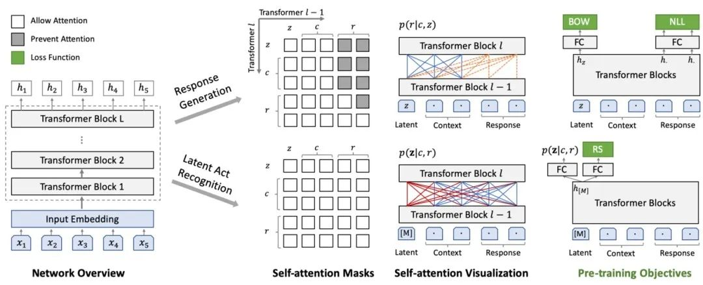
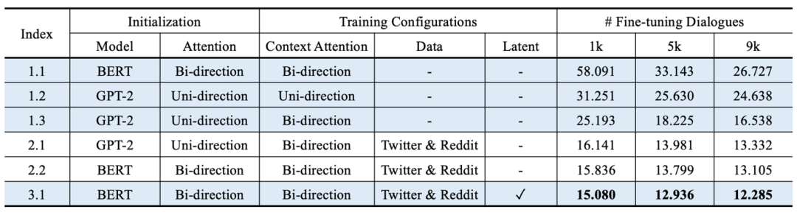

# PLATO

PLATO是业界首个基于隐空间（Latent Space）的端到端的预训练对话生成模型。据悉，该模型利用隐向量来表示对话的潜在方向，从而达到对话内容丰富度和流畅度的显著提升。针对具体的对话任务，基于PLATO可以用少量数据训练得到非常流畅的对话系统。

**论文名称：**

PLATO:Pre-trained Dialogue Generation Model with Discrete Latent Variable

**论文地址：**

[https://arxiv.org/abs/1910.07931](https://arxiv.org/abs/1910.07931)

**预训练模型及代码：**

[https://github.com/PaddlePaddle/Research/tree/master/NLP/Dialogue-PLATO](https://github.com/PaddlePaddle/Research/tree/master/NLP/Dialogue-PLATO)

代码主页：[https://github.com/PaddlePaddle/Knover/tree/develop/projects/PLATO-2](https://github.com/PaddlePaddle/Knover/tree/develop/projects/PLATO-2)

[https://github.com/PaddlePaddle/Knover](https://github.com/PaddlePaddle/Knover)

训练中文模型：[https://github.com/PaddlePaddle/Knover/issues/25](https://github.com/PaddlePaddle/Knover/issues/25)

[https://github.com/PaddlePaddle/Knover/issues/79](https://github.com/PaddlePaddle/Knover/issues/79)

[https://github.com/PaddlePaddle/Knover/issues/63](https://github.com/PaddlePaddle/Knover/issues/63)

[https://github.com/PaddlePaddle/Knover/issues/60](https://github.com/PaddlePaddle/Knover/issues/60)

对话系统的挑战非常多，其中有两点非常重要，一是大规模开放域多轮对话数据匮乏； 二是对话中涉及常识、领域知识和上下文，因此在对话回复时，存在“一对多”问题。

一个对话的上文（Context），往往可以对应多个不同回复（Response）的方向。这些不同的回复随着不同的人，不同的背景和环境可能有所不同，但都是合理的回复。

对于这种复杂的一对多的模式，神经网络拟合起来往往非常棘手。在学习这样一对多的数据的时候，会因为模型能力和数据匮乏导致最终学习的效果趋向于平庸，极易产生如“哈哈”、“嗯”这样大家熟知的索然无味的“聊天终结语”。

隐变量较为普遍地在VAE、CVAE等技术中使用，但在论文中，作者们首次提出将离散的隐变量结合Transformer结构，应用到通用的对话领域。通过引入离散隐变量，可以对上文与回复之间的“一对多”关系进行有效建模。

同时，文章中通过利用大规模的与人人对话类似的语料，包括Reddit和Twitter，进行了生成模型的预训练，后续在有限的人人对话语料上进行微调，即可以取得高质量的生成效果。

PLATO可以灵活支持多种对话，包括闲聊、知识聊天、对话问答等等。而文章最终公布的在三个公开对话数据集上的测试，PLATO都取得了新的最优效果。

## PLATO

在PLATO中，离散隐变量可以有K个取值，它的每个取值，是与一个回复中的意图相对应的，或者可以理解为多样化的对话的动作（Action）。

在PLATO的训练中，有2个任务同步进行，且共享网络参数：**回复生成**和**隐变量识别**。给定上文和离散隐变量的取值（即确定了回复中的意图），生成任务会尽量最大化目标回复的似然概率。

同时，识别任务尽量估计给定上文和目标回复对应的隐变量取值。显然，隐变量的准确识别，可以进一步提升回复生成的质量。

PLATO的网络架构如图1所示，由Transformer Blocks组成。针对多轮对话的输入的表示方法，PLATO也进行了独特的设计，每个token的Input Embedding是由对应的token、role、turn和position embedding相加得到。

预训练中同步进行了2个任务——回复生成（Response Generation）和隐变量识别（Latent Act Recognition）。

在回复生成任务中，PLATO借鉴UniLM使用了灵活的注意力机制：对上文进行了双向编码，充分利用和理解上文信息；对回复我们进行了单向解码，适应回复生成的Autoregressive特性。

在隐变量识别任务中，PLATO使用特殊符号[M]作为输入，收集给定上文和目标回复的信息，用于估计回复意图（即离散隐变量的取值）。

PLATO训练使用了三个目标函数(Loss Function)——negative log-likelihood (NLL) loss、bag-of-words (BOW) loss和response selection (RS) loss，如图1最后一列所示。

在文本生成任务中，最常用的是NLL loss，PLATO引入了BOW loss是为了促进离散隐变量的训练。此外，RS可以辅助判断一个回复与上文的相关性。

PLATO的模型由大规模语义预训练模型进行参数初始化，在预训练中，PLATO使用了8.3M Twitter和Reddit对话样本。

通过对比这些结果，可以看出：

灵活的注意力机制可以充分利用上文的双向信息（Model 1.2 v.s. Model 1.3）；大规模的Twitter和Reddit语料，显著改善回复生成（Group 2&3 v.s. Group 1）；离散隐变量的引入，则可以进一步提升回复质量（Model 3.1 v.s. Model 2.2）。

## PLATO-2

arXiv：

[https://arxiv.org/abs/2006.16779](https://arxiv.org/abs/2006.16779)

GitHub：

[https://github.com/PaddlePaddle/Knover](https://github.com/PaddlePaddle/Knover)

它的训练过程分为两个阶段，第一阶段，在一对一映射的简化框架下，训练粗粒度生成模型来学习回复生成，第二阶段，进一步训练细粒度生成模型和评估模型，这个细粒度生成模型显式地建模一对多关系，评估模型用来学习回复的一致性从而选择最合适的回复。

## PLATO-XL

PLATO-XL网络架构上承袭了PLATO unified transformer 结构,可同时进行对话理解和回复生成的联合建模,参数性价比很高。通过灵活的注意力机制,模型对上文进行了双向编码,充分利用和理解上文信息;对回复进行了单向解码,适应回复生成的auto-regressive特性。此外,unified transformer结构在对话上训练效率很高,这是由于对话样本长短不一,训练过程中padding补齐会带来大量的无效计算,unified transformer可以对输入样本进行有效的排序,大幅提升训练效率。

为了进一步改善对话模型有时候自相矛盾的问题,PLATO-XL引入了多角色感知的输入表示,以提升多轮对话上的一致性。对话模型所用的预训练语料大多是社交媒体对话,通常有多个用户参与,表述和交流一些观点和内容。在训练时,模型较难区分对话上文中不同角度的观点和信息,容易产生一些自相矛盾的回复。针对社交媒体对话多方参与的特点,PLATO-XL进行了多角色感知的预训练,对多轮对话中的各个角色进行清晰区分,辅助模型生成更加连贯、一致的回复。

PLATO-XL包括中英文2个对话模型,预训练语料规模达到千亿级token,模型规模高达110亿参数。PLATO-XL也是完全基于百度自主研发的飞桨深度学习平台,利用了飞桨 FleetX库的并行能力,使用了包括 recompute、sharded data parallelism等策略,基于高性能 GPU 集群进行了训练。

## PLATO-LTM
论文：Long Time No See! Open-Domain Conversation with Long-Term Persona Memory

#ACL  

[https://mp.weixin.qq.com/s/EGhQ2dVjxVobz4lz3vkeXw](https://mp.weixin.qq.com/s/EGhQ2dVjxVobz4lz3vkeXw)

github: https://github.com/PaddlePaddle/Research/tree/master/NLP/ACL2022-DuLeMon

task: Long-term Memory Conversation(LeMon)

dataset: DuLeMon

dialogue generation framework: PLATO-LTM

抽取和更新长期persona记忆，训练时不需要多轮的对话数据

### 数据集

- Persona collection: 主要来源于PersonaChat
- Dialogue collection: 众包对话
- Persona Grounding Labeling: 标注当前回复是否用了persona info，以及当前句子是否是persona句子

数据包括两个部分
- DeLeMon-SELF: bot只知道自己的persona
- DuLeMon-BOTH: bot也知道user的persona

### 模型

包括几个部分

1. Persona Extractor(PE)

使用分类器过滤不相关的信息，抽取persona句子

ERNIE- CNN，使用预训练的ERNIE作为句子表示，CNN作为分类

数据集：6k utterances（来源于DuLeMon和中国的社交平台）

训练5个模型（参数不同）(pc-stage1)，拿5个模型给140万数据做标注，有至少2个模型标positive就给positive标签，否则给negative标签。然后5个模型在所有数据上训练，选择表现最好的一个作为最终的模型(pc-stage2)。

2. Long-Term Memory(LTM)
两个long-term memories存储双方的persona info

reading and writing based on the context persona matching (CPM) model

context encoder Ec，persona encoder Ep，[CLS]  E

Ec和Ep用ERNIE模型初始化，然后在DuLeMon数据集上训练

每个训练样本中，positive persona是当前用户的utterance和机器人的response使用的persona, 包括机器人看到的bot persona和user persona, negative persona是current session中的剩余persona

triplet loss (context, positive persona, negative persona)

Write: PE module识别对话历史中的persona作为待写入的候选信息，需要跟memory中的persona去重，计算cosine相似度获取最相似的persona，如果超过阈值，就以新换旧，否则直接写入。需要存储(persona, Ep(persona)) pair.

Read: 从memory中检索的过程。First, we use the effificient similarity search of dense vectors to select candidates. Then a matching model is utilized to score the relevance of the candidates to the current context. The similarity between the context and the persona using cosine similarity

选择topk的user persona和topk的bot persona,过滤相似度低于阈值的那些。

3. Generation Module

大模型PLATO-2，双方的persona句子+对话上下文作为模型输入

加了角色信息区分，两个策略
- role embedding
- role token: system persona和user persona

### 实验
自动评估指标：
- Precision, Recall, F1 for persona classification model
- AUC, recall@k for the long-term memory ranking model
- PPL, BLEU, F1, DISTINCT-1/2 for response generation model

人工评估指标
- Coherence: whether the response is relevant and consistent with the context
- Consistency: whether the response is consistent with the persona in the dialogue history
- Engagingness: whether the annotator would like to talk with the speaker for each response in the long-term conversation

PE模型：200条测试样本

ranking model CPM
- AUC 0.76, recall@5 0.83

generate model

self-chat, PLATO-LTM是user simulator, 其它所有模型是bot (包括plato-ltm)

PLATO-FT: The PLATO-2 model fine-tuned on our proposed DuLeMon dataset.

PLATO-LTM: The PLATO-FT model with our proposed long-term memory (LTM).

PLATO-LTM w/o PE: PLATO-LTM without the persona extractor (PE) module, which stores all history utterances (user and bot separately) into memory without persona extraction.

## 参考资料

[PLATO：百度发布首个大规模隐变量对话模型](https://mp.weixin.qq.com/s/c5OOCwOuZpm8qxbvgjZh8Q)

