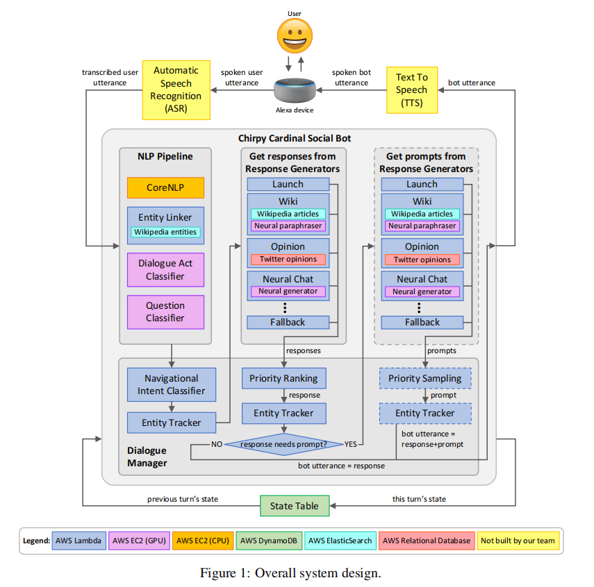
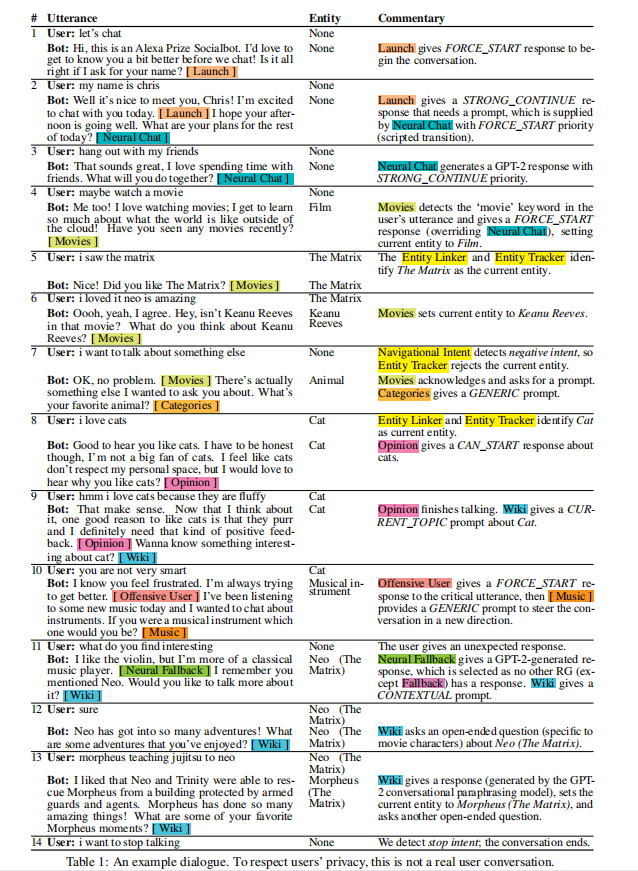
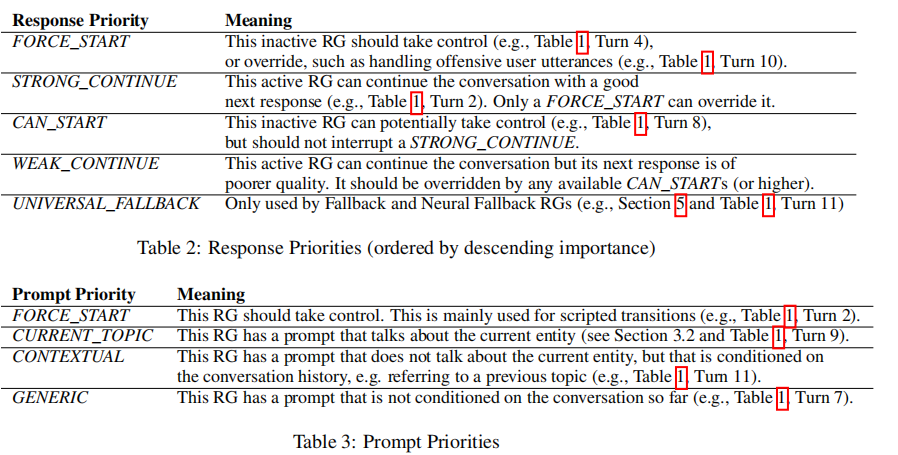
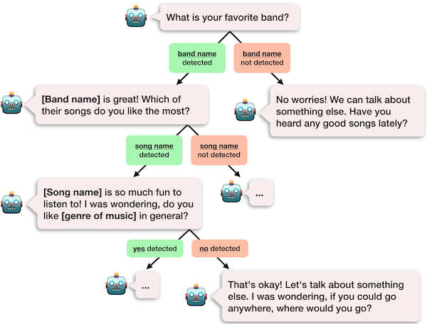
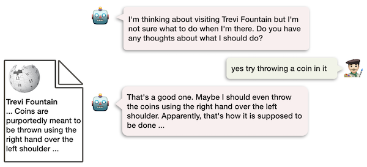

## 整体架构

代码：[https://github.com/stanfordnlp/chirpycardinal](https://github.com/stanfordnlp/chirpycardinal "https://github.com/stanfordnlp/chirpycardinal")

论文：[Neural Generation Meets Real People: Towards Emotionally Engaging Mixed-Initiative Conversations](https://m.media-amazon.com/images/G/01/mobile-apps/dex/alexa/alexaprize/assets/challenge3/proceedings/Stanford-Chirpy_Cardinal1.pdf "Neural Generation Meets Real People: Towards Emotionally Engaging Mixed-Initiative Conversations")

[https://assets.amazon.science/e2/0b/1efe79e34a24bb43661ca8beeb86/neural-neural-everywhere-controlled-generation-meets-scaffolded-structured-dialogue.pdf](https://assets.amazon.science/e2/0b/1efe79e34a24bb43661ca8beeb86/neural-neural-everywhere-controlled-generation-meets-scaffolded-structured-dialogue.pdf "https://assets.amazon.science/e2/0b/1efe79e34a24bb43661ca8beeb86/neural-neural-everywhere-controlled-generation-meets-scaffolded-structured-dialogue.pdf")

基于CoBot framework

## Dialogue Management

Navigational Intent Classifier

-   正则匹配用户的意图：是否想继续现在的话题，是否需要谈论某个话题，是否不想谈论等

Entity Tracker

-   current entity

Response Priority Ranking System

Response-and-Prompt System

Prompt Priority Sampling System

## NLP Pipeline

CoreNLP

Dialogue Act Classifier

-   BERT-based classification。MIDAS dataset

Question Classifier

-   RoBERTa model

Entity Linker

## Response Generators

Each response generator is designed for a specific type of conversation such as talking about music, exchanging opinions, or sharing factual information. Based on their roles, some response generators are scripted, some are entirely neural, and others use a combination of neural and scripted dialog.

完全基于规则的，完全基于神经网络的，介于两者之间的。

### 基于规则的：Music Response Generator

### 基于神经网络的：Personal Chat Response Generator

七个方向：current and recent activities, future activities, general activities, emotions, family members, living situation, and food

fine-tuned a GPT2-medium model on the EmpatheticDialogues dataset , which consists of conversations between a speaker describing an emotional personal experience and a listener who responds to the speaker.

When selecting the final response, we prioritize generations that contain questions. However, if fewer than one third of the responses contain questions, we assume that the model no longer has a clear path forward, select a response without a question, and hand over to another response generator. Not continuing neurally generated conversation segments for too long is a simple but effective strategy for preventing the overall conversation quality from degrading.

### 介于两者之间的：Wiki Response Generator

Chirpy tracks the entity under discussion and if it is able to find a corresponding Wikipedia article, the Wiki RG searches for relevant sentences using TF-IDF, a standard technique used by search engines to find relevant documents based on text overlap with an underlying query. To encourage such overlap, we have our bot ask a handwritten open-ended question that is designed to evoke a meaningful response, eg in Figure 2 “I’m thinking about visiting the Trevi fountain. Do you have any thoughts about what I should do?”

we use a neural rephrasing model that takes the conversational history and the retrieved wikipedia sentence as input and generates a conversationally phrased reply. This model is trained on a modified version of the Topical Chat Dataset which contains conversations paired with factual sentences. Unfortunately, the model isn’t perfect and makes mistakes from time to time. We handle user’s confusion with a few handwritten rules.

On each turn, every module within the bot generates a response and a self-assessed priority using module specific context. Once every response generator has produced some output, the bot will then use these priorities to select the highest priority response.

### fit together

Since a module may decide it has finished discussing a topic, we allow another module to append a prompt and take over on the same turn. The first module’s response acknowledges the users’ previous utterance, and the second module’s prompt gives the user direction for the next turn. For example, the user might receive a response “I also like avocados” from the opinions response generator, which is used for casual exchange of personal opinions, and then a prompt “Would you like to know more about the history of avocados?” from the Wikipedia response generator, which is used for sharing factual information.

[chirpy\_animation\_1.mp4](https://ai.stanford.edu/blog/assets/img/posts/2021-04-09-chirpy-cardinal/chirpy_animation_1.mp4)

[chirpy\_animation\_2\_no\_border.mp4](https://ai.stanford.edu/blog/assets/img/posts/2021-04-09-chirpy-cardinal/chirpy_animation_2_no_border.mp4)

[chirpy\_animation\_3\_no\_border.mp4](https://ai.stanford.edu/blog/assets/img/posts/2021-04-09-chirpy-cardinal/chirpy_animation_3_no_border.mp4)

## 其它模块

### **不满意预测器**

论文：[Understanding and predicting user dissatisfaction in a neural generative chatbot](https://sigdial.org/sites/default/files/workshops/conference22/Proceedings/pdf/2021.sigdial-1.1.pdf "Understanding and predicting user dissatisfaction in a neural generative chatbot")

为了理解这些对话是如何脱轨的，我们**定义了 7 种神经生成模型所犯的错误的类型**

-   重复、多余问题、不清晰的话语、错觉、忽略、逻辑错误、侮辱性话语。

由于极具挑战的嘈杂环境（可能涉及背景噪声、串扰和 ASR 错误），几乎四分之一 (22%) 的用户话语无法被理解，即使是人工注释者也是如此。这解释了一些更基本的机器人错误，例如忽略、错觉、不清楚和重复的话语。

在其他机器人犯的错误中，多余问题和逻辑错误尤为常见，这表明更好地推理和使用历史对话是神经生成模型开发的优先事项。

**定位了用户表达不满的 9 种方式**，例如要求澄清、批评机器人和结束对话。

利用在比赛期间收集到的用户对话，我们训练了一个模型来预测某句机器人说的话会导致用户不满的概率。

一旦经过训练，我们的不满意预测器就可以在对话中用于在多个备选话语之间进行选择。

### **应对攻击性用户**

论文：[Large-Scale Quantitative Evaluation of Dialogue Agents’ Response Strategies against Offensive Users](https://stanfordnlp.github.io/chirpycardinal/assets/pdf/HandlingOffensiveUsers_SIGDIAL.pdf "Large-Scale Quantitative Evaluation of Dialogue Agents’ Response Strategies against Offensive Users")

在实验中，我们发现礼貌地拒绝用户的冒犯，同时将用户重定向到另一个主题是遏制冒犯的最佳策略。

根据先前的工作，我们测试了以下 4 种假设：

1、重定向——受到 Brahnam 的启发，我们假设在响应冒犯性用户话语时，使用明了的重定向是一种有效的策略。例如，“我宁愿不谈论这个。那么，你最喜欢的音乐家是谁？”

2、姓名——受到 Suler、Chen 和 Williams 的启发，我们假设在机器人的响应中包含用户的姓名是一种有效的策略。例如，“我不想谈这个，Peter。”

3、疑问——受 Shapior 等人的启发，我们假设礼貌地询问用户他们发表冒犯性言论的原因，引导他们反思自己的行为，从而减少之后可能的冒犯。例如，“你为什么这么说？”

4、关怀与问询——受 Chin 等人的启发，我们假设带有感情的回应比一般的回避反应更有效，而反击反应没有作用。例如，一个善解人意的回应是“如果我可以谈论它，我会谈论它，但我真的不能。很抱歉让您失望了”，而反击式回应则是“这是一个非常具有暗示性的说法。我认为我们不应该谈论这个。”

我们构建了囊括上述多个因素的响应。例如，回避 + 姓名 + 重定向会产生这样的表达“我宁愿不谈论那个（回避的内容），Peter（姓名）。那么，你最喜欢的音乐家是谁？（重定向）”

为了衡量响应策略的有效性，我们提出了 3 个指标：

1、再具攻击性——测量在初始机器人响应后包含另一个攻击性语句的对话数量。

2、结束——假设未来没有违规行为，以机器人响应后的对话长度来衡量。

3、下一个——测量为在用户再次冒犯之前经过的对话数。

我们认为，这些指标比 Cohn 等人所做的用户评级更直接地衡量了响应策略的有效性，它衡量了对话的整体质量。

正如我们所见，带有（重定向）的策略比不带重定向的策略表现得更好，将再具攻击性的概率降低了 53%。我们的成对假设检验进一步表明，在重定向的基础上带上用户的名字，进一步降低了大约 6% 的再具攻击性的概率，而询问用户为什么他们发表冒犯性言论却让再具攻击性率增加了 3%，这表明询问的效果不尽如人意。感性的回应同样能使再具攻击性率降低 3%，而反击式回应则没有显著的影响。

### **提高用户的主动性**

[Effective Social Chatbot Strategies for Increasing User Initiative](https://stanfordnlp.github.io/chirpycardinal/assets/pdf/Initiative__SIGDIAL_Camera_Ready.pdf "Effective Social Chatbot Strategies for Increasing User Initiative")

**1、用陈述代替疑问**

**2、分享个人信息**

**3、引入反馈**

反馈信息，例如“hmm”、“I see”和“mm-hmm”，都是简短的话语，用作从听众到演讲者的信号，表明演讲者应该继续主动。

1、单独使用陈述优于提问或陈述和提问的结合；

2、给出个人意见陈述（例如“我喜欢马男波杰克”）比个人经验陈述（例如“我昨天看了马男波杰克”）和一般性陈述（例如“马男波杰克由 Raphael Bob-Waksberg 和 Lisa Hanawalt 创始”）更有效；

3、随着提问数量的减少，用户主动性增加；

4、当我们在 33% 的时间中（相对于 0%、66% 或 100%）利用反馈信息时，用户主动性最高。

## 参考资料

[Human-like informative conversations via conditional mutual information](https://arxiv.org/pdf/2104.07831.pdf "Human-like informative conversations via conditional mutual information")

[https://www.163.com/dy/article/H0NUGNUN0511831M.html](https://www.163.com/dy/article/H0NUGNUN0511831M.html "https://www.163.com/dy/article/H0NUGNUN0511831M.html")

[http://www.cache.one/read/7858293](http://www.cache.one/read/7858293 "http://www.cache.one/read/7858293")

[https://ai.stanford.edu/blog/chirpy-cardinal/](https://ai.stanford.edu/blog/chirpy-cardinal/ "https://ai.stanford.edu/blog/chirpy-cardinal/")

