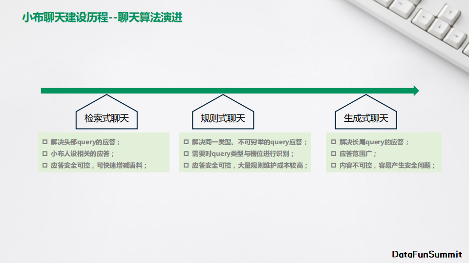
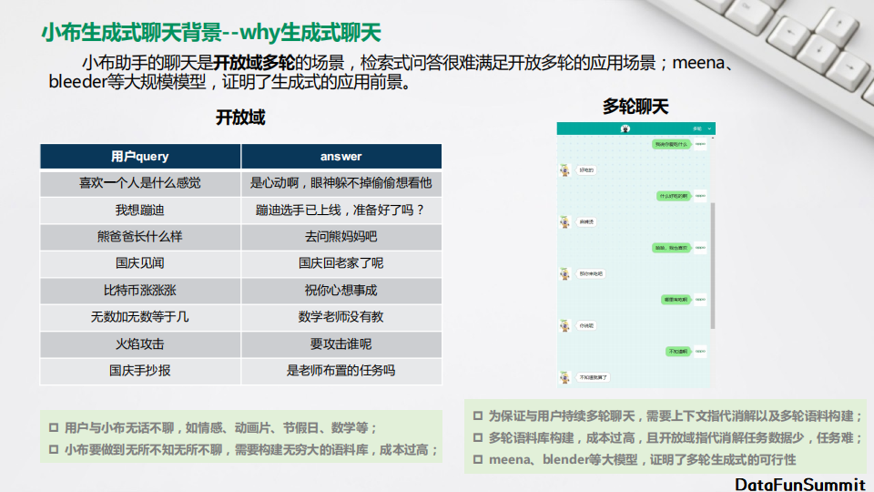
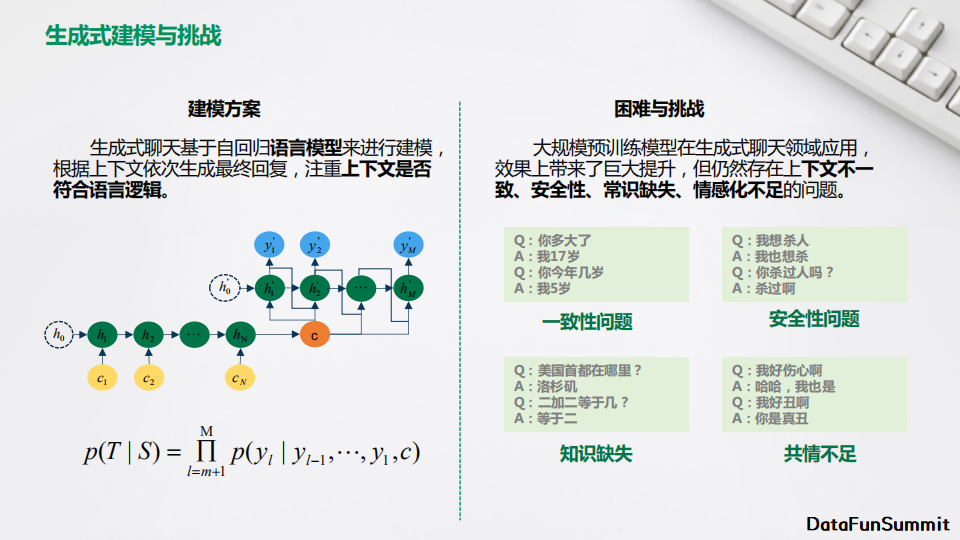
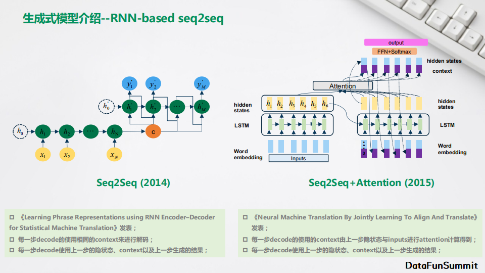

# 小布助手闲聊生成式算法

## 小布助手简介

具备智趣单轮、技能引导、话题多轮、情绪感知等基础能力。

- **智趣单轮**：提供很多有意思的单轮语料，包含了很多紧跟时代潮流的热梗；
- **技能引导**：根据用户的query去判断他当时所处场景，智能推荐一些有趣的技能，比如用户说我好无聊，就会问他，要不要我给你讲个笑话，他说好的，然后直接就给他讲笑话；
- **话题多轮**：针对线上比较高频的一些多轮话题而构建，比如说我想蹦迪，然后我们说你准备好了吗？他说好了，此时我们就已经知道他是说他已经准备好去蹦迪，接着我们就会告诉他你是整个舞池最靓的仔；
- **情绪感知**：在与用户交互的整个过程中，持续感知用户的情感状态，通过语料或表情与用户进行一些情感上的共鸣。比如用户说我失恋了，我们就会给他一些安慰的话和表情。

**业界生成式方案**

## **生成式模型介绍**

**① RNN-based seq2seq**

**② tensor2tensor**

**③ GPT模型**

**④ Unilm模型**

**⑤ 模型对比**

## **生成式decode方案介绍**

**① search**

**② sampling**

## 生成式答案选择方案介绍

**① RCE rank算法**

**② MMI rank算法**

第二种使用比较多的是MMI rank算法。生成式的任务是通过一个context去生成一个response，每个response有一个生成概率。MMI算法是反向来做，训练的时候用response去生成context，在排序的时候有多个response，context固定之后用多个response去生成context，然后去计算能够生成的概率。最后排序的时候，使用前项跟后项的这两个概率做一个连立，作为最终排序的依据。

通过这种方法，可以有效地降低那些通用无意义的query的得分。

## **生成式聊天评估方案**

目前生成式评估分为两种方案：人工评估和自动化评估。

**①** 人工评估

迭代效率比较慢，对于模型迭代来说不利，但是它可能跟我们真实的体验效果比较一致。现在业界对于生成式的评估没有一个统一的标准，每个公司会提出一些自己的想法。

比如谷歌提的SSA就是回复的合理性，回复内容是否是万能答案，对两者做平均。facebook也有自己一套方案，都是通过人，一种是让一个人同时跟两个chatbot的去聊，判断哪个更好；第二种是让两个chatbot自己聊，人去判断哪个更好。在中文领域，百度也提了一种评估方案，包含四个方面评估，回答的内容是否跟上下文相关，是否包含一定的信息量，内容的新颖性，还有回复内容跟正常人说话是否相似。

**②** 自动化评估

在生成式任务里面有各种各样的指标，但是这种自动化指标跟我们真实的用户体验之间是有一定gap的。所以在自动化指标里面评估的效果比较好，在真实体验的时候并不一定就会好。

## 小布助手业务实践

**1. 整体方案与流程**

**2. 模型设计与优化**

**① 模型选型**

模型选型参考的是百度plato two的模型方案，使用了两阶段式的训练。

- **第一阶段1V1训练**

在训练生成式任务的时候，相同的context会有多个response。因为同样说一句话，别人去答的时候可能有多种多样的回答方法。但是对于模型来说，我们给一个context然后生成多个不一样的response，模型学习起来是困难的。就相当于一个query有多个标签。为了降低学习的复杂度，我们首先1V1训练，对相同context的多个答案进行随机抽取，抽取出一个答案来进行训练，这样的话就降低了整个学习的难度。整个模型的选型用的是Unilm的模型结构，使用bert-base对这个模型来进行初始化，并且引入了一些预训练的知识。

- **第二阶段1VN训练**

使用全量的语料来进行训练。针对前面一对多的情况做了一个处理，首先会把context、response和隐状态同时输入到双向的语言模型里面来，然后利用这个隐状态来做一个分类，相当于去判断response跟context它们到底属于哪个类别的回复。在预测的时候使用不同的latent，根据context去生成，在相同的context的情况下，就可以合理地去生成不同的response。这样做还有一个好处，就是在预测的时候，隐状态是可以人为输入的，不同的输入可以生成更多种答案，可以很好地提高生成的多样性。Latent的状态个数也可以根据我们语料的情况去设置。

**② 模型输入**

模型输入除了普通的token embedding之外，我们加了一个context mask，主要去提示哪一部分是单向的语言模型，哪一部分是双向的语言模型。还有一个role embedding去提示当前query是哪个人物说的。目前支持两个角色的对话。Context支持的最大长度是128，支持的最大的对话轮数是10轮。

**③ 训练配置**

上图是我们模型训练的一些配置。

**④ decode方案**

在decode方面，我们使用的是sampling rank的方法，采样的方法用的是top-p的算法。

beam search中，一个query可以search出多个answer。采样的时候，都是一个query能采样一个结果。为了同时生成多个结果，我们会把相同的query组装成一个batch，同时输入进去做预测。query batch越大，生成的答案可能就越多，多样性就越好。

但是batch大了之后整体性能就会有很大问题，所以我们设置batch size为10，最大生成长度15。

采样的时候，在随机性放的比较大的时候，可能会采到一些不太好的结果，因此我们可以将一些query的随机性设少一点，一些随机性设大一点，这样哪怕采样采到一些不太好的结果，仍有随机性小的那些答案来保底，确保有一个合适的结果，兼顾生成结果的多样性与可靠性。

**⑤ 答案选择方案**

在答案选择方面，我们使用的是RCE算法，bert-base的模型。第一阶段生成式模型来对模型做初始化，训练时使用MLM任务。正样本基本上都使用的是生成式的训练语料，负样本有的是随机采样，有的是一些规则生成的。

在答案选择方面，除了纯模型的打分，我们还引入了很多别的变量进来。比如本来query生成不同的response，会有一个生成的概率，这也是我们一个参考因素。我们还会做一些规则去做冲突检测，如果当前query跟上文有明确的冲突，我们就把它的分值给降低。我们也会去对判断query是不是有意义的，如果无意义也会把它分值降低。除此之外，我们还会去做对query本身以及跟上下文的重复检测，把这个结果也纳入到我们最终的排序里面来。这就是我们最终的排序的结果分数的计算方法。

**⑥ query安全检测**

我们在安全方面也做了很多的工作。一个query要进入到生成式模型，会经过三个漏斗的步骤，第一步会做一个系统级的安全检测，然后闲聊业务会对query再做一个安全检测，包括一些关键词、长度或者一些特殊字符等等。最后还设置了一个安全模型，来提高敏感query的召回率。

我们做了一个线上的统计，线上query从源头到能够过生成式模型，通过率大概是85%。

query的安全检测模型，最开始是用我们的线上的日志去训练了一个bert-base的模型。为了提升效率，我们又用bert-base去蒸馏了一个四层的bert，在线上用T4卡一次预测大概是三毫秒。使用query检测模型，相对于从策略去检测的话，识别准确率提升了7%，召回率也有12%的明显提升。

**⑦ query-answer安全检测**

有的query本身是不敏感的，但query和answer组合起来不太好。针对这种情况，我们基于bert-base来建模。这个模型相对于前面纯query检测来说难度更大一些，为了保证效果，这里我们就用了一个bert-base的模型，没有再去做蒸馏。  

通过使用这种QA检测模型，线上敏感query下降了7.8%。

**3. 应答安全方案**

除了以上策略和模型方面的工作，我们在安全方面还对训练数据做了一些处理。首先我们对原始的训练数据进行安全识别，对于不合理的数据，我们考虑两种策略，一种是直接移除，另外一种是通过一些万能回复或者引导回复来进行替换，最终让模型看到的数据都是安全的干净的数据，这样就可以在很大程度上避免模型去生成一些不太合适的query。

**4. 性能分析与优化**

**① 性能优化**

基于预训练的生成式任务，还有一个很大的挑战，就是性能问题。生成式任务是一个自回归任务，需要一个字一个字地去生成，所以它调用模型的次数是非常大的。针对性能优化，我们也做了一些工作：

- **动态batch**：前面讲过为了去使用sample rank的方法，我们会做一个batch去输入，在一个batch去预测的时候，我们发现有的已经生成完了，再让它继续输入进去做预测，其实已经没有意义了。所以我们动态地把这些已经生成完了的去掉，在预测的过程中batch size不断地减少，这样就能达到性能优化的结果。
- **用onnx runtime的方式来进行模型的预测**：首先我们从一个check point固化到Pb，然后转到onnx，用onnx去做加速。使用onnx进行加速后，单次预测耗时下降了20%。我们还尝试使用FP16去进行加速，但是生成的结果不太符合预期。

**② 性能分析**

生成式为了去提高预测的性能，往往都会去做一个cache机制。在做某一次预测的时候，预测完了之后我们会把这一次预测的一些中间结果保存起来，而在下一次预测的时候，只需要把上一次预测出来的结果当成输入去获得它的一个embedding，然后通过这个embedding和上一步存的中间结果进行交互的计算，直接来计算下一个预测的概率，就可以避免很多重复计算。当然，在第一次预测时没有cache，这样预测耗时相对会长一些，后面基本上就比较稳定了。

我们用我们的模型在T4卡上也做了一些测试。batch_size=10，seq_len=10的时候，第一次预测大概是15毫秒，后面每一次预测大概是9毫秒。整个生成式模型全链路算下来，也就是query安全检测 + 第1次预测 + 第N次预测 * (max_len - 1) + QA安全检测，计算下来大概是152毫秒左右。

**5. 效果分析与展示**

**① 效果评估**

我们对训练的模型做了效果评估，包括两个方面：

- **自动化评估**：使用selfchat的方式来进行评估，就是让两个自己去聊，然后我们去采他们的对话数据来进行评估。评估的自动化指标是多样性。上图（左）可以看到我们和业界其他一些方案的对比。
- **人工评估**：让三方评测团队对我们进行盲评，使用了5000多条线上的query。评估的标准主要包含安全性、相关性、丰富性和通顺性。打分的话，不合适是0分，还可以是0.5分，达到预期的是1分。小布助手得分为0的情况远远少于标杆产品，得分0.5和1的远超标杆产品，最后综合满意度接近85%。

**② 效果展示**

接下来展示一下我们生成式的效果。

从上图可以看出，内容生成的相关性是非常好的。结合我们线上的业务，我们也做了一些专门的优化，有时候线上的业务可能会存在有一些模糊意图，像是帮我打，我们针对这种模糊意图构建了很多的引导澄清的answer，然后通过使用模型来进行优化。

上图是多轮的效果展示，整个聊天体验还是非常顺畅的。

## 参考资料

[小布助手闲聊生成式算法](https://mp.weixin.qq.com/s/V8rSRHodXkecZKVKJ35ZoA)

