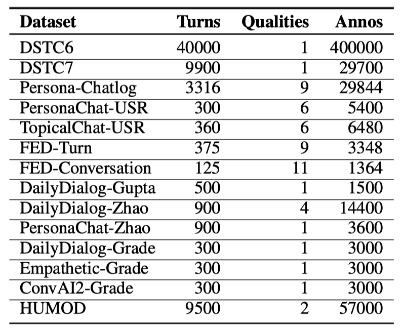
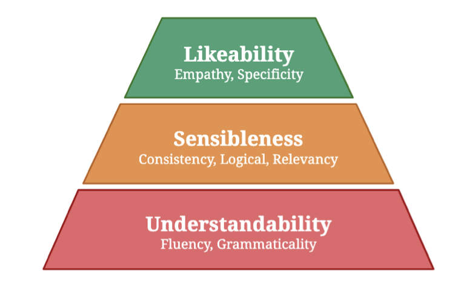
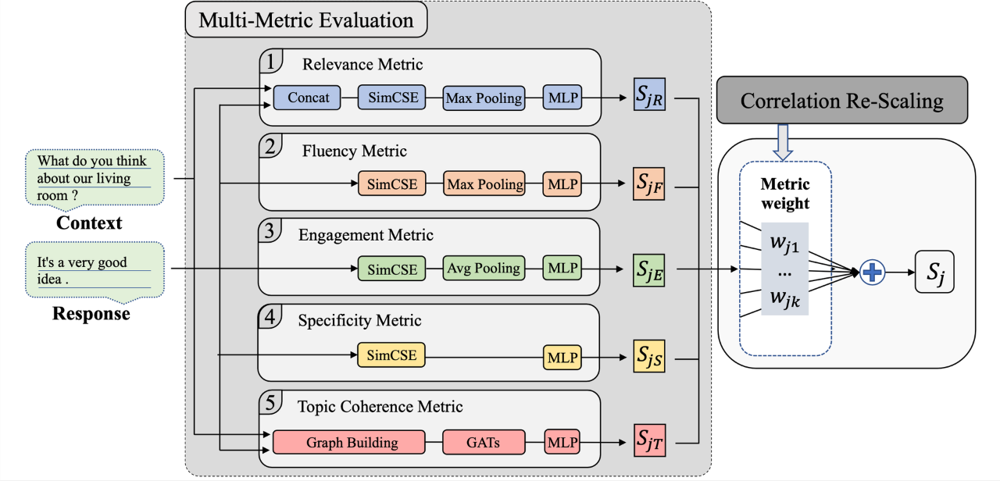
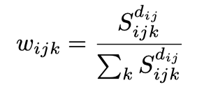
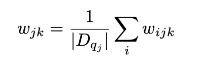
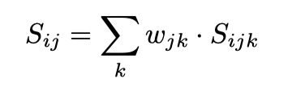
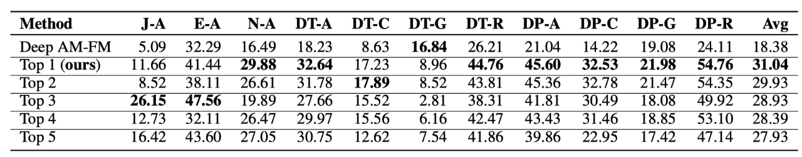
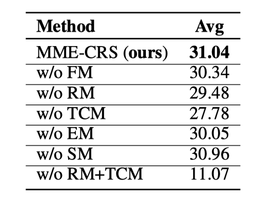
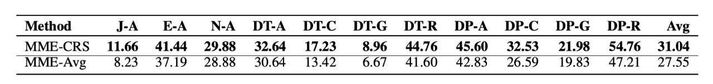

> 本文由 [简悦 SimpRead](http://ksria.com/simpread/) 转码， 原文地址 [mp.weixin.qq.com](https://mp.weixin.qq.com/s/UKwN4pXQf_jhgtMefSzuDw)

每天给你送来 NLP 技术干货！

来自：美团技术团队

本文介绍了国际竞赛 DSTC10 开放领域对话评估赛道的冠军方法 MME-CRS，该方法设计了多种评估指标，并利用相关性重归一化算法来集成不同指标的打分，为对话评估领域设计更有效的评估指标提供了参考。相关方法已同步发表在 AAAI 2022 Workshop 上。希望能给从事该技术领域工作的同学一些启发或帮助。

*   1 背景
    
*   2 赛题简介
    
*   3 现有方法和问题
    
*   3.1 现有方法
    
*   3.2 问题
    
*   4 我们的方法
    
*   4.1 基础指标
    
*   4.2 集成方法 CRS
    
*   5 实验分析
    
*   5.1 实验结果
    
*   5.2 消融实验
    
*   5.3 CRS 效果
    
*   6 总结
    
*   参考文献
    
*   作者简介
    

1 背景
----

对话系统技术挑战赛 DSTC（The Dialog System Technology Challenge）由微软、卡内基梅隆大学的科学家于 2013 年发起，旨在带动学术与工业界在对话技术上的提升，在对话领域具有极高的权威性和知名度。对话系统挑战赛今年已举办至第十届（DSTC10），吸引了微软、亚马逊、卡内基梅隆大学、Facebook、三菱电子研究实验室、美团、百度等全球知名企业、顶尖大学和机构同台竞技。

DSTC10 共包含 5 个 Track，每个 Track 包含某一对话领域的数个子任务。其中 Track5 Task1 Automatic Open-domain Dialogue Evaluation 较为系统全面地将开放领域对话的自动评估任务引入 DSTC10 比赛中。开放领域对话自动评估是对话系统的重要组成部分，致力于自动化地给出符合人类直觉的对话质量评估结果。相比于速度慢、成本高的人工标注，自动化评估方法可以高效率、低成本地对不同对话系统进行打分，有力促进了对话系统的发展。

不同于任务型对话有一个固定的优化目标，开放领域对话更接近人类真实的对话，评估难度更大，因而吸引了广泛的关注。DSTC10 Track5 Task1 比赛共包含 14 个验证数据集（共包含 37 种不同的对话评估维度）和 5 个测试数据集（共包含 11 个评估维度）。美团语音团队最终以平均 0.3104 的相关性取得了该比赛的第一名，该部分工作已完成一篇论文 MME-CRS: Multi-Metric Evaluation Based on Correlation Re-Scaling for Evaluating Open-Domain Dialogue，并收录在 AAAI2022 Workshop。

2 赛题简介
------

开放领域对话评估比赛收集了对话领域论文中的经典数据集，包括 14 个验证数据集（12 个 Turn-Level 级别数据集和 2 个 Dialog-Level 级别数据集）和 5 个测试数据集。

数据集中的每个对话主要包含以下信息：

*   Context：对话中的提问，或者说对话的上下文。
    
*   Response：针对 Context 的回复，也即评估的具体对象；对话数据集中的 Response 一般由不同对话生成模型产生，如 GPT-2 和 T5。
    
*   Reference：人工给出的针对 Context 的参考回答，一般为 5 条左右。
    

每个对话包含多个评估维度，如 Context 和 Response 的相关性，Response 本身的流畅度等。每个数据集的评估维度不同，14 个验证集总共包含 37 种不同的评估维度，具体包含 Overall、Grammar、Relevance、Appropriateness、Interesting 等。每个评估维度都有人工标注的打分，打分从 1 到 5，分数越高表示当前评估维度的质量越高。

验证集和测试集的统计信息如图 2 和图 3 所示：

图 2 DSTC10 Track5 Task1 验证集数据统计信息

图 3 DSTC10 Track5 Task1 测试集数据统计信息

其中 Turns 表示对应数据集中的对话轮数；Qualities 表示数据集中每个对话的评估维度，每个评估维度都有对应的人工标注打分；Annos 表示每个数据集的标注量。

在该比赛中，每个数据集每个对话每个评估维度都有人工标注的打分，打分范围一般为 1 到 5，一般求均值用于相关性计算。参赛队伍需要设计评估指标用于预测每个对话不同评估维度的打分。每个数据集的每个评估维度的预测打分会和人工标注的打分计算 Spearman 相关性，最后的比赛结果基于全部测试数据集的评估维度求均值。

3 现有方法和问题
---------

### 3.1 现有方法

开放领域对话的自动评估方法主要分为三类。

**Overlap-based 方法**

早期研究人员将对话系统中 Reference 和 Response 类比于机器翻译中的原句和翻译句，借鉴机器翻译的评价指标来评估对话质量。Overlap-based 方法计算对话中 Response 和 Reference 之间的词重叠情况，词重叠越高打分越高。经典方法包括 BLEU[1] 和 ROUGE[2] 等，其中 BLEU 根据精确率衡量评估质量，而 ROUGE 根据召回率衡量质量。Response 的评估依赖于给定的 Reference，而开放领域下合适的 Response 是无限的，因此，Overlap-based 方法并不适用于开放领域对话评估。

**Embedding-based 方法**

随着词向量和预训练语言模型的快速发展，Embedding-based 评估方法取得了不错的性能。基于深度模型分别编码 Response 和 Reference，并基于二者的编码计算相关性打分。主要方法包括 Greedy Matching[3]、Embedding Averaging[4] 和 BERTScore[5-6] 等。Embedding-based 方法相比 Overlap-based 方法有较大的提升，但是同样依赖于 Reference，仍然存在较大的优化空间。

**Learning-based 方法**

基于 Reference 的开放领域对话评估存在一个 One-To-Many[7] 困境：即开放领域对话合适的 Response 是无限的，但人为设计的 Reference 是有限的（一般为 5 条左右）。因此，基于对比 Reference 和 Response 的相似性（字面重叠或者语义相似）设计开放领域评估方法存在较大局限性。相比已有的 Overlap-based 方法和 Embedding-based 方法，ADEM 方法 [8] 首次使用层次化的编码器来编码 Context 和 Reference，并对输入的 Response 进行打分。ADEM 方法基于模型打分和人工打分的均方误差来优化模型参数，期望逼近人类的打分。ADEM 模型相比 Overlap-based 方法和 Embedding-based 方法取得了很大的成功，Learning-based 方法也逐渐成为了开放领域自动化评估的主流方法。

为了不断提高对话评估的准确和全面性，各种不同的评估维度层出不穷。为了应对越来越多评估维度带来的挑战，USL-H[9] 将评估维度分为 Understandability、Sensibleness 和 Likeability 三类，如图 4 所示。USL-H 针对性提出了 VUP（Valid Utterance Prediction）、NUP（Next Utterance Prediction）和 MLM（Mask Language Model）3 种指标，分别衡量对话中：

1.  Response 是否通顺流畅。
    
2.  Context 和 Respose 的相关程度。
    
3.  Response 本身是否详细，更像人类等。
    

图 4 USL-H 评估算法的分层次模型

### 3.2 问题

现有的评估方法主要有以下问题：

**设计的对话指标不够全面，难以综合衡量对话的质量**

现有的自动评估方法主要聚焦在个别数据集的部分评估维度上。以当前较为全面的 USL-H 为例，该方法考虑了 Response 的流畅度、丰富度以及 Context-Response 句子对的相关性，但是 USL-H 忽略了：

1.  更细粒度的 Context-Response 句子对的主题一致性。
    
2.  回复者对当前对话的参与度。
    

实验证明，这些指标的遗漏严重影响了评估方法的性能。为了更全面稳定地评估多个对话数据集，设计考虑更多评估维度的指标势在必行。

**缺乏有效的指标集成方法**

现有方法大多倾向于为每种评估维度设计一种评估指标，这种思路面对越来越多的评估维度显得力不从心（考虑下比赛测试集共包含 37 种不同的评估维度）。每种对话维度的评估可能依赖数种评估指标，如 Logical 评估维度需要对话：1）Response 流畅；2）Response 和 Context 是相关的。设计基本的评估子指标，再通过合适的集成方法集成多个子指标打分，可以更全面有效表示不同的对话评估维度。

4 我们的方法
-------

针对评估指标不够全面，本文设计了 5 类共 7 种评估指标（Multi-Metric Evaluation，MME）用于全面衡量对话的质量。基于设计的 5 类 7 种基础指标，我们进一步提出了相关性重归一化方法（Correlation Re-Scaling Method，CRS）来集成不同评估指标的打分。我们将提出的模型称为 MME-CRS，模型整体架构图 5 所示：

图 5 模型总体架构设计图

### 4.1 基础指标

为了解决现有方法的第一个问题，即设计的对话指标不够全面，我们在比赛中设计了 5 类共 7 种评估子指标。

#### 4.1.1 Fluency Metric (FM)

**目的**：分析 Response 本身是否足够流畅可理解。

**内容**：首先基于 Dailydialog 数据集 [10] 构建 response 流畅度数据集，流程如下：

1.  在 Dailydialog 数据集中随机选择一个 Response，并以 0.5 概率决定 r 是正样本还是负样本。
    
2.  如果样本 r 是正样本，随机选择一种调整：a. 不调整；b. 对每一个停用词，以 0.5 的概率删除。
    
3.  如果样本 r 是负样本，随机选择一种调整：a. 随机打乱词序；b. 随机删除一定比例的词语；c. 随机选择部分词语并重复。
    

基于上述规则构建流畅度数据集后，在预训练模型 SimCSE 模型 [11] 上微调。微调后的模型可以计算任一对话的 Response 流畅度打分，记为 FM 打分。

#### 4.1.2 Relevance Metric (RM)

**目的**：分析 Context 和 Response 的相关程度。

**内容**：基于 Dailydialog 数据集构建 Context-Response 句子对形式的相关性数据集，其中句子对相关为正样本，不相关则为负样本。负样本的通常构建思路是将 Response 随机替换成其他对话的 Response。PONE 方法 [12] 指出随机挑选的 Respose 和 Context 基本不相关，模型训练收益很小。因此，这里的做法是随机选择 10 条 Response，并计算和真实 Response 的语义相关度，并选择排名居中的句子作为伪样本。构造数据集后再在 SimCSE 模型上微调，微调后的模型可用于计算对话中 Context 和 Response 的相关度打分，记为 RM 打分。

#### 4.1.3 Topic Coherence Metric (TCM)

**目的**：分析 Context 和 Response 的主题一致性。

**内容**：GRADE 方法 [13] 构建了 Context 和 Response 的主题词级别的图表示，并计算了 Context 和 Response 的主题词级别的相关度。相比粗粒度的相关性指标，GRADE 更加关注细粒度级别的主题相关程度，是相关性指标的有效补充。TCM 指标借鉴 GRADE 方法。

**具体流程如下**：首先提取 Context 和 Response 中的关键词构建图，其中每个关键词都是一个节点，只有 Context 和 Response 的关键词之间存在边。基于 ConceptNet 获取每个节点的表示，再使用图注意力网络（GATs）聚集关键词邻居节点的信息并迭代每个节点的表示，最后综合全部节点的表示得到对话的图表示。在主题词级别的图表示上连接全连接层用于分类，微调后的模型即可用于计算对话的 TCM 打分。

#### 4.1.4 Engagement Metric (EM)

**目的**：分析生成 Response 的人或对话模型有多大的意愿参与当前对话。

**内容**：前面提到的指标都是从 Context 和 Response 视角评估对话质量，而用户参与度则是基于用户的视角来评估。用户参与度打分一般是 0~5，分数越大，表示用户参与当前对话的兴趣越大。我们将 ConvAI 数据集 [10] 的参与度打分从 1~5 缩放到 0~1，作为参与度打分数据集。预训练模型仍然使用 SimCSE，用于预测对话的参与度打分。预训练后的模型可用于预测对话的用户参与度打分，记为 EM。

#### 4.1.5 Specificity Metric (SM)

**目的**：分析 Response 本身是否足够细节。

**内容**：SM 指标用于避免 Response 模棱两可，缺乏信息量。

**具体做法如下**：序列 Mask 掉 Response 中的每一个 Token，并基于 SimCSE 模型的 MLM 任务计算 Negative Log-Likelihood 损失，得到的打分称为 SM-NLL。替换损失函数为 Negative Cross-Entropy 和 Perplexity 可以分别得到 SM-NCE 和 SM-PPL 打分，共 3 个 SM 指标打分。3 个 SM 指标打分都需要分别归一化到 0 和 1 之间。

### 4.2 集成方法 CRS

集成不同评估指标的打分是提高自动化对话评估效果的有效手段。

对每一个待评估的对话，基于上述 5 类 7 种基础指标可以得到 7 种不同的打分。对于待评估数据集的某个评估维度，需要综合 7 种指标打分得到一个综合打分，用于和人类打分计算相关性。我们的集成方法分为以下两步。

#### 4.2.1 不同评估维度权重分布的计算

首先，计算验证集上每个数据集每个评估维度 7 种评估指标的相关性打分，相关性打分越大，认为该指标对该评估维度越重要。对越重要的评估指标赋予一个更大的权重，并将得到的权重在指标维度重新归一化，这样则得到了每个数据集每个评估维度上不同评估指标的权重分布：

其中是第个数据集第个评估维度上第个评估指标的相关性打分，是相关性打分的幂数，越大则相关性打分越高的指标的权重就越大。一般当 max（）在 1/3 到 1/2 之间时集成效果最好，这是计算的一种简单有效手段。实验中，将设置为常数可以获得更好的泛化效果，我们将设置为 2，并在验证集上计算权重分布，再迁移到测试集上，取得了比赛最优性能。

在数据集维度，将不同数据集中相同评估维度的权重求均值，得到每个评估维度在不同评估指标上的权重分布：

注意这里得到的权重分布已经和具体数据集无关，可以将权重分布迁移到测试集上。

#### 4.2.2 计算指标打分的加权和

对每个测试集的每个评估维度，计算 7 种指标打分并基于第一步的权重求加权和，得到综合打分：

加权得到的综合打分和人工打分计算相关性，得到每种评估维度上的模型打分和人工打分的相关性打分。

我们的集成方法基于指标的相关性打分赋予权重并重新归一化，所以将该集成方法称为相关性重归一化方法。在得到的 MME 指标上使用 CRS 集成方法，可得 MME-CRS 评估算法。

5 实验分析
------

### 5.1 实验结果

我们的方法主要基于 Dailydialog 数据集预训练（除了 EM 子指标是使用 ConvAI2 数据集），在比赛验证集上计算集成方法的权重分布，最终在测试集上取得了 0.3104 的 Spearman 相关性打分。

图 6 展示了比赛基准模型 Deep AM-FM[14] 以及比赛 Top5 队伍在测试集上不同数据集评估维度的性能。本文的方法以 0.3104 的平均 Spearman 相关性系数取得了第一，且在 5 个数据集全部 11 个评估维度中的 6 个取得了第一，证明了本文方法的优越性能。

图 6 测试集上 Top 5 队伍的 Spearman 相关性打分对比（%）

为了方便展示，图中方法采用了数据集 - 评估维度的展示方式。其中 J、E、N、DT、DP 分别表示 JSALT、ESL、NCM、DST10-Topical、DSTC10-Persona 数据集，而 A、C、G、R 分别表示 Appropriateness、Content、Grammar、Relevance 评估维度。我们对每个评估维度上最好的性能进行了加粗。

### 5.2 消融实验

在消融实验部分，我们以本文方法 MME-CRS 评估为基准，在集成阶段分别去除 FM、RM、TCM、EM、SM、RM+TCM 指标，对比不同指标在集成过程中的重要性。实验性能如图 7 所示：

图 7 测试集上不同评估指标的消融实验（%）

相关性指标 RM 和主题一致性指标 TCM 都使用了对话中的 Context 和 Response 信息，因此在实验中同时去除这两个指标，观察对性能的影响。从图 7 中的实验结果可以看出：

*   TCM、RM 和 EM 对于模型性能的贡献最大，打分集成阶段删除这三个评估指标后，测试集上的平均 Spearman 相关性打分分别降低了 3.26%、1.56% 和 1.01%。
    
*   粗粒度的 RM 指标和细粒度的 TCM 指标是有益的互相补充。如果分别去除 RM 或 TCM 指标，性能会有稍微下降；如果同时去除 RM 和 TCM 指标，评估方法缺乏了 Context 相关的信息，性能会大幅降低到 11.07%。
    
*   SM 指标在测试集上的提升基本可以忽略。我们分析原因是：测试集中用于生成 Response 的各个生成模型在测试集语料上过拟合较为严重，因此生成了很多非常详细，但和 Context 不相关的 Response。因此 SM 指标的优劣对于测试集质量的评估基本没有作用。
    

### 5.3 CRS 效果

为了分析集成算法 CRS 的作用，本文对比了 MME-CRS 和 MME-Avg（将 MME 多个指标打分简单平均）两个评估方法的性能，如图 8 所示：

图 8 MME-CRS 和 MME-Avg 在测试集上的性能对比（%）

从图中可以看出，MME-CRS 方法相比于 MME-Avg 高了 3.49%，证明了 CRS 算法在集成子指标打分方面的优越性能。

6 总结
----

在本次比赛中，我们总结了开放领域对话自动评估存在的两个主要问题，即评估指标不够全面和缺乏有效的指标集成方法。针对评估指标不够全面的问题，本文设计了 5 类 7 种评估指标用于全面衡量对话的质量；基于 7 种基础指标，提出了相关性重归一化方法来计算每种对话评估维度的集成打分。

虽然本文方法在 DSTC10 比赛中取得了较好的成绩，但后续我们将继续探索其他更有效的评估指标和指标集成方法。我们正在尝试将比赛中的技术应用到美团具体业务中，如语音交互中心的智能外呼机器人、智能营销和智能客服中，在多个不同维度评估机器、人工客服与用户的对话质量，不断优化对话效果，提升用户的满意度。

参考文献
----

[1] Papineni, K.; Roukos, S.; Ward, T.; and Zhu, W.-J. 2002. Bleu: A method for automatic evaluation of machine translation. In Proceedings of the 40th annual meeting of the Association for Computational Linguistics, 311–318.

[2] Lin C Y. Rouge: A package for automatic evaluation of summaries[C]//Text summarization branches out. 2004: 74-81.

[3] Rus, V.; and Lintean, M. 2012. An optimal assessment of natural language student input using word-to-word similarity metrics. In International Conference on Intelligent Tutoring Systems, 675–676. Springer.

[4] Wieting, J.; Bansal, M.; Gimpel, K.; and Livescu, K. 2016. Towards universal paraphrastic sentence embeddings. In 4th International Conference on Learning Representations.

[5] Zhang, T.; Kishore, V.; Wu, F.; Weinberger, K. Q.; and Artzi, Y. 2019. BERTScore: Evaluating text generation with BERT. In International Conference on Learning Representations.

[6] Liu C W, Lowe R, Serban I V, et al. How NOT To Evaluate Your Dialogue System: An Empirical Study of Unsupervised Evaluation Metrics for Dialogue Response Generation[C]//Proceedings of the 2016 Conference on Empirical Methods in Natural Language Processing. 2016: 2122-2132.

[7] Zhao, T.; Zhao, R.; and Eskenazi, M. 2017. Learning discourse-level diversity for neural dialog models using conditional variational autoencoders. In Proceedings of the 55th Annual Meeting of the Association for Computational Linguistics (Volume 1: Long Papers), 654–664.

[8] Lowe R, Noseworthy M, Serban I V, et al. Towards an Automatic Turing Test: Learning to Evaluate Dialogue Responses[C]//Proceedings of the 55th Annual Meeting of the Association for Computational Linguistics (Volume 1: Long Papers). 2017: 1116-1126.

[9] Phy, V.; Zhao, Y.; and Aizawa, A. 2020. Deconstruct to reconstruct a configurable evaluation metric for open-domain dialogue systems. In Proceedings of the 28th International Conference on Computational Linguistics, 4164–4178.

[10] Zhao, T.; Lala, D.; and Kawahara, T. 2020. Designing precise and robust dialogue response evaluators. In Proceedings of the 58th Annual Meeting of the Association for Computational Linguistics, 26–33.

[11] Gao T, Yao X, Chen D. SimCSE: Simple Contrastive Learning of Sentence Embeddings[J]. arXiv preprint arXiv:2104.08821, 2021.

[12] Lan, T.; Mao, X.-L.; Wei, W.; Gao, X.; and Huang, H. 2020. Pone: A novel automatic evaluation metric for open-domain generative dialogue systems. ACM Transactions on Information Systems (TOIS), 39(1): 1–37.

[13] Huang, L.; Ye, Z.; Qin, J.; Lin, L.; and Liang, X. 2020. Grade: Automatic graph-enhanced coherence metric for evaluating open-domain dialogue systems. In Proceedings of the 2020 Conference on Empirical Methods in Natural Language Processing (EMNLP), 9230–9240.

[14] Zhang, C.; D’Haro, L. F.; Banchs, R. E.; Friedrichs, T.; and Li, H. 2021. Deep AM-FM: Toolkit for automatic dialogue evaluation. In Conversational Dialogue Systems for the Next Decade, 53–69. Springer.

作者简介
----

鹏飞、晓慧、凯东、汪建、春阳等，均为美团平台 / 语音交互部工程师。

