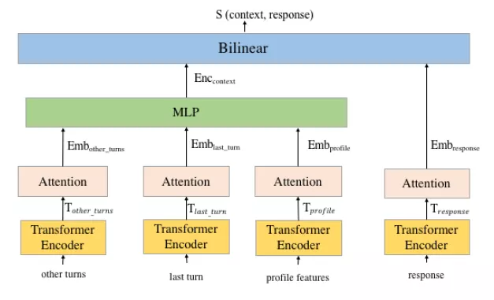
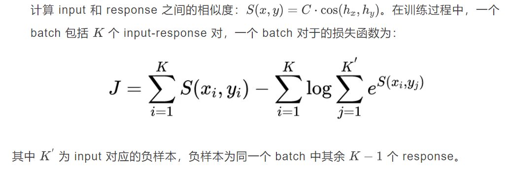
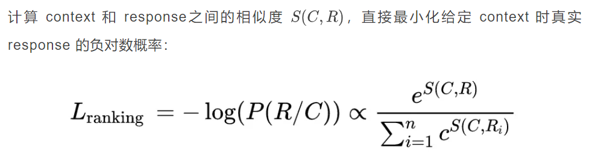

## 背景

***\*1.1 检索式对话系统\****

目前对话系统的建模主要有三种方式：生成式、检索式以及生成和检索融合的方式。检索式对话系统（Retrieval-based dialogue system）是根据对话历史和当前用户话语选择最合适的系统回复来与用户进行对话的系统。顾名思义，一个检索式对话系统的任务就是在大量的候选回复中选择一个最佳的回复反馈给用户。

检索式对话系统将对话建模为回复选择任务，这种方式构建的对话系统具有许多优势，例如：不需要专家定义结构化的领域本体，减少人工；避免了困难的语言生成（language generation）问题；回复选择模型的输出更方便进行约束和组合；不需要设计专用的用于决策的策略模块等。

然而，想要将对话系统应用于新的领域就需要足够多的域内数据来训练回复选择模型，获取这样的数据代价高昂且数据集的规模非常有限。尽管检索式对话系统的概念非常有吸引力，它仍然面临数据短缺（data scarcity）的问题。

***\*1.2 预训练语言模型\****

目前，预训练语言模型（如 BERT、GPT 等）已经广泛应用于许多 NLP 任务。这些模型是基于大量的文本语料库（如：Wikipedia）进行自监督训练的，进一步 fine-tune 模型输出的表示可以在各种下游任务上取得很好的成果。

然而，由于文本和对话的语言模式存在一定的差异，传统的文本预训练模型很难在对话数据上进行 fine-tune。因此，近年来有研究者利用社交媒体的闲聊数据（如：Twitter、Reddit）来预训练语言模型，得到专用于对话系统的预训练语言模型，并将其运用于对话任务，取得了很好的效果。

在现有的研究中，对话系统预训练大量的工作是针对生成式对话系统（采用 GPT 系模型），也有一些以回复选择任务为主要目标的工作，这类工作更多地是应用于检索式对话系统。**本文旨在对检索式对话系统预训练的一系列工作进行整理和介绍。**

## 模型

### 2.1 pretrain (general-domain) + fine-tune (target domain) 模式

2019 年 6 月，PolyAI 团队发表了论文：Training Neural Response Selection for Task-Oriented Dialogue Systems [1]（2019 ACL Paper），该论文提出了一种新的方法来训练面向任务型对话的回复选择模型。该方法先在 Reddit 数据集上预训练一个通用的回复选择模型，然后针对不同的对话领域对其进行 fine-tune，解决了任务型对话数据匮乏的问题。并通过实验验证了 pretrain+fine-tune 模式的有效性。

**训练方式的选择：为什么使用 pretrain + fine-tune，不采用其他方式？**

本文采用的方案是利用 Reddit 进行 pretrain（only run once），再利用预训练好的模型再各个领域 fine-tune。而其替代方案是，域内数据和 Reddit 数据融合成一个单一的训练集，但是这种方式存在如下的问题：

- 需要对每个任务进行昂贵的再训练
- 域内数据和 Reddit 数据大小之间的不平衡，目标任务信号被消除
- 初步实验结果表明，该方案的结果低于提出的轻量级 fine-tune 策略

所以 pretrain + fine-tune 才是时间上、性能上均为最佳的模式。

**数据集的选择：为什么使用 Reddit 数据集？**

Reddit 数据集包含原生的对话结构，且其数据量大、话题广泛、回复长度不受限制、回复话语更自然，所以非常适用于回复选择任务。

**模型结构及训练**

- 模型结构

- 预训练目标函数：Scaled Cosine Similarity Scoring

### **2.2 ConveRT：更轻量的模型**

2019 年 11 月，PolyAI 团队在 arXiv 上传论文：ConveRT: Efficient and Accurate Conversational Representations from Transformers [2]（2020 EMNLP Findings），这篇文章可以认为是 2019 ACL 的后续工作，依然是 pretrain（Reddit 数据）+fine-tune 的方式，在其基础上提出了一个更轻量级的预训练回复选择模型 ConveRT，并且模型还可以引入了更多的对话历史信息。另外，模型学习的句子编码可以 transfer 到其他对话任务（eg.意图识别）。

这篇文章是基于目前预训练模型参数量过大，训练和运行都消耗巨大的计算资源，导致其实际应用受阻的问题提出的。在现实应用场景中，我们需要一个“更小”的模型。ConveRT 是一个轻量级的双编码器预训练结构，它综合利用了多种方式来降低模型的复杂度，包括：子词表示（subword representation）、单头注意力机制（single-headed attention）、量化感知训练（quantization-aware training）等，该模型与其他模型相比，参数更少、训练时间更短、且具有更好的性能，如下表所示。

**模型结构及训练**

- 模型结构

- 预训练目标函数：和 2019 ACL [1] 一致

**ConveRT 的后续工作**

PolyAI 团队在提出 ConveRT 模型后，紧接着将该模型迁移到了其他对话任务：槽填充。Span-ConveRT [3] 是一个用于对话系统中槽填充的模型，它将 ConveRT 输出的表示输入 CNN+CRF，以此来完成槽填充任务，并且证明该模型在少样本情况下非常有效。ConVEx [4] 基于 ConveRT 的模型结构，并针对槽填充任务设计了一个新的预训练任务——Pairwise Cloze，进一步提高了对话系统中槽填充的性能。

### 2.3 Pretrain+fine-tune：Real-World Setting

Amazon 团队在 2021 NAACL 的 Industy Paper 发表了 Pretrain-Finetune Based Training of Task-Oriented Dialogue Systems in a Real-World Setting [5]。这篇文章依然采用 pretrain+fine-tune 的方式训练检索式对话系统，且模型部署在 agent-support 应用程序中，并实时进行评估。

**模型结构及训练**

- 模型结构

  

- 预训练目标函数：a ranking based loss function

### **2.4 其他相关工作**

以上三篇工作均是**主要针对回复选择任务**进行对话预训练的文章，在一些其他工作中，如：以 BERT 为基础的对话预训练模型，虽然回复选择不是主要任务，但是利用这些模型分别对 input 和 response 进行编码，并分别得到其对应的表示，只需简单添加一些模块便可以构建检索式的对话系统，如 TOD-BERT [6]。

**参考文献**

[1] Henderson M , I Vulić,  Gerz D , et al. Training Neural Response Selection for Task-Oriented Dialogue Systems[C]// Proceedings of the 57th Annual Meeting of the Association for Computational Linguistics. 2019. 

[2] Henderson M, Casanueva I, Mrkšić N, et al. ConveRT: Efficient and Accurate Conversational Representations from Transformers[C]//Proceedings of the 2020 Conference on Empirical Methods in Natural Language Processing: Findings. 2020: 2161-2174. 

[3] Coope S, Farghly T, Gerz D, et al. Span-ConveRT: Few-shot Span Extraction for Dialog with Pretrained Conversational Representations[C]//Proceedings of the 58th Annual Meeting of the Association for Computational Linguistics. 2020: 107-121. 

[4] Henderson M, Vulić I. ConVEx: Data-Efficient and Few-Shot Slot Labeling[C]//Proceedings of the 2021 Conference of the North American Chapter of the Association for Computational Linguistics: Human Language Technologies. 2021: 3375-3389. 

[5] Srivastava M, Lu Y, Peschon R, et al. Pretrain-Finetune Based Training of Task-Oriented Dialogue Systems in a Real-World Setting[C]//Proceedings of the 2021 Conference of the North American Chapter of the Association for Computational Linguistics: Human Language Technologies: Industry Papers. 2021: 34-40. 

[6] Wu C S, Hoi S C H, Socher R, et al. TOD-BERT: Pre-trained Natural Language Understanding for Task-Oriented Dialogue[C]//Proceedings of the 2020 Conference on Empirical Methods in Natural Language Processing (EMNLP). 2020: 917-929.

## 参考资料

[基于预训练模型的检索式对话系统最新研究进展](https://mp.weixin.qq.com/s/vISU6GPHP7q5zmwq3QS01w)

