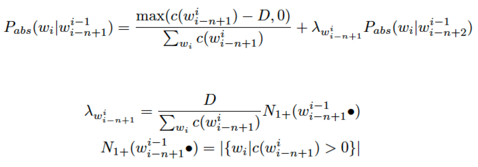
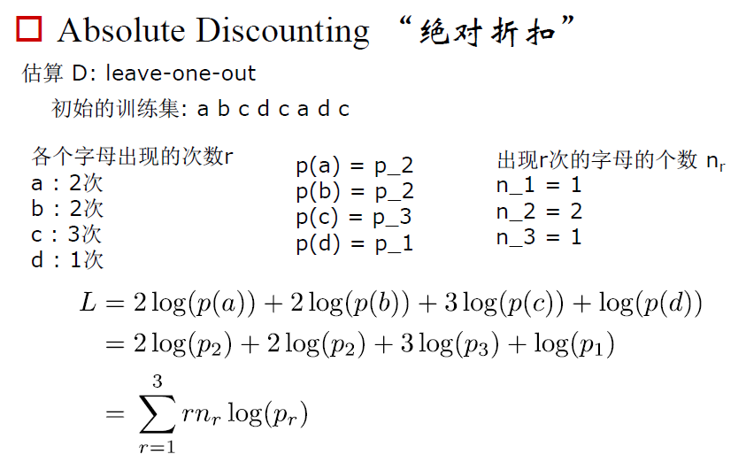
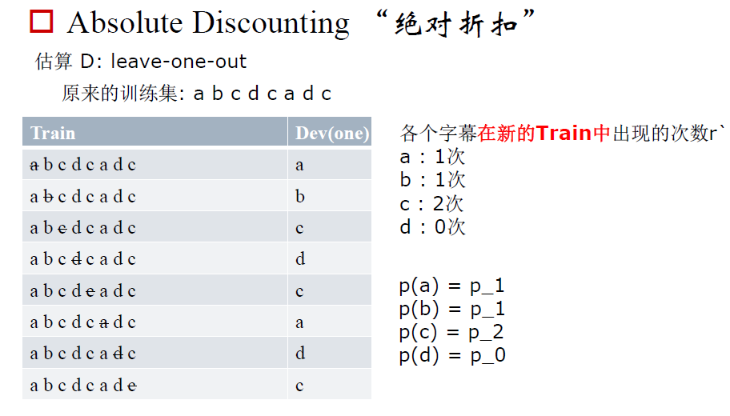
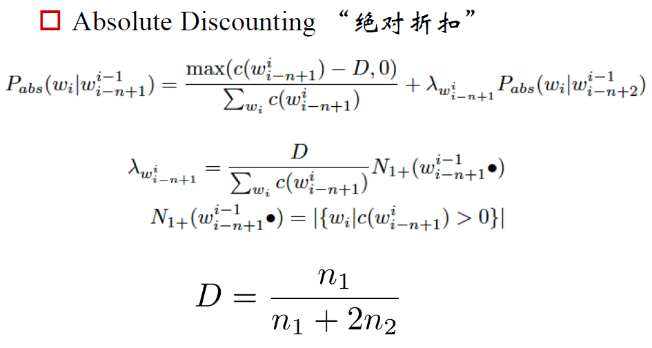
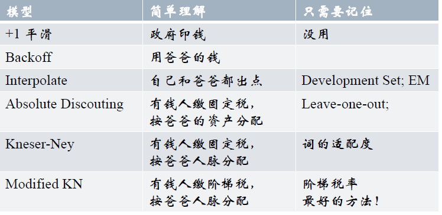

语言模型是什么？简单来说，**语言模型就是判断一句话是不是人话，通常用概率来表示一句话是人话的可能性**。比如“我是谁”是人话的概率就比“我谁是”大。

语言模型的目的是判断一个句子序列是不是人话，也就是计算一个句子序列是人话的概率。这是语言模型的通俗解释，它的标准定义其实是这样的：

**对于语言序列$w_1, w_2, ..., w_n$，语言模型就是计算该序列出现的概率，即$P(w_1, w_2, ..., w_n)$。**

其中$w_i$是指词，语言序列就是由词组成的序列，语言模型会给更像人话的序列更大的概率，比如P(我是谁)>P(我谁是)。

语言模型的应用有哪些呢？

- 在机器翻译里面，遴选更常见的词汇组合（根据概率大小）
- 应用于句子的拼写纠错（根据正确/错误组合的概率大小）
- 帮助语音识别（根据相似发音的组合的概率大小）
- 搜索引擎、输入法的词语提示（根据组合的概率大小）

语言模型包括统计语言模型和神经网络语言模型。

统计语言模型产生的初衷是为了解决语音识别问题。在语音识别中，计算机需要知道一个文字序列是否能构成一个大家理解而且有意义的句子，然后显示或者打印给使用者。

统计语言模型就是运用统计的方法计算出语言序列出现的概率。可以把人类有史以来讲过的话写过的句子统计一下，就能知道序列可能出现的概率了。但是想也知道这种方法行不通。所以我们需要有一个模型来估算。常用的统计语言模型就是N-gram。下面详细介绍N-gram模型。

首先，根据链式法则(chain rule)：

$P(w_1, w_2, ..., w_n)=P(w_1)P(w_2|w_1)...P(w_n|w_1,...,w_{n-1})$

其中$P(w_1)$表示词$w_1$在**句子开头**出现的概率，$P(w_2|w_1)$表示在已知第一个词的前提下，第二个词出现的概率；以此类推。词$w_n$出现的概率取决于它前面所有的词。n越大，涉及的词越多，计算某个序列的概率可能还好，但是要计算所有可能的序列的概率就变得十分困难，甚至无法估算。那怎么办呢？

为了解决这个问题，马尔可夫假设被提出了，即假设任意一个词出现的概率只与它前面的N-1个词有关：

$P(w_i|w_1,...,w_{i-1})=P(w_i|w_{i-n-1},...,w_{i-1})$

基于上式，定义**N-gram语言模型**如下：

N=1 unigram：$P(w_1, w_2, ..., w_n)=\prod_{i=1}^nP(w_i)$

N=2 bigram：$P(w_1, w_2, ..., w_n)=\prod_{i=1}^nP(w_i|w_{i-1})$

N=3 trigram：$P(w_1, w_2, ..., w_n)=\prod_{i=1}^nP(w_i|w_{i-2},w_{i-1})$

以此类推

可以发现，N-gram模型和N-1阶马尔可夫假设是对应的。N=1时的模型实际上是一个上下文无关的模型。

N-gram模型所做的马尔可夫假设忽视了语言中的长程依赖（比如某个词的出现还依赖于上一个段落）,但实用效果不错。**实际中应用最多的是N=3的三元模型。** 当N从1到2，再从2到3时，模型的效果上升显著，而从3到4时，效果的提升就不是很显著了，但是资源的耗费却增加得非常快。

以bigram为例，如何计算右边的条件概率呢？根据条件概率的定义：

$P(w_i|w_{i-1})=\frac{P(w_{i-1}, w_i)}{P(w_{i-1})}$

为了估计联合概率$P(w_{i-1}, w_i)$和边缘概率$P(w_{i-1})$，我们需要有一个语料库(Corpus)，只要统计一下词对出现的次数以及每个词出现的次数，用两个数分别除以语料库的大小，即可得到这些词或二元组的相对频度：

$f(w_{i-1}, w_i)=\frac{count(w_{i-1}, w_i)}{count}$

$f(w_{i-1})=\frac{count(w_{i-1})}{count}$

根据大数定理，只要统计量足够，相对频度就等于概率：

$P(w_{i-1}, w_i)=\frac{count(w_{i-1}, w_i)}{count}$

$P(w_{i-1})=\frac{count(w_{i-1})}{count}$

所以：

$P(w_i|w_{i-1})=\frac{count(w_{i-1}, w_i)}{count(w_{i-1})}$

只需要在语料库中统计分子分母的值就可以计算出条件概率了。

但是如果$count(w_{i-1}, w_i)=0$怎么办？是否意味着条件概率$P(w_i|w_{i-1})=0$呢？如果$count(w_{i-1}, w_i)$和$count(w_{i-1})$都等于1，能否得出$P(w_i|w_{i-1})=1$的结论呢？显然是不能这么草率的。可以用下面几种方法改进：

**1.加1平滑和加K平滑**

对每一个N-gram，其计数更新为(实际出现次数+1)次。这称为加1平滑，或者Laplace平滑。这个方法的弊端在于，很容易为没出现过的N-gram分配过多的概率空间。1920年提出

对每一个N-gram，其计数更新为(实际出现次数+K)次，其中K小于1。这种方法称为Lidstone法则。

加1平滑在别的分类问题中可能有用，但是在语言模型中表现一般

比喻：政府给大家每人发一点钱

**2.卡茨退避法(Katz backoff)**

来源于Good-Turing估计，这个估计的原理是这样的：对于没有看见的事件，我们不能认为它发生的概率是零，因此我们从概率的总量中，分配一个很小的比例给这些没有看见的事件，同时需要将所有看见的事件概率调小一点，使得概率总和等于1。至于小多少，要根据“越是不可信的统计折扣越多”的方法进行。

假设在语料库中出现r次的词有$N_r$个，特别地，未出现的词数量为$N_0$。语料库的大小为N，那么：

$N=\sum_{r=1}^{\infty}rN_r$

假定r比较小时，它的统计可能不可靠，在计算那些出现r次的词的概率时，要使用一个更小一点的次数$d_r$：

$d_r=(r+1) * N_{r+1}/N_r$

显然：

$\sum_r d_r * N_r = N$

一般来说，出现一次的词的数量比出现两次的多，出现两次的比出现三次的多。即$N_{r+1} < N_r$。这种规律称为Zipf定律(Zipf's Law)。一般情况下$d_r < r, d_0 > 0$。这样就给未出现的词赋予了一个很小的非零值。

在实际中，一般对出现次数超过某个阈值的词，频率不下调，只对出现次数低于这个阈值的词，频率才下调，下调得到的频率总和分配给未出现的词。

基于这种思想，估计二元模型概率的公式如下：

$$ P(w_i|w_{i-1})= \begin{cases} f(w_i|w_{i-1}), & \text {if $count(w_{i-1},w_i)\geq T$} \\ f_{gt}(w_i|w_{i-1}), & \text{if $0\lt count(w_{i-1},w_i)\leq T$} \\ Q(w_{i-1})f(w_i), & \text{otherwise} \end{cases} $$

其中T是一个阈值，一般在8-10左右，$f_{gt}()$函数表示经过Good-Turing估计后的相对频度，而$Q(w_{i-1})$是将剩下的概率均分给没有出现在语料库中的词（即未登录词OOV）的结果。这种平滑的方法就称为卡茨退避法(Katz backoff)。

内伊(Herman Ney)等人在此基础上优化了这个方法，原理大同小异。

**3.删除插值(Deleted Interpolation)法**

用低阶语言模型和高阶模型进行线性插值来达到平滑的目的。1980提出完善

$P(w_i|w_{i-2}, w_{i-1})=\lambda_3 f(w_i|w_{i-2}, w_{i-1})+\lambda_2 f(w_i|w_{i-1})+\lambda_1 f(w_i)$

比喻：自己，爸爸，爷爷各自出一点钱

公式中的$\lambda$均为正数且和为1。这种方法的效果比卡茨退避法略差。注意f值从Training Set中计算出，$\lambda$值从Development Set中得出，用极大似然估计法。

$L=\sum_h count(h)log(\sum_{i=1}^K \lambda_i f_{w_i}(h))$

log里面只有几个参数的和，求导之后，各个参数耦合在一起。用EM算法来解决。

更进一步，还可以根据不同的上下文，选择不同的参数

$\lambda_k \rightarrow \lambda_{k, w^i_{i-2}}$

**4.Back-off回退法**

1987年提出, 使用Trigram如果count(trigram)满足一定的条件；否则使用Bigram；否则使用Unigram。具体参考"Katz smoothing"

比喻：自己有钱自己出；自己没钱爸爸出；爸爸没钱爷爷出

**5.Absolute Discounting绝对折扣**

比喻：有钱的，每个人交固定的税D，建立一个基金；没钱的，根据自己爸爸有多少钱来分了这个基金。

递归停止：Unigram或者zero-gram

下面是具体的例子，可以不用看，这个方法已经过时了。

**6.Kneser-Ney Smoothing**

回顾Absolute Discounting

填空：我 想 买 太阳 __

A 像章 count(太阳，像章)=0  count(像章)=100

B 老铁 count(太阳，老铁)=0 count(老铁)=1000

这样会选到B，显然不合理，需要选一个更加"适配"的词

(刘强西 奶茶)=40，(玉思聪 ZB)=10，(玉思聪 LY)=10，(玉思聪 LPD)=10

(___, 网红SLD)？会选成刘（出现次数更多）

需要选一个更加"交际广泛"的人

Kneser-Ney Smoothing

有钱的，每个人固定的税D，建立一个基金；没钱的，根据自己爸爸“交际广泛”的程度来分了这个基金。

以bigram为例，分子表示$w_i$这个词之前出现了多少种词（跟多少个词搭配过），分母表示一共有多少个bigram。

Modified Kneser-Ney Smoothing

设置三个D：

D1 如果c=1, D2如果c=2, D3如果c>=3

**OOV问题的解决**

1.假设Training Set中出现了|V'|个不同的词汇，那么我们根据词频选择词频最高的|V|个词汇作为我们的词汇集V。

2.在Training和Testing中，将不属于V的词汇都替换成特殊词汇UNK。

### 实践

工具：KenLM

https://kheafield.com/code/kenlm

pip install https://github.com/kpu/kenlm/archive/master.zip

代码：https://github.com/shixing/xing_nlp/tree/master/LM

案例：完形填空。http://edu.sina.com.cn/en/2002-09-27/6063.html

*参考资料*

[吴军《数学之美》](https://item.jd.com/11572052.html)

[自然语言处理NLP中的N-gram模型](https://blog.csdn.net/songbinxu/article/details/80209197)

小象学院《自然语言处理之序列模型》