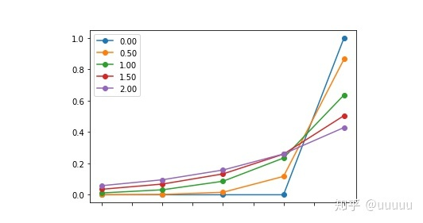

# 语言模型解码/采样策略

# 贪心


核心思想： 每一步取当前最可能的结果，作为最终结果


具体方法：获得新生成的词是vocab中各个词的概率，取argmax作为需要生成的词向量索引，继而生成后一个词

# beamsearch


核心思想： beam search尝试在广度优先基础上进行进行搜索空间的优化（类似于剪枝）达到减少内存消耗的目的


具体方法：在decoding的每个步骤，我们都保留着 top K 个可能的候选单词，然后到了下一个步骤的时候，我们对这 K 个单词都做下一步 decoding，分别选出 top K，然后对这 K^2 个候选句子再挑选出 top K 个句子。以此类推一直到 decoding 结束为止。当然 Beam Search 本质上也是一个 greedy decoding 的方法，所以我们无法保证自己一定可以得到最好的 decoding 结果

缺点：会生成出空洞、重复、前后矛盾的文本。

# 随机sampling

我们可以在生成文本的时候引入一些随机性。例如现在语言模型告诉我们下一个单词在整个单词表上的概率分布是 p = (p_1, p_2, … p_|V|)，那么我们就可以按照这个概率分布进行随机采样，然后决定下一个单词生成什么。采样相对于greedy方法的好处是，我们生成的文字开始有了一些随机性，不会总是生成很机械的回复了。

随机采样容易产生前后不一致的问题。而在开放闲聊领域，生成文本的**长度都比较短**，这种问题就被自然的淡化了。

## **Temperature** **sampling**

采样的时候有一个可以控制的超参数，称为**温度**(temperature, )T。解码器的输出层后面通常会跟一个softmax函数来将输出概率归一化，通过改变T可以控制概率分布的形貌。softmax的公式如下，当T大的时候，概率分布趋向平均，随机性增大；当T小的时候，概率密度趋向于集中，即强者愈强，随机性降低，会更多地采样出“放之四海而皆准”的词汇。

**存在的问题**

①生成的话容易不连贯，上下文比较矛盾。  
②容易生成奇怪的话，出现罕见词。

```python
>>> import torch
>>> import torch.nn.functional as F
>>> a = torch.tensor([1,2,3,4.])
>>> F.softmax(a, dim=0)
tensor([0.0321, 0.0871, 0.2369, 0.6439])
>>> F.softmax(a/.5, dim=0)
tensor([0.0021, 0.0158, 0.1171, 0.8650])
>>> F.softmax(a/1.5, dim=0)
tensor([0.0708, 0.1378, 0.2685, 0.5229])
>>> F.softmax(a/1e-6, dim=0)
tensor([0., 0., 0., 1.])
```




## top-k sampling

取概率最大的K个词，之后对这K个词概率归一化之后再进行sampling,但K的大小不太好选，因为不同的句子，概率分布的变化有很大的区别，有的时候比较平，有的时候比较集中，分布均衡时，K小了容易丢失优质的词，分布集中时，K大了容易引入奇怪的词，就和随机采样没什么区别了。

## top-p（nucleus） sampling核采样

[The Curious Case of Neural Text Degeneration](https://arxiv.org/abs/1904.09751)

好处:不需要手动的选取K,作者选取p为0.95
对当前的所有词的概率按照从大到小开始累加，当累加的值大于阈值P的时候，后面小的概率词就不使用，对前面的词再进行sampling,如设置阈值p为0.95，则相当于对左上选用top 4,右上选用top 2

参考：[https://zhuanlan.zhihu.com/p/115076102](https://zhuanlan.zhihu.com/p/115076102)


其实上述各种采样方式在HuggingFace的库里都已经实现了（感动！），我们来看一下代码。

先看top-k和top-p采样

```python
# 代码输入的是logits，而且考虑很周全（我感觉漏了考虑k和p都给了的情况，这应该是不合适的）
# 巧妙地使用了torch.cumsum
# 避免了一个词都选不出来的尴尬情况
def top_k_top_p_filtering(logits, top_k=0, top_p=1.0, filter_value=-float("Inf"), min_tokens_to_keep=1):
    """ Filter a distribution of logits using top-k and/or nucleus (top-p) filtering
        Args:
            logits: logits distribution shape (batch size, vocabulary size)
            if top_k > 0: keep only top k tokens with highest probability (top-k filtering).
            if top_p < 1.0: keep the top tokens with cumulative probability >= top_p (nucleus filtering).
                Nucleus filtering is described in Holtzman et al. (http://arxiv.org/abs/1904.09751)
            Make sure we keep at least min_tokens_to_keep per batch example in the output
        From: https://gist.github.com/thomwolf/1a5a29f6962089e871b94cbd09daf317
    """
    if top_k > 0:
        top_k = min(max(top_k, min_tokens_to_keep), logits.size(-1))  # Safety check
        # Remove all tokens with a probability less than the last token of the top-k
        indices_to_remove = logits < torch.topk(logits, top_k)[0][..., -1, None]
        logits[indices_to_remove] = filter_value

    if top_p < 1.0:
        sorted_logits, sorted_indices = torch.sort(logits, descending=True)
        cumulative_probs = torch.cumsum(F.softmax(sorted_logits, dim=-1), dim=-1)

        # Remove tokens with cumulative probability above the threshold (token with 0 are kept)
        sorted_indices_to_remove = cumulative_probs > top_p
        if min_tokens_to_keep > 1:
            # Keep at least min_tokens_to_keep (set to min_tokens_to_keep-1 because we add the first one below)
            sorted_indices_to_remove[..., :min_tokens_to_keep] = 0
        # Shift the indices to the right to keep also the first token above the threshold
        sorted_indices_to_remove[..., 1:] = sorted_indices_to_remove[..., :-1].clone()
        sorted_indices_to_remove[..., 0] = 0

        # scatter sorted tensors to original indexing
        indices_to_remove = sorted_indices_to_remove.scatter(1, sorted_indices, sorted_indices_to_remove)
        logits[indices_to_remove] = filter_value
    return logits

```


## **自动选取超参-p&k**

目标是通过top k 和 top p来最大化下一个预测最大概率的token为真实token。对于k， 可以直接找到真实token对应的sorted之后的index, 对于p, 可以看真实token对应的累计之后的位置。比如"我喜欢吃热"，真实token是“狗”，而模型top 1置信度对应的token是"煎饼"，top 1对应的累加概率为60%，往低概率的token继续查找，如果发现”狗“对应的index是3，此时对应的累加概率是85%，这时候就找到了最优的p了。

超参搜索。

```python
def best_k_p(logits, golden, verbose=False):
    sorted_logits, sorted_indices = torch.sort(logits, descending=True)
    cumulative_probs = torch.cumsum(F.softmax(sorted_logits, dim=-1), dim=-1)
    ks = (sorted_indices == golden).nonzero()[:, 1]
    ps = cumulative_probs[sorted_indices == golden]
    #print('top 5:', enc_.decode(sorted_indices[0, :5].tolist()))
    return ks, ps
```


## 重复惩罚

为了解决重复问题，还可以通过**惩罚因子**将出现过词的概率变小或者**强制不使用重复词**来解决。惩罚因子来自于同样广为流传的《CTRL: A Conditional Transformer Language Model for Controllable Generation》[2]。

```python
# 输入的同样是logits(lprobs)
# 同时输入了之前出现过的词以及惩罚系数（大于1的）
# 考虑到了logit是正和负时处理方式应该不一样
def enforce_repetition_penalty_(self, lprobs, batch_size, num_beams, prev_output_tokens, repetition_penalty):
        """repetition penalty (from CTRL paper https://arxiv.org/abs/1909.05858). """
        for i in range(batch_size * num_beams):
            for previous_token in set(prev_output_tokens[i].tolist()):
                # if score < 0 then repetition penalty has to multiplied to reduce the previous token probability
                if lprobs[i, previous_token] < 0:
                    lprobs[i, previous_token] *= repetition_penalty
                else:
                    lprobs[i, previous_token] /= repetition_penalty

```


## 重复词去除


```python
# 这个函数将会返回一个不可使用的词表
# 生成n-gram的巧妙方式大家可以借鉴一下
# 下面是一个3-gram的例子
# a = [1,2,3,4,5]
# for ngram in zip(*[a[i:] for i in range(3)]):
#    print(ngram)
def calc_banned_tokens(prev_input_ids, num_hypos, no_repeat_ngram_size, cur_len):
    # Copied from fairseq for no_repeat_ngram in beam_search"""
    if cur_len + 1 < no_repeat_ngram_size:
        # return no banned tokens if we haven't generated no_repeat_ngram_size tokens yet
        return [[] for _ in range(num_hypos)]
    generated_ngrams = [{} for _ in range(num_hypos)]
    for idx in range(num_hypos):
        gen_tokens = prev_input_ids[idx].numpy().tolist()
        generated_ngram = generated_ngrams[idx]
        # 就是这巧妙的一句
        for ngram in zip(*[gen_tokens[i:] for i in range(no_repeat_ngram_size)]):
            prev_ngram_tuple = tuple(ngram[:-1])
            generated_ngram[prev_ngram_tuple] = generated_ngram.get(prev_ngram_tuple, []) + [ngram[-1]]

    def _get_generated_ngrams(hypo_idx):
        # Before decoding the next token, prevent decoding of ngrams that have already appeared
        start_idx = cur_len + 1 - no_repeat_ngram_size
        ngram_idx = tuple(prev_input_ids[hypo_idx, start_idx:cur_len].numpy().tolist())
        return generated_ngrams[hypo_idx].get(ngram_idx, [])

    banned_tokens = [_get_generated_ngrams(hypo_idx) for hypo_idx in range(num_hypos)]
    return banned_tokens


```


```python
if do_sample:
    # 这是今天的采样方式
    _scores = scores + beam_scores[:, None].expand_as(scores)  # (batch_size * num_beams, vocab_size)
    # Top-p/top-k filtering，这一步重建了候选集
    _scores = top_k_top_p_filtering(
        _scores, top_k=top_k, top_p=top_p, min_tokens_to_keep=2
    )  # (batch_size * num_beams, vocab_size)
    # re-organize to group the beam together to sample from all beam_idxs
    _scores = _scores.contiguous().view(
        batch_size, num_beams * vocab_size
    )  # (batch_size, num_beams * vocab_size)

    # Sample 2 next tokens for each beam (so we have some spare tokens and match output of greedy beam search)
    probs = F.softmax(_scores, dim=-1)
    # 采样
    next_tokens = torch.multinomial(probs, num_samples=2 * num_beams)  # (batch_size, num_beams * 2)
    # Compute next scores
    next_scores = torch.gather(_scores, -1, next_tokens)  # (batch_size, num_beams * 2)
    # sort the sampled vector to make sure that the first num_beams samples are the best
    next_scores, next_scores_indices = torch.sort(next_scores, descending=True, dim=1)
    next_tokens = torch.gather(next_tokens, -1, next_scores_indices)  # (batch_size, num_beams * 2)
else:
    # 这是昨天的beam search方式
    # 直接将log概率相加求条件概率
    next_scores = scores + beam_scores[:, None].expand_as(scores)  # (batch_size * num_beams, vocab_size)

    # re-organize to group the beam together (we are keeping top hypothesis accross beams)
    next_scores = next_scores.view(
        batch_size, num_beams * vocab_size
    )  # (batch_size, num_beams * vocab_size)

    next_scores, next_tokens = torch.topk(next_scores, 2 * num_beams, dim=1, largest=True, sorted=True)

```


# 参考资料

[解码策略](https://blog.csdn.net/weixin_44179676/article/details/109407547)（介绍了几个解码策略，包括代码）

[十分钟读懂Beam Search(2/2) 看ICLR2020论文教你如何提升](https://mp.weixin.qq.com/s/BuvLXx0ZItOvhno4XAUpTg)（和解码策略这篇文章类似）

[香侬读 | 采样算法哪家强：一个针对主流采样算法的比较](https://mp.weixin.qq.com/s/vTFt9iSk2ektt9DPhSUcDg)（比较了当前主流的几个采样算法Top-K, Nucleus, Tempered，发现他们都满足三个关键性质（1）减熵性；（2）保序性；（3）保斜率性。）

[从不同解码策略看机器如何生成文本](https://blog.csdn.net/Kaiyuan_sjtu/article/details/105387819)（以GPT2为例举例说明各种策略）

[语言模型采样策略](https://zhuanlan.zhihu.com/p/267471193)（介绍+代码）

[文本生成中的decoding strategy整理](https://zhuanlan.zhihu.com/p/68383015)（有Class-factored Softmax和Pointer-generator Network）


