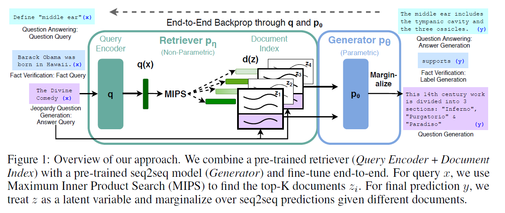
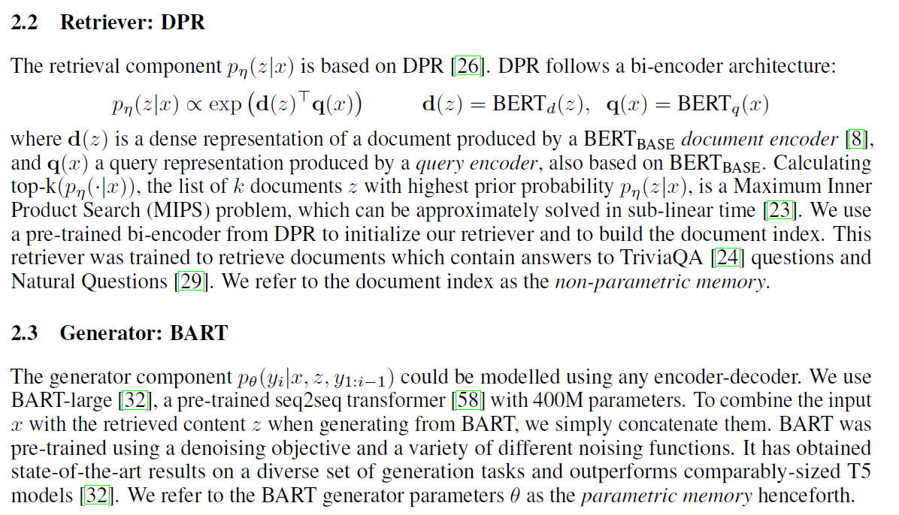

## RAG

[https://huggingface.co/docs/transformers/model_doc/rag](https://huggingface.co/docs/transformers/model_doc/rag)（官方介绍文档）

[https://huggingface.co/blog/ray-rag](https://huggingface.co/blog/ray-rag)（使用RAY来finetune）

[https://github.com/huggingface/transformers/tree/master/examples/research_projects/rag](https://github.com/huggingface/transformers/tree/master/examples/research_projects/rag)（使用torch来finetune）

预训练模型的汇总

|Autoregressive|Autoencoding|Seq2Seq|Multimodal|Retrieval-based|
|---|---|---|---|---|
|GPT   GPT-2   CTRL   Transformer-XL   Reformer   XLNet|BERT   ALBERT   RoBERTa   DistilBERT   ConvBERT   XLM   XLM-RoBERTa   FlauBERT   ELECTRA   Funnel Transformer   Longformer|BART   Pegasus      MarianMT      T5   MT5   MBart   ProphetNet      XLM-ProphetNet|MMBT|DPR   RAG|

Retrieval-Augmented Generation for Knowledge-Intensive NLP Tasks

https://github.com/huggingface/transformers/blob/master/examples/rag/

论文的RAG模型：

- the parametric memory is a pre-trained seq2seq transformer(BART)
- the non-parametric memory is a dense vector index of Wikipedia, accessed with a pre-trained neural retriever(Dense Passage Retriever).

总结起来就是**拿到问题后先查资料再答题**

The retriever (Dense Passage Retriever [26], henceforth DPR) provides latent documents conditioned on the input, and the seq2seq model (BART [32]) then conditions on these latent documents together with the input to generate the output. We marginalize the latent documents with a top-K approximation,
either on a per-output basis (assuming the same document is responsible for all tokens) or a per-token
basis (where different documents are responsible for different tokens). Like T5 [51] or BART, RAG
can be fine-tuned on any seq2seq task, whereby both the generator and retriever are jointly learned

retriever：给定query x返回top k个text passages

generator：根据之前i-1个token，原始的输入x以及passage z生成当前的token

RAG（**R**etrieval**A**ugmented**G**eneration，检索增强生成）架构是一个端到端的可差异化模型，它结合了信息检索组件（Facebook AI 的[基于稠密段落检索系统](https://arxiv.org/abs/2004.04906)（dense-passage retrieval system）和 seq2seq 生成器（Facebook 的[BART 模型](https://arxiv.org/abs/1910.13461)（Bidirectional and Auto-Regressive Transformers，双向和自回归 Transformer ））。与最大的预训练 seq2seq 语言模型相比，RAG 可以在知识密集型下游任务上进行微调，达到最优结果。而且与这些预训练模型不同，RAG 的内部知识可以轻松地随时更改或补充，从而使研究人员和工程师控制 RAG 所知道的内容，而不会浪费时间或算力来重新训练整个模型。

RAG 的外观和行为类似于标准的 seq2seg 模型，这意味着它接受一个序列并输出相应的序列。不过，还有一个中间步骤，它将 RAG 与通常的 seq2seq 方法区别开来并提升。RAG 不是直接将输入传递给生成器，而是使用输入检索一组相关文档，在我们的例子中，是从维基百科（Wikipedia）检索的。

例如，给出提示“地球上第一个哺乳动物是什么时候出现的？”，RAG 可能会提供“哺乳动物”、“地球历史”和“哺乳动物进化”的文档。然后，将这些支持文档与原始输入作为上下文连接起来，并提供给生成实际输出的 seq2seq 模型。因此，RAG 有两个知识来源：seq2seq 模型在其参数中存储的知识（参数记忆）和存储在 RAG 段落检索语料库中的知识（非参数记忆）。

这两个来源相辅相成。我们发现，RAG 使用其非参数记忆来“提示”seq2seq 模型产生正确的响应，本质上结合了“闭卷”或纯参数方法的灵活性与“开卷”或基于检索的方法性能。RAG 使用一种后期融合的形式集成所有检索到的文档知识，这意味着它对文档-问题进行单独的答案预测，然后聚合最终的预测分数。最关键的是，使用后期融合允许我们将输出中的错误信号反向传播到检索机制，这可以实质性地显著提高端到端系统的性能。

将基于检索的组件与生成组件相结合，即使在纯粹的提取任务（如开放域 NaturalQuestions 任务）中也具有优势。当 RAG 可以访问包含正确答案线索的文档，但答案从未逐字说明时，性能也会提高，并且 RAG 甚至可以在某些情况下生成正确答案，而正确答案在任何文档都检索不到。我们用 RAG 在 NaturalQuestions、CuratedTrec 和 WebQuestions 上获得了非常好的结果，证明了最先进的机器阅读性能可以用生成式阅读器而不是提取式阅读器来实现。

RAG 确实擅长知识密集型的自然语言生成，我们通过生成“Jeopardy!”问题进行了探索。RAG 生成的“Jeopardy!”问题比同类最先进的 seq2seq 模型的问题更具体、更多样、更符合事实。我们认为，这是因为 RAG 有能力使用从多个来源获得的不同信息来合成一个响应。

RAG 的真正优势在于其灵活性。要改变预训练的语言模型所知道的内容，需要用新的文档对整个模型进行再训练。通过 RAG，我们可以通过交换知识检索所用的文档来控制它所知道的内容。我们将维基百科的原始数据集换成一个旧的数据集，然后问一些问题，比如，“谁是冰岛的总理？”，对这种行为进行测试。结果表明，尽管参数知识保持静态，但 RAG 还是利用交换语料库中的知识来调整其答案。在事实（或我们对事实的理解）随时间演变的情况下，这种自适应方法是非常有价值的。

使用：

- 需要一个question_encoder_name_or_path例如dpr-question_encoder-single-nq-base
- 需要一个generator_name_or_path例如bart-large

## 分享

论文1题目：Retrieval-Augmented Generation for Knowledge-Intensive NLP Tasks

摘要：RAG架构是一个端到端的可差异化模型，它结合了信息检索组件和 seq2seq 生成器。与预训练 seq2seq 语言大模型相比，RAG 可以在知识密集型下游任务上进行微调，达到最优结果。而且与这些预训练模型不同，RAG 的内部知识可以轻松地随时更改或补充，从而使研究人员和工程师控制 RAG 所知道的内容，而不会浪费时间或算力来重新训练整个模型。

## 参考资料

[Facebook 开源人工智能模型 RAG：可检索文档以回答问题](https://cloud.tencent.com/developer/news/706625)

https://zhuanlan.zhihu.com/p/339942960

https://blog.csdn.net/qq_40212975/article/details/109046150
