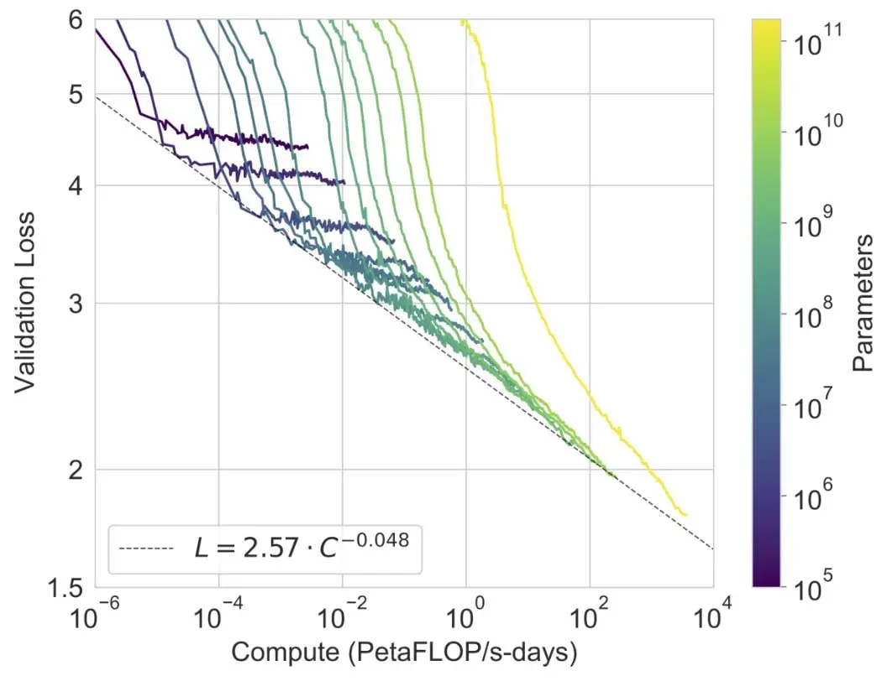
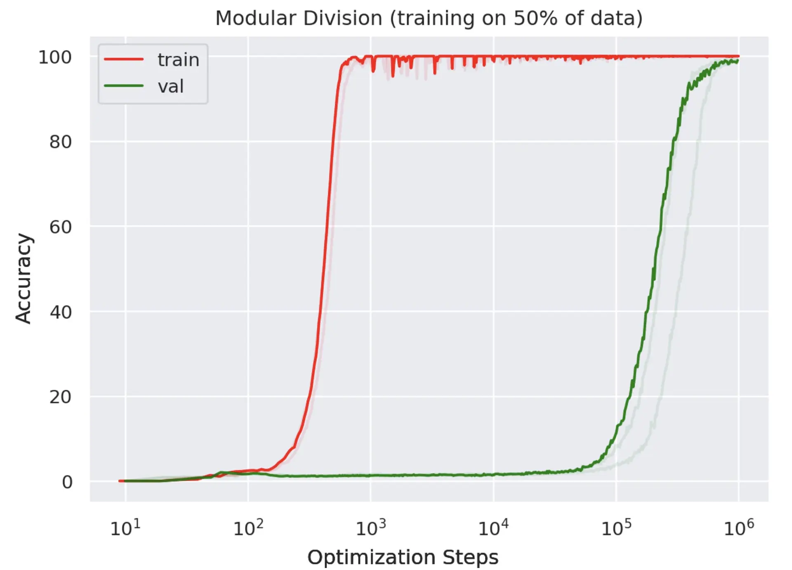
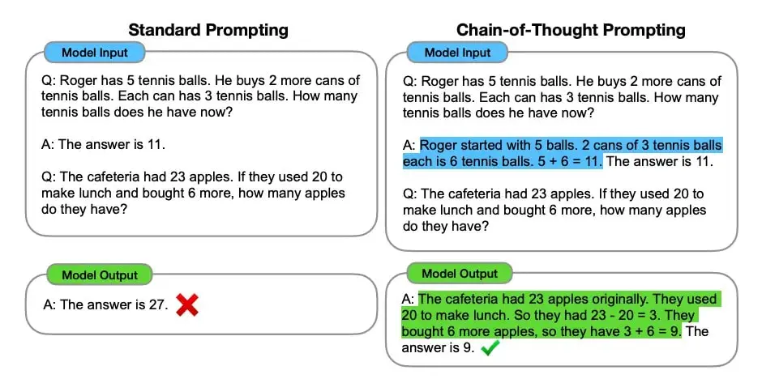
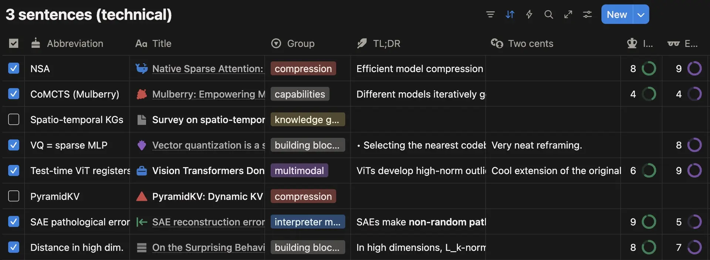

# 如何用 5 分钟阅读研究论文

**作者：Mason J. Wang**  
原文链接：[how to read research papers, in 5 minutes. | writing](https://masonjwang.com/writing/reading-research)
（译者注：这篇文章主要面向所有阶段的读者，尤其是机器学习领域的研究者，但原则几乎适用于任何学科。）

### 💡 TL;DR（总结）

现在的论文实在太多了，大多数要么是小修小补，要么写得很糟。  
你得快速看很多篇，才能看出规律。  
除非你是刚入门，否则我建议你练习一种能力：**快速扫读大量论文，只对好的论文深入阅读**。

## 开篇：没人教你怎么读论文

不管你是在学术界还是业界，大多数人都没人教过如何读论文。  
在学术界，这被视为你“自己应该会”的技能；在学术界之外，很多人则被“太技术、太枯燥”的印象吓退。

我自己也花了大约三年时间，把读论文当作苦差事。  
但现在，我真的挺喜欢读论文的。

回头看，这里是我总结的三个最有用的原则：

## #1. 直觉→实证→细节。按这个顺序来。

读论文最有效率的方法是什么？  
对我而言，最有效的方式是这个三步框架：

1. **先抓直觉（Intuition）**：弄清楚这篇论文在讲什么、为什么重要；
    
2. **再看实证（Empirics）**：方法到底有没有用；
    
3. **最后看细节（Details）**：只有当你觉得值得时再深入。

### ① 直觉（Intuition）

问问自己：**能不能用三句话总结这篇论文？**  
如果不能，那就说明你还没抓住核心。

### ② 实证（Empirics）

也就是论文中的“证据”和“实验”。  
作者都想推销自己的方法，所以要学会看穿宣传。

一个很好的起点是——**看图表**。  
论文用图表讲故事的清晰程度，往往能反映论文质量。  
比如，经典的机器学习论文往往图表清晰、有说服力；而那种“在某个基准上+1%”的论文，通常一眼就显得敷衍。

举几个例子：

- **GPT-3 的 scaling law（扩展规律）**：模型越大、算力越多，误差就越低——清晰、可信。
    
- **Grokking 现象**：模型先死记硬背（红线快速上升），后来才突然学会真正的规律（绿线上升）。
    
- **Chain-of-thought prompting（思维链提示）**：除了结果图之外，优秀的论文通常还有有帮助的解释性视觉元素。这张图展示了将逐步推理添加到模型答案中如何产生巨大差异。
    

这些都是“好论文”的标志——不仅结果强，还能清楚地解释。

### ③ 细节（Details）

只有当你觉得**值得花时间**时再看。

人和人差别最大的一步就在这里：

- 我有工程背景，喜欢边读边写点代码，比如自己复现 Hopfield 网络。这让我更容易理解理论。
    
- 我认识的数学博士则喜欢从定义和公式入手，因为“万物皆由此起”。但那种方式对我来说太慢了。
    
- 有时自己推一遍公式、验证推导，不仅帮助理解，还能发现论文其实有错！
    

你可以随时在上述步骤中的某一步停下来。  读 20 篇抓直觉、挑 2 篇深入理解——这就够了。

### 为什么速度重要？

因为你需要——

## #2 狠心优化，找到最适合你的方式。

要读得多、读得快，同时优化这三个维度：

### 🔹 **读什么（WHAT）**

培养“研究品味”。  
在机器学习领域，论文尤其容易受到“斯特金定律”（90% 的东西都是垃圾）的影响。  
如果每篇都花太久，你永远看不够多，自然也看不出“好坏”的感觉。

记住：**论文的意义来自它与整个领域的联系**，而不是孤立存在。

### 🔹 **怎么读（HOW）**

找到自己的阅读流程。  
我试过笔记本、Jupyter、最后停在 Notion。

我的方法是：

- 把整篇论文贴进一个prompt模板，让 AI 帮我生成三段总结（直觉、实证、细节），从高处俯瞰。
    
- 然后在 Notion 数据库（我的“论文书架”）里记录：
    
    - 3 句 TL;DR；
        
    - 2 句个人评价；
        
    - 兴趣度和重要性评分。

### 🔹 **去哪找（WHERE）**

每个人的论文来源不同。  
有的人看推特，有的人读 survey，还有的人顺着引用一路挖。

关键是明确：**你为什么要读？**  
是想了解全局，还是想找新的角度？目的不同，策略也不同。

### ⚙️ 总之：多尝试。

别照搬别人的方法。  
读论文这事，没有统一公式。  
有人建议先读摘要，有人建议最后读——我都被教过，两种都试过。

## #3 用 AI，但要让“思考”变难。

现在是学习最方便的时代。  
ChatGPT 能解释几乎所有东西。

但我也非常庆幸自己在这些工具出现前就学会了编程。  
因为当学习的“摩擦”被拿走时，**真正的学习反而变难**。

很多人用 AI 学编程，反而学得更慢。

正如作家 Joan Westenberg 所说：

> “当我们用第二种知识取代第一种——那些‘看似懂了其实没懂’的东西——  
> 它在表面上看起来一样：我们听起来很自信，也感觉自己懂了。  
> 但只有真正理解的那种，才能经得起挑战。”

因此，我会用 AI 来辅助理解（甚至写好提示词模板），  
但写那三句总结或个人评论时，**绝不用 AI**。  
因为那才是你真正动脑的时刻。

你也可以用别的方式，把“摩擦”加回来。

## 🔍 最后：练习“提问”的能力

AI 可以给你答案，但问出**正确的问题**还是靠你。

我时常提醒自己，只有两种状态：

1. 我理解这个主题，可以评论、判断、使用；
    
2. 我不理解。
    

两者的区别，就是中间那一串问题。

如果看不懂，不是你笨，而是你还缺一个“前置概念”。  
去补那个缺口，一次一个问题地补全。

要大胆、要好奇。

# 附录摘录

- 如果你刚入门，请慢慢读前几篇，逐行查不懂的术语，打好地基。
    
- 为什么要读论文？因为不读原始资料，就只能“被动接受判断”。
    
- 经典论文也会出错（比如 Adam 优化器、FlashAttention）。
    
- 快速阅读不是浅阅读，你随时能回头深入。
    
- 找论文的地方：AlphaXiv、Hazy Research、DeepSeek 的论文都值得关注。
    
- 一些令人印象深刻的“重新定义类”论文：
    
    - **Universal Hopfield Networks**：把 Hopfield 网络与 Transformer 联系起来；
        
    - **Fast Weight Programmers**：早期权重生成网络与现代注意力机制的桥梁；
        
    - **Vector Quantization is a Sparse MLP**：把量化-嵌入过程看作稀疏 MLP 层。
        
- 不要在缺少基础概念时硬啃论文；概念的树其实没那么深，边读边填补空白。
    
- 找学习伙伴、加入读论文小组，是提升最快也最有趣的方式。