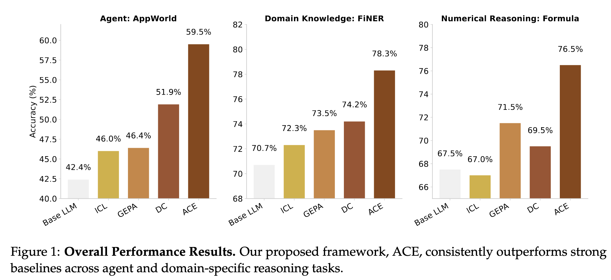
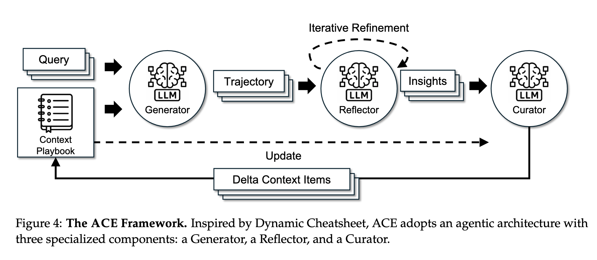
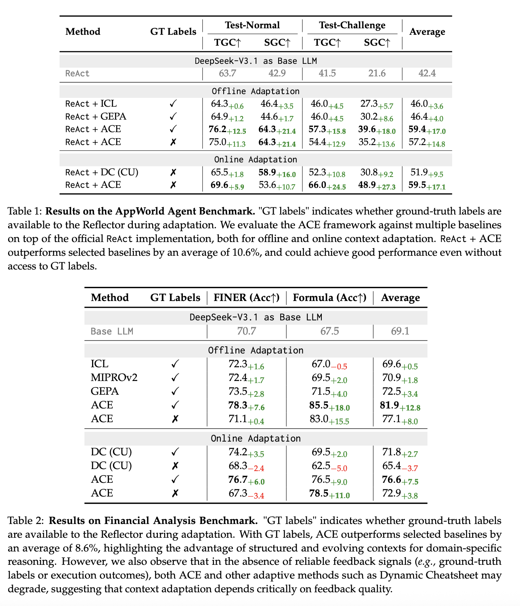
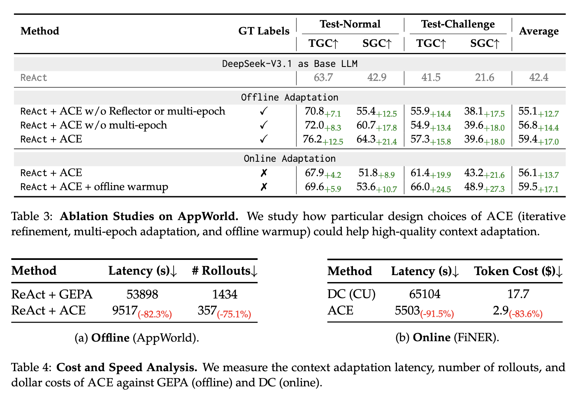

## 论文基本信息

标题：Agentic Context Engineering: Evolving Contexts for Self-Improving Language Models

链接：http://arxiv.org/abs/2510.04618

## 一、论文概况与动机

### 背景与问题

- 在当前很多基于大语言模型（LLM）的系统（比如 agent、领域推理系统等）中，一个常见做法是通过「上下文」（prompt、记忆、检索证据等）来调控模型行为，而不是去微调模型参数。也就是说，“context adaptation”（上下文适应）是一个重要方向。 
    
- 但现有 context adaptation 方法存在两个核心问题：

  1. **简洁偏差（brevity bias）**：优化过程倾向于把 prompt 或上下文写得非常简洁、泛化，但可能舍弃那些在特定任务或领域中十分重要的细节、策略和启发。   
  2. **上下文坍缩（context collapse）**：某些方法在不断重写或压缩上下文时，会逐渐丢失历史的有用信息，导致性能急剧下降。论文中举了一个例子：上下文从 ~18,000 tokens 被压缩到 ~122 tokens，结果性能下降的情况。 

- 为了解决这两点，作者希望一种新的方式：让上下文像 “不断进化的剧本 (playbook)” 那样，能够积累、有选择地保留策略与经验，而不是反复重写压缩。
    

于是他们提出 **ACE（Agentic Context Engineering）** 框架。 

---

## 二、ACE 的核心方法

ACE 的核心理念是：将上下文视为一个 “进化式的剧本／注记库 (playbook)” — 它不断积累、反思、更新，而不是被整体重写。ACE 将这个过程拆分为三个角色（模块）：

- **Generator**：负责用当前上下文去执行任务 / 回答问题，产出推理轨迹 (reasoning trajectories)、工具调用、成功 & 失败案例等。
    
- **Reflector**：对这些轨迹进行反思和批判，抽炼出哪些是好的、哪些是错误的，提取可用的“经验教训”（lessons）。
    
- **Curator**：把这些 lessons 转换成结构化的、局部的 delta（增量）更新条目，然后把它们合并进现有上下文，以保持有序、无重复、可检索。
    

这种分工的好处是：不让一个 LLM 模块同时负责所有事情（生成、反思、整理），而是职责分明，更便于控制和优化。 

### 关键机制细节

1. **增量 delta 更新（Incremental Delta Updates）**  
     上下文不是一刀全部重写，而是以小块条目的形式（“delta 条目”）加入或修改。这样可以避免每次全量重写导致的上下文坍缩。上下文以 bullet/条目的形式组织，每条带有 metadata（如“正向 / 反向 / 置信度 / 来源”等）以便管理。 
    
2. **Grow-and-Refine（扩展 + 精炼）**  
     当新的经验加入时，不是一味扩张上下文，而要有机制去控制冗余（比如去重、合并语义重复内容）、维持结构合理性。即“在保留历史与多样性的同时，避免上下文膨胀或冗杂”。 
    
3. **多轮反思 (Iterative Reflection)、多 epoch 适应 (Multi-epoch Adaptation)、离线预热 (Offline Warmup)**  
     论文在 ablation 实验中表明，这些设计（比如让 Reflector 能做多次反思、在训练阶段做多遍上下文适应、先离线适应再在线适应）对性能都有正效益。 
    
4. **上下文合并与管理策略**  
     Curator 负责把 delta 条目插入已有上下文，同时做去重、优先级排序、条目合并或淘汰等操作。这些操作多数是规则化／确定性逻辑（而不是每次都调用 LLM 完全重写）。这种设计有利于效率、可控性。 
    
5. **离线 vs 在线 适应**  
     ACE 同时支持：
  - **离线适应 (offline context adaptation)**：在训练集或已标注数据上优化上下文（比如系统 prompt、策略条目等）。  
  - **在线适应 (online adaptation / test-time memory 更新)**：在推理阶段根据模型表现 / 执行反馈（success / failure 信号）更新上下文。

  也就是说，ACE 能做到模型上线后依然自我改进。 

6. **无标签 / 反馈驱动适应**  
     一个很吸引人的点是：在某些任务中，ACE 不强依赖人工标注的正确答案，而是利用执行反馈（比如工具调用成功/失败、运行结果是否合理等）来指导 Reflector 提取经验，从而做到 “无标签适应” 或 “弱监督适应”。当然，这依赖于任务本身具备可观察的反馈信号。 
    

---

## 三、实验与结果

### 任务 & 基准

作者在两个大类任务上验证 ACE 的效果：

- **Agent 任务**：使用 AppWorld 基准（涉及 agent 的多步交互、工具调用、环境操作等）
    
- **领域专用推理任务**：在金融分析相关的数据集（FiNER token tagging、XBRL formula 推理）上测试 ACE 在领域知识密集任务上的表现。
    

对比 baselines 包括：

- Base LLM：直接提示LLM生成

- In-Context Learning (ICL)：带上few-shot（在不超出上下文长度的前提下尽可能多地提供训练样本）
    
- 剪枝／优化 prompt 的方法如 MIPROv2
    
- GEPA（genetic-Pareto prompt evolution）：经验上看，该方法比强化学习（如 GRPO）或传统 prompt 优化（如 MIPROv2）更好；
	- 收集模型的执行轨迹（推理过程、工具调用、输出结果等）；
	- 用自然语言反思（reflection）分析错误、归因、提出改进；
	- 使用遗传算法 + Pareto 优化，保留表现最好的 prompt 作为“前沿”（frontier），防止陷入局部最优。
    
- Dynamic Cheatsheet（一个自适应记忆 / 策略积累方法）：模型在任务过程中不断记录自己的输入、输出、策略、代码片段等；这些被存入一个外部记忆（cheatsheet）；之后遇到类似任务时，可直接检索和复用这些经验。

ACE的Generator、Reflector、Curator都使用同一个LLM：非思考模式的DeepSeek-V3.1
    

### 性能提升

- 在 agent 任务上，ACE 相对于强 baselines 的平均提升为 **+10.6%**。
    
- 在金融 / 领域推理任务上，ACE 提升约 **+8.6%**。
    
- 在 AppWorld leaderboard 上，用较小的开源模型（DeepSeek-V3.1） + ACE，在平均性能上可以和生产级别大模型（如 IBM CUGA，基于 GPT-4.1）相当，甚至在 “挑战 (challenge)” 分支上有优势。
    
- 成本 / 时延方面也有显著改进：
    
  - 离线适应时：与 GEPA 相比，ACE 可减少 ~82.3% 的时延 (latency)，减少 ~75.1% 的 rollout 数量。  
  - 在线适应时：在某些任务与 Dynamic Cheatsheet 对比，ACE 可减少 ~91.5% 的适应时延、~83.6% 的 token 花费。

- Ablation 实验显示：Reflector 的多轮反思、多 epoch 适应、离线预热这些设计都对最终性能有正作用。
    

总的来说，ACE 在准确性、效率、自适应能力三方面都有较为令人信服的提升。

---

## 四、优点与创新点

1. **结构化、增量的上下文更新**  
     将上下文更新设计为 “delta 条目 + 合并” 的方式，是对“单次重写整个上下文”策略的一个有意义的改进。这种方式更可控，也更有利于保留历史知识和防止坍缩。
    
2. **模块分工（Generator / Reflector / Curator）**  
     抽象出三种职责，使每环节的任务更清晰。这种设计有利于未来针对每块模块做优化或替换。
    
3. **兼具离线与在线适应 / 自我改进能力**  
     ACE 能够在系统上线后继续根据实际反馈自我演进，这使得它更接近“终身学习 / 持续进化”范式的 agent。
    
4. **在效率 / 成本上的改进**  
     作者并非只追求准确率，还在适应成本、时延、rollout 数量等指标上做优化，这对于真实部署非常重要。
    
5. **弱监督 / 无标签反馈能力**  
     在某些任务中，ACE 能够仅依赖执行反馈（而非人工标注）进行上下文优化，这增加了其实用性和通用性。
    
6. **实验证明有竞争力**  
     在多个任务、多个基准上，ACE 的性能优异，且在 leaderboard 上能竞争顶尖模型，说明这种方法不只是理论有趣，而有实用价值。
    

---

## 五、局限性与挑战

虽然这篇工作很有前景，但也存在一些需要注意或未来改进的地方：

1. **依赖反馈信号质量**  
     ACE 在没有可靠反馈（如工具调用成败、运行错误检测机制等）的场景里，可能难以提炼出可靠的经验。论文也在金融任务中指出：如果没有 ground-truth 或稳定的执行反馈，ACE 和其他自适应方法的性能可能下降。
    
2. **上下文膨胀风险**  
     虽然 ACE 有 grow-and-refine、去重机制，但随着使用时间变长、经验条目越来越多，如何防止上下文规模变得过大、影响推理效率仍是挑战。论文讨论中提及现代服务器 / 模型对长上下文的支持（KV cache reuse, 压缩, offload 等），但这些方案并非总是适用所有部署场景。
    
3. **Reflector / Curator 的设计复杂度**  
     如何设计高质量的 Reflector（从失败 / 成功轨迹里抽取 generalized lesson）和 Curator（高效合并、去重、组织）是个系统工程问题。在不同任务或领域中可能需要手工调整。
    
4. **泛化与领域转移**  
     ACE 在一些特定基准上表现很好，但当切换到完全不同的领域（如法律、医学、物理推理等），是否能保持同样的效果，这还需要进一步验证。
    
5. **可解释性 / 错误传播**  
     当上下文中积累了错误／误导性的策略条目，如果不谨慎清理或校验，有可能导致错误传播。如何对不良条目进行 “反向删除 / unlearning” 是一个需要解决的问题。论文中在 Discussion 部分也提到 “可选择性忘记 (selective unlearning)” 的可能性。
    
6. **评估范围 / 多样性**  
     目前实验集中在 agent 基准和金融推理任务。真正广泛应用于更多任务（对话、编程、跨模态推理等）还需更多验证。
    

---

## 六、可能的未来方向 / 拓展思考

- 在 **更多任务 / 多模态场景** 中验证 ACE（如医学问答、法律判例推理、多模态 agent 等）。
    
- 研究更高级 / 自动化的 Reflector 或 Curator 模块（比如用更大模型或强化学习来清洗 / 优化 delta 条目）。
    
- 探讨 **“忘记 / 修正”机制**：如何当某些策略条目被证明错误时，从上下文中自动、稳健移除它们，而不破坏整体结构。
    
- 将 ACE 与 **检索增强 (retrieval-augmented)** 方法结合：delta 条目可以与外部知识库或检索系统协作。
    
- 考察长期运行下的上下文膨胀问题，并设计更激进的压缩、抽象或摘要机制，同时不丢失关键知识。
    
- 安全性 / 偏差控制研究：如何确保累积的经验不会引入偏差或有害策略。
    
- 在资源受限环境（小模型、边缘设备）下测试 ACE 的适用性与效率折中。
    

---

## 参考资料
