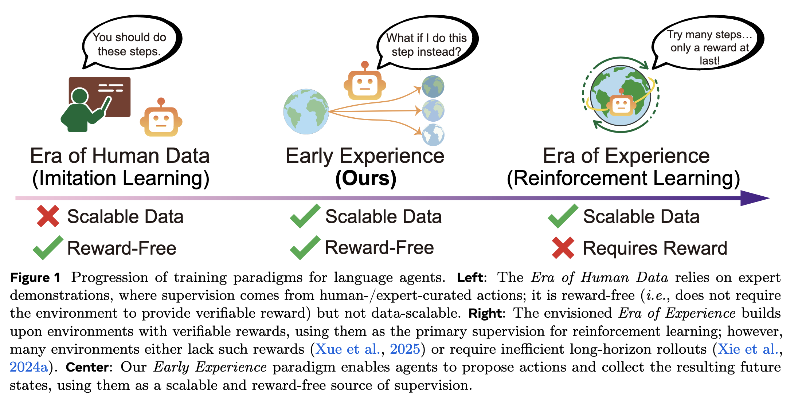
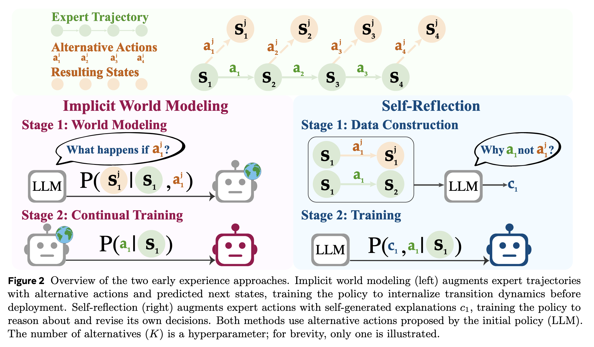
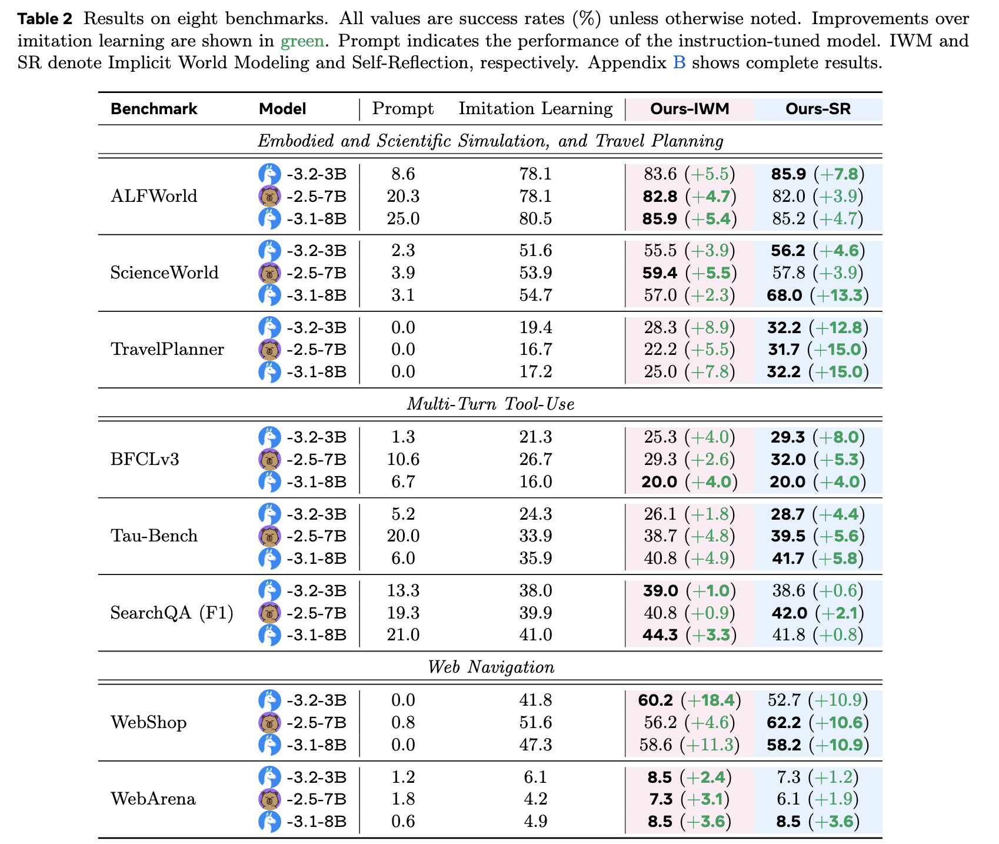
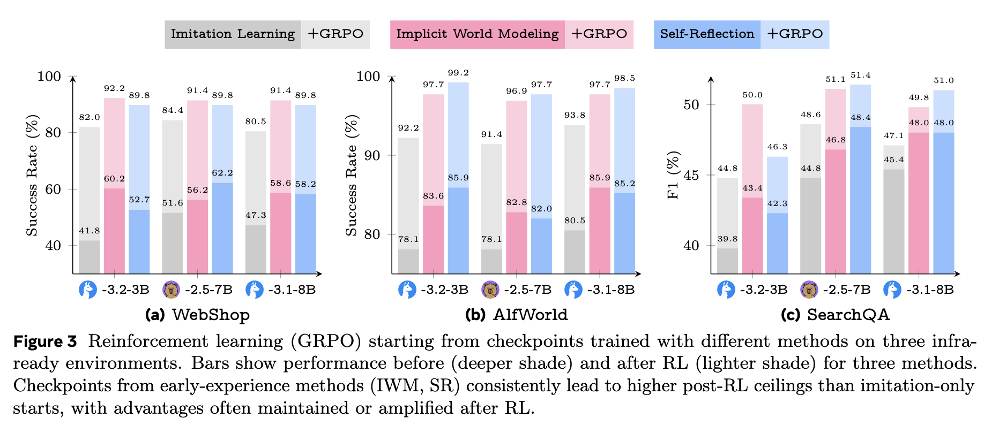

## 论文基本信息

标题：Agent Learning via Early Experience

作者团队：来自Meta-超级智能实验室，Meta-FAIR实验室, 俄亥俄州立大学

链接：https://arxiv.org/pdf/2510.08558

代码：无

---

## 🌱 一、论文想解决什么问题？

让智能体（agent）学会在复杂环境里做决策，常见的两种训练方式：

1. **模仿学习（Imitation Learning）**  
    直接学专家怎么做，比如学会“在某个网页上搜索、填写表单”。  
    → 优点：训练简单。  
    → 缺点：模型只看过专家的动作，从没见过“错误的动作会导致什么后果”，一旦环境变化就容易出错。
    
2. **强化学习（Reinforcement Learning）**  
    让模型自己尝试、拿奖励。  
    → 优点：理论上更强。  
    → 缺点：很多环境根本不给明确的奖励（比如网页任务、工具调用），或者奖励太稀疏、太慢，训练代价大。
    

📌 **核心问题：**  
有没有一种方法，在“没有奖励”的情况下，也能让模型像 RL 一样从“自己探索”中学习？

---

## 💡 二、核心思想：Early Experience（早期经验学习）

论文提出一个中间方案，叫 **Early Experience**，意思是：

> “让模型先自己试着在环境中做动作，看看会发生什么（哪怕没有奖励），然后用这些经历来改进自己。”

也就是说，模型从“自己的行为带来的后果”里学习，不需要奖励信号。  
这种方式介于模仿学习和强化学习之间。

---

## ⚙️ 三、Early Experience 包含两种具体做法

### 方法 1：Implicit World Modeling（隐式世界建模）

**核心想法：**

> “学会预测动作的结果。”

模型不只是学“在这个状态下专家做了什么”，  
而是学“如果我做这个动作，接下来世界会变成什么样”。

**做法：**

1. 从专家数据中拿到很多“状态（s）+动作（a）”对。
    
2. 对每个状态，让模型自己生成几个新的动作a'（不是专家动作）。
    
3. 把这些动作放到环境里执行，看看结果（新状态 s’）。
    
4. 用这些 (s, a', s’) 数据训练模型，让它学会预测 s’（即预测给定 (state, action) 会看到的下一个 state）。
    

简单理解就是：

> “当我这样做，世界会发生什么？”  
> 模型通过预测学到了环境的因果规律。

这样，模型就不仅会“模仿”，还理解了“行动的后果”。

---

### 方法 2：Self-Reflection（自我反思）

**核心想法：**

> “让模型自己解释为什么专家的动作更好。”

做法是：

1. 在一个场景下，模型有两个动作：
    
    - 专家动作（正确的）
        
    - 自己生成的动作（可能错误）
        
2. 执行这两个动作，看看结果。
    
3. 然后让模型生成一段“反思说明”：
    
    > “为什么专家的动作更好？我的动作导致了什么问题？”
    
1. 把这种“反思文本c + 专家动作a”作为新的训练数据(s, a, c)。
    

换句话说：

> 模型通过“对比自己和专家”的经验，学习到更深的决策逻辑。

---

## 🧩 四、它们是怎么训练的？

两种方法都分两步走：

1. **收集 Early Experience 数据**
    
    - 让模型在环境中尝试K个不同动作。
        
    - 记录这些动作带来的结果。
        
2. **训练模型**
    
    - IWM：让模型预测 “动作 → 结果”。用 next-token 损失两阶段训练，IWM 阶段和常规模仿学习阶段。
        
    - SR：让模型根据反思文本学习“为什么专家更好”。训练数据包括反思数据和专家数据（保留专家数据自带的 chain-of-thought 若有）。用 next-token 损失训练。
        

---

## 🧠 五、为什么有效？

- 模仿学习只看到“正确示例”，太片面。
    
- Early Experience 让模型看到“做错会发生什么”，  
    所以它对环境理解更深，**泛化能力更强**。
    
- 而且不需要奖励，数据可大规模获取。  
    所以能在没 reward 的环境中高效使用。
    

---

## 📊 六、实验结果（论文的主要发现）

- 在 8 个不同类型的环境中（网页操作、搜索问答、科学推理等），实验3个不同的模型Llama-3.2-3B、Qwen-2.5-7B 和 Llama-3.1-8B，
	- Early Experience 的模型比单纯模仿学习平均提升 **9–10%**。
	- “隐式世界建模（IWM）” 对结构化任务特别有帮助。
	- “自我反思（SR）” 在推理和规划类任务中效果更好。
    
- 如果后面再接强化学习（比如 GRPO），  
    - 以 Early Experience 为起点能获得更高最终表现。

- Long CoT（推理放大）与 STaR（用未经过环境验证的 rationale 生成再微调）作为对比基线：
	- Long CoT 在没有相应训练支持下，推理长度放大常常崩溃或导致输出 drift（论文实测效果有限）。
	- STaR 类方法因为 rationale 未被环境检验，生成的 rationale 常常“空中楼阁/幻觉”，用于训练时反而可能降级性能。

- Demonstration budget：Early Experience 在示例极少时收益尤其大（例如 WebShop 只用 1/8 专家数据时已超越完整版的 IL），说明 rollout 信号能有效缓解专家数据稀缺问题。
    
- Branching factor K：IWM 对更大 K 更有利（学习到更多转移模式），而 SR 在 K 过大时会非单调（因为替代动作中可能出现其他成功动作，削弱对比）；论文建议 IWM 可用较大 K（8–30 视环境），而 SR 更适合小到中等 K（2–4）。
    
- Model scaling：方法在 3B、8B 到 70B（LoRA）上都有效且能继续提升。
    

---

## 🪄 七、你可以这样理解：

|阶段|模型在学什么|类比|
|---|---|---|
|Imitation Learning|学专家“怎么做”|背标准答案|
|Early Experience|学“为什么那样做才对”|自己动手试、理解规律|
|Reinforcement Learning|学“怎样拿到高分”|真正考试、靠奖励优化|

---

## 🚀 八、总结一句话：

> **Early Experience 让智能体先在无奖励环境中“自己体验”，学会行动与后果的关系，再通过反思理解专家行为，从而在没有奖励的情况下也能更聪明地学习。**

---

## 参考资料

[经典之作！Agent无需奖励也能学习：通过“早期经验”的Agent Learning](https://mp.weixin.qq.com/s/iwlBW-g3qP96gLfmTEXWQw)

