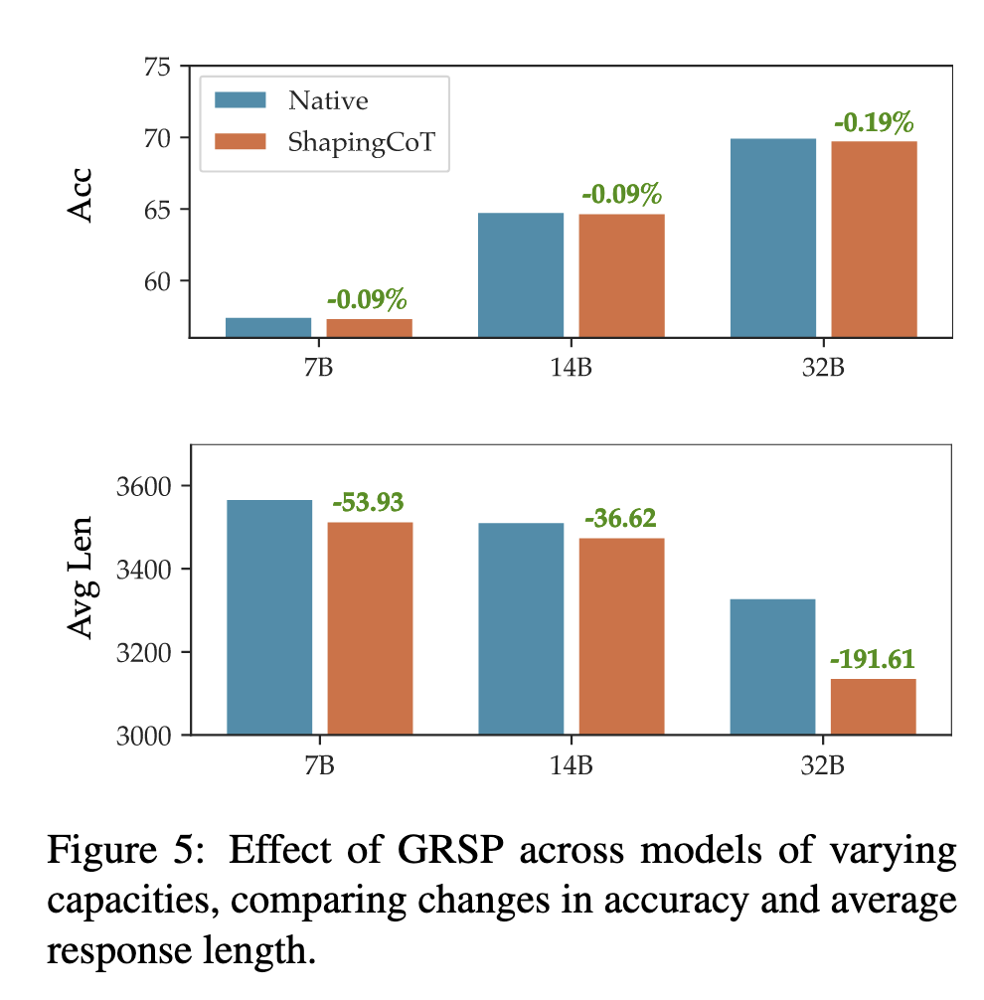

## 论文基本信息

标题：Mitigating Overthinking through Reasoning Shaping

链接：http://arxiv.org/abs/2510.09535

代码：

框架图：

这篇论文 **《Mitigating Overthinking through Reasoning Shaping》（通过推理塑形缓解过度思考）** 由北大与Moonshot AI联合提出，核心目标是解决**大推理模型（Large Reasoning Models, LRM）在强化学习阶段“过度思考（overthinking）”的问题**——即模型生成过长、重复、无效的推理文本，浪费算力并拖慢推理速度。

---

## 研究动机：RLVR带来的“过度思考”问题

- **RLVR（Reinforcement Learning from Verifier Reward）** 是一种强化学习框架，用“可验证信号”（如数学答案正确性）训练模型的推理能力，代表性模型如 **DeepSeek-R1、Kimi-k1.5**。
    
- 但它常导致 **模型反复修正推理路径**、输出极长 reasoning，从而：
    
    - 增加计算成本；
        
    - 推理过程缺乏稳定性；
        
    - 若简单惩罚 token 数量，会破坏性能（accuracy 明显下降）。
        

论文认为问题在于 **惩罚粒度太细（token级别）**。  
人类判断“哪一步多余”更容易，而不是“哪个词多余”。  
因此作者提出：**从 step / segment（推理段落）层面进行正则化监督**。

---

## 核心方法：GRSP（Group Relative Segment Penalization）

GRSP 是一种**在强化学习阶段替换 token 惩罚项的 drop-in 模块**。

### （1）思路：改为对“推理段（segment）”进行惩罚

- 将模型生成的 reasoning 通过关键词或 log-prob 边界分割成若干段（segments）。
    
- 实验证明：段数与总 token 数高度正相关。
    

惩罚定义：  

$P(y_j) = -\frac{|S_j| - \mathbb{E}[|S|]}{\text{std}[|S|]}$

即段数越多 → 惩罚越大。

### （2）Group Relative Penalization（分组相对惩罚）

- 发现不同长度的 segment 与性能有关：
    
    - 错误案例往往包含**更多短 segment**；
        
    - 正确推理中，**长 segment 比例更高**；
        
    - 强模型的 segment 分布更均衡（短段少、长段多）。
        
- 因此作者引入 **按长度分组的权重惩罚机制**：
    
    - 将 segment 分为若干长度簇（cluster）；
        
    - 对短段给予更强惩罚，对长段惩罚更弱（权重递减）；
        
    - 这样可**鼓励模型在每步更深入思考，而不是频繁切换思路**。
        

综合奖励函数：  

$R' = R + \alpha \sum_k w_k P^k(y_j)$  

## Segmentation 实现方式

两种分段方法：

1. **基于关键词（keyword-based）**
    
    - 通过常见逻辑词（如“因此”、“所以”、“但是”）划分 reasoning；
        
    - 计算简单但语言相关。
        
2. **基于置信度（confidence-based）**
    
    - 利用 token log-prob 的局部极小点（segment 边界置信度下降）来确定段落；
        
    - 更鲁棒、无语言限制。
        

后者在实验中取得略优性能。

---

## 实验结果

### （1）数据与设置

- SFT 数据：NuminaMath-1.5
    
- RL 数据：AIME、Omni-MATH
    
- 测试集：MATH500、AIMO Prize、Omni-MATH500
    

对比方法包括：

- **LCPO (L1)**：基于长度比的加权惩罚；
    
- **O1-Pruner**：长度相关的辅助奖励；
    
- **GRSP**：本文提出的分段惩罚。
    

### （2）主要结论

|方法|Accuracy|平均输出长度|效果|
|---|---|---|---|
|Reinforce baseline|64.8|3513|baseline|
|+ LCPO|63.9|5009|变短但准确率下降|
|+ O1-Pruner|62.6|3477|效果不稳定|
|**+ GRSP**|**64.7**|**3477**|最稳定、效率最佳|

- **GRSP在准确率几乎不降的情况下减少约30%输出token数。**
    
- 在复杂任务（Omni-MATH 500）中优势最明显。
    
- 较大模型（如 Qwen-32B）配合 GRSP 效率提升更显著。
    

---

## 消融与分析

### （1）权重机制（降序 vs 升序）

- 若长段权重更高（升序），训练更不稳定，会过度压缩推理；
    
- **降序（短段惩罚大）更稳定**，能促使模型在每段思考更深，整体更短、更准。
    

### （2）可扩展性

- GRSP 适用于不同规模模型；
    
- 随模型变大，token 减少更明显，推理更高效。
    

### （3）置信度分段

- 与关键词分段相当甚至略优；
    
- 精度+长度均提升。
    

---

## 总结与启示

|项目|传统RLVR|GRSP改进|
|---|---|---|
|惩罚单位|token|reasoning segment|
|惩罚目标|总长度|段数+长度结构|
|结果|缩短输出但精度下降|提升效率且稳定性高|
|核心机制|L1长度惩罚|组内相对惩罚 + 长度加权|

**GRSP 的关键贡献在于：**

1. 提出推理层面（step-level）的正则化思路；
    
2. 引入“长度感知加权”以平衡简洁性与准确性；
    
3. 显著减少过度思考（overthinking），提高推理效率；
    
4. 稳定强化学习过程并可随模型规模扩展。
    

---

✅ **一句话总结**

> GRSP 通过对“推理段”而非“token”进行惩罚，并按长度分组加权，成功在强化学习中抑制 LRM 的过度思考，让模型“少想但想对”。

## 简化版本

这篇由北京大学和Moonshot AI团队合作完成的论文，核心关注点是提升大型推理模型在解决问题时的​**​效率​**​，同时尽可能保持其​**​性能​**​。

大型推理模型（如DeepSeek-R1, Kimi等）通过“测试时缩放”技术，能够生成复杂的、多步骤的推理轨迹来解决问题，性能显著提升。但随之而来的是一个新问题——​**​过度思考​**​。

以往的研究试图通过在强化学习奖励中加入对生成长度的惩罚来解决这个问题。例如，直接惩罚总Token数或与参考答案长度的比例。然而，这种方法虽然有效减少了Token消耗，却常常导致模型性能（准确率）大幅下降。论文指出，其根本原因在于 ​**​Token级别的监督过于简单和模糊​**​：很难判断单个Token是否冗余，因为大多数Token与稀疏的验证器奖励（对/错）没有直接关联。

论文的核心论点是：​**​监督的粒度至关重要​**​。他们提出，相比于难以评估的单个Token，​**​推理步骤/片段​**​ 是一个更自然的监督单元。人类也更容易判断一个完整的推理步骤是否冗余，而不是单个词。

基于此，论文提出了 ​**​分组相对片段惩罚（GRSP）​**​ 方法。该方法包含三个关键设计：

1. ​**​片段级惩罚​**​： 不再惩罚总Token数，而是惩罚推理轨迹中的片段数量。这间接但有效地减少了Token消耗，因为片段数量与总Token数高度正相关。
    
2. ​**​长度分组相对惩罚​**​： 这是GRSP的精髓。论文通过分析发现，模型性能与推理片段的长度分布有关：
    
    - ​**​正确​**​的答案中，​**​较长​**​的推理片段占比相对更高。
        
    - ​**​更强​**​的模型，其正确和错误答案的片段长度分布差异更小（即更平衡）。
        
    - 因此，简单地惩罚所有片段会损害模型进行深度推理的能力。GRSP将片段按长度分组，并对不同组别施加​**​递减的权重​**​：对​**​短片段​**​施加​**​重惩罚​**​（鼓励减少无意义的短步骤），对​**​长片段​**​施加​**​轻惩罚​**​（保护有深度的推理步骤）。
    
3. ​**​两种分段策略​**​：
    
    - ​**​基于关键词匹配​**​： 使用“so”、“therefore”等关键词来划分片段。默认方法，高效。
        
    - ​**​基于置信度匹配​**​： 利用模型生成时Token对数概率的局部最低点来划分片段（段落的开始通常不确定性更高）。该方法不依赖语言关键词，更通用。
        

论文在多个数学推理基准（MATH, AIME, Omni-MATH）上进行了广泛实验，证明了GRSP的优势：

1. ​**​效率与性能的更好平衡​**​： 与基线方法（LCPO, O1-Pruner）相比，GRSP在​**​大幅降低Token消耗​**​的同时，​**​保持了最高的准确率​**​。尤其在最难的Omni-MATH数据集上，优势最为明显。
    
2. ​**​增强训练稳定性​**​： 如图所示，使用​**​递减权重​**​的GRSP训练过程非常平稳，准确率持续上升后保持稳定。而使用递增权重（重罚长片段）的对比方法则出现了严重的​**​训练崩溃​**​（准确率骤降）。
    
3. ​**​有效的模型缩放性​**​： 在不同规模的模型（Qwen-7B, 14B, 32B）上，GRSP都能一致地提升Token效率，且对准确率影响极小。这表明GRSP是一种普适性的方法。
    
4. ​**​分段策略有效性​**​： 基于置信度的分段方法取得了与基于关键词方法相似甚至略优的效果，证明了该方法的可行性。
    

## 参考资料
