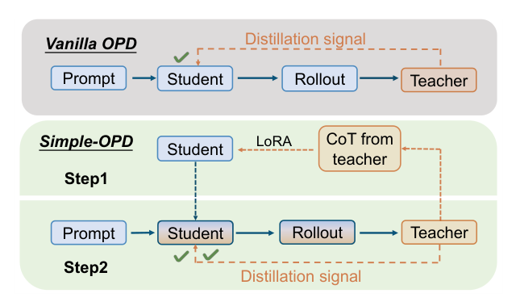
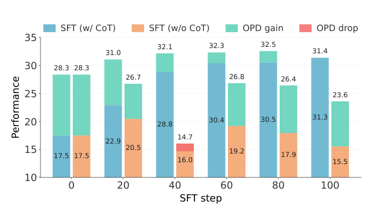
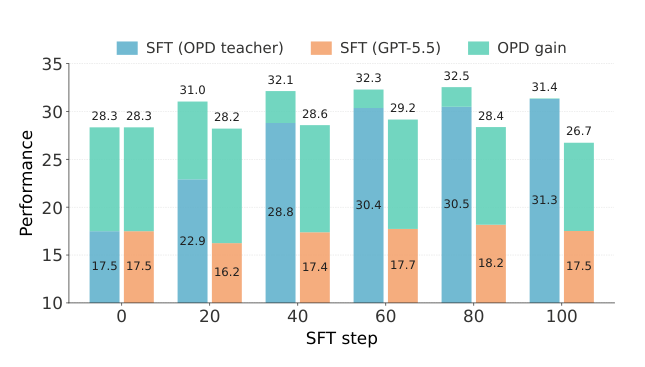
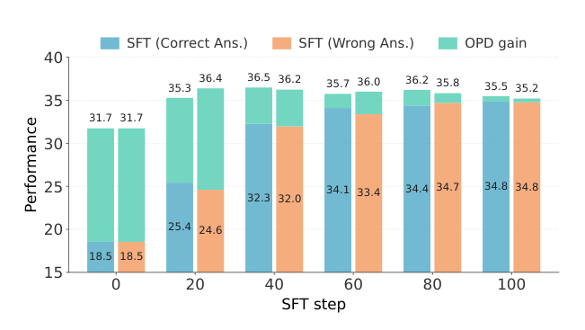
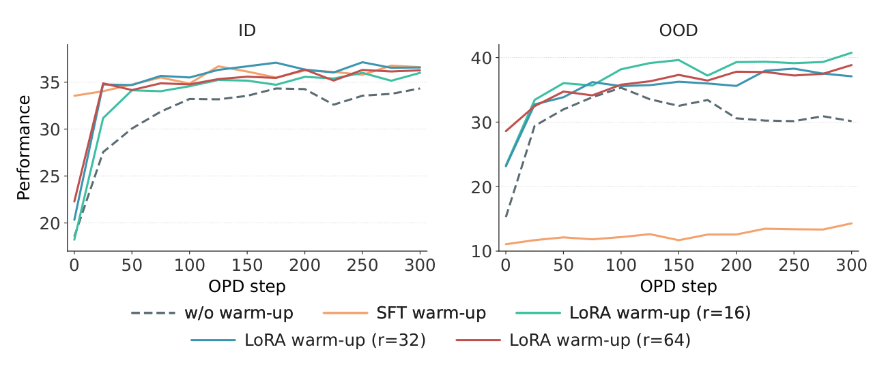
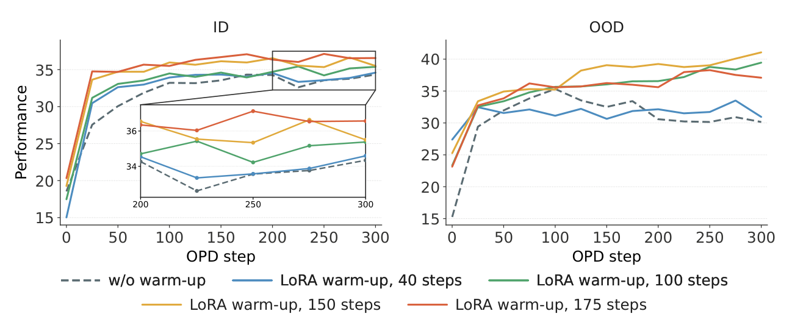
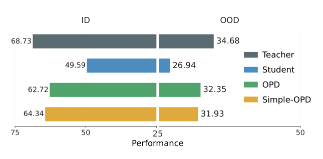
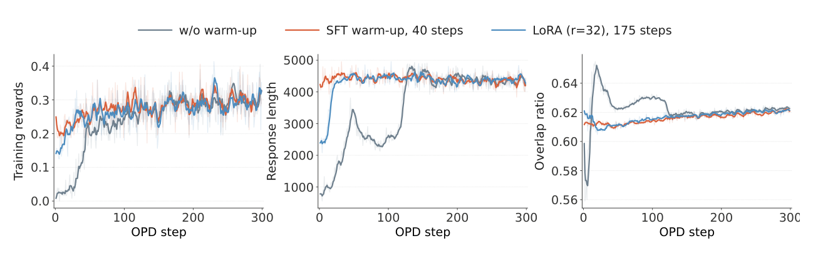

## 论文基本信息

标题：Simple-OPD: Demystifying Warm-up for On-policy Distillation

作者：Tao Liu, Taiqiang Wu（共同一作），Mao Zheng, Xuan Luo, Runming Yang, Xuewei Yang, Junjie Wang, Yujiu Yang

链接：https://arxiv.org/abs/2608.06802 （v1, 2026-08-07）

代码：https://github.com/Utaotao/Simple-OPD

框架图：

# 一句话总结

**在线策略蒸馏（OPD）之前那个「先 SFT 热身一下」的步骤，一直被当成随手加的启发式，这篇把它拆开做了控制实验**：结论是 warm-up 传递给学生的不是「正确答案」，而是「跟教师兼容的思考习惯」——所以数据要用**你自己那个 OPD 教师**采的 CoT（答对答错都行），训练要用**小 rank 的 LoRA 训到接近饱和**（而不是全参 SFT 猛训）。把这两条合起来就是 Simple-OPD，一个不改 OPD 目标函数的即插即用初始化配方。

---

# 1) 研究动机（为什么要做）

**先说清 OPD 是什么**：on-policy distillation（在线策略蒸馏）让学生自己采样生成完整回答（rollout），教师在学生走过的每个 token 位置上给密集监督（本文用 reverse KL 散度，即最小化学生分布相对教师分布的 KL）。对比传统 off-policy 蒸馏「教师先写好标准答案、学生背」，OPD 的好处是学生在自己真实会犯错的状态上拿反馈，解决了训练/推理分布不匹配的问题。

但 OPD 有个已知的坑：**如果学生的 rollout 落在教师几乎没定义过的生成空间里，教师给的监督就是有偏的、甚至有害的**。业界通行的对策是先做一轮 SFT warm-up，把学生拉进教师分布附近，提高师生的重叠度，再开 OPD（[OPD](OPD.md) 那篇 Rethinking 论文把这个叫 off-policy cold start）。

问题在于：**warm-up 一直只被当成"初始化的启发式"，没人系统研究过它该喂什么数据、怎么训**。这篇就是来补这个洞的，并且明确评估这些选择对**域内（ID）性能**和**域外（OOD）泛化**两边的影响。

---

# 2) 方法要点（核心思想与流程）

Simple-OPD 本身极简，全部价值来自前面的消融实验结论：

1. **采数据**：从 OPD 的训练集里随机采 prompt，用**要用于 OPD 的那个教师模型**生成带 CoT 的完整回答。**不过滤正确性**。
2. **热身**：用这批数据对学生做 **LoRA SFT**（低 rank，r=16~32），训到**接近饱和**就停（本文约 150~175 步）。
3. **正常跑 OPD**：目标函数一个字不改。

即：`教师采 CoT → 低秩 LoRA 训到饱和 → 标准 OPD`。

---

# 3) 关键设计细节（值得关注）

## 数据侧三个发现

### 3.1 CoT 必须有

对比「带完整推理过程的 rollout」和「只给最终答案的 rollout」：

（蓝/橙柱是 SFT 后的成绩，绿色段是后续 OPD 带来的增益，红色段是下降；step 0 = 不做 warm-up 直接 OPD）

- 同样的训练步数，带 CoT 一直更好，而且**差距随 warm-up 变长而扩大**；
- **后续 OPD 补不回来**：不带 CoT 的 checkpoint 虽然能被 OPD 拉起来不少，但最终成绩始终低于带 CoT 的；
- 副作用更值得注意：带 CoT 的各个 checkpoint 做完 OPD 会**收敛到差不多的位置**，不带 CoT 的波动巨大（step 40 那组甚至 OPD 后掉了）。意味着不带 CoT 的话你还得费劲挑 checkpoint。

### 3.2 CoT 必须来自「你要用的那个教师」，而不是更强的模型

用同一批 prompt，分别用 OPD 教师（Qwen3-8B-Base 训过 DAPO-Math）和 GPT-5.5 生成 CoT：

- GPT-5.5 明显比教师强得多，但用它的 CoT 做 warm-up，**学生基本原地不动**（17.5 → 18.2 附近），而且 warm-up 越长反而越差；
- 用教师自己的 CoT 则稳步涨到 31 左右；
- OPD 能把 GPT-5.5 那条线部分救回来，但最终也就回到「直接 OPD」的基线水平——**等于白热身**。

结论：warm-up 有没有效，**取决于跟下游教师的兼容性，不取决于 CoT 生成者本身的强度**。

### 3.3 教师答错的 rollout，和答对的几乎一样有用

同一批 prompt 上配对构造教师的正确/错误 rollout（两组都有 CoT、都来自同一教师），只有答案对错这一个变量：

- SFT 阶段两条曲线**差距 <1 分**；
- OPD 之后最终成绩都落在 **35.2–36.5** 的窄区间，谁也没稳定占优；
- 而且 SFT 阶段强的那个 checkpoint，做完 OPD 不一定就更强——**"更好的 SFT 分数"不等于"更好的初始化"**。

论文的 case study 给出了机制侧的解释：热身过的模型会**主动复核中间结果或者独立重算一遍**再给答案（跟教师一样），没热身的模型走完一条看似合理的路径就停，局部的计数/算术错误不会被发现。**warm-up 真正搬过去的是教师的验算行为**。

> **数据侧 Takeaway（论文原话）**：有效的 warm-up 需要跟 OPD 教师对齐的 CoT，而 rollout 的正确性只是次要因素。这说明 warm-up 主要传递的是**教师兼容的思考模式**，而不仅仅是正确答案。

## 训练侧两个发现

### 3.4 LoRA 打全参 SFT（本文最硬的结论）

对比直接 OPD / 全参 SFT warm-up / LoRA warm-up（r=16, 32, 64），画出后续 OPD 全程的 ID 和 OOD 轨迹：

- **直接 OPD**（黑虚线）：ID 慢慢涨，但 OOD 很早就见顶然后一路往下掉；
- **全参 SFT warm-up**（橙线）：ID 起点高、收敛快，但 **OOD 在 warm-up 阶段就崩了，而且整个 OPD 过程都救不回来**（图右那条贴在底部的橙线）；
- **LoRA warm-up**：ID 起步略低但很快追平全参，OOD 全程高于 base 和全参；
- rank 16/32/64 的 ID 几乎无差别，但 **rank 16 的 OOD 最好**，32/64 略弱。

解读：LoRA 在这里同时扮演两个角色——参数高效微调方法 **+ 对 warm-up 更新幅度的约束**。低秩更新足够学到教师的思考模式，同时限制了对预训练能力的破坏。**约束越紧，通用能力保得越好**。

### 3.5 warm-up 时长要「接近饱和」，不是越长越好

固定 LoRA rank=32，比较 40 / 100 / 150 / 175 步：

- 40 步基本等于没做（ID 轨迹贴着直接 OPD）；
- 100 步 ID 小涨，OOD 提升更明显；
- 150 / 175 步在两个维度上都优于更短的配置，但**不是单调的**：175 步 ID 略优，**150 步 OOD 最优**；
- 顺带一个工程收益：充分 warm-up 的版本约 **100 步 OPD** 就到稳定水平，直接 OPD 要到 **200 步左右**——**收敛步数减半**。

> **训练侧 Takeaway（论文原话）**：推荐用相对低秩的 LoRA 训到接近饱和。这个配置在 ID 性能和 OOD 泛化之间给出 Pareto 有效的平衡，同时加速后续的 OPD。

## 关键超参（附录 A）

| 阶段 | 超参 | 值 |
|---|---|---|
| SFT warm-up | batch size | 16 |
| | lr（全参） | 5e-6 |
| | lr（LoRA） | 5e-5 |
| OPD | global / mini batch | 128 / 128 |
| | rollout n | 1 |
| | max prompt / response | 2048 / 8192 |
| | temperature / top-p | 1.0 / 1.0 |
| | lr | 1e-6 |
| | KL 系数 | 0.0 |

**overlap ratio 定义**（跟 [OPD](OPD.md) 那篇同一个指标）：在学生生成的每个位置上，取师生分布各自的 top-k token 集合求交集占比，k=32，在整个 batch 上平均。

---

# 4) 实验设置与主要结果

**主实验设置**：学生 Qwen3-1.7B-Base，教师 Qwen3-8B-Base（在 DAPO-Math-17K 上训过）。ID = MATH-500 / AIME24 / AIME25 / AMC23（MATH-500 用 avg@4，AIME 用 avg@16）；OOD = IFEval、GPQA-Diamond、HumanEval、MMLU-Pro 的化学/物理/历史子集。训练框架 verl，采样加速 vllm，8 卡。

## 4.1 跨 OPD 变体（Qwen3-1.7B ← Qwen3-4B，均为 non-thinking）

| 方法 | ID Avg. | OOD Avg. |
|---|---|---|
| Teacher | 60.00 | 65.67 |
| Student | 12.81 | 40.51 |
| OPD | 38.34 | 47.43 |
| **+ Simple-OPD** | **39.69** (+1.35) | **48.96** |
| G-OPD | 41.56 | 44.71 |
| **+ Simple-OPD** | **43.13** (+1.57) | 44.61 |
| PowerOPD | 39.06 | 46.80 |
| **+ Simple-OPD** | **40.01** (+0.95) | **47.63** |

ID 在三种目标函数上都涨，OOD 大体持平（vanilla / PowerOPD 涨，G-OPD 基本不变）。说明这个初始化配方**跟 OPD 目标函数的选择是正交的**。

## 4.2 思考模式（Qwen3-0.6B thinking ← Qwen3-4B-Thinking-2507）

| 方法 | ID Avg. | OOD Avg. |
|---|---|---|
| Student | 37.94 | 32.41 |
| OPD | 42.36 | 35.43 |
| **Simple-OPD** | **43.81** | **36.28** |

ID 增益主要来自 AMC23、MATH-500、AIME25，AIME24 略降。

## 4.3 同尺寸整合（DeepSeek-R1-Distill-Qwen-1.5B ← JustRL-DeepSeek-1.5B）

这个场景很实用：把 RL 后训练出来的能力**整合回同尺寸的部署模型**。ID 62.72 → 64.34，OOD 32.35 → 31.93（略降）。

## 4.4 训练动态

热身过的模型：训练 reward 起点更高、response length 更早进入稳定区间、overlap ratio 早期的剧烈波动被抹平。训练到后期各配置逐渐趋同——**说明 warm-up 的主要作用是加速和稳定收敛**，而不是抬高终点。

---

# 5) 优点

- **能直接省钱**：warm-up 数据不用做正确性校验/拒绝采样，也不用调更贵更强的外部模型来采 CoT——直接拿你手上那个 OPD 教师采就行。这是全文最有落地价值的一条。
- **省算力**：LoRA warm-up 比全参 SFT 便宜，且后续 OPD 收敛步数减半。
- **正交、即插即用**：不改 OPD 目标函数，跟 vanilla OPD / G-OPD / PowerOPD 都能叠。
- **同时盯 ID 和 OOD**：多数蒸馏论文只报域内分数，这篇把 OOD 泛化作为一等公民来评，暴露了「全参 SFT warm-up 打崩通用能力」这个实际很致命、但容易被漏掉的问题。
- **消融控制干净**：3.3 那组正确/错误 rollout 是同 prompt、同教师配对构造的，只动了一个变量。

---

# 6) 局限与风险

- **增益幅度小，且统计上不硬**。表 1 的 ID 提升只有 0.95~1.57 分。AIME24/25 各 30 题，1 分 ≈ 0.3 题的差别。虽然用了 avg@16 缓解方差，但**全文没报标准差、没有置信区间、没有多 seed 重复**。所以"Simple-OPD 一致优于 OPD"这个说法撑得不算硬——这些数字更适合读成"至少不亏"，而不是方法优势。
- **GPT-5.5 那组对比有混淆变量**。GPT-5.5 的 CoT 在长度、格式、语言风格上跟 Qwen3-8B 差异极大，学生学完分布偏离教师，后续 reverse KL 反而更难优化。论文把这归因于"兼容性"，但**没做控制实验**（比如让 GPT-5.5 模仿教师的输出风格来生成 CoT），无法分离「风格不兼容」和「能力不匹配」两种解释。结论方向可信，因果链没锁死。
- **规模和领域都窄**。学生 0.6B–1.7B、教师 4B–8B，ID 域只有数学一个。"教师兼容性 > 外部强模型"这条在更大规模、多领域上是否成立没验证（作者在 Limitation 里也承认了）。
- **同尺寸整合场景 OOD 是掉的**（32.35 → 31.93），论文轻描淡写带过。
- **"接近饱和"没给可操作的判据**。150 vs 175 步的最优点是事后看出来的，实践中怎么判断"到饱和了"（看 SFT loss？看 overlap ratio？）论文没给。

---

# 7) 实践建议

如果在做 OPD / 蒸馏管线，这篇能直接抄的：

1. **warm-up 数据用你的 OPD 教师自己采，不要过滤正确性，不要花钱调更强的外部模型**。这条省的钱最多。
2. **用 LoRA 不用全参**，rank 16~32 起步，lr 5e-5。全参 SFT 会把 OOD 打崩且不可逆。
3. **训到 SFT 指标接近饱和就停**，别往死里训。可以监控 overlap ratio 作为停止判据（比看 loss 更贴近 OPD 的目标）。
4. **期待值放对位置**：主要收益是**收敛速度减半 + OOD 不塌**，不是 benchmark 涨点。用这个理由去说服人比用"+1.4 分"靠谱得多。
5. **自己复现时补上多 seed**，论文没做，别直接信 1 分左右的差距。

---

# 8) 论文的贡献点

- 系统性地把 OPD 的 warm-up 阶段拆成「数据配方」和「训练配方」两个维度做控制实验，给出可操作的经验规则；
- 提出并验证「warm-up 传递的是教师兼容的思考模式，而非答案正确性」这一判断（正确/错误 rollout 配对实验）；
- 提出 Simple-OPD：教师 CoT + 低秩 LoRA 训到饱和 + 标准 OPD，在多种 OPD 目标、thinking/non-thinking 设置、同尺寸师生配置上验证有效。

---

# 9) 短评

**撑得住的部分**：图 5 那两条 OOD 曲线是全文最硬的证据——全参 SFT warm-up 把 OOD 打崩、LoRA 保住，gap 大到不需要统计检验，而且在整个 OPD 过程中稳定。3.3 的正确/错误 rollout 配对实验也扎实：控制干净、SFT 和 OPD 两阶段都验证了，是最反直觉也最可信的一条。收敛步数减半（100 vs 200）是实打实的工程收益，比 benchmark 分数值钱。

**撑不住的部分**：表 1、表 2 那些 1 分左右的提升，在没有方差报告的情况下我不会当成方法优势。论文的叙事把"Simple-OPD consistently improves"说得很满，实际支撑它的是趋势一致性而非统计显著性。

**跟 [OPD](OPD.md) 那篇的关系**（本文引的 Li et al., 2026 就是它，arXiv 2604.13016，同为清华）：

- Rethinking 那篇给了**why**：OPD 成败取决于「思维模式兼容（overlap ratio 够高）」+「教师有学生没有的新能力」，并提出 off-policy cold start SFT 作为补丁；
- 这篇给了**how**：那个 cold start 具体该怎么做——数据用教师采、别管对错，训练用低秩 LoRA、训到饱和；
- 更关键的是，这篇**部分回答了 Rethinking 那篇留下的坑**。OPD.md 里那条 P.S. 指出「冷启动实验用了额外 200K 教师数据，没隔离『数据量增加』和『思维模式对齐』的贡献」。Simple-OPD 的 3.3（错答案也 work）和 3.2（更强的外部模型不 work）恰好从侧面把这个问题掰开了：**如果起作用的是"数据量"或"数据质量"，那 GPT-5.5 的 CoT 应该更好用、正确 rollout 应该明显赢——但两个都不是。剩下的解释只能是思维模式对齐**。这是本文在文献脉络里真正的位置。

**两篇合起来看的完整逻辑链**：RL 生产新知识 → OPD 把新知识廉价复制给小模型 → 但复制的前提是师生思维模式兼容 → warm-up 就是强行制造这个兼容性 → 而制造兼容性靠的是让学生模仿教师的**思考习惯**（验算、复核），不是灌正确答案。所以 warm-up 数据的"质量"标准跟 SFT 完全不同：SFT 要对，warm-up 要**像**。

一个还没人答的问题：既然 warm-up 传的是"像不像"，那有没有比 SFT loss 更直接的对齐目标？现在等于是用"模仿 token 序列"这个间接手段去优化"分布重叠"这个真实目标。直接拿 overlap ratio 当训练信号（而不只是监控指标）应该是个可做的方向。

## 参考资料

- 论文：https://arxiv.org/abs/2608.06802
- 代码：https://github.com/Utaotao/Simple-OPD
- 前作/强相关：[Rethinking On-Policy Distillation](OPD.md)（arXiv 2604.13016）
