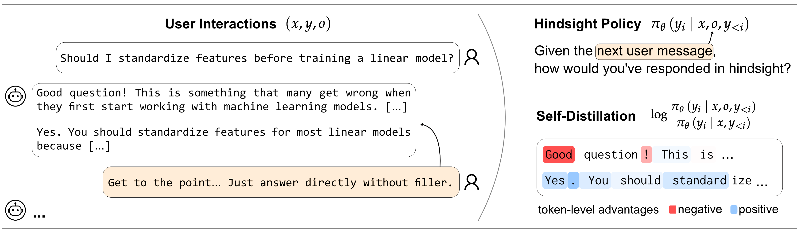
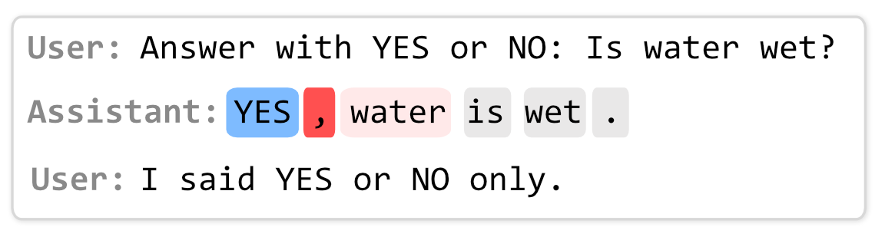
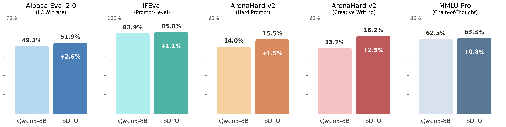
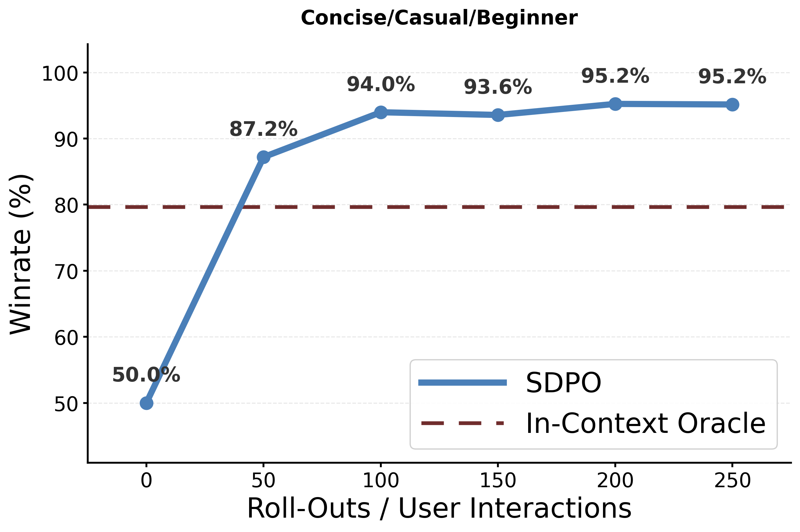
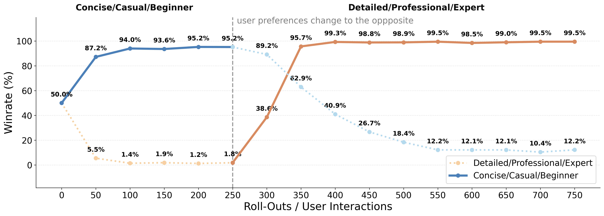
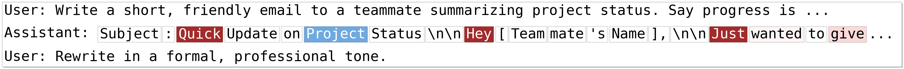
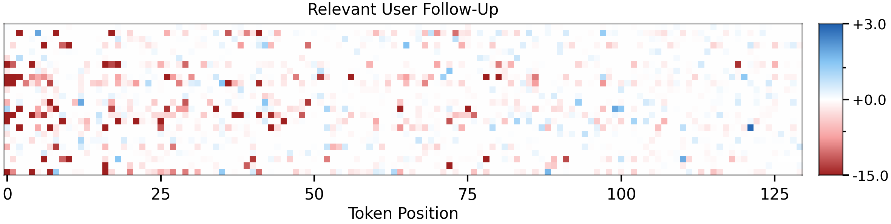
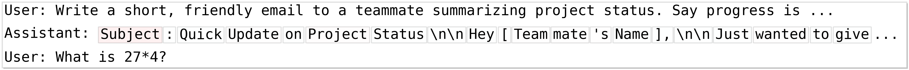
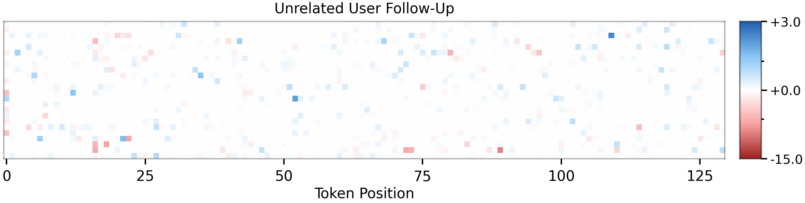

## 论文基本信息

标题：Aligning Language Models from User Interactions

作者：Thomas Kleine Buening, Jonas Hübotter, Barna Pásztor, Idan Shenfeld, Giorgia Ramponi, Andreas Krause（ETH AI Center / Krause 组）

链接：https://arxiv.org/abs/2603.12273 （v1, 2026-02-18）

代码：论文未提供

框架图：



# 一句话总结

把多轮对话里**用户的下一条消息**当成事后（hindsight）信息塞回 prompt，用「看过用户反应之后的模型分布」和「原始分布」的 token 级 log 比值当 advantage 做策略更新——等价于让模型蒸馏自己（self-distillation），从而**不需要奖励模型、偏好对、人工标注**，直接在真实用户对话上做对齐和个性化。方法叫 SDPO（Self-Distillation Policy Optimization）。

---

# 1) 研究动机（为什么要做）

- 推理侧算力已经超过训练侧，模型每天处理海量用户 query，但这些交互**基本被丢掉了**，没有回流到模型改进里。
- 用户对话里其实充满隐式信号：报错「你这段代码跑不通」、指正「我说了只要 YES 或 NO」、要求「改成正式语气」——这些天然产生，反映输出被真实接收和使用的情况。
- 但这类数据**没有任何显式标签**：没有专家演示、没有偏好排序、没有 reward。既有做法要么先做语义分类（WildFeedback）、要么先人工标偏好、要么用外部强模型把语言反馈翻译成 reward（Text2Grad 那类）——都要额外的建模假设和中间目标。
- 关键观察：**模型本来就会在 context 里用这些信息**。看到用户 follow-up 之后，同一个模型往往能自己改对。这个 in-context learning 能力可以当杠杆——「事后聪明」是免费的监督信号。

---

# 2) 方法要点（核心思想与流程）

**数据结构**。一轮交互记作三元组 `(x, y, o)`：
- `x` = 对话历史（含最近一条用户 prompt）
- `y` = 模型的回复
- `o` = 用户的下一条消息

一段 t 轮对话能拆出 t 个交互三元组（历史互相嵌套）。实验里把 `x` 截断到最近 5 条消息。

**Hindsight policy（事后策略）**。把 `o` 拼进 prompt 再算一遍 `y` 的 token 概率。模板（论文 Table 1）：

```
User: <对话历史 x>
      <hindsight context> The following is a future user message.
      Use this to guide your answer to the user prompt: o
Assistant: <原来的回复 y>
```

去掉中间那段 hindsight context 就退化成普通模板，所以两个分布**用的是同一套权重、同一个模型**，只差 prompt 里那一段。

**Token 级 advantage**。逐 token 比较两个分布：

$$A_i(x,y,o) = \log \frac{\pi_\theta(y_i \mid x, o, y_{<i})}{\pi_\theta(y_i \mid x, y_{<i})}$$

- 事后概率**升高** → 这个 token 被用户反应「支持」→ 正 advantage → 强化
- 事后概率**降低** → 这个 token（或它引出的后续）导致了不好的结果 → 负 advantage → 抑制

拿这个 advantage 做标准 policy gradient 就完事了（advantage 当常数，不对 θ 求导）。



*用户抱怨「我说了只要 YES 或 NO」时的 token advantage：啰嗦的部分被打负分。*

**等价的自蒸馏视角**。同一件事也可以写成：把 hindsight policy 当 teacher（detach 掉梯度），让原策略去拟合它，最小化反向 KL：

$$\mathcal{L}_{\text{SDPO}}(\theta) = \sum_i \mathrm{KL}\big(\pi_\theta(\cdot \mid x, y_{<i}) \,\|\, \bar\pi_\theta(\cdot \mid x, o, y_{<i})\big)$$

论文 Lemma B.1 证明**上面那个 policy gradient 是这个蒸馏梯度的无偏单样本估计**——两个视角在期望意义上给出同样的更新，只差「把 log 比值理解成 advantage 还是理解成蒸馏损失」。实验里用的是 policy gradient 版本（更简单）。

> 名词：**反向 KL（reverse KL）** 指 KL(学生 ‖ 教师)，倾向让学生分布收缩到教师的高概率区域（mode-seeking），而不是铺开去覆盖教师的所有可能（那是正向 KL）。

**算法流程（Algorithm 1，在线版）**：观察 context `x` → 采样回复 `y` 并记下 log-prob → 观察用户回复 `o` → 算 hindsight log-prob → 一步梯度更新。**每来一条用户消息就更新一次**。

**离线 off-policy 变体**。真实日志（WildChat）里的回复来自别的模型（GPT-3.5/GPT-4），拿不到行为策略的 token 概率，所以直接在 logged 三元组上优化一个 surrogate 目标（论文 Eq. 4）。作者明确承认**这个目标相对 on-policy SDPO 是有偏的**，只能算近似。第 4.1 节的主结果全部是这个离线版本。

---

# 3) 关键设计细节（值得关注）

- **同一个模型扮演 teacher 和 student**，靠 prompt 里多出的一段 `o` 制造分布差异——不需要第二个模型，也不需要额外生成（不像那些「先按反馈重写一遍再 SFT」的做法）。credit assignment 直接落在**模型自己原本的 rollout** 上。
- **无关 follow-up 自动不更新**。如果 `o` 跟前面的回复没关系（比如让写邮件之后突然问「27×4 等于几」），hindsight 分布和原分布几乎一样，advantage 全场趋 0，梯度自然消失。**不需要额外训一个「这条算不算反馈」的分类器**——这是这个设计最漂亮的地方。
- **超参很朴素**（Table 5）：lr 2e-6（在 {1,2,3,5}×10⁻⁶ 上 sweep 过）、batch 32、2 epoch、cosine + 5% warmup、AdamW 8-bit、temperature 1.0。个性化实验里作者说 SDPO 对超参（尤其 lr）不敏感，就没细调。
- **潜在奖励解释（附录 A）**。假设用户按 Boltzmann-rational 方式选下一条消息 `p(o|x,y) ∝ p(o|x)exp(r(x,y,o))`，且 hindsight 分布行为上像贝叶斯后验 `π(y|x,o) ∝ π(y|x)p(o|x,y)`，则序列级 advantage 恰好等于 `r(x,y) − log Z(x,y)`——即 SDPO 隐式在最大化交互用户的潜在奖励。作者自己标注了「假设高度理想化」，transformer 的 attention 并不真的做贝叶斯条件化。

---

# 4) 实验设置与主要结果

## 4.1 通用对齐（离线 off-policy）

数据：WildFeedback（WildChat 的策划子集，约 2 万对话，筛掉 6 千无 follow-up 的，用剩下 **14,000 对话 → 约 50,000 个 `(x,y,o)`**，平均每段 4-5 轮）。

模型：Qwen3-4B、Qwen3-8B、Olmo3-7B-Instruct-SFT、Olmo3-7B-Instruct-DPO（同一批数据、同一评测协议）。



| 模型 | AlpacaEval 2.0<br>(LC 胜率) | IFEval<br>(prompt-level) | ArenaHard-v2<br>(Hard) | ArenaHard-v2<br>(创意写作) | MMLU-Pro<br>(CoT) |
|---|---|---|---|---|---|
| Qwen3-4B | 37.9 | 81.9 | 9.0 | 8.0 | 58.1 |
| + SDPO | **46.1** ↑ | **83.2** ↑ | 7.8 ↓ | 7.9 | 58.0 |
| Qwen3-8B | 49.3 | 83.9 | 14.0 | 13.7 | 62.5 |
| + SDPO | **51.9** ↑ | **85.0** ↑ | **15.5** ↑ | **16.2** ↑ | **63.3** ↑ |
| Olmo3-7B-SFT | 34.3 | 80.2 | 2.4 | 1.4 | 23.7 |
| + SDPO | 35.2 ↑ | 80.6 ↑ | 2.4 | 1.4 | 24.0 ↑ |
| Olmo3-7B-DPO | 50.4 | 80.2 | 1.7 | 8.2 | 28.4 |
| + SDPO | 51.8 ↑ | 80.4 ↑ | 2.0 ↑ | 10.0 ↑ | 28.7 ↑ |

> **LC 胜率（length-controlled winrate）**：AlpacaEval 2.0 的指标，先校正掉「回答越长越容易赢」的偏差再算胜率。**IFEval prompt-level loose**：一条 prompt 里所有格式指令全部满足才算通过（loose 指允许少量表面变体）。

其他几组：
- **数据质量消融**：换成完全未筛选的 WildChat 随机 14k 对话，Qwen3-8B 仍然涨（AlpacaEval 50.7、IFEval 84.5），只有 ArenaHard-Hard 轻微掉 0.6。说明筛选能增强信号，但不筛也不崩。
- **SFT 对照（关键）**：在同样的 `(x, y)` 上做标准 SFT，Qwen3-4B **全线崩盘**（AlpacaEval 37.9→18.9、IFEval 81.9→73.2、MMLU-Pro 58.1→51.2）。原因：WildFeedback 的回复部分来自 GPT-3.5，且超过一半的对话里用户在表达不满——去拟合这些回复当然是灾难。这一组坐实了 SDPO 的增益**不是变相 SFT**。
- **预训练基准无退化**（附录 D）：TruthfulQA / HellaSwag / CommonsenseQA 三项前后几乎不动（差异都在 stderr 内）。

## 4.2 个性化与持续适应（在线）

设置：模拟用户。用 persona system prompt 让另一个模型生成 follow-up 并当 judge。
- Figure 5/9：TL;DR 摘要任务，Qwen3-4B 训练，**Qwen3-8B 同时充当模拟用户和 judge**。
- Figure 6：HelpSteer2 真实 prompt + 更复杂的复合偏好，Qwen3-8B 训练，**Claude Haiku 4.5** 当用户和 judge（作者说小模型在这个设置下当 judge 已经不可靠）。评测在 256 条 held-out prompt 上，每对回复正反位置各判一次消除位置偏差。



结果：从 50% 平手起步，**50 次交互后 >85% 胜率，200 次后 >95%**，并且能追平甚至超过「把完整用户画像直接写进 prompt」的 in-context oracle。



**偏好翻转**（Figure 4）：前 250 次交互学「简洁/口语/新手友好」，之后用户偏好突然翻成「详细/专业/专家」。SDPO 在 100 次交互内就把旧行为反转过来（旧偏好胜率 95%→12%，新偏好 1.8%→99%），说明过期偏好能被 unlearn。

**多偏好累积**（Figure 6）：1500 次交互里顺序引入 3 个互补偏好（各 500 次），每条曲线对比「该偏好引入时刻的 checkpoint」。先学的偏好在后续学习中**保持住了**，没有灾难性遗忘——前提是这些偏好本身不冲突。

## 4.3 可解释性与鲁棒性



follow-up 相关时（要求改成正式语气），`Quick` / `Hey` / `Just` 这些口语 token 拿到强负 advantage：



follow-up 无关时（同样是写邮件的请求，用户接着问「27×4 等于几」），advantage 全场接近 0，几乎不更新：





作者还观察到：话题切换有时会给出**弱正**advantage（尤其在模型原本不确定的 token 上）——即 hindsight policy 倾向于把「用户没追问、直接换话题」当成中性或轻微正面的证据。

---

# 5) 优点

- **真正无监督**：不要 reward model、不要偏好对、不要人工标注、不要外部强模型打分。在「拿真实日志改进模型」这条路上，是目前假设最少的做法之一。
- **信号有自动门控**：无关 follow-up 天然给出 ~0 advantage，不需要前置过滤器。这比「先筛出有反馈的对话再训」优雅得多，也解释了为什么在未筛选的 WildChat 上也不崩。
- **token 级可解释**：能直接看到哪个词被打了负分，在 RLHF 系列方法里很少见（PPO/DPO 的信号都是序列级的）。debug 和归因成本低。
- **在线个性化收敛极快**：50 次交互就有效果，且不需要用户画像、不需要显式打分按钮。
- **理论上自洽**：policy gradient 与自蒸馏两个视角的等价性有证明（Lemma B.1），不是拍脑袋的 heuristic。

---

# 6) 局限与风险

**① 主表格没有误差棒——最大的方法论漏洞。** Table 2/3 全是单次运行的单点数字，没有多 seed、没有置信区间。Olmo3 两行的 +0.2~+0.9、Qwen3-8B 的 +0.8~+2.6 都在 judge 噪声量级里（AlpacaEval 2.0 用 GPT-4 Turbo、ArenaHard-v2 用 GPT-4.1 当裁判，本身就有 1-2 个点抖动）。只有 Figure 6 报了 standard error。以论文「across model families and sizes」这个声明强度，至少该给 3 seed。**目前可信的只有两个大效应**：Qwen3-4B 的 AlpacaEval +8.2，和 SFT 对照的全线崩盘。

**② 个性化实验是自己评自己的闭环。** Figure 5/9 里 Qwen3-8B 既生成模拟用户 follow-up、又当 judge，训练信号和评测信号来自同一个模型的同一 persona prompt。95% 胜率更可能是拟合了 judge 而不是学到偏好；「超过 in-context oracle」也要打折看。作者显然察觉到了（Figure 6 换成 Claude Haiku 4.5，理由是小模型判不准），但没回头修 Figure 5。

**③ 主结果跑的不是正式算法。** Algorithm 1 是 on-policy 的，但 4.1 节因为拿不到 GPT-3.5/GPT-4 的 log-prob，实际优化的是作者自己承认有偏的 surrogate（Eq. 4）。论文提出的算法和验证它的实验之间有这道缝。（作者提到试过先 SFT 拟合行为策略再算比值，「初步实验没有明显差异」，但没给数据。）

**④ 天花板在模型自己身上：这不是新知识来源。** advantage 完全由模型自己的 hindsight 分布决定，所以模型越强、越会读 follow-up，信号越好；弱模型信号弱甚至有害。Qwen3-4B 的 ArenaHard 退化（-1.2）和 Olmo3-SFT 的几乎不动，正好印证。**SDPO 只能把「in-context 已经能做到但权重里没固化」的部分蒸下来**，本质是 context distillation 的变体，不能带来 in-context 也做不到的能力。作者在 discussion 里也承认这点。

**⑤ 谄媚风险是结构性的，且论文没给方案。** 用户 follow-up 反映的是用户**喜欢什么**，不是**什么是对的**。作者的 persona 里恰好有一个是「讨厌开头的 filler praise」（反谄媚方向），但同一个机制反向完全成立：用户爱被吹捧，SDPO 就学会吹捧；用户拒绝正确但不合心意的答案，SDPO 就学会退让。持续个性化在没有护栏的情况下，还能被用户主动诱导着往不安全的方向漂。论文 Safety 段落列了这些风险，只提了一句「也许可以在 hindsight prompt 里注入原则来引导怎么解读反馈」——没有实验。

**⑥ 计算成本翻倍（论文没讨论）。** 每个交互都要多算一次 forward（hindsight 分布），而且 hindsight prompt 更长。在线部署时这是实打实的额外开销。

---

# 7) 实践建议

- **想复现，先补 seed 方差**。跑 3 seed 看 Table 2 里那些 sub-1-point 的箭头还在不在。这是判断这套方法值不值得投入的第一道闸。
- **别在弱模型上试**。SDPO 的信号强度取决于基座能不能读懂 follow-up。要验证方法，用最强的那个基座跑，不然容易得出「方法没用」的假阴性结论。
- **落地更靠谱的入口是个性化，不是通用对齐**。通用对齐那部分增益小又噪声大；个性化那部分（50 次交互见效、能 unlearn 旧偏好）效应量足够大，而且天然是每用户一份轻量 adapter 的场景。
- **上生产必须自己加护栏**。至少要有：安全维度的回归测试挡住谄媚/退让漂移；对 advantage 幅度做 clip 防单次交互影响过大；对抗性用户的检测。论文一条都没给。
- **hindsight prompt 是个被低估的接口**。作者只用了最朴素的一句「以下是用户未来的消息」。在这里加入原则/宪法（「按有用且诚实的标准解读这条反馈」）可能是最低成本的护栏方向，也是明显的后续工作空位。
- 对**角色扮演/陪伴类产品**特别对味：用户 follow-up 密集、偏好高度个体化、显式打分数据稀缺——正是这套方法的靶心场景。但也正是谄媚风险最高的场景（用户想要的常常就是被顺着），两者要一起考虑。

---

# 8) 论文的贡献点

- 定义了 **Direct Learning from User Interactions** 这个问题：只用自然发生的多轮对话，不引入任何外部标注/reward/分类机制。
- 提出 **SDPO**：把用户下一条消息当 hindsight 条件，用 token 级 log 比值作为 advantage，同时给出 policy gradient 与自蒸馏两种等价形式并证明其等价（Lemma B.1）。
- 在 WildChat/WildFeedback 真实日志上验证可行（含关键的 SFT 崩盘对照），并给出未筛选数据的鲁棒性检查。
- 展示同一机制支持在线个性化、偏好翻转后的 unlearn、多偏好累积不遗忘。
- 给出 advantage 的可视化，证明相关 follow-up 强信号 / 无关 follow-up 零信号这一自动门控性质。
- 附录 A 给出「隐式最大化用户潜在奖励」的理论解释（假设很强，当直觉用）。

---

# 9) 短评

思路很干净，而且省掉的是整整一层建模：Text2Grad 那类要先把语言反馈翻译成 reward，rubric-as-reward 要先设计打分标准，这篇直接用「模型看到反馈之后概率怎么变」当信号——**用模型自己的 in-context 能力替代了外部 reward 建模**。这个 reframe 是有价值的。

最漂亮的一点不是主实验，是 Figure 8：无关 follow-up 的 advantage 自动趋零。很多「从隐式反馈学习」的工作都要先训一个分类器判断「这条算不算反馈」，这篇不用——因为 log 比值本身就是一个天然的相关性度量。这才是这个 formulation 真正的优雅之处。

但论文的实验严谨性没跟上叙事强度。主表格一个 seed 都没重复、个性化实验自己评自己、主结果跑的是有偏的近似目标而非提出的算法——三条叠起来，「across model families and sizes 都有提升」这个结论目前撑不住。我只信 SFT 崩盘那个对照和 Qwen3-4B 的 AlpacaEval +8.2。

更本质的问题是：这套方法的上限就是**「in-context 能做到」这条线**。它把事后聪明固化进权重，所以能省掉 prompt 里的用户画像、能让个性化持久化——这是真实的工程价值。但它不会让模型学到 context 里也学不到的东西。所以定位应该是「**部署期的行为固化 / 个性化机制**」，不是「新的能力来源」。作者自己也是这么说的，比很多论文诚实。

最后，谄媚问题在我看来是这条路线的根本张力，不是可以留给 future work 的边角。**用户 follow-up 表达的是偏好，不是正确性**——把它当唯一信号，模型就是在优化「让用户当下满意」。方法越有效，这个问题越严重。作者提的「在 hindsight prompt 里注入原则」是对的方向（这里恰好是一个干净的干预点：改一段 prompt 就能改变整个学习信号的解读方式），但论文停在了想法层面。

和相关工作的位置关系：
- 和 **DPO/PPO** 系：都是对齐，但那两个要显式偏好/reward，SDPO 完全不要，且信号是 token 级而非序列级。
- 和 **[Training-Free GRPO](../Training-FreeGRPO/Training-FreeGRPO.md)**：思路正好互补——都在利用模型自身的反思能力，但 Training-Free GRPO 把经验写进**上下文**（不动权重），SDPO 把上下文里的行为蒸进**权重**。一个是「经验外置」，一个是「经验内化」。
- 和 **on-policy distillation**（Hübotter et al. 2026 的 RL via self-distillation、Thinking Machines 那篇 blog）：SDPO 是同一条线在「用户交互」这个数据源上的实例化。区别于 off-policy 自蒸馏（在 teacher 的生成上训学生）——SDPO 训的是**学生自己 rollout 里的错误**。
- 和 **Self-Refine / Reflexion**：那些只在 context 内改进、不更新权重；SDPO 做的是权重更新，而且不需要额外生成一遍修正后的回复。

## 参考资料

- 论文：https://arxiv.org/abs/2603.12273
- 基础工作（自蒸馏 RL）：Hübotter et al., Reinforcement Learning via Self-Distillation, arXiv:2601.20802
- 数据集：[WildChat](https://huggingface.co/datasets/allenai/WildChat) (Zhao et al., ICLR 2024) / WildFeedback (Shi et al., arXiv:2408.15549)
