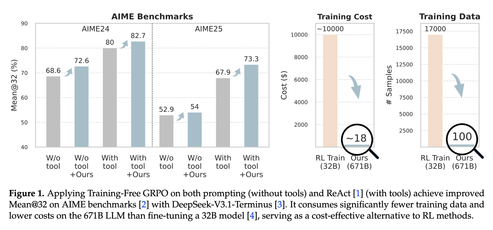
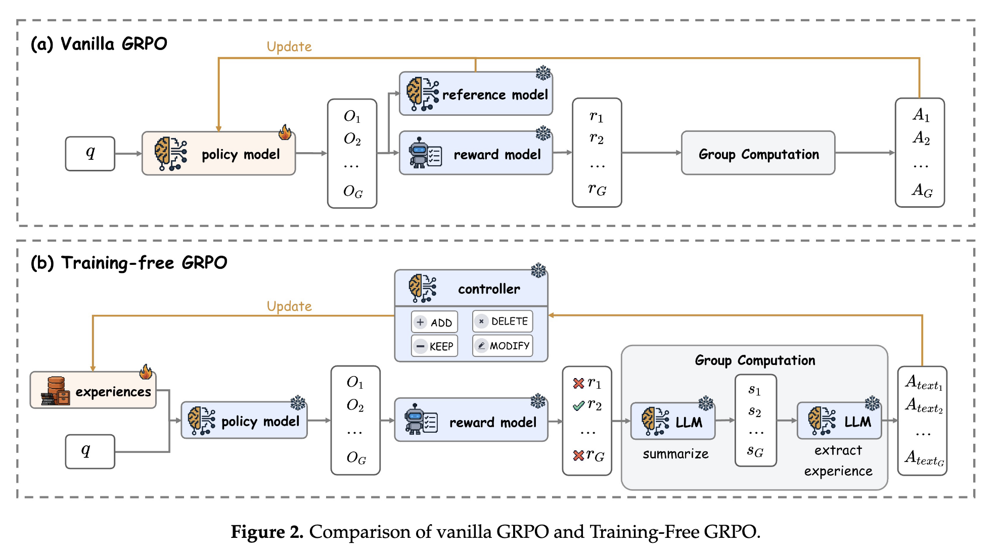
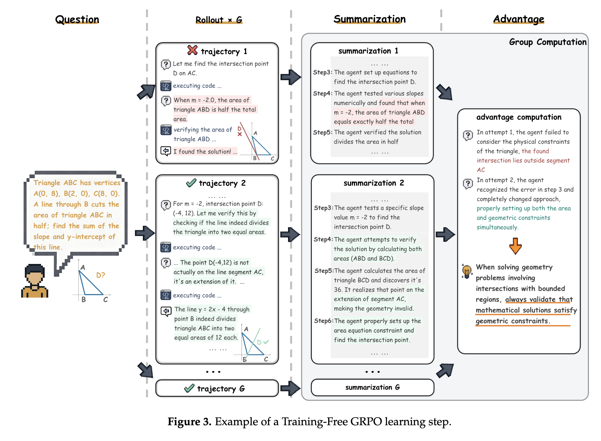
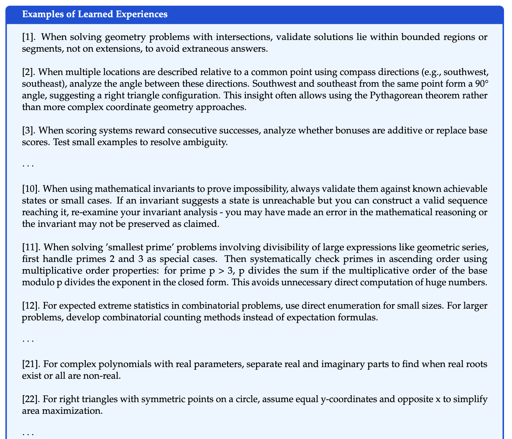
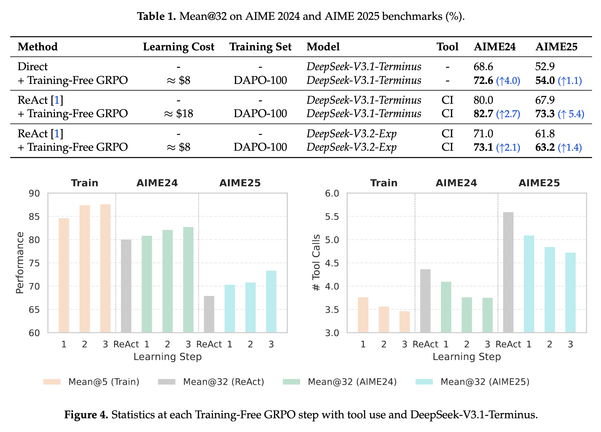
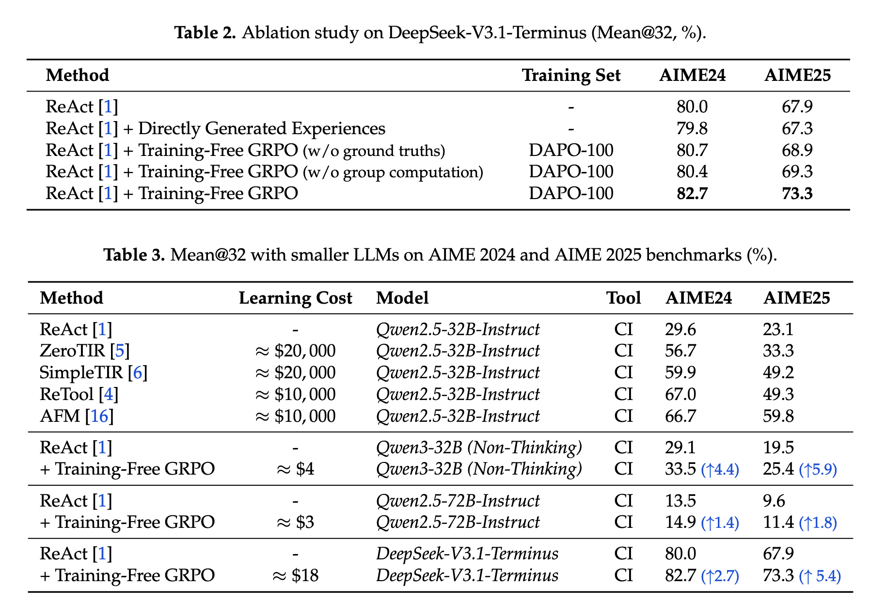
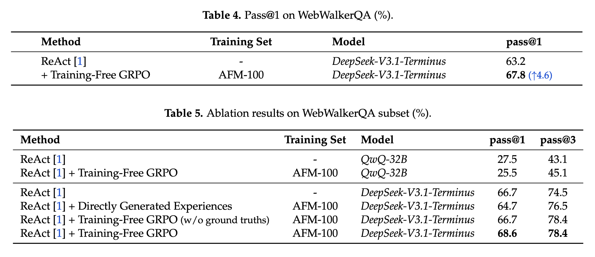
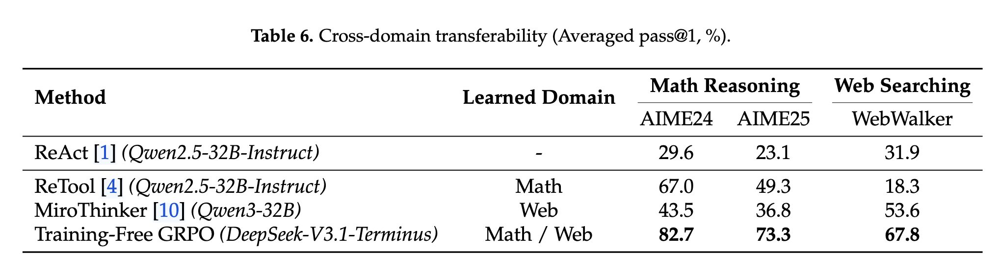

## 论文基本信息

标题：Training-Free Group Relative Policy Optimization

作者：Youtu-Agent Team

链接：http://arxiv.org/abs/2510.08191

代码：https://github.com/TencentCloudADP/youtu-agent/tree/training_free_GRPO

框架图：

# 一句话总结

作者提出了一种 **不修改模型参数**、在**上下文（context）空间内做“策略优化”的方法**：通过对同一问题的多次并行 rollout 生成一组候选输出，使用 LLM 自身对这些输出做“语义级群体比较（semantic group advantage）”，把比较得到的高质量经验以**自然语言的 token prior（经验库 E）** 的形式迭代加入到上下文，从而在后续推理时引导冻结的模型输出更好的结果。该方法被称为 Training-Free GRPO，目标是以极小的数据与成本，达到类似于 GRPO（基于参数更新的 RL） 的效果。

---

# 1) 研究动机（为什么要做）

- 现有的 agentic RL（如 GRPO）通过对模型参数进行微调来改善策略，但参数微调**代价高、对数据量敏感且泛化差**（需要专门部署多个微调模型），在实际场景不总是可行。作者想知道是否可以**在不改参数**的前提下，通过调整上下文信息（token prior / 经验库）来达到类似的行为调整效果。
    

---

# 2) 方法要点（核心思想与流程）

整体思路可以看成把 GRPO 的“群体相对优势”从数值空间变成 **语义/经验空间**，并在上下文里迭代保存这些经验以影响未来推理。主要分为3个步骤：

1. **并行 Rollout（和 GRPO 一样）**：对单个 query (q)，用基础（冻结）LLM 条件于当前经验库 (E) 生成一组 G 个输出 (${o_1,...,o_G}$)。（仍然使用 reward 模型对每个输出打分，流程与 GRPO 保持一致以便比较）。
    
2. **语义群体比较（Semantic Group Advantage）**：不是计算数值 advantage，而是让同一或另一个 LLM 对每个输出生成**摘要** ($s_i$)，再基于摘要与当前经验库 (E) 生成一段**自然语言形式的“经验 / 语义优势”** ($A_{text}$)，说明为何某些输出更优（或如何改进）。这一步用 prompt 模板把数值比较变成解释性的自然语言经验。
    
3. **更新经验库 E（非参数更新）**：把得到的自然语言经验 ($A_{text}$) 转化为对经验库的操作指令（Add / Delete / Modify / Keep）(由LLM完成），并据此修改经验库 E。经验库是一个可逐步演化的 token prior，可以在后续的 API 调用中被插入 prompt，作为上下文引导模型生成。
    
**迭代多 epoch**：重复上面步骤。每次 E 改变会在条件化策略 ($\pi_\theta(y \mid q, E)$) 上产生分布偏移，从而实现类似参数更新的效果——但本质上是“通过上下文引导输出分布”而非更新权重。作者称这保留了冻结模型的泛化优势，同时获得了任务定制化的性能提升。

（可把它视为：把 RL 中的“经验/优势信号”写成自然语言的“小贴士/规则”，并把这些“小贴士”当作 prompt 的一部分反复使用。）

经验的例子：

---

# 3) 关键设计细节（值得关注）

- **语义优势由 LLM 生成**：依赖 LLM 本身来做 introspection（自我总结）与经验抽取；这既是方法简洁的关键，也是风险来源（见后文）。
    
- **经验库的操作类型**（Add/Delete/Modify/Keep）：通过 LLM 判断并执行，避免简单累积导致上下文膨胀或噪声累积。
    
- **与 KL 约束的类比**：作者把冻结模型的行为类比成 GRPO 中的 KL 约束（防止偏离原模型），所以通过在上下文而非参数空间小幅引导输出，方法更稳定且保留原模型优势。
    

---

# 4) 实验设置与主要结果

- 基准：数学推理（AIME 2024 / AIME 2025 数据集）与交互式网页检索任务等。评测用 Pass@1 的 Mean@32（每题 32 次独立运行）。论文声称 Training-Free GRPO 对冻结的大模型（如 DeepSeek-V3.1-Terminus）在**越域任务上显著提升**，并且用“几十”样本就能超越对小模型的微调基线（例如微调的 32B 模型）——在成本上更划算。

**数学推理性能** 在使用DeepSeek-V3.1-Terminus（671B参数）的AIME24和AIME25基准测试中，免训练GRPO取得了显著改进：

- AIME24：Mean@32从80.0%增加到82.7%（+2.7%）
- AIME25：Mean@32从67.9%增加到73.3%（+5.4%）

这些成果仅通过100个域外训练示例实现，大约花费18美元，与传统强化学习方法相比，数据需求和计算成本均降低了两个数量级以上。

*注：ReAct 框架让大语言模型在生成时交替执行「思考」(Reason) 与「行动」(Act)，并根据行动反馈再思考、再行动，从而实现自主推理与交互。*

**网页搜索性能** 在WebWalkerQA基准测试中，该方法仅使用AFM数据集中的100个查询，将pass@1分数从63.2%提高到67.8%（+4.6%），证实了其在不同任务领域的有效性。

**关键实验洞察** 全面消融研究揭示了几项重要发现：

1. **GRPO类优化的必要性**：没有结构化学习过程的直接生成未能提高性能，证实了群组相对优势计算的关键性。
    
2. **无groud-truth鲁棒性**：依赖隐式奖励信号（多数投票、自我辨别）的变体仍取得了令人印象深刻的结果，表明其适用于groud-truth数据稀缺的领域。
    
3. **群组计算的重要性**：取消基于群组的比较（将群组大小设置为1）显著降低了性能，突出了相对评估的价值。
    
4. **模型能力前提条件**：该方法的有效性取决于底层模型的能力，当应用于缺乏足够推理能力的较小模型时，效果会减弱。

**跨领域泛化** 免训练GRPO最显著的优势之一是其卓越的泛化能力。虽然经过参数调整的模型在跨领域迁移时通常会遭遇显著的性能下降，但免训练GRPO保持基础模型不变，只需为不同领域调整经验知识库。

---

# 5) 优点

- **无需参数微调**：极大降低了计算与工程部署成本（尤其是大模型无法或不愿微调时）。
    
- **数据效率高**：仅少量训练样本（几十个）即可获得明显收益，适合数据稀缺情形。
    
- **保留原模型泛化性**：因为不改参数，避免把通用模型变成只在某一小任务上过拟合的专属模型。
    
- **实现简单、工程可行**：把“训练”替换成对上下文的迭代编辑，更容易在 API-based 服务上实现（论文同时给出代码）。
    

---

# 6) 局限与风险

- **费用与延迟：多轮 Rollout + LLM 自我总结 + reward 评分本质上会产生大量 API 调用**（尤其当 G 较大、epoch 多时），虽然没有微调 GPU 成本，但在推理/开发阶段的调用成本与时延可能仍然可观。论文强调总体成本低于微调大模型，但实际工程成本依赖于具体的 API 价格与并发策略。
    
- **依赖 reward 模型与 LLM 的 introspection 质量**：如果 reward 模型打分不可靠或 LLM 的自我总结有偏差，经验库可能累积误导性提示，导致性能下降或过拟合到噪声。语义优势的准确性是关键。
    
- **上下文膨胀和提示管理问题**：经验库会占用上下文长度，长期迭代可能触发上下文窗口限制，论文提出了 Add/Delete/Modify，但实际如何高效管理（去冗、压缩、检索）是工程难点。
    
- **可解释性 / 可控性**：把优化信号写成自然语言提示，便于理解，但同时也可能被 prompt-engineering 的偏差影响（需要严谨的 prompt 设计与验证）。
    

---

# 7) 实践建议

1. **先用小规模试验**：少量 queries、G（例如 4–8）和 epoch（1–5），观察经验更新的稳定性与实际提升。
    
2. **控制上下文预算**：把经验以可检索的“短句”或“规则化模板”保存，必要时做向量化索引 + 局部检索替代全部拼接。
    
3. **对语义优势做校验器**：在把经验写入 E 之前，使用独立的验证集或额外的判别器检查经验的有效性（避免噪声累积）。
    
4. **审计 reward 模型**：确保 reward 模型在目标任务上可靠；在需要时复合多个奖励信号（例如准确性 + 稳健性）。
    
5. **日志与回滚策略**：记录每次 Add/Delete/Modify 的来源与效果，便于回滚和分析。论文给出了代码仓库作为起点。
    

---

# 8) 论文的贡献点

- 把 GRPO 的优化从参数空间迁移到**上下文空间（token prior / 经验库）**，提出 Training-Free GRPO 的算法框架。
    
- 用**语义群体优势**代替数值 advantage，通过 LLM 自身生成可解释经验并迭代更新。
    
- 在数学推理与网页检索任务上展示了在样本与计算成本极小的情况下能获得显著提升，声称在某些设置下超越了小模型的微调基线。论文同时附带代码实现便于复现。
    

---

# 9) 短评

- **思想上很有创意**：把“学习”放在上下文/经验库而不是权重上，开辟了一条轻量级的 agentic 调优路线，适配 API 时代的约束。GRPO训练就像学生通过不断做题—反馈来提高自己的做题家能力，免训练GRPO就是经验都给你总结好了，你能不能通过经验来做对新的题。所以这个学生聪不聪明、经验总结地对不对是非常重要的。
    
- **工程实现中挑战仍然存在**：虽然避免了巨量 GPU 微调成本，但运行时 API 调用成本、延迟、上下文窗口以及经验质量管理都是实际部署必须认真解决的问题。
    
- **风险与健壮性**：方法高度依赖 LLM 做高质量的自我评估与抽取，这在复杂/对抗场景中可能脆弱（例如会产生自洽但不正确的“经验”）。建议后续工作探讨更多的验证/约束机制或半参数化混合方案。

这篇论文的思路和[ACE](../../Agent/ACE/ACE.md)很像

- 都不用训练，通过上下文来调整模型的行为

- ACE是模型生成执行轨迹 → 反思 → 编辑上下文，Training-Free GRPO是多样化输出 → 群体比较 → 提炼语义经验 → 编辑经验库

- Training-Free GRPO需要用到奖励模型对生成的推理轨迹打分，ACE不需要（但是它有Reflector，也会反思哪些是对的哪些是错的）

- 对于每一条推理轨迹，Training-Free GRPO会为其生成摘要、该轨迹相对成功或失败的原因（GRPO的思想），再基于所有这些原因（也可以说是经验）生成更新经验库的一系列操作（增删改）。ACE则只生成一条推理轨迹，然后对其反思形成经验教训，且只有增加这一种操作，增加新见解、策略或错误。

笔者认为ACE则更偏向一种思想理论框架，缺少方法的细节；而Training-Free GRPO的实操性会更强一些，论文附录也对实验中的几个例子做了分析。

## 参考资料
