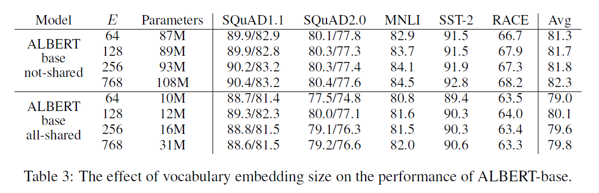
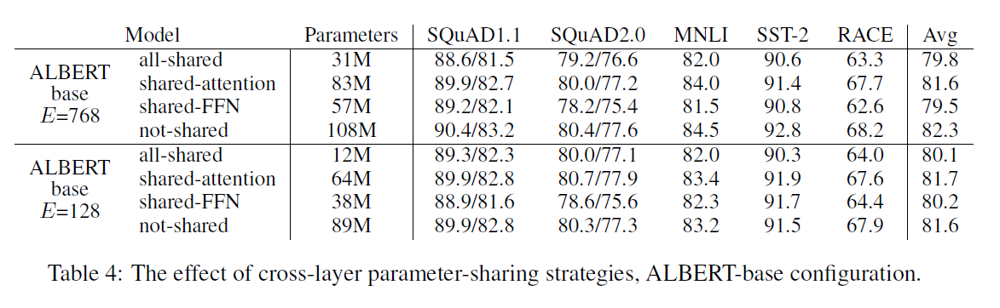
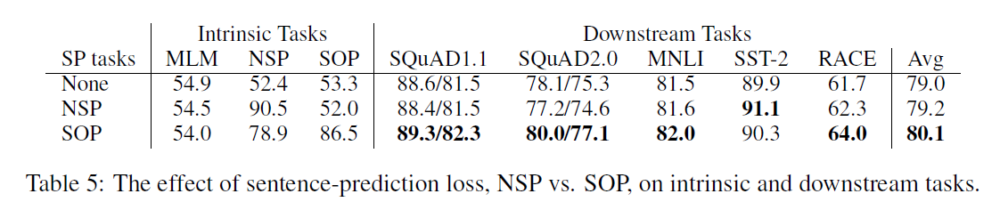
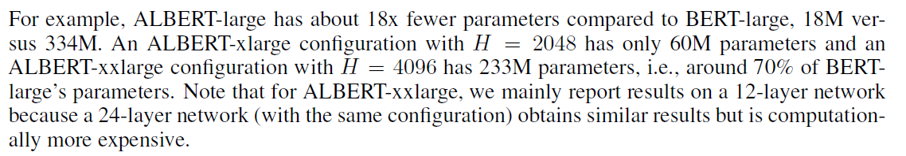
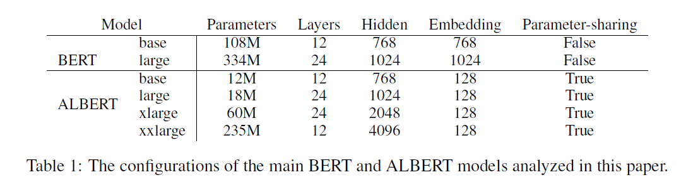

ALBERT: A Lite BERT For Self-Supervised Learning Of Language Representations

https://github.com/google-research/ALBERT

为了解决目前预训练模型参数量过大的问题，本文提出了两种能够大幅减少预训练模型参数量的方法，此外还提出用Sentence-order prediction（SOP）任务代替BERT中的Next-sentence prediction（NSP）任务，基于这些本文提出了ALBERT（A Lite BERT）模型，在多个自然语言理解任务中取得了state-of-the-art的结果。

### Factorized embedding parameterization

E=128最好。not-shared的效果最好，但是差别不是很大。

### Cross-layer parameter sharing

本文提出的另一个减少参数量的方法就是层之间的参数共享，即多个层使用相同的参数。参数共享有三种方式：只共享feed-forward network的参数、只共享attention的参数、共享全部参数。ALBERT默认是共享全部参数的，在后续实验结果中我们可以看到几种方式的模型表现。

实验表明加入参数共享之后，每一层的输入embedding和输出embedding的L2距离和余弦相似度都比BERT稳定了很多。这证明参数共享能够使模型参数更加稳定。

shared-FFN造成的效果下降最多。

另一种方案：将L层分成size M的N个组，每个组共享参数。实验表明，M越小，效果越好，但同时也增加了参数量。

### Inter-sentence coherence loss

除了减少模型参数外，本外还对BERT的预训练任务Next-sentence prediction (NSP)进行了改进。在BERT中，NSP任务的正例是文章中连续的两个句子，而负例则是从两篇文档中各选一个句子构造而成。在先前的研究中，已经证明NSP并不是一个合适的预训练任务。本文推测其原因是模型在判断两个句子的关系时不仅考虑了两个句子之间的连贯性（coherence），还会考虑到两个句子的话题（topic）。而两篇文档的话题通常不同，模型会更多的通过话题去分析两个句子的关系，而不是句子间的连贯性，这使得NSP任务变成了一个相对简单的任务。

因此本文提出了Sentence-order prediction (SOP)来取代NSP。具体来说，其正例与NSP相同，但负例是通过选择一篇文档中的两个连续的句子并将它们的顺序交换构造的。这样两个句子就会有相同的话题，模型学习到的就更多是句子间的连贯性。

## 参数比较

## 参考资料

[【论文阅读】ALBERT](https://zhuanlan.zhihu.com/p/87562926)

[如何看待瘦身成功版BERT——ALBERT？](https://www.zhihu.com/question/347898375)