[The Big LLM Architecture Comparison](https://magazine.sebastianraschka.com/p/the-big-llm-architecture-comparison)  

# DeepSeek

- DeepSeek-MLA，在DeepSeek-V2的论文中的消融实验表明，GQA 的性能似乎不如 MHA，而 MLA 的建模性能优于 MHA，这可能就是 DeepSeek 团队选择 MLA 而非 GQA 的原因。
- DeepSeek-MOE，MOE是将Transformer 模块中的每个单个前馈模块替换为多个前馈模块。DeepSeek-V3 每个 MoE 模块有 256 位专家，总共 6710 亿个参数。在推理过程中，每次只有 9 位专家处于活动状态（1 位共享专家加上 8 位由路由器选择的专家）。这意味着每个推理步骤仅使用 370 亿个参数。
- DeepSeek-V3 的 MoE 设计的一个显著特点是使用了一个共享专家。这是一个始终对每个 token 保持活跃的专家。在 [DeepSeek 2024 MoE](https://arxiv.org/abs/2401.06066) 和 [2022 DeepSpeedMoE 论文](https://arxiv.org/abs/2201.05596)中就已提出 。他们发现与没有共享专家相比，共享专家可以提升整体建模性能。

# OLMo

在训练数据和代码方面非常透明，并且技术报告也相对详细。

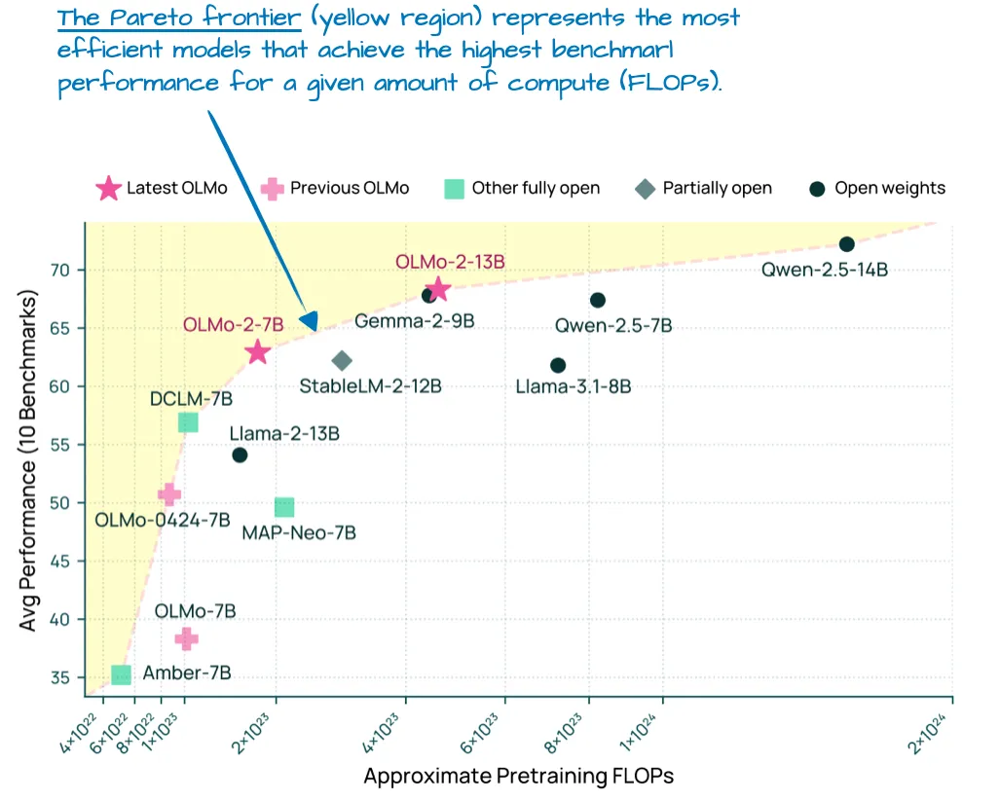

OLMo 2 仍然采用传统的多头注意力（MHA），而不是 MLA 或 GQA。

## RMNSorm

与 Llama、Gemma 和大多数其他 LLM 类似，OLMo 2 从 LayerNorm 转换为 RMSNorm。RMSNorm 已经过时（它本质上是 LayerNorm 的简化版本，可训练参数更少）。

然而，RMNSorm 层的放置位置值得讨论。原始 Transformer（来自“ [Attention is all you need](https://arxiv.org/abs/1706.03762) ”论文）将两个规范化层分别放置在 Transformer 模块中的注意力模块和前馈模块**之后**。这也称为 Post-LN 或 Post-Norm。

GPT 和之后出现的大多数 LLM 将归一化层置于注意力模块和前馈模块**之前** ，这被称为 Pre-LN 或 Pre-Norm。

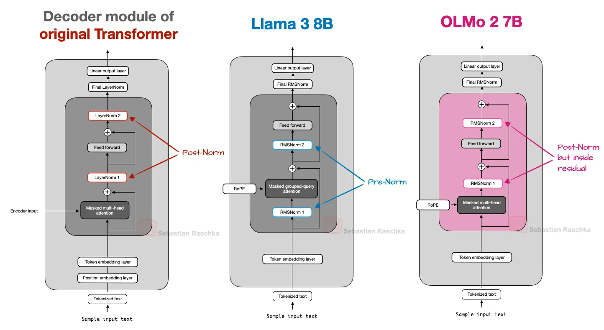

[2020 年，熊等人。](https://arxiv.org/abs/2002.04745) 表明 Pre-LN 在初始化时会导致更良好的梯度。此外，研究人员提到，Pre-LN 甚至可以在没有仔细的学习率预热的情况下运行良好，这是 Post-LN 的重要工具。

 OLMo 2 采用了一种 Post-LN 形式（但使用 RMSNorm 而不是 LayerNorm，所以我称之为 _Post-Norm_）。在 OLMo 2 中，它们不是将归一化层放在注意力层和前馈层之前，而是将它们放在后面，如上图所示。但是，请注意，与原始 Transformer 架构相比，归一化层仍在残差层（跳过连接）内。

那么，他们为什么要移动归一化层的位置呢？ 原因是它有助于训练稳定性，如下图所示。

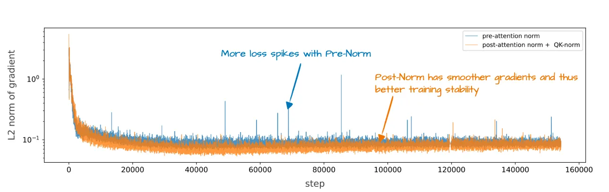

不幸的是，此图显示了与 QK-Norm 一起重新排序的结果，这是一个单独的概念。因此，很难判断归一化层重新排序本身贡献了多少。

## QK-Norm

QK-Norm 本质上是另一个 RMSNorm 层。它放置在多头注意力 （MHA） 模块中，并在应用 RoPE 之前应用于查询 （q） 和键 （k）。为了说明这一点，下面是我为我的 [Qwen3 从头开始实现](https://github.com/rasbt/LLMs-from-scratch/tree/main/ch05/11_qwen3)编写的分组查询注意力 （GQA） 层的摘录 （GQA 中的 QK-norm 应用程序类似于 OLMo 中的 MHA）：

```python
class GroupedQueryAttention(nn.Module):
    def __init__(
        self, d_in, num_heads, num_kv_groups,
        head_dim=None, qk_norm=False, dtype=None
    ):
        # ...

        if qk_norm:
            self.q_norm = RMSNorm(head_dim, eps=1e-6)
            self.k_norm = RMSNorm(head_dim, eps=1e-6)
        else:
            self.q_norm = self.k_norm = None

    def forward(self, x, mask, cos, sin):
        b, num_tokens, _ = x.shape

        # Apply projections
        queries = self.W_query(x) 
        keys = self.W_key(x)
        values = self.W_value(x) 

        # ...

        # Optional normalization
        if self.q_norm:
            queries = self.q_norm(queries)
        if self.k_norm:
            keys = self.k_norm(keys)

        # Apply RoPE
        queries = apply_rope(queries, cos, sin)
        keys = apply_rope(keys, cos, sin)

        # Expand K and V to match number of heads
        keys = keys.repeat_interleave(self.group_size, dim=1)
        values = values.repeat_interleave(self.group_size, dim=1)

        # Attention
        attn_scores = queries @ keys.transpose(2, 3)
        # ...
```

如前所述，QK-Norm 与 Post-Norm 一起稳定了训练。请注意，QK-Norm 不是由 OLMo 2 发明的，而是可以追溯到 [2023 年 Scaling Vision Transformers 论文](https://arxiv.org/abs/2302.05442) 。

下图进一步并排比较了 OLMo 2 和 Llama 3;可以看出，除了 OLMo 2 仍然使用传统的 MHA 而不是 GQA 之外，这些架构在其他方面相对相似。（但是， OLMo 2 团队在 3 个月后发布了使用 GQA 的 [32B 变体](https://huggingface.co/allenai/OLMo-2-0325-32B-Instruct) 。

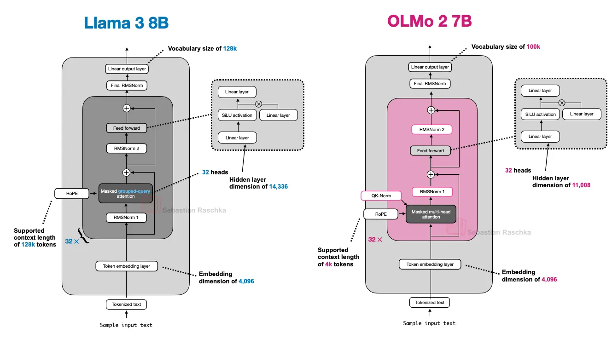

# Gemma 3

Gemma 的显着特点之一是相当大的词汇量（以更好地支持多种语言），并且更注重 27B 大小（相对于 8B 或 70B）。但请注意，Gemma 2 也有更小的尺寸：1B、4B 和 12B。27B 尺寸达到了一个非常好的最佳位置：它比 8B 型号功能强大得多，但不像 70B 型号那样占用资源.

如前所述，其他模型（如 Deepseek-V3/R1）使用混合专家 （MoE） 架构来减少推理时的内存需求，前提是模型大小固定。（我们稍后将讨论的其他几种模型也使用了 MoE 方法。

Gemma 3 使用了不同的“技巧”来降低计算成本，即滑动窗口注意力。

## **Sliding Window Attention**

通过滑动窗口注意力（最初在 [2020 年的 LongFormer 论文](https://arxiv.org/abs/2004.05150)中引入，[Gemma 2](http://arxiv.org/abs/2408.00118) 也已经使用 ），Gemma 3 团队能够大幅减少 KV 缓存中的内存需求，如下图所示。

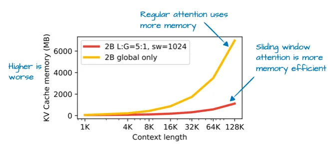

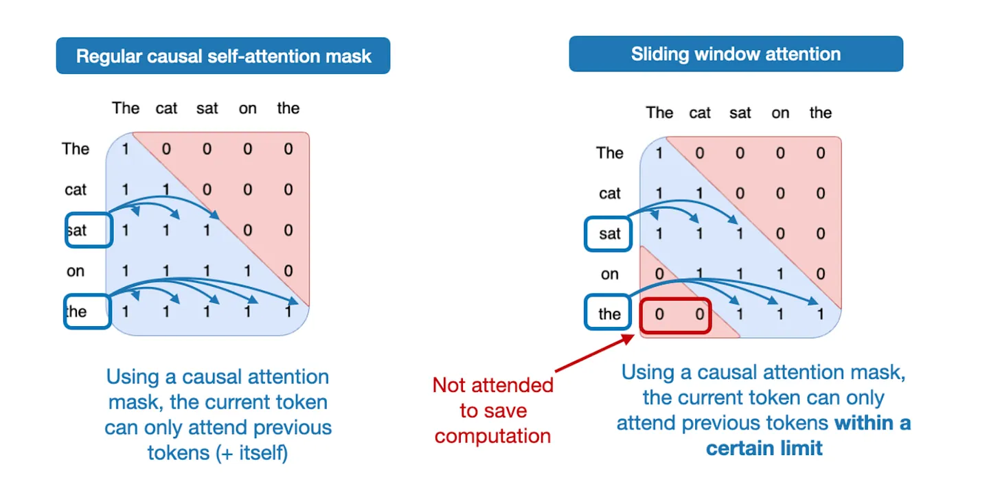

请注意，滑动窗口注意力可以与 Multi-Head Attention 和 Grouped-Query Attention 一起使用;Gemma 3 使用分组查询注意力。

Gemma 2 的前身架构之前也使用了滑动窗口注意力。Gemma 3 的不同之处在于它们调整了全局（常规）和局部（滑动）注意力之间的比率。

例如，Gemma 2 使用混合注意力机制，将滑动窗口（局部）和全局注意力以 1：1 的比例组合在一起。每个 Token 都可以关注附近上下文的 4k Token 窗口。

Gemma 2 在每隔一层中使用滑动窗口注意力，而 Gemma 3 现在的比率为 5：1，这意味着每 5 个滑动窗口（局部）注意力层只有 1 个完整的注意力层;此外，滑动窗口尺寸从 4096 （Gemma 2） 减少到仅 1024 （Gemma 3）。这将模型的关注点转移到更高效的本地化计算上。

根据他们的消融研究，使用滑动窗口注意力对建模性能的影响最小，如下图所示

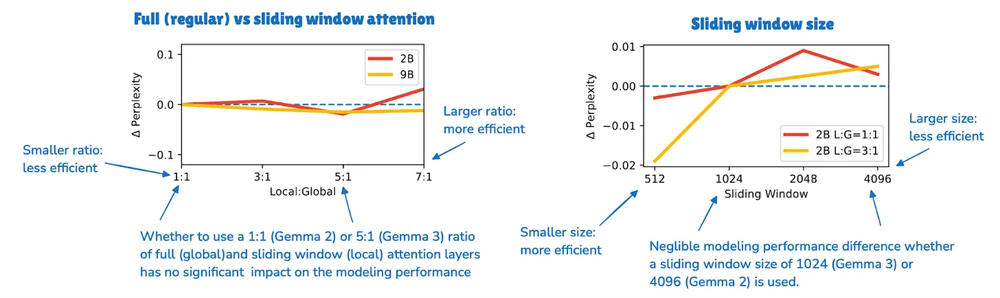

## **Normalization Layer Placement in Gemma 3**

需要强调的一个小而有趣的花絮是，Gemma 3 在其分组查询注意力模块的 Pre-Norm 和 Post-Norm 设置中使用了 RMSNorm。

这与 Gemma 2 类似，但仍然值得强调，因为它不同于 （1） 原始transformer中使用的 Post-Norm（2） Pre-Norm，它由 GPT-2 推广，并在之后的许多其他架构中使用，以及 （3） 我们之前看到的 OLMo 2 中的 Post-Norm 风格。

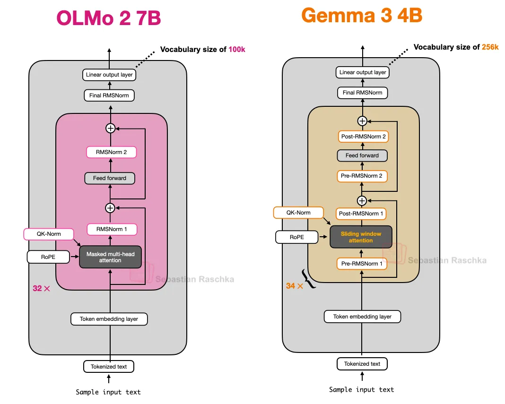

我认为这种归一化层放置是一种相对直观的方法，因为它可以两全其美：Pre-Norm 和 Post-Norm。在我看来，一点额外的规范化不会有什么坏处。在最坏的情况下，如果额外的规范化是多余的，这会通过冗余增加一些效率低下。实际上，由于 RMSNorm 在宏伟的计划中相对便宜，因此这应该不会产生任何明显的影响。

## **Gemma 3n**

在 Gemma 3 发布几个月后，Google 分享了 [Gemma 3n](https://developers.googleblog.com/en/introducing-gemma-3n/)，这是一款 Gemma 3n 模型，针对小型设备效率进行了优化，目标是在手机上运行。

Gemma 3n 中为提高效率而进行的其中一项更改是所谓的每层嵌入 （PLE） 参数层。这里的关键思想是仅将模型参数的子集保留在 GPU 内存中。然后，令牌层特定的嵌入（例如用于文本、音频和视觉模态的嵌入）会按需从 CPU 或 SSD 流式传输。

下图说明了 PLE 内存节省，列出了标准 Gemma 3 模型的 54.4 亿个参数。这可能指的是 Gemma 3 40 亿的变体。

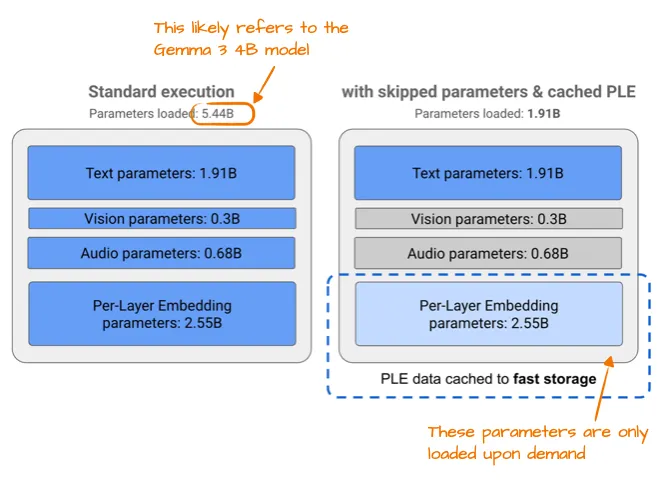

5.44 与 40 亿参数的差异是因为 Google 有一种有趣的方法来报告 LLM 中的参数计数。它们通常排除嵌入参数以使模型看起来更小，但在这种情况下除外，在这种情况下，可以方便地包含它们以使模型看起来更大。这并不是谷歌独有的，因为这种方法已成为整个领域的普遍做法。

另一个有趣的技巧是 [MatFormer](https://arxiv.org/abs/2310.07707) 概念（Matryoshka Transformer的缩写）。例如，Gemma 3n 使用单个共享 LLM（转换器）架构，该架构可以切片为更小的、独立可用的模型。每个切片都经过训练以独立运行，因此在推理时，我们可以只运行您需要的部分（而不是大型模型）。


# Mistral Small 3.1

[Mistral Small 3.1 24B](https://mistral.ai/news/mistral-small-3-1) 于 Gemma 3 之后不久的 3 月发布，值得注意的是，它在多个基准测试（数学除外）上优于 Gemma 3 27B，同时速度更快。

Mistral Small 3.1 的推理延迟低于 Gemma 3 的原因可能是由于它们的自定义分词器，以及 KV 缓存和层数的缩小。它是标准架构，如下图所示。

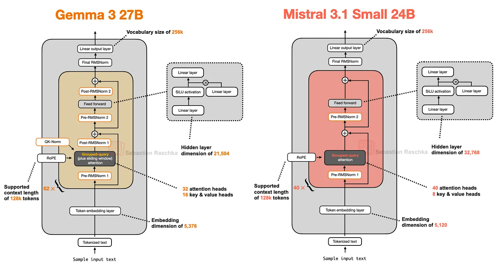

有趣的是，早期的 Mistral 模型使用了滑动窗注意力，但他们似乎在 Mistral Small 3.1 中放弃了它。因此，由于 Mistral 使用常规的分组查询注意力，而不是像 Gemma 3 中那样带有滑动窗口的分组查询注意力，因此由于能够使用更优化的代码（即 FlashAttention），可能会节省额外的推理计算成本。例如，我推测，虽然滑动窗口注意力减少了内存使用，但它并不一定能减少推理延迟，而这正是 Mistral Small 3.1 所关注的。

# Llama 4

[Llama 4](https://ai.meta.com/blog/llama-4-multimodal-intelligence/) 也采用了 MoE 方法，其他方面遵循了与 DeepSeek-V3 非常相似的相对标准的架构，如下图所示。（Llama 4 包括原生多模态支持，类似于 Gemma 和 Mistral 等模型。但是，由于本文侧重于语言建模，因此我们只关注文本模型。

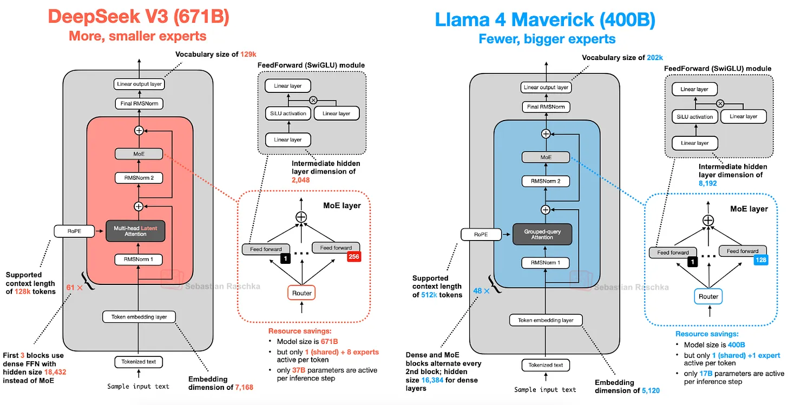

首先，Llama 4 使用与其前身类似的分组查询注意力，而 DeepSeek-V3 使用多头潜在注意力，我们在本文开头讨论过。现在，DeepSeek-V3 和 Llama 4 Maverick 都是非常大的架构，其中 DeepSeek-V3 的总参数数大约大了 68%。然而，DeepSeek-V3 拥有 370 亿个活动参数，其活动参数数量是 Llama 4 Maverick （17B） 的两倍多。

与 DeepSeek-V3（9 名活跃专家，每人 2,048 个隐藏大小）相比，Llama 3 Maverick 使用更经典的 MoE 设置，专家数量较少但规模更大（2 名活跃专家，每人 8,192 个隐藏大小）。此外，DeepSeek 在每个 Transformer 块（前 3 个除外）中使用 MoE 层，而 Llama 4 在所有其他 Transformer 块中交替使用 MoE 和密集模块。

与 DeepSeek-V3（9 名活跃专家，每人 2,048 个隐藏大小）相比，Llama 3 Maverick 使用更经典的 MoE 设置，专家数量较少但规模更大（2 名活跃专家，每人 8,192 个隐藏大小）。此外，DeepSeek 在每个 Transformer 块（前 3 个除外）中使用 MoE 层，而 Llama 4 在所有其他 Transformer 块中交替使用 MoE 和密集模块。

鉴于架构之间存在许多细微的差异，很难确定它们对最终模型性能的确切影响。然而，主要的结论是，MoE 架构在 2025 年将显着普及。

# Qwen3

## **Qwen3 (Dense)**

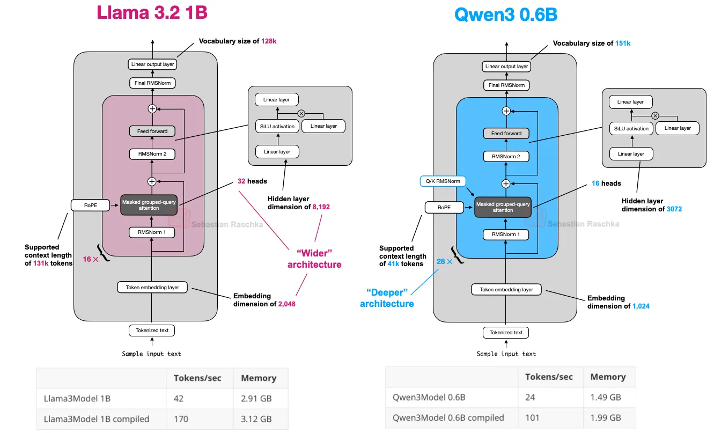

0.6B 型号很可能是目前最小的当前一代开放重量型号。根据我的个人经验，鉴于它的体积小，它的表现非常好。如果您计划在本地运行它，它具有出色的令牌/秒吞吐量和低内存占用。但更重要的是，由于其体积小，也很容易在本地进行训练（出于教育目的）。

Qwen3 的内存占用更小，因为它总体上是一个更小的架构，但也使用更小的隐藏层和更少的注意力头。然而，它比 Llama 3 使用更多的 transformer 块，这导致运行时间较慢（令牌/秒生成速度较低）。

## **Qwen3 (MoE)**

如前所述，Qwen3 还提供两种 MoE 版本：30B-A3B 和 235B-A22B。为什么某些架构（如 Qwen3）有常规（密集）和 MoE（稀疏）变体？

如本文开头所述，MoE 变体有助于降低大型基础模型的推理成本。提供密集和 MoE 版本为用户提供了灵活性，具体取决于他们的目标和限制。

密集模型通常更直接地跨各种硬件进行微调、部署和优化。

另一方面，MoE 模型针对扩展推理进行了优化。例如，在固定的推理预算下，他们可以实现更高的整体模型容量（即，由于更大而在训练期间吸收知识），而不会成比例地增加推理成本。

通过发布这两种类型，Qwen3 系列可以支持更广泛的用例：用于稳健性、简单性和微调的密集模型，以及用于大规模高效服务的 MoE 模型。

为了总结这一部分，让我们看看 Qwen3 235B-A22B（注意 A22B 代表“22B 活动参数”）到 DeepSeek-V3，后者的活动参数几乎是 DeepSeek-V3 的两倍（37B）。

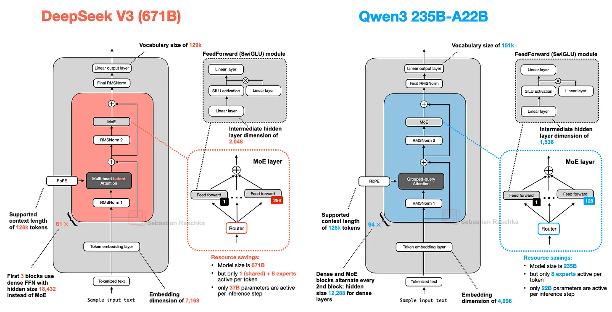

如上图所示，DeepSeek-V3 和 Qwen3 235B-A22B 架构非常相似。不过，值得注意的是，Qwen3 模型不再使用共享专家（早期的 Qwen 模型，例如 [Qwen2.5-MoE](https://qwenlm.github.io/blog/qwen2.5-max/) 确实使用共享专家）。

不幸的是，Qwen3 团队没有透露他们放弃共享专家的任何原因。如果我必须猜测的话，当他们将专家从 2 个（在 Qwen2.5-MoE 中）增加到 8 个（在 Qwen3 中）时，他们的设置可能根本不需要训练稳定性。然后，他们能够通过仅使用 8 个而不是 8+1 个专家来节省额外的计算/内存成本。（但是，这并不能解释为什么 DeepSeek-V3 仍然保留他们的共享专家。

**更新。**Qwen3 的开发者之一林[俊阳](https://x.com/JustinLin610/status/1947364862184853626)回应如下：

当时，我们没有发现共享专家有足够显着的改进，我们担心共享专家引起的推理优化。老实说，这个问题没有直接的答案。

# SmolLM3

[SmolLM3](https://huggingface.co/blog/smollm3) 可能不像本文介绍的其他 LLM 那样受欢迎，但我认为它仍然是一个有趣的模型，因为它在位于 1.7B 和 4B Qwen3 模型之间的相对较小且方便的 30 亿参数模型大小下提供了非常好的建模性能，如下图所示。

而且，它还分享了很多训练细节，类似于 OLMo

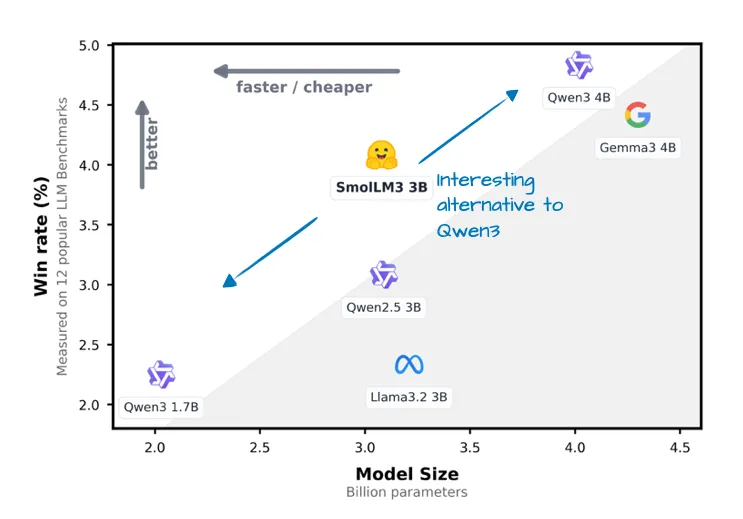

如下图架构对比图所示，SmolLM3 架构看起来相当标准。不过，也许最有趣的方面是它对 NoPE（无位置嵌入）的使用。

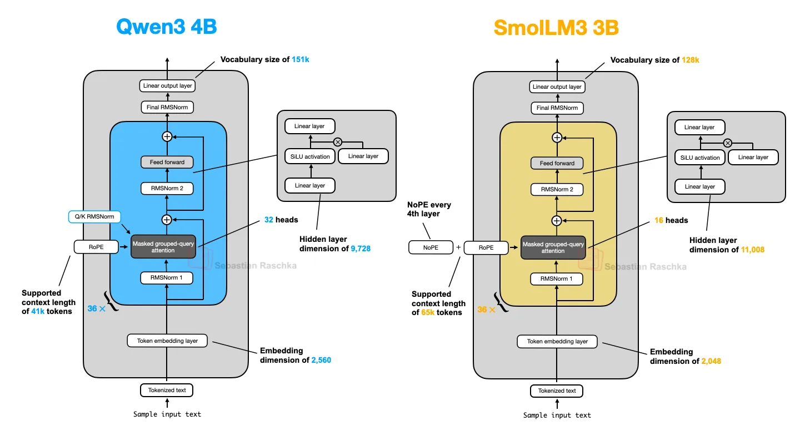

## **No Positional Embeddings (NoPE)**

在 LLM 上下文中，NoPE 是一个较旧的想法，可以追溯到 2023 年的一篇论文（ 位置[编码对 Transformers 中长度泛化的影响](https://arxiv.org/abs/2305.19466) ），以消除显式位置信息注入（例如通过早期 GPT 架构或现在的 RoPE 中的经典绝对位置嵌入层）。

在基于 Transformer 的 LLM 中，位置编码通常是必要的，因为自注意力独立于顺序处理标记。绝对位置嵌入通过添加一个额外的嵌入层来解决这个问题，该层将信息添加到 token embeddings中。

另一方面，RoPE 通过相对于其标记位置轮换查询和键向量来解决这个问题。

然而，在 NoPE 层中，根本没有添加这样的位置信号：不是固定的、不是学习的、不是相对的

即使没有位置嵌入，模型仍然知道哪些标记在前面，这要归功于因果注意力掩码。此掩码可防止每个令牌关注未来的令牌。因此，位置 t 的标记 只能看到位置 t ≤的标记 ，这保留了自回归排序。

因此，虽然没有显式添加位置信息，但模型结构中仍然存在隐含的方向感，在基于梯度下降的常规训练中，LLM 可以学习利用它，如果它发现它对优化目标有益。（查看 NoPE 论文的定理了解更多信息。

所以，总体来看，[NoPE 论文](https://arxiv.org/abs/2305.19466)不仅发现不需要位置信息注入，而且还发现 NoPE 具有更好的长度泛化，这意味着 LLM 应答性能随着序列长度的增加而下降得更小，如下图所示。

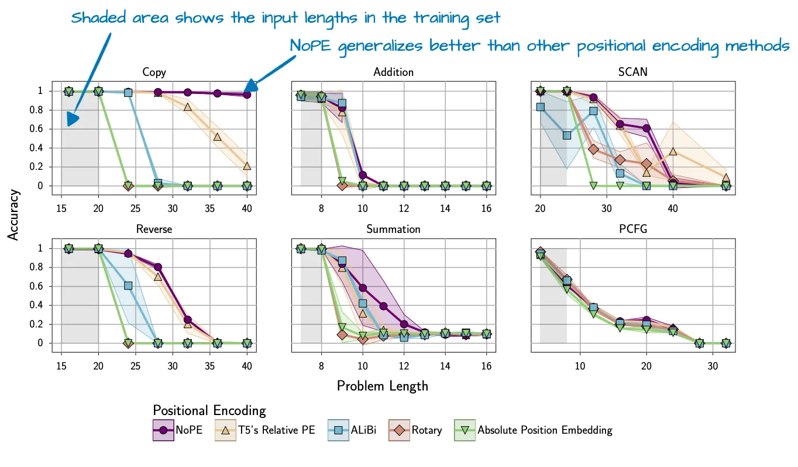

请注意，上面显示的实验是使用相对较小的 GPT 风格模型进行的，该模型具有大约 1 亿个参数和相对较小的上下文大小。目前尚不清楚这些发现在更大的当代法学硕士中的推广效果如何。

出于这个原因，SmolLM3 团队可能只在每 4 层中“应用”NoPE（或者更确切地说省略了 RoPE）。

# Kimi 2

[Kimi 2](https://moonshotai.github.io/Kimi-K2/) 最近在 AI 社区掀起了巨大的波澜，因为它是一款具有令人难以置信的出色性能的开放重量模型。根据基准测试，它与谷歌的 Gemini、Anthropic 的 Claude 和 OpenAI 的 ChatGPT 模型等最佳专有模型不相上下。

一个值得注意的方面是它使用了相对较新的 [Muon](https://github.com/KellerJordan/Muon) 优化器的变体，而不是 AdamW。据我所知，这是 Muon（而不是AdamW）第一次用于这种规模的任何生产模型（ [以前](https://arxiv.org/abs/2502.16982) ，它只被证明可以扩展到 16B）。这导致了非常好的训练损失曲线，这可能有助于将该模型推向上述基准的顶部。

虽然人们评论说损失非常平滑（由于没有尖峰），但我认为它并不是特别平滑（例如，参见下图中的 OLMo 2 损失曲线;此外，梯度的 L2 范数可能是跟踪训练稳定性的更好指标）。然而，值得注意的是损失曲线的衰减程度。

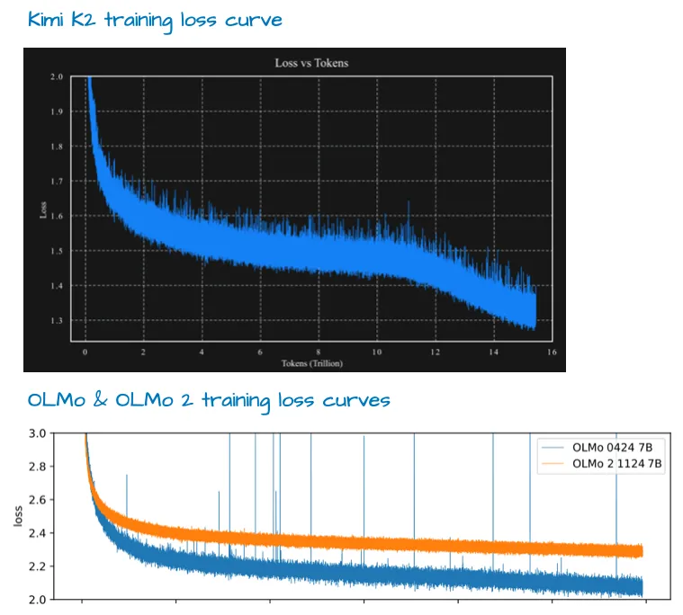

模型本身就有 1 万亿个参数，这确实令人印象深刻。

在撰写本文时，它可能是这一代最大的 LLM（考虑到 Llama 4 Behemoth 未发布的限制，专有的 LLM 不算在内，而 Google 的 1.6 万亿 [Switch Transformer](https://arxiv.org/abs/2101.03961) 是来自不同一代的编码器-解码器架构）。

随着 Kimi 2 使用我们在本文开头介绍的 DeepSeek-V3 架构，它也回到了原点，只是他们把它做得更大，如下图所示。

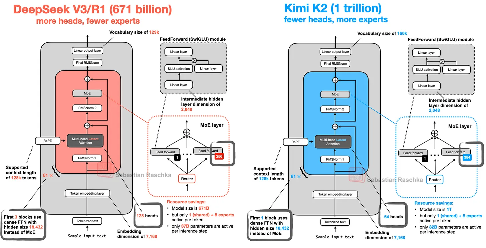

如上图所示，Kimi 2.5 与 DeepSeek V3 基本相同，只是在 MoE 模块中使用了更多的专家，而在多头潜在注意力（MLA）模块中使用了更少的头部。

Kimi 2 并不是凭空出现的。[Kimi k1.5：使用 LLMs 扩展强化学习论文](https://arxiv.org/abs/2501.12599)中讨论的早期 Kimi 1.5 模型也令人印象深刻。