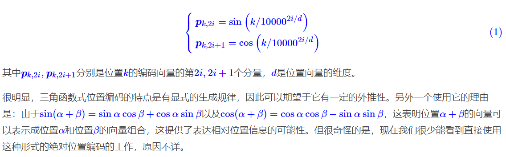
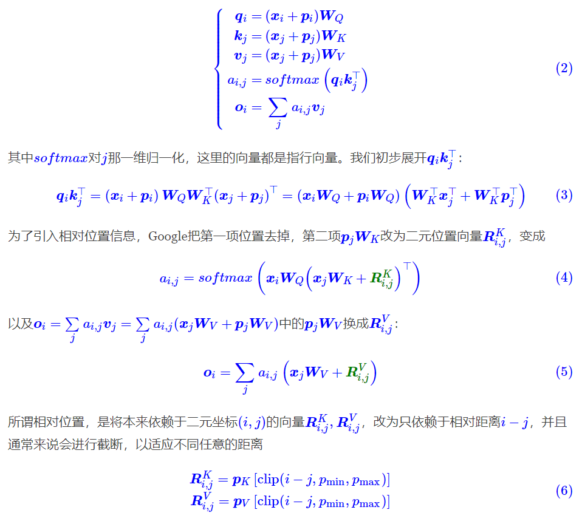
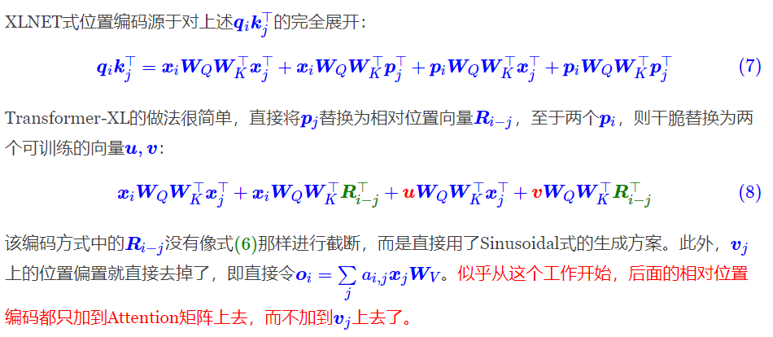
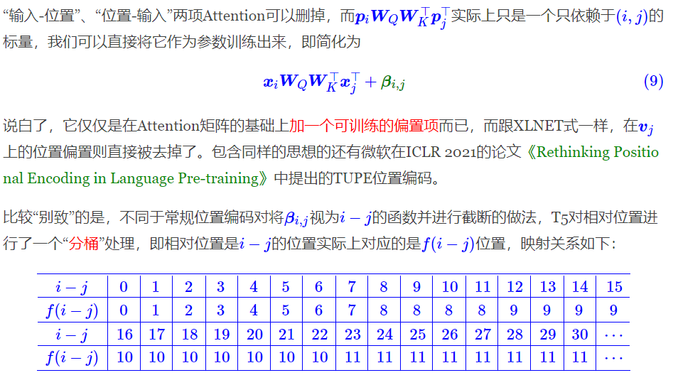
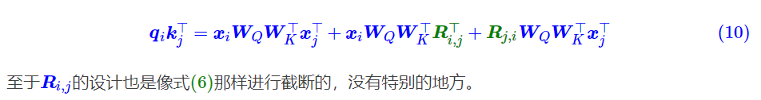
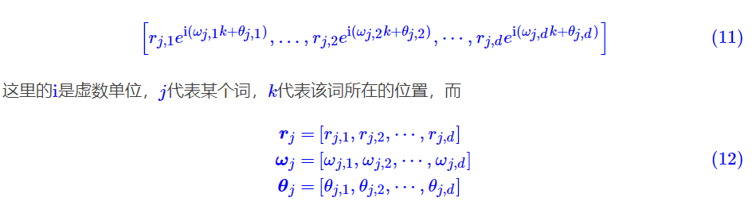
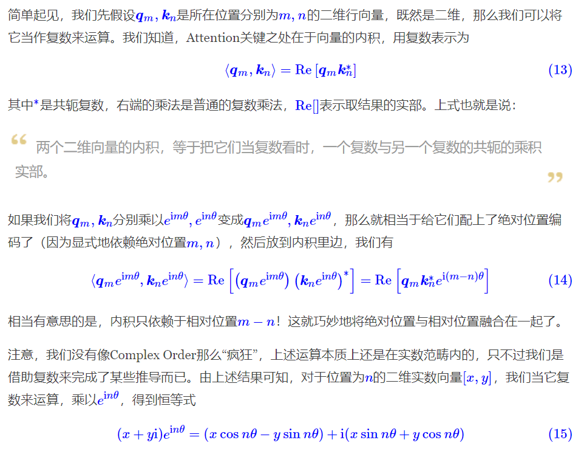
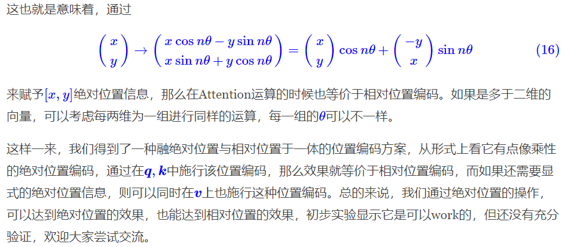

有两个选择：1、想办法将位置信息融入到输入中，这构成了绝对位置编码的一般做法；2、想办法微调一下Attention结构，使得它有能力分辨不同位置的Token，这构成了相对位置编码的一般做法。

## 绝对位置编码

一般来说，绝对位置编码会加到输入中：在输入的第k个向量xk中加入位置向量pk变为xk+pk，其中pk只依赖于位置编号k。

### 训练式

- 直接将位置编码当作可训练参数
- 比如最大长度为512，编码维度为768，那么就初始化一个512×768512×768的矩阵作为位置向量，让它随着训练过程更新。
- 例子：BERT、GPT，2017年Facebook的[《Convolutional Sequence to Sequence Learning》](https://arxiv.org/abs/1705.03122)
- 缺点是没有外推性，即如果预训练最大长度为512的话，那么最多就只能处理长度为512的句子，再长就处理不了了。
- 也可以将超过512的位置向量随机初始化，然后继续微调。
- 通过层次分解的方式，可以使得绝对位置编码能外推到足够长的范围，同时保持还不错的效果
- [《层次分解位置编码，让BERT可以处理超长文本》](https://kexue.fm/archives/7947)

### 三角式

三角函数式位置编码，一般也称为Sinusoidal位置编码，是Google的论文[《Attention is All You Need》](https://arxiv.org/abs/1706.03762)所提出来的一个显式解：

- 相邻的位置编码向量很相似，较远的位置编码向量差异很大，说明基于正余弦函数的绝对位置可以表征位置的相关性；
    
- 不需要显式地学习位置，提高效率。

Sinusoidal位置编码的每个分量都是正弦或余弦函数，所有每个分量的数值都具有周期性。如下图所示，每个分量都具有周期性，并且越靠后的分量，波长越长，频率越低。这是一个非常重要的性质，基于RoPE的大模型的长度外推工作，与该性质有着千丝万缕的关联

Sinusoidal位置编码还具有远程衰减的性质，具体表现为：对于两个相同的词向量，如果它们之间的距离越近，则他们的内积分数越高，反之则越低。如下图所示，我们随机初始化两个向量q和k，将q固定在位置0上，k的位置从0开始逐步变大，依次计算q和k之间的内积。我们发现随着q和k的相对距离的增加，它们之间的内积分数震荡衰减。

因为Sinusoidal位置编码中的正弦余弦函数具备周期性，并且具备远程衰减的特性，所以理论上也具备一定长度外推的能力。
### 递归式

原则上来说，RNN模型不需要位置编码，它在结构上就自带了学习到位置信息的可能性（因为递归就意味着我们可以训练一个“数数”模型），因此，如果在输入后面先接一层RNN，然后再接Transformer，那么理论上就不需要加位置编码了。同理，我们也可以用RNN模型来学习一种绝对位置编码，比如从一个向量p0出发，通过递归格式pk+1=f(pk)来得到各个位置的编码向量。

ICML 2020的论文[《Learning to Encode Position for Transformer with Continuous Dynamical Model》](https://arxiv.org/abs/2003.09229)把这个思想推到了极致，它提出了用微分方程（ODE）dpt/dt=h(pt,t)的方式来建模位置编码，该方案称之为FLOATER。显然，FLOATER也属于递归模型，函数h(pt,t)可以通过神经网络来建模，因此这种微分方程也称为神经微分方程。

理论上来说，基于递归模型的位置编码也具有比较好的外推性，同时它也比三角函数式的位置编码有更好的灵活性（比如容易证明三角函数式的位置编码就是FLOATER的某个特解）。但是很明显，递归形式的位置编码牺牲了一定的并行性，可能会带速度瓶颈。

### 相乘式

xk⊗pk的方式

参考[《中文语言模型研究：(1) 乘性位置编码》](https://zhuanlan.zhihu.com/p/183234823)

## 相对位置编码

相对位置并没有完整建模每个输入的位置信息，而是在算Attention的时候考虑当前位置与被Attention的位置的相对距离，由于自然语言一般更依赖于相对位置，所以相对位置编码通常也有着优秀的表现。对于相对位置编码来说，它的灵活性更大，更加体现出了研究人员的“天马行空”。

### 经典式

相对位置编码起源于Google的论文[《Self-Attention with Relative Position Representations》](https://arxiv.org/abs/1803.02155)，华为开源的NEZHA模型也用到了这种位置编码，后面各种相对位置编码变体基本也是依葫芦画瓢的简单修改。

一般认为，相对位置编码是由绝对位置编码启发而来，考虑一般的带绝对位置编码的Attention：

这样一来，只需要有限个位置编码，就可以表达出任意长度的相对位置（因为进行了截断），不管pK,pV是选择可训练式的还是三角函数式的，都可以达到处理任意长度文本的需求。

### XLNET式

XLNET式位置编码其实源自Transformer-XL的论文[《Transformer-XL: Attentive Language Models Beyond a Fixed-Length Context》](https://arxiv.org/abs/1901.02860)，只不过因为使用了Transformer-XL架构的[XLNET](https://arxiv.org/abs/1906.08237)模型并在一定程度上超过了BERT后，Transformer-XL才算广为人知，因此这种位置编码通常也被冠以XLNET之名。

### T5式

T5模型出自文章[《Exploring the Limits of Transfer Learning with a Unified Text-to-Text Transformer》](https://arxiv.org/abs/1910.10683)，里边用到了一种更简单的相对位置编码。思路依然源自展开式[(7)](https://kexue.fm/archives/8130#mjx-eqn-eq%3Aqk-exp)(7)，如果非要分析每一项的含义，那么可以分别理解为“输入-输入”、“输入-位置”、“位置-输入”、“位置-位置”四项注意力的组合。如果我们认为输入信息与位置信息应该是独立（解耦）的，那么它们就不应该有过多的交互，所以“输入-位置”、“位置-输入”两项Attention可以删掉

这个设计的思路其实也很直观，就是比较邻近的位置（0～7），我们需要比较得精细一些，所以给它们都分配一个独立的位置编码，至于稍远的位置（比如8～11），我们不用区分得太清楚，所以它们可以共用一个位置编码，距离越远，共用的范围就可以越大，直到达到指定范围再clip。

代码： https://huggingface.co/transformers/v4.10.1/_modules/transformers/models/t5/modeling_t5.html

解析： https://juejin.cn/post/7107516511824117790

`_relative_position_bucket`函数的功能就是输入一个相对位置i-j，返回其对应的分区类型
- num_buckets种相对位置，将任意多的相对位置信息映射到这些最终类型上
- bidirectional代表双向的含义是左右位置都处于相同的状态(举个例子，左边0～7的位置和右边0～7的位置的编码相同)
- relative_position=pi-pj
- max_exact = num_buckets // 2
- relative_buckets = (relative_position > 0).to(torch.int32) * num_buckets
- is_small = relative_position < max_exact
- relative_postion_if_large=max_exact + (torch.log(relative_position.float() / max_exact)/ math.log(max_distance / max_exact) * (num_buckets - max_exact)
- relative_postion_if_large每个元素最大取num_buckets - 1
- 最终值=relative_buckets+(is_small的时候取relative_position，否则取relative_postion_if_large)

### DeBERTa式

DeBERTa也是微软搞的，论文为[《DeBERTa: Decoding-enhanced BERT with Disentangled Attention》](https://arxiv.org/abs/2006.03654)，一是它正式中了ICLR 2021，二则是它登上[SuperGLUE](https://super.gluebenchmark.com/)的榜首，成绩稍微超过了T5。

其实DeBERTa的主要改进也是在位置编码上，同样还是从展开式[(7)](https://kexue.fm/archives/8130#mjx-eqn-eq%3Aqk-exp)(7)出发，T5是干脆去掉了第2、3项，只保留第4项并替换为相对位置编码，而DeBERTa则刚刚相反，它扔掉了第4项，保留第2、3项并且替换为相对位置编码（果然，科研就是枚举所有的排列组合看哪个最优）：

不过，DeBERTa比较有意思的地方，是提供了使用相对位置和绝对位置编码的一个新视角，它指出NLP的大多数任务可能都只需要相对位置信息，但确实有些场景下绝对位置信息更有帮助，于是它将整个模型分为两部分来理解。以Base版的MLM预训练模型为例，它一共有13层，前11层只是用相对位置编码，这部分称为Encoder，后面2层加入绝对位置信息，这部分它称之为Decoder，还弄了个简称EMD（Enhanced Mask Decoder）；至于下游任务的微调截断，则是使用前11层的Encoder加上1层的Decoder来进行。

## 其他位置编码

### CNN式

尽管经典的将CNN用于NLP的工作[《Convolutional Sequence to Sequence Learning》](https://arxiv.org/abs/1705.03122)往里边加入了位置编码，但我们知道一般的CNN模型尤其是图像中的CNN模型，都是没有另外加位置编码的，那CNN模型究竟是怎么捕捉位置信息的呢？

答案可能是卷积核的各项异性导致了它能分辨出不同方向的相对位置。不过ICLR 2020的论文[《How Much Position Information Do Convolutional Neural Networks Encode?》](https://arxiv.org/abs/2001.08248)给出了一个可能让人比较意外的答案：CNN模型的位置信息，是Zero Padding泄漏的！

我们知道，为了使得卷积编码过程中的feature保持一定的大小，我们通常会对输入padding一定的0，而这篇论文显示该操作导致模型有能力识别位置信息。也就是说，卷积核的各向异性固然重要，但是最根本的是zero padding的存在，那么可以想象，实际上提取的是当前位置与padding的边界的相对距离。

不过，这个能力依赖于CNN的局部性，像Attention这种全局的无先验结构并不适用。

### 复数式

来自ICLR 2020的论文[《Encoding word order in complex embeddings》](https://arxiv.org/abs/1912.12333)。论文的主要思想是结合复数的性质以及一些基本原理，推导出了它的位置编码形式（Complex Order）为：

代表词jj的三组词向量。你没看错，它确实假设每个词有三组跟位置无关的词向量了（当然可以按照某种形式进行参数共享，使得它退化为两组甚至一组），然后跟位置kk相关的词向量就按照上述公式运算。

你以为引入多组词向量就是它最特立独行的地方了？并不是！我们看到式(11)还是复数形式，你猜它接下来怎么着？将它实数化？非也，它是将它直接用于复数模型！也就是说，它走的是一条复数模型路线，不仅仅输入的Embedding层是复数的，里边的每一层Transformer都是复数的，它还实现和对比了复数版的Fasttext、LSTM、CNN等模型！这篇文章的一作是Benyou Wang，可以搜到他的相关工作基本上都是围绕着复数模型展开的，可谓复数模型的铁杆粉了～

### 融合式

利用复数的形式，苏神构思了一种比较巧的位置编码，可以将绝对位置编码与相对位置编码融于一体。

## RoPE
RoPE（Rotary Position Embedding）的出发点就是“ **通过绝对位置编码的方式实现相对位置编码** ”，或者可以说是实现 **相对位置编码和绝对位置编码的结合** 。RoPE位置编码通过将一个向量旋转某个角度，为其赋予位置信息。

这样做既有理论上的优雅之处，也有实践上的实用之处，比如它可以拓展到线性Attention中就是主要因为这一点。

假设$q_m$ 和$k_n$  是对应位置的二维行向量（即每个位置都有两个向量来表征位置），因此这个二维向量可以用复数来代替（包括实部和虚部），因此他们的内积可以作为其对应的Attention值。

后面两项的乘积本质就是向量 q（或k）的两个二维行向量。

#### 实现

- 当输入一个句子“Enhanced Transformer with Rotary Position Embedding”时，首先获得其Query和Key向量q、 k，其对应的维度均为d，然后对于向量中相邻两个元素为一组，可以得到 d/2组（图中左下部分相同颜色的两个元素作为一组，对于每一组，一个文本则可以得到两个行向量）；
    
- 获得每个词的绝对位置编号（该句子由6个词，位置编号分别为1，2，3，4，5，6），假设取“Enhanced”单词为例，其第一组元素为θ1，位置为 m=1，那么通过旋转位置编码可以的到新的元素值x1', x2'。
    
- 所有单词的d/2个组合都按照这种形式进行“旋转”，即可得到新的位置编码（右下角）
    

RoPE一种线性的实现如下所示：

#### 性质

**（1）远程衰减**

从图中我们可以可以看到随着相对距离的变大，内积结果有衰减趋势的出现。因此，选择$\theta_i=10000^{\frac{-2i}{d}}$，确实能带来一定的远程衰减性。当然，能带来远程衰减性的不止这个选择，几乎任意的光滑单调函数都可以。如果以$\theta_i=10000^{\frac{-2i}{d}}$为初始化，将θ视为可训练参数，然后训练一段时间后发现θ并没有显著更新，因此干脆就直接固定$\theta_i=10000^{\frac{-2i}{d}}$了。

**（2）优势**

1. 用一个旋转矩阵rotation matrix来对绝对位置进行编码，于此同时，meanwhile；
    
2. 在自注意力机制中导入显式的位置依赖。
    
3. 自由的序列长度；
    
4. 随着相对位置的增大，而逐步延缓退化（=衰减）的inter-token dependency；
    
5. 用相对位置编码来“武装”线性自注意力。
    

具体来说，RoPE 使用 **旋转矩阵对绝对位置进行编码** ，同时将 **显式的相对位置依赖性纳入自注意公式中** 。

【核心的两个点，一个是“旋转矩阵”，一个是“显式的相对位置依赖”】。

### NTK原始方法，也就是直接拉大[rope_base](https://zhida.zhihu.com/search?content_id=246478078&content_type=Article&match_order=1&q=rope_base&zhida_source=entity)的方法为什么可以提升模型外推能力？

提高base以后可以将远程不衰减的部分，变回衰减。

比如在[llama-3.1](https://zhida.zhihu.com/search?content_id=246478078&content_type=Article&match_order=1&q=llama-3.1&zhida_source=entity)-8k rope_base = 500000 的第一层下随机抽取两个token的Q，K。我们观察 attention score 和 positional distance的变化曲线：

可以发现在8k前attention score 虽然不难保证严格一致下降，但依然可以保持在远端为0附近。但是出了8k以后，就开始远程上升了。当我们试着用llama-3.1-64k rope_base = 8000000, 在不训的情况下，整体曲线变成：

那么明显16k以内可以保证远程衰减了～。

Attention score保持远程衰减是重要的，原因是，人类语言在叙述的时候更focus在最近的n个tokens上。如果不能保持远程衰减，那么会导致你的注意力过度关注非常远的token，而忽略你刚输入的token，那么会破坏**语意连续性。** 比如写代码的时候，`import numpy ....., if ...., el <pre>`, 你需要继续预测`<pre>`，正常的modle会focus在el上，然后预测后面是se，组成else。如果不远程衰减，会focus在 numpy上，那么预测啥就不知道了。

**如果只做到远程衰减，最差可以得到一个接近Slide window的做法：** 也就是我只关注最近n个tokens，其余变为0。这种做法有个问题，那就是不能召回远端相关的tokens（也就是检索任务会不好）。那么除了远程衰减以外，position embedding需要保证attention score远程震荡为0，而不一直为0。这样就可以保证能召回非常相关的tokens，这也是RoPE的优点之一。

from：
- [Site Unreachable](https://zhuanlan.zhihu.com/p/712562934)
- [Site Unreachable](https://zhuanlan.zhihu.com/p/712805065)

## deepseek-R1的回答

ROPE（Rotary Position Embedding，旋转位置编码）是一种用于Transformer模型中的相对位置编码方法，旨在通过旋转操作将位置信息融入自注意力机制，从而有效捕捉序列中元素之间的相对位置关系。以下是对ROPE的详细解释：

---

### **1. 核心思想**

- **相对位置编码**：传统绝对位置编码（如Sinusoidal或Learned Positional Embedding）直接为每个位置分配固定向量，而ROPE通过旋转矩阵对查询（Query）和键（Key）向量进行变换，使得注意力分数仅依赖于相对位置差（如位置`m`和`n`的相对距离`m−n`）。
    
- **旋转操作**：将位置编码视为对向量在复数空间中的旋转，通过旋转角度的差异体现位置关系。
    

---

### **2. 数学形式**

对于位置索引`m`的查询向量`q`和位置`n`的键向量`k`，ROPE通过以下步骤编码：

1. **复数空间表示**：将`q`和`k`视为复数向量，拆分实部和虚部（或二维子空间）。
    
2. **旋转矩阵应用**：
    
    - 定义旋转角度`θ_i = 10000^{-2i/d}`（`i`为维度索引，`d`为向量维度）。
        
    - 对每个位置的向量应用旋转矩阵：
        
        Rθ,m=(cos⁡mθ−sin⁡mθsin⁡mθcos⁡mθ)Rθ,m​=(cosmθsinmθ​−sinmθcosmθ​)
    - 将`q`和`k`分别与`R_{\theta,m}`和`R_{\theta,n}`相乘。
        
3. **注意力分数计算**：旋转后的点积`(R_{\theta,m}q)^T (R_{\theta,n}k)`仅依赖相对位置`m−n`，即：
    
    $q^TR_{θ,n−m}k$

---

### **3. 关键优势**

- **显式相对位置建模**：通过旋转操作直接编码相对位置差，无需依赖注意力机制隐式学习位置关系。
    
- **长序列友好**：旋转角度的衰减设计（如`θ_i`随维度指数下降）使模型能处理长程依赖。
    
- **兼容线性注意力**：旋转操作保持向量的模长不变，适合与线性注意力结合以提升效率。
    
- **无需额外参数**：旋转矩阵由预定义规则生成，不增加可训练参数量。

### **4. 实现细节**

- **分块处理**：将高维向量划分为多个二维子空间，每块独立应用旋转。
    
- **高效计算**：利用三角函数恒等式（如`cos(a±b)`、`sin(a±b)`）避免显式矩阵乘法，直接对向量元素进行旋转：
    
    $Rotate(x,mθ_i)=[x_1cos⁡mθ_i−x_2sin⁡mθ_i,x_1sin⁡mθ_i+x_2cos⁡mθ_i]$

---

### **5. 应用与效果**

- **模型适配**：ROPE已被广泛应用于LLaMA、Chinese-LLaMA等模型，替代原始Transformer的位置编码。
    
- **性能提升**：在长文本任务（如文本生成、问答）中，ROPE相比绝对位置编码能显著提升模型对位置敏感任务的准确性。
    

---

### **示例对比**

假设查询`q`在位置`m=2`，键`k`在位置`n=5`：

- **绝对位置编码**：计算注意力时需显式比较`pos_2`和`pos_5`的嵌入向量。
    
- **ROPE**：直接对`q`旋转`2θ`、`k`旋转`5θ`，点积结果自然包含相对位置差`3θ`，无需显式存储位置嵌入。
    

---

ROPE通过将位置信息编码为几何旋转，为Transformer提供了一种高效且优雅的相对位置建模方案，成为当前大语言模型中位置编码的主流选择之一。

## 参考资料

[让研究人员绞尽脑汁的Transformer位置编码](https://kexue.fm/archives/8130)

[Transformer升级之路：2、博采众长的旋转式位置编码](https://kexue.fm/archives/8265)

[图解 RoPE 旋转位置编码及其特性](https://mp.weixin.qq.com/s/iV_RJqPV2YiLxSBCQXjRtg)

[LLM：旋转位置编码（RoPE）的通俗理解](https://zhuanlan.zhihu.com/p/690610231)

