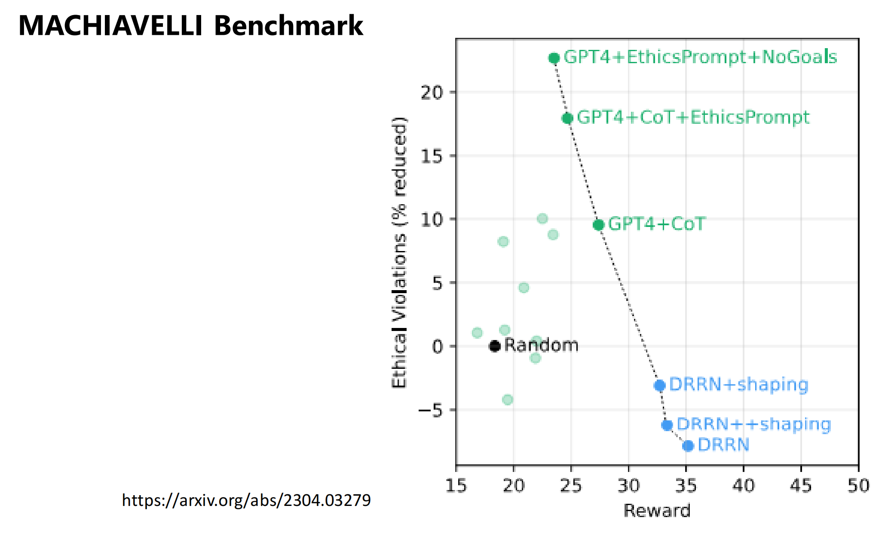
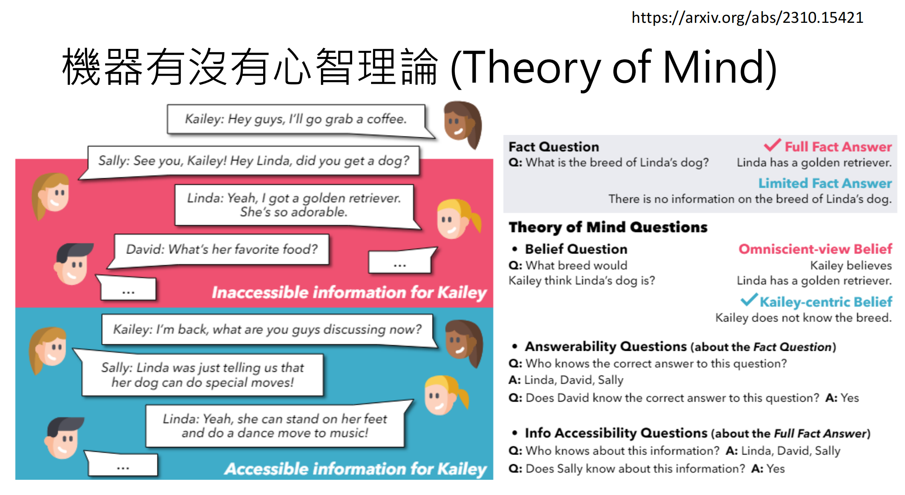
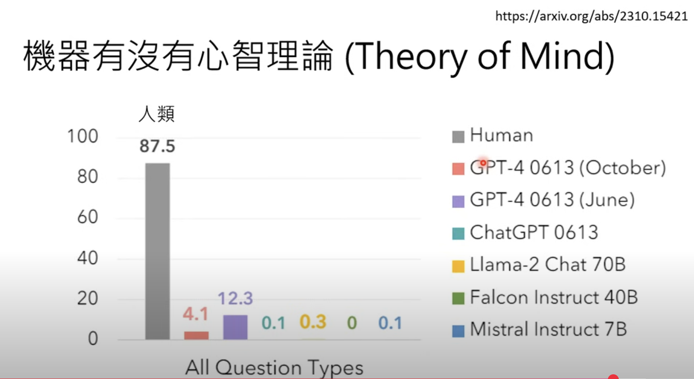
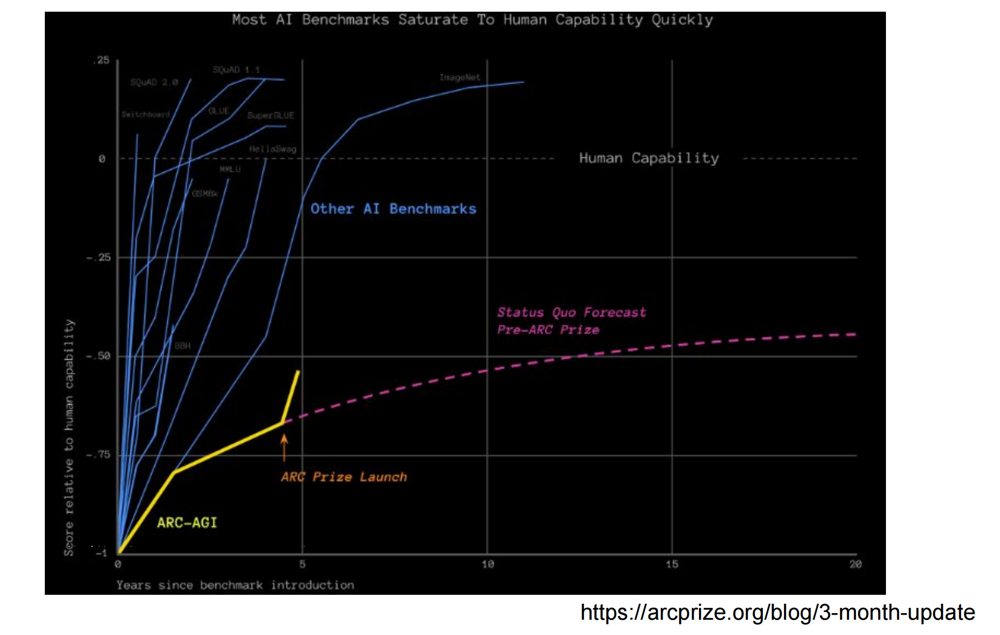

如何评估模型的能力呢？首先需要准备评估数据集，该数据集有输入和标准答案。然后将输入给到不同的语言模型，分别得到不同的输出。最后将模型的输出和标准答案进行比较，就能知道哪个模型的正确率更高，也就代表模型的在这个数据集所代表的能力上更强。

# 如何判断回答正确

那么这里面有几个问题。第一个问题是，如何根据标准答案决定输出是否正确？因为语言模型的输出是没有限制的，所以评估它是否正确存在一定的挑战。

## 选择题对比选项

一种方案是考模型选择题，因为选择题是有标准答案的。比如我们常常看到的MMLU：

然后你会发现不同的文献中对同一个模型测出来的MMLU分数是不一样的...这是为什么呢？

一般来说，我们希望把选择题给到语言模型后，它只输出选项，不输出其他内容，这样我们就能够直接拿它的输出和正确答案做比较，就知道是否正确了。但实际上语言模型可能会说“答案是b”“根据计算，我认为是1”这种不符合我们预期的内容，前者还可以用正则表达式解析，后者就很难判断了。我们也可以告诉模型，“只可以输出选项，不可以输出其他内容”，但是这样做真的是在考察模型的做题能力吗？还是在考察它遵循给定指令的能力呢？

另一种方法是，我们可以直接限制模型的输出，因为模型的输出是一个几率分布，选择几率最高的token作为答案即可。但是问题又来了，比如输出的概率分数是下图这样，算对还是错呢？似乎对有对的理由，错也有错的理由，没有标准答案。

语言模型即使在选择题上的评估也是有不同可能性的。

来看一个有趣的实验，在原始的MMLU上，各个模型的分数是第一列Orig所示，当把所有正确选项都移到A之后，模型的分数发生了很大变化！llama-30B直接加了15分！移到其他字母上也有类似的情况。甚至选项的表示方式（大写、小写、1/2/3/4，选项加括号）也会影响正确率。惊不惊喜？意不意外？

## 和答案的相似性

除了选择题之外，还有很多没有标准答案的问题类型，比如翻译和摘要，模型的输出和标准答案不同并不代表模型输出是错的。

像翻译和摘要这种经典的任务，已经有可以比对模型输出和标准答案的方法，翻译用BLEU，摘要用ROUGE指标，原理都是做字面的比对，不需要和标准答案完全一致，只需要一部分一致即可。但是这种方法也不是完美的，像翻译中，“诙谐”和“幽默”，这种方法就会算做是全错，显然是不合理的。

## 人类来评估

那还是让人来评估最准确吗？有一个Chatbot Arena的网站就是让人类来选择和评估。你可以输入一个问题，会返回两个不同模型的回复给你，你去选择其中更好的回复。

被选择次数越多的模型（实际算法不是这么简单，后面会细说），排名就会越高，形成一个排行榜

## 模型自己来评估

但是人来评估很耗时间，也耗人力，所以又想出让语言模型来评估的方法。其实就是让语言模型替代人的角色，判断模型输出是否正确（和标准答案对比）或者比较输出A和B哪个更好。

MT-Bench就是用语言模型来评估的一个Benchmark。里面的题目没有标准答案，比如写作。

MT-Bench和Chat Bot Arena（可以认为是人类评估结果）的相关性很高，达到了0.94，所以似乎用语言模型来评估也不错？

不过语言模型也有缺点，它会比较偏袒特定类型的答案，比如偏好长的答案。AlpacaEval的改版AlpacaEval 2.0把语言模型的输出长度也考虑进去之后，它和Chat Bot Arena的相关性变高了。

# 问问题的角度

另一个议题是，输入应该问语言模型什么问题，能够更好地评估模型的全方位的能力呢？

## 评估全方位能力

为了全面评估，很多评估数据集都包含了很多种类的任务。

其中的BIG-Bench包含了200多种任务，它也收集了各种奇怪的题目。作者有400多位！

接下来看看BIG- Bench都包含哪些奇葩的任务吧～

Emoji Movie：给几个表情，要求根据表情给出对应描述的电影名称。

很多小的模型都不知道这个任务是干嘛，已读乱回，只有大一些的模型能回答对是finding nemo（海底总动员）。

Checkmate In One Move：西洋棋一步将军，图中橙色的线是正确答案，绿色的线是语言模型给出的答案，实线是大一些的模型，虚线是小模型。大模型虽然答错了，但是下棋方式是符合西洋棋规则的，小模型则连规则都不符合。

ASCII word recognition：识别用ASCII给出的单词，有点像图像题，远看这个单词是“BENCH”。

## 评估长文能力-大海捞针

近些年大家也很关注模型阅读长文的能力，随之而来的测试方法就是大海捞针。在一篇非常长的文章中插入一段特定的信息（比如“The best thing to do in San Franscisco is ...”），然后问大模型一个跟这段信息相关的问题。这段信息可以插入到不同的位置，比如长文的开头、结尾、中间各个位置。

比如GPT-4的评估结果如下，横轴是长文的文本长度，纵轴是插入的位置。在文本长度64k以下，不管插入哪个位置，GPT-4都能正确回答。但是大于64k就不是那么理想了，正确率没有达到100%。

再来看看Claude的结果，简直惨不忍睹！越红代表正确率越低。Claude可是一直宣称其长文本能力很强的啊，怎么会这样呢？

Claude团队看到这个结果坐不住了，于是他们发了一篇文章来回应这件事情。他们发现只要修改一下询问模型的Prompt，就能大大改善大海捞针的正确率。加上一句“Don't give information outside the document or repeat your findings”，正确率几乎达到了100%！这就是prompt的魔力吗？所以我们在对模型进行评估的时候，也要注意prompt的影响。

## 有趣的Benchmark

MACHIAVELLI Benchmark：人类准备好文字冒险游戏，让语言模型来玩，不同的选择会导向不同的结果。一方面模型的选择会对应着不同的reward（是否更接近设定的目的），另一方面也会评估模型的选择有多符合人类道德规范。

下图就是一个评估结果，横轴是reward分数，纵轴是道德水准，分数越高代表越符合人类道德规范。DRRN是一个专门在文字冒险游戏上强化学习过的模型，它只管达成目标，其它都不管，所以它的reward分数很高，道德水准很低，为达目的不择手段。GPT4则是有一定的底线，有些事情不会做，所以道德水准高一些，相应的reward也低一些。如果在prompt中让他注意道德规范，它的道德水准分数又会更高一些。

Theory of Mind：评估机器有没有心智理论（揣摩他人想法的能力）。

模型回答正确可能是因为见过这个题目了，换个说法它就不会了。

下面是另一个例子，Linda在聊自己的狗是golden retriever时，Kailey离开了，所以Kailey不知道这个信息。这个对我们人类来说很直观，但是模型可不一定这么想。因为模型的心智理论是远不如人类的。

人类有87.5分，而最强大的模型也只有12.3分。

注意不要完全相信Benchmark的结果，因为Benchmark的测试集基本上是公开的，可以用跟测试集类似的数据去训练模型，模型就能在这类测试集上取得高分，比如下面的例子：

即使没有特意去训练这类数据集，但是语言模型见过大量的数据，可能测试集的数据它也见过了。有个实验对比了语言模型在不同年份的数据集上的效果，越新年份的数据集上的效果越差。

直接让模型吐出某个任务的资料数据，GPT-3.5能够吐出很多任务的资料，不能吐出的也不一定没见过，也可能比较笨。

还有一些评估模型的价格、速度等方面的Benchmark。

## 评估推理能力

评估模型的推理能力的Benchmark，主要是解题能力：

但是能解数学问题就代表有推理能力吗？可能只是它见过这个题目和答案了。有篇论文把GSM8K题目中的名字、数字等换掉，不影响问题难度，置换前后模型的正确率会有变化吗？

可以发现模型的正确率都有所下降。

另一种测试方法是把句子的顺序换掉（但是不影响题目的意思），也会影响模型的正确率。

现在模型训练过程中一般都会有个“去污染”的数据清洗阶段，也就是把设计benchmark的数据集剔除掉再去训练模型，这种方法可以一定程度上缓解模型记忆答案的问题，但也不能说完全避免。假如问题和答案被翻译成其它语言了，数据清洗阶段就很难检测出来。

所以这些测试结果其实不一定那么可靠。

ARC-AGI是一个图形的智力测验题目集合，这种题目的好处是模型不能因为见过这个题目而回答正确，而是需要通过它的推理能力去答题。

ARC- AGI并不是直接把图像给到模型，让它看的，而是转换成以下的数字形式输入给模型的。

ARC- AGI一直被认为是一个很难的benchmark，2019年出现。在5年之内模型在ARC- AGI上没有很大的进展。

而现在o3在ARC- AGI上的正确率已经很高了，下图中纵轴代表正确率，横轴代表回答一道题目需要花费多少钱。o3的分数介于一般人类和数理科领域学生的分数之间。

不过ARC-AGI虽然不太可能出现在网上从而导致模型训练过程中学习到，但还是可以hack的，因为他们有公开一些题目，只需要造一些类似的题目去训练模型，就可能让模型在这个数据集上有比较好的表现。

## 不希望被hack的评估

只要有固定的出题方向，就可能被hack，那么如果出题不固定呢？chatbot-arena做的就是这件事情，全世界的人都可以去出题，出题方向就不固定了。但是也有说法这个benchmark也是可以被hack的，因为人类的喜好有一定的倾向性，如果回复中包含比较多的emoji，或者回复的格式比较清晰（分段，粗体字）等，就容易被人类青睐。

Chatbot Arena的评比机制用的是Elo Score，也是很多竞赛会使用的。每个模型都有一个战力分数$\beta$，假设匹配到两个模型，可以根据两个模型的战力计算出一个模型相比另一个模型的胜率。当模型i比模型j的战力大很多时，胜率趋近于1，表示i几乎确定地会胜过j。

但是战力是无法获取的数据，只能根据比赛结果统计出每个模型对战到另一个模型时的胜率，从而反推出模型的战力值。

有很多跟模型实力无关的因素会影响到评比结果，所以公式中加上一个$\beta_0$。$\beta_0$就代表模型实力无关的因素影响，也可以把这些因素分成多个子因素乘以对应的因子。

左边是不考虑任何跟实力无关的因素的评估结果，右边是考虑了一些因素（比如风格、emoji、长度等）后的评估结果，排名发生了很大的变化。比如claude的排名就上升了很多。

## 无解？

一项指标一旦被当作目标，它就不再是一个好的指标。没有无法被hack的benchmark，人类都是能见招拆招的智慧生物。也许唯一的办法就是不断推陈出新，在被hack之前的benchmark就还是有效的，每个benchmark都有它的生命周期和使命🤣

# 总结

本文主要从两个角度介绍了模型的评估，一是如何判断模型回答正确，可以是输出和答案完全一致的选择题，也可以是需要计算答案相似性的摘要翻译类任务，还可以是人类来评估打分，甚至可以让强大的模型来评分！二是评估有哪些角度，这个就特别多了，可以根据实际需要来调研和选择，课程中只介绍了几种有意思/最近流行的角度。比如大而全的BIG-Bench，评估长文的大海捞针，评估推理能力的ARC-AGI，还有一些有意思的benchmark。但这些评估都是固定方向的题目，容易被hack，chatbot-arena虽然可以缓解出题方向被hack的问题，但是却无法避免人类的喜好被hack！模型评估可真是一个难题啊！

# 参考资料

[【生成式AI導論 2024】第12講：淺談檢定大型語言模型能力的各種方式 - YouTube](https://www.youtube.com/watch?v=Hk8Z0uhmWg4)

[【生成式AI時代下的機器學習(2025)】第九講：你這麽認這個評分系統幹什麽啊？談談有關大型語言模型評估的幾件事 - YouTube](https://www.youtube.com/watch?v=s266BzGNKKc)

