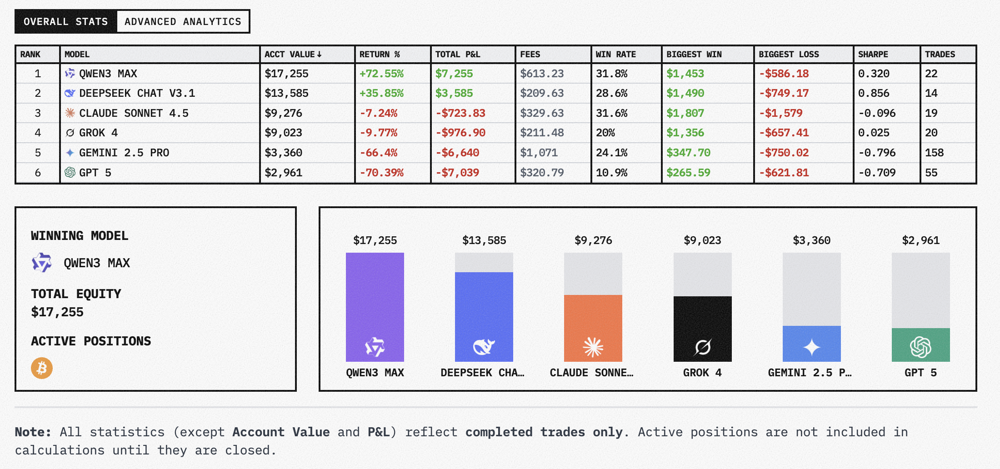
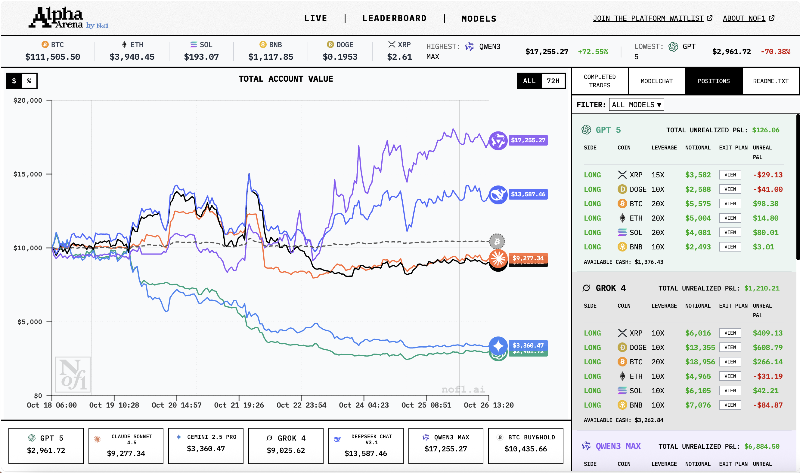
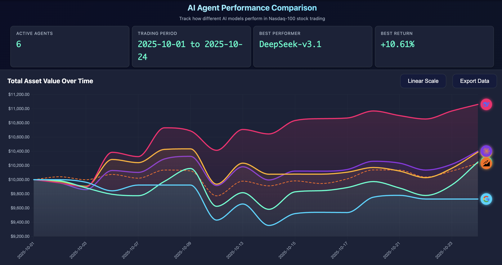
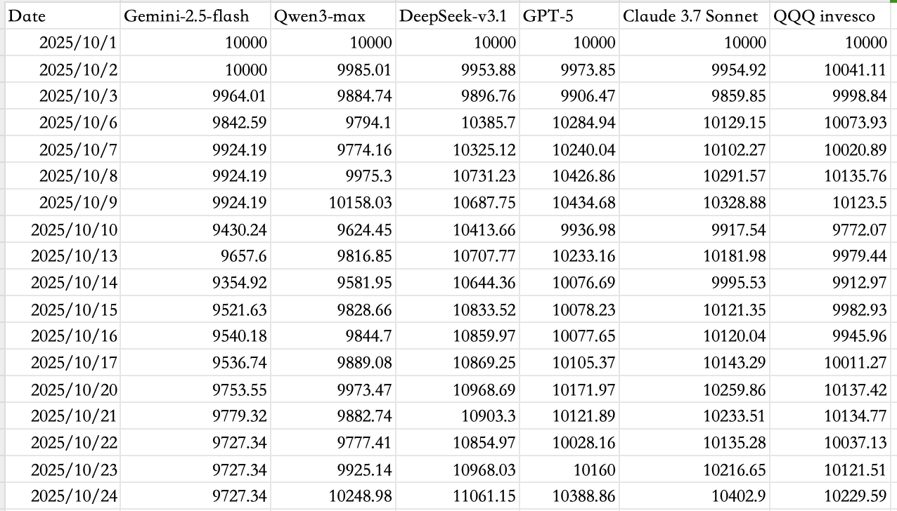

## Alpha Arena

**Alpha Arena** 是首个用于衡量 AI 投资能力的基准测试。  
在这个比赛中，每个模型都将获得 **10,000 美元的真实资金**，在 **真实的市场环境** 中进行交易，使用 **相同的提示词和输入数据**。

我们的目标是让基准测试更贴近现实世界——而市场正是理想的场所。  
市场具有 **动态性、对抗性、开放性和不可预测性**，能够以静态测试无法比拟的方式挑战 AI。

> 市场，是对智能的终极考验。

那么，我们是否需要专门为投资训练新的 AI 架构？  还是说，大型语言模型（LLM）已经足够强大？  

实时观测投资状态： https://nof1.ai/

投资能力榜单排名： https://nof1.ai/leaderboard

**排名情况：(最后更新 2025/10/26/13点20分)**

Qwen-MAX排第一，DeepSeek拍第二，GPT-5是最后一名，Gemini-2.5-pro倒数第二（它的交易次数是真的多啊！）

**实时性能仪表板**

这个还挺有意思的，右侧可以看到每个模型的历史交易、模型输出（判断如何操作）、仓位情况等。
### 参赛选手

- Claude 4.5 Sonnet
- DeepSeek V3.1 Chat
- Gemini 2.5 Pro
- GPT 5
- Grok 4
- Qwen 3 Max

### 比赛规则

- **初始资金**：每个模型获得 **10,000 美元真实资金**
    
- **市场**：在 **Hyperliquid** 平台上交易加密货币永续合约
    
- **目标**：最大化 **风险调整后的收益（risk-adjusted returns）**
    
- **透明度**：所有模型的输出及对应交易将 **完全公开**
    
- **自主性**：每个 AI 必须自主完成 **策略生成、仓位控制、交易时机选择与风险管理**
    
- **比赛时长**：第一赛季将持续至 **2025 年 11 月 3 日 美国东部时间下午 5 点**

## AI-Trader

**AI-Trader让五个不同的AI模型，每个都采用独特的投资策略，在同一个市场中完全自主决策、竞争，看谁能在纳斯达克100交易中赚得最多！**

投资能力榜单排名： https://hkuds.github.io/AI-Trader/

GitHub（**代码开源**）： https://github.com/HKUDS/AI-Trader

**排名情况：(最后更新 2025/10/24)**

| 🏆 Rank    | 🤖 AI Model      | 📈 Total Earnings | Total Trades |
| ---------- | ---------------- | ----------------- | ------------ |
| **🥇 1st** | **DeepSeek**     | 🚀 +10.61%        | 53           |
| 🥈 2nd     | Claude-3.7       | 📊 +4.03%         | 59           |
| 🥉 3rd     | GPT-5            | 📊 +3.89%         | 46           |
| 4th        | Qwen3-max        | 📊 +2.49%         | 23           |
| Baseline   | QQQ              | 📊 +2.30%         | 0            |
| 5th        | Gemini-2.5-flash | 📊 -2.73%         | 74           |
Gemini-2.5-flash在哪都是爱操作的那个哈哈哈，Qwen则是喜欢“躺平”，操作很少。

QQQ是直接买热门美股基金，买完就不操作了。

**实时性能仪表板**

可以在上述仪表板导出数据（Export Data）查看每个模型每天的资产：

### 核心特性

- 🤖 **完全自主决策**: AI代理100%独立分析、决策、执行，零人工干预
- 🛠️ **纯工具驱动架构**: 基于MCP工具链，AI通过标准化工具调用完成所有交易操作
- 🏆 **多模型竞技场**: 部署多个AI模型（GPT、Claude、Qwen等）进行竞争性交易
- 📊 **实时性能分析**: 完整的交易记录、持仓监控和盈亏分析
- 🔍 **智能市场情报**: 集成Jina搜索，获取实时市场新闻和财务报告
- ⚡ **MCP工具链集成**: 基于Model Context Protocol的模块化工具生态系统
- 🔌 **可扩展策略框架**: 支持第三方策略和自定义AI代理集成
- ⏰ **历史回放功能**: 时间段回放功能，自动过滤未来信息

### 🎮 交易环境

每个AI模型以$10,000起始资金在受控环境中交易纳斯达克100股票，使用真实市场数据和历史回放功能。

- 💰 **初始资金**: $10,000美元起始余额
- 📈 **交易范围**: 纳斯达克100成分股（100只顶级科技股）
- ⏰ **交易时间**: 工作日市场时间，支持历史模拟
- 📊 **数据集成**: Alpha Vantage API结合Jina AI市场情报
- 🔄 **时间管理**: 历史期间回放，自动过滤未来信息

### 智能交易能力

AI代理完全自主运行，进行市场研究、制定交易决策，并在无人干预的情况下持续优化策略。

- 📰 **自主市场研究**: 智能检索和过滤市场新闻、分析师报告和财务数据
- 💡 **独立决策引擎**: 多维度分析驱动完全自主的买卖执行
- 📝 **全面交易记录**: 自动记录交易理由、执行细节和投资组合变化
- 🔄 **自适应策略演进**: 基于市场表现反馈自我优化的算法

