接着上节课讲的深度思考模型（推理模型），本节课主要讲如何缩短模型不必要的思考过程。这节课比较短，只有24分钟（之前的课程一般是1小时多）。

首先抛出一个问题：推理（思考）越长，结果越好吗？

有很多实验针对这个问题做了研究，把大量问题输入给模型，得到推理过程和答案，接着把这些推理的长度和答案的正确率分别作为横轴、纵轴画出它们的关系图，发现两者是负相关的。推理长度越长，正确率越低。

但是这种实验其实并不严谨，实验只能证明推理长度和正确率有某种相关性，并不能证明推理长度变长，正确率会变低。因为可能他们背后还有一个因素，就是问题的难度，当问题越难，模型就更倾向于输出更长的推理长度；当问题越难，正确率也会越低。所以看似是推理长度和正确率之间负相关，但实际是他们都和问题难度是相关的。

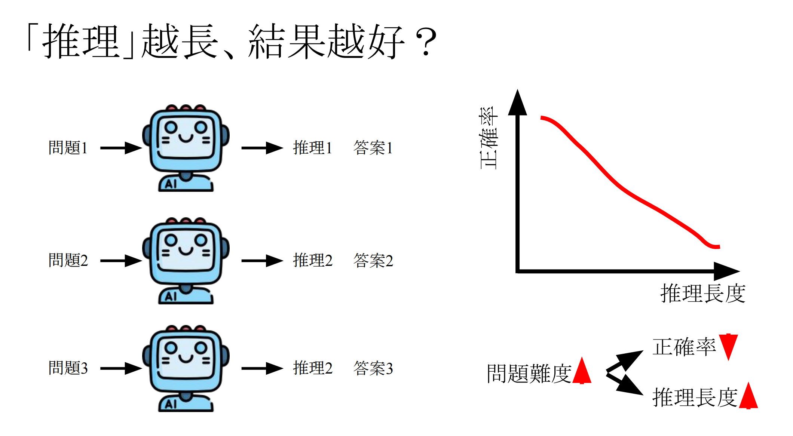

也有一些实验比较严谨的论文得到结论说，推理长度对于正确率不一定有帮助。

同一个问题输入给推理类模型5次，把长度最短的标为Group 1，次短的标为Group 2，以此类推。如图，论文尝试了多个思考模型，横轴是不同的Group，纵轴是不同Group的长度。可以发现Group 5的长度和Group 1的长度差距还蛮大的。

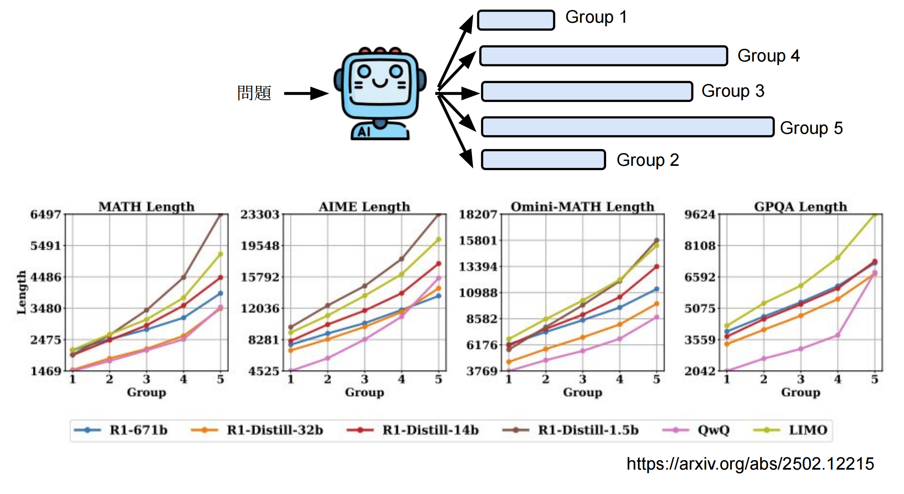

下图的纵轴是正确率，发现越长的答案并不是正确率越高。所以这么长的推理过程其实是不必要的。

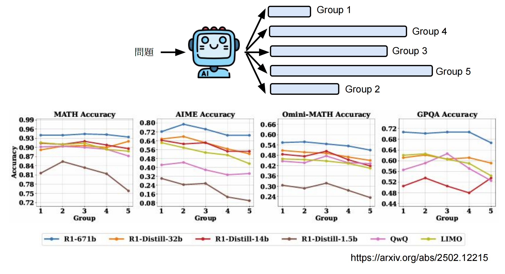

最好的工程师，不是把事情做到完美，而是在有限资源下，把事情做到最好。人工智慧也是一样。

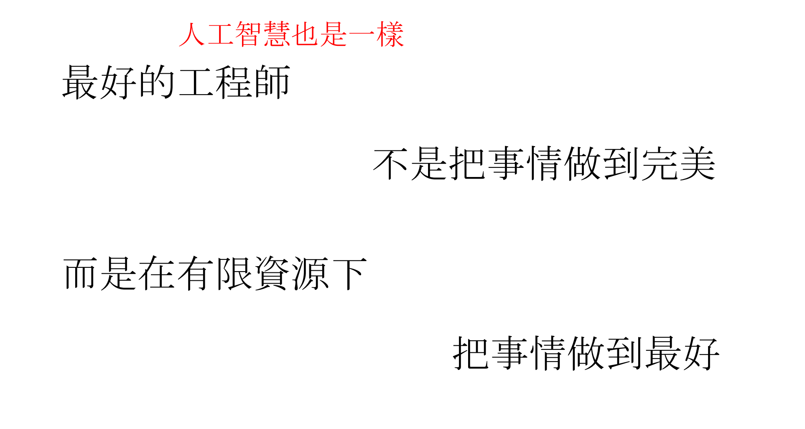

那么如何避免模型“想太多”呢？针对上节课的4种教模型思考的方法，这里分别给出对应的避免“想太多”的方法。

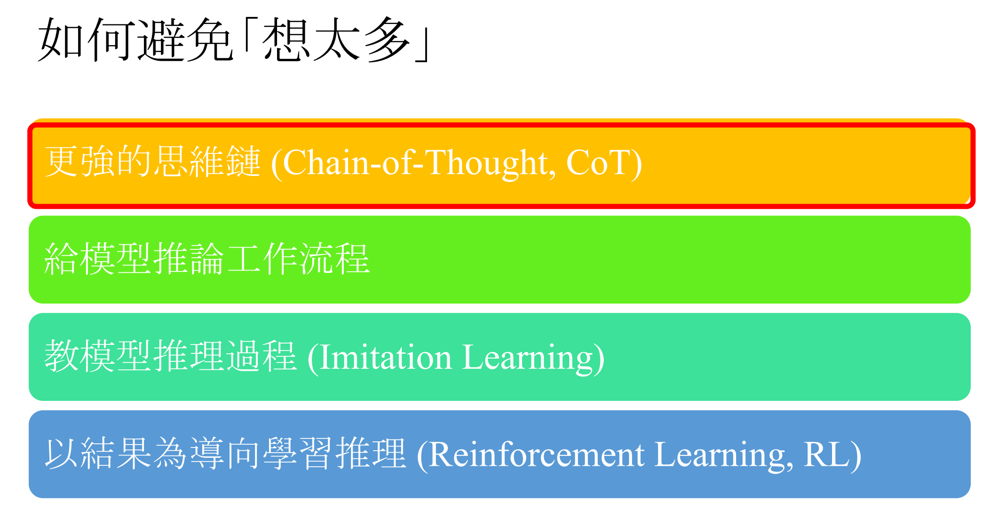

第一个是CoT方法，教模型做思考。Chain of Draft这篇论文则修改了CoT的prompt，教它不要输出太长。在不太影响正确率的情况下，大大降低了推理长度。不过论文是在Claude 3.5 Sonnet上实验的。

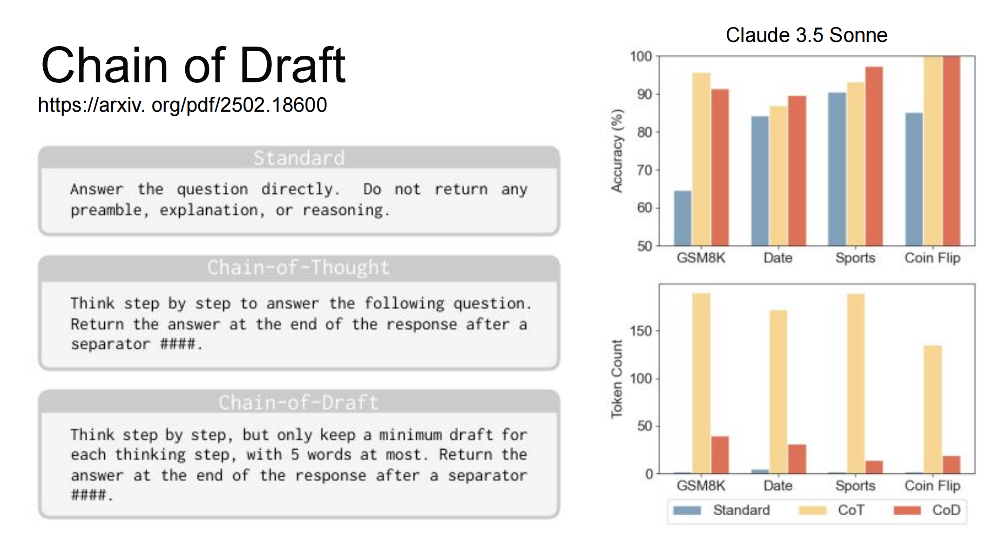

第二个给模型推理工作流程，可以直接人为控制，比如让模型采样少一些，beam search时候的N小一些，产生树状结构的时候树小棵一点，等等。就能控制模型的推理长度。

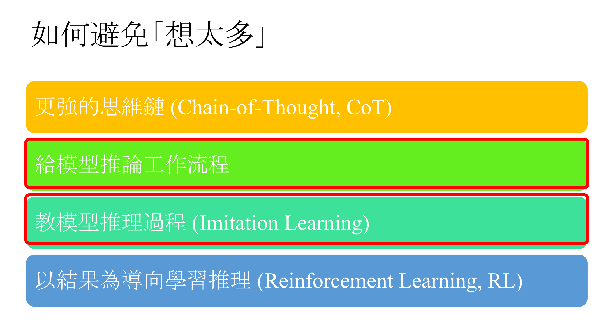

第三个是Imitation Learning，模型学习教师模型的输出内容。因为教师模型每次采样的输出长度都不一样，可以多次采样，选出其中答案正确但是推理长度最短的那条数据，让学生模型去学，这样就能减少模型的推理长度了。

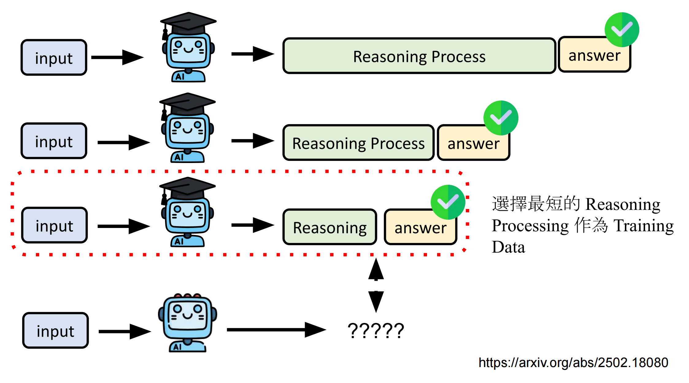

还有一个方法叫From Explicit CoT to Implicit CoT，把显式的推理过程变成隐式的。分多阶段训练，一开始是（问题，完整的计算过程，答案），然后慢慢把完整的计算过程中的部分token拿掉去训练模型，最后是丢掉计算过程，直接产生答案。最后模型学会了不输出思考过程。论文在比较简单的任务（数学乘法、GSM8K）上训练，发现有推理过程和没有推理过程的效果差不多。

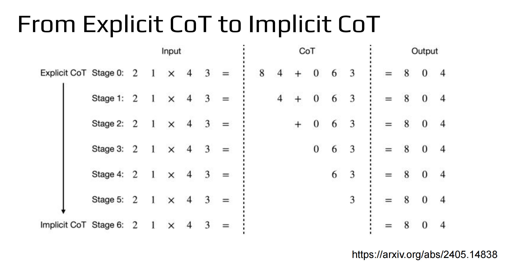

最后是RL方法教模型学会推理，这种方法训练出来的模型输出的思考过程通常都很长。

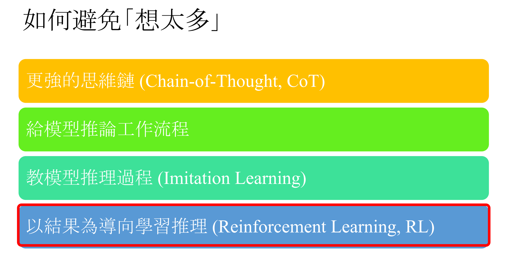

比如DeepSeek-R1，随着训练的进行，模型的回答长度越来越长。

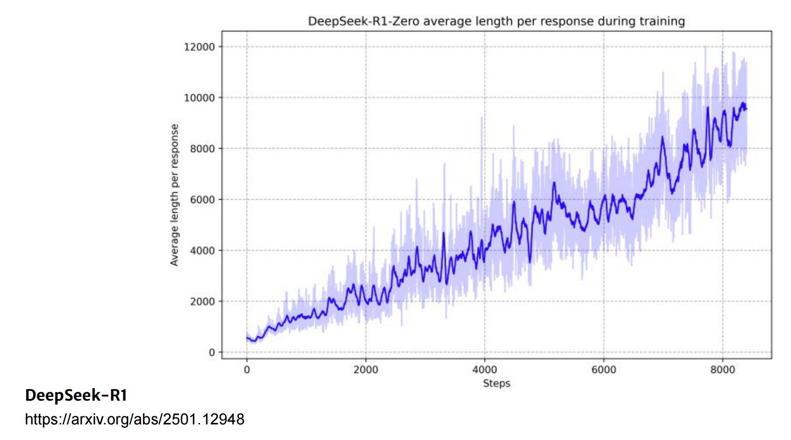

为什么会这样呢？在训练的过程中，没有人告诉模型要在意推理过程的长度，只要答案正确就可以，所以模型可能会为了正确进行反复的验证、多种方法的尝试等。那么一个很直觉的解法就是把长度限制加到RL中，当超过某个长度的时候就给惩罚。但是大部分论文都不会这么做，因为这个方法需要设置一个阈值，不适用于所有类型的问题。

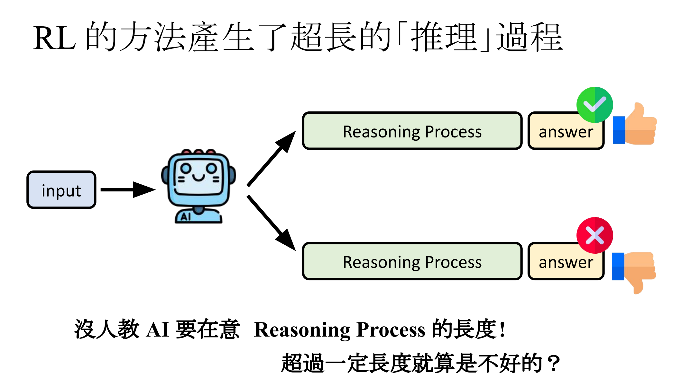

大部分论文都采取了另一种方法，根据问题的难度设置不同的长度控制。如何知道问题的难度呢？把问题输入给语言模型多次，把答对的情况收集起来，看看模型答对平均需要多少的长度，比平均长度长就是不好的，比平均长度短就是好的。这样RL训练模型就能避免模型产生冗长的推理过程。

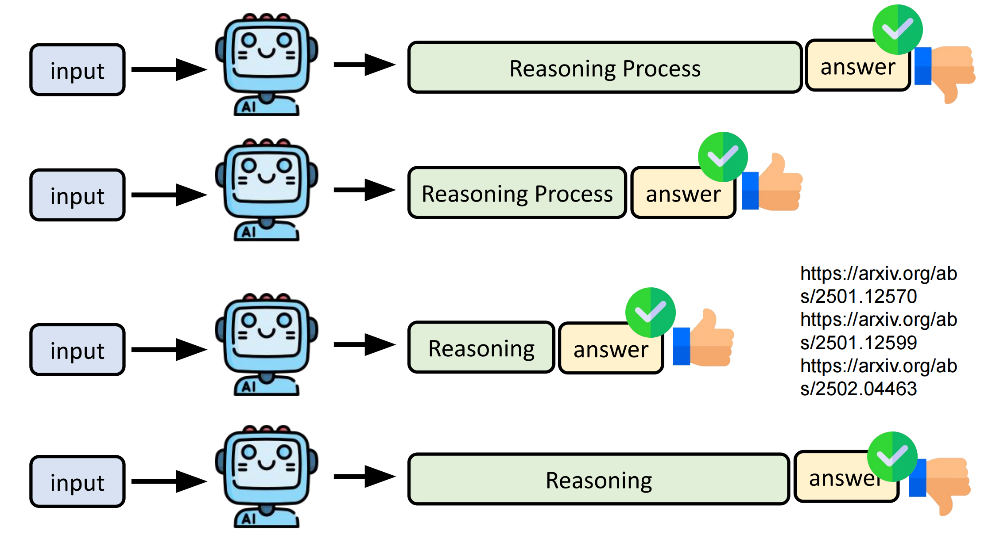

还可以教模型控制推理的长度，在问题后面加一句“推理长度设定为n”，reward设置为（正确率-目标和实际推理长度差异），如果差异很大的话，模型会得到负面的reward。

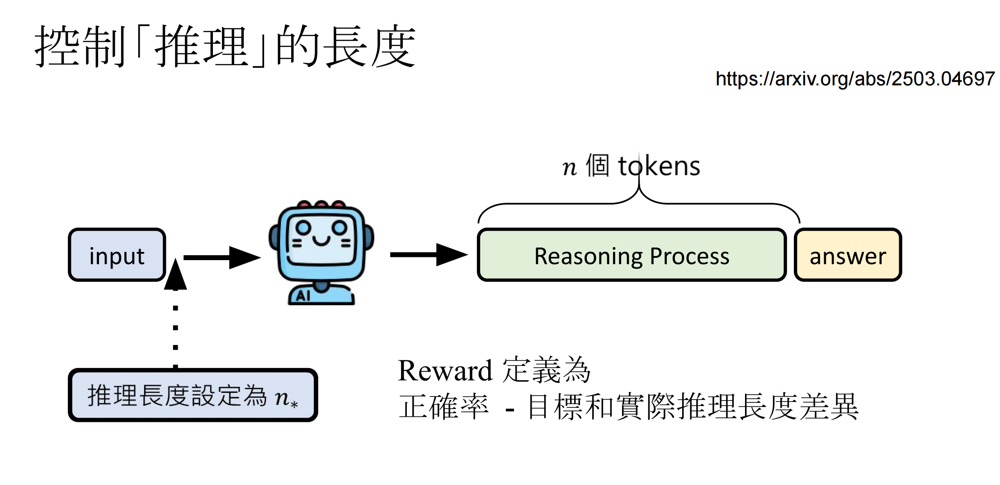

数学问题上训练，在in-domain的测试集测试，模型输出的长度和prompt中指定的长度的差异在2%-6%区间内，但是在out-of-domain的测试集上控制长度的效果没那么好，但也是有一定控制力度的。

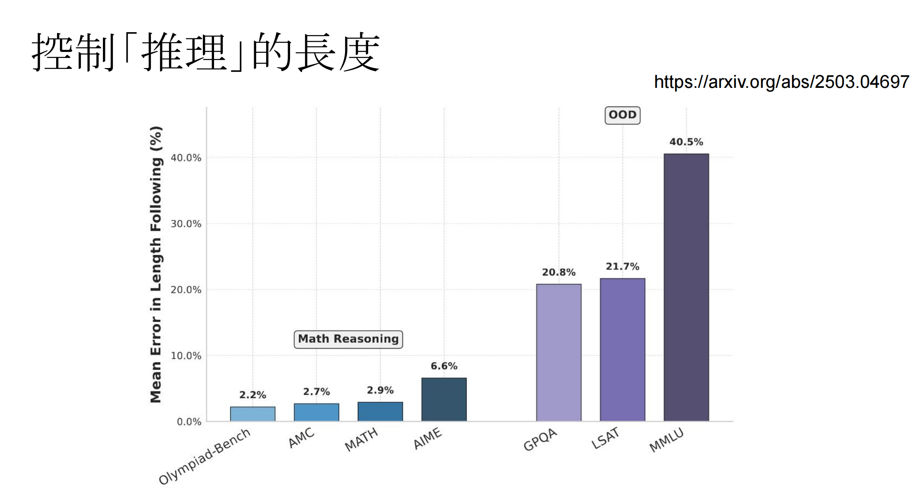

那么控制长度后会不会影响到模型的推理能力呢？图中每个点代表不同的模型，横轴是所用的长度，纵轴是正确率。一些不能控制长度的模型（比如DeepSeek-R1-1.5B，Agentica-24K等），输出长度较长，正确率也很高。

S1也控制了输出的长度，但是控制的方法比较粗暴，超过目标长度的时候就强行截断，没有超过目标长度就强行让它继续输出（比如加一个"wait"）。这个方法在输出比较短的时候正确率很低。

如果用RL教模型控制输出长度，L1-Exact是说必须要输出设定的目标长度，长了短了都不行，L1-Max是说比目标值长了不行但是短了可以。这两个方法在输出token比较长的情况下，达到的效果和不控制长度的模型差不多，输出token比较短的情况下，比S1要好。说明是可以训练一个控制输出思考长度的推理模型的。

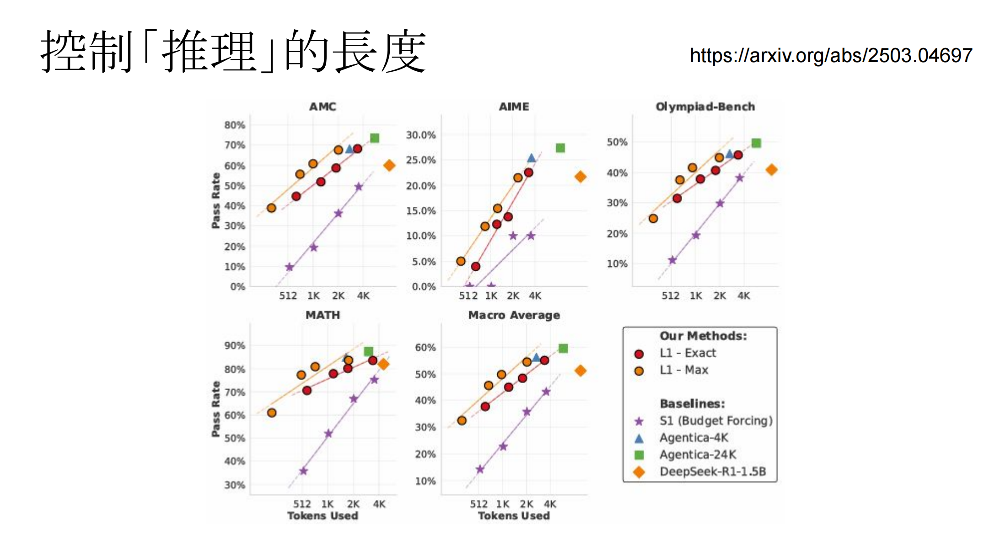

## 参考资料

[【生成式AI時代下的機器學習(2025)】第八講：大型語言模型的推理過程不用太長、夠用就好 - YouTube](https://www.youtube.com/watch?v=ip3XnTpcxoA)

