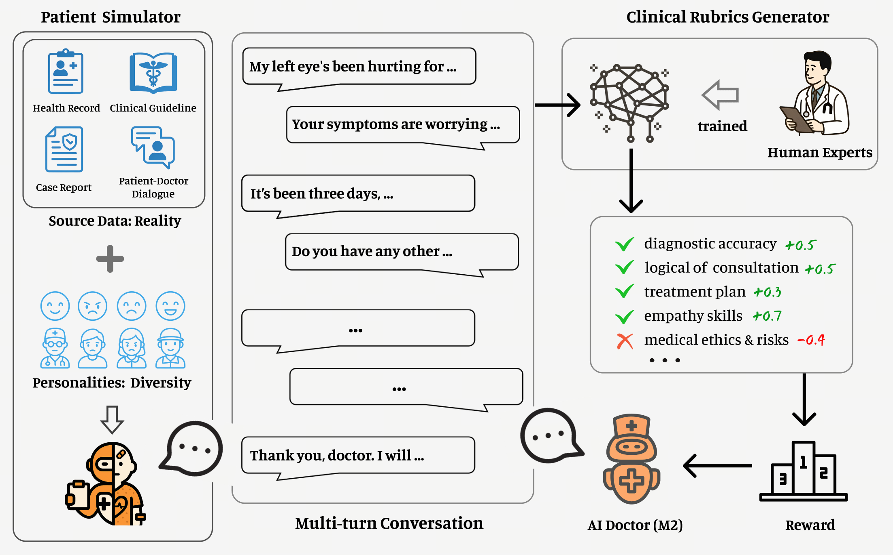

博客地址：[百川大模型-汇聚世界知识 创作妙笔生花-百川智能](https://www.baichuan-ai.com/blog/baichuan-M2)

模型地址：[baichuan-inc/Baichuan-M2-32B · Hugging Face](https://huggingface.co/baichuan-inc/Baichuan-M2-32B)

效果：Baichuan-M2 是迄今为止世界上最好的开源医疗模型。它超越了所有开源模型，包括 gpt-oss-120b，以及 HealthBench Benchmark 上的许多尖端闭源模型。它是医疗能力上最接近 GPT-5 的开源模型。更多医疗上的效果、案例可以看原博客。

启发：强大的验证器对于将模型能力与现实世界联系起来至关重要，而端到端的强化学习方法从根本上增强了模型的医学推理能力。

标题：从静态问答到虚拟临床：Baichuan-M2 如何用“大规模验证器”重塑医疗大模型

### 1. 引言：为什么医疗大模型需要一次范式升级？

过去两年，RLVR（Reinforcement Learning with Verifiable Rewards）在数学、代码等高度结构化任务上屡创佳绩，核心在于“可验证奖励”——答案要么对，要么错。  

然而临床场景截然不同：  
- 信息永远不完整（患者主诉、检验、影像、社会因素交织）；  
- 决策是多回合、带伦理权衡的动态过程；  
- “对”与“错”并非二元，而是一条连续谱，需要资深医生的经验给出“加权评分”。

Baichuan-M2 的贡献，正是把 RLVR 的“可验证”升级为“可临床验证”：用一套大规模、高保真、可交互的虚拟临床环境取代传统题库，让模型在“数字规培”中学会像医生一样思考。

### 2. 系统总览：一条“数据-模拟-评估”闭环

这条闭环由三大组件构成：

#### 2.1 Patient Simulator：用生成式病历做“标准化病人”  
- **数据来源**：整合去识别化的病历、临床指南、病例报告和真实世界的医患对话记录。 
- **模型训练​**​：基于Qwen2.5-72B-Instruct模型，利用合成数据训练低秩适配器（LoRA），生成动态响应的高仿真病人模拟器。
- **能力**：可生成不同医疗状况、社会背景和互动模式的“数字病人”，超越僵化的单轮问答，生成充满不确定性且与现实世界情况非常相似的连续交互场景。

#### 2.2 Clinical Rubrics Generator：把“专家经验”变成可微奖励  
- **设计思想**：设计“多维加权评分清单”，与资深医生的临床思维相一致  。
- **维度示例**：  
  - 诊断准确度
  - 咨询的逻辑连贯性
  - 治疗计划的适当性
  - 沟通和同理心技能
  - 医学道德
- **技术细节**：  
  - 对模型在多轮交互中的整体性能进行连续和动态的定量评估。

#### 2.3 多阶段强化学习框架  
- 将复杂的强化学习任务拆分为可控、分层的阶段。每一个阶段都围绕特定能力目标、数据来源和评估机制进行设计，逐步引导模型能力的提升。  
- 优化器：改进版 GRPO（Group Relative Policy Optimization），通过动态长度奖励、loss 归一化等 trick 解决医疗答案长度差异大、任务难度不均的问题。

### 3. 关键技术拆解与扩展思考

#### 3.1 从 KL 惩罚到动态长度奖励：稳定高效的强化学习 
Baichuan-M2 采用GRPO的改进版本：    
- **消除KL散度**：移除KL损失，以避免减缓奖励增长，并减少参考模型的计算开销。
- **Clip-higher**：提高重要性采样的上限阈值，同时保持下限不变，缓解熵过早收敛，鼓励策略探索。
- **损失归一化**：为了解决不同数据源中答案长度差异较大的问题，在求和之前，将每个标记级别的损失除以一个固定的最大长度，以消除长度偏差。
- **优势归一化**：在优势计算中去除标准差归一化，以减少由任务间固有难度差异引起的偏差，从而显著提高多任务训练中的更新稳定性。
- **动态长度奖励**：当一个组中的大多数样本得分高于阈值时，为高分样本分配与响应长度成反比的额外奖励，鼓励更短、高质量的答案，并避免固定长度奖励的探索约束。

#### 3.2 异步 Rollout + Reward Pipeline：解决“专家评分”耗时瓶颈  
医生级别的 Rubric 评估需调用复杂的验证者系统，显着增加了奖励评分所需的时间。团队在 verl 之上开发了一个完全异步的 rollout + 奖励Pipeline，有效消除了训练过程中因等待评分结果而造成的空闲时间。 

#### 3.3 Mid-Training：防止“医学专精”导致通用能力坍塌  
通用大模型在医疗应用中面临三大限制：医学知识不足、权威性不足、时效滞后，直接后训练往往会导致两难境地：要么知识吸收不足，要么幻觉问题恶化。
**构建高质量的医学语料库**
- 精心挑选了高度权威的公共医学教材、临床专著、药学知识库，以及最新出版的临床指南和真实病例报告，构建了专业的医学语料库。
- 数据合成，加强两个维度：
	- 结构化表达：基于知识保真原则，对原医文本进行结构性改写，提高表达的逻辑性和流畅性，同时严格控制幻觉的引入。
	- 增强深度推理：在知识密集型段落和关键结论中，自适应地插入深度思考笔记，包括知识关联分析、批判性反思、论点验证和案例推演等认知过程，使模型能够“像医生一样思考”。
**数据配比**
- 高质医学 : 通用 : 数学 = 2 : 2 : 1；  
**训练方法**
- 约束方法：用原模型做参考，KL 控制输出分布，避免灾难遗忘。  
- 医疗数据：采取双任务范式，在常规文本上进行续写训练，同时在插入的笔记文本上进行ICL笔记推理。
- 通用与数学：使用通用模型作为参考模型，应用KL散度来约束输出分布。

#### 3.4 4-bit/8-bit 量化：把模型塞进 RTX 4090  
采用 PTQ 量化策略：  
  - 权重 4-bit，KV Cache 8-bit；  
  - 可以部署在单个 RTX4090 GPU 上。
结合 Eagle-3 MTP（Multi-Token Prediction）投机解码，单用户吞吐提升 58.5%。  

### 4. 结语

Baichuan-M2 的最大启示，是把“大模型刷题”升级为“大模型规培”：  
- 用 Patient Simulator 代替题库，让模型体验“真实患者”的不确定性；  
- 用 Clinical Rubrics 代替对错标签，把专家经验量化为可微奖励；  
- 用多阶段 RL + 量化部署，让“医院级 AI”飞入寻常诊所。

