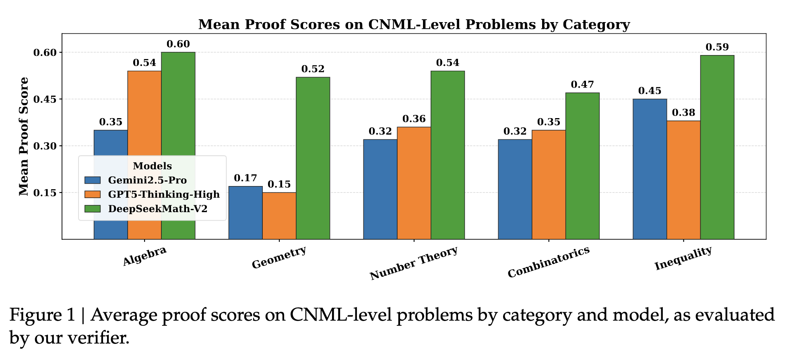
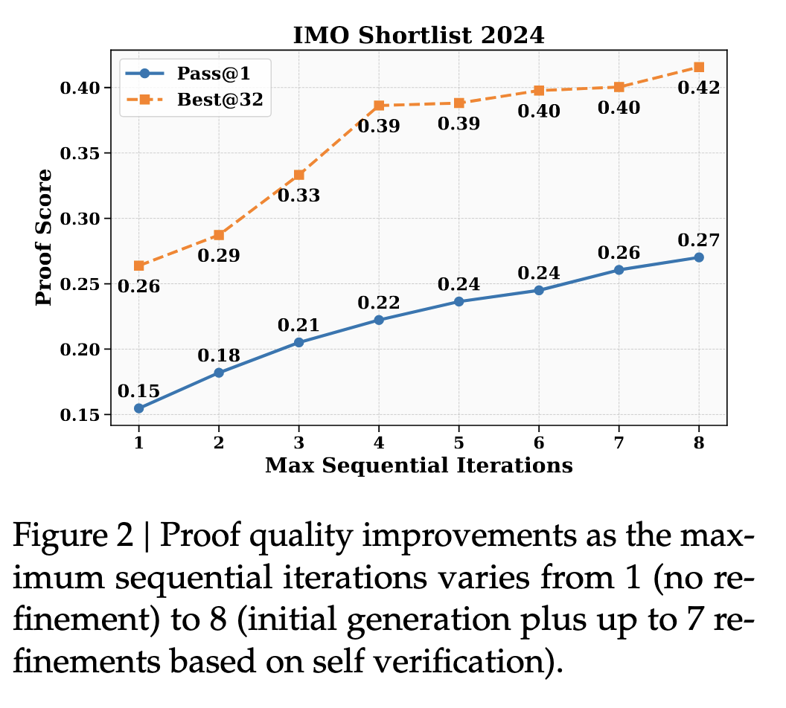
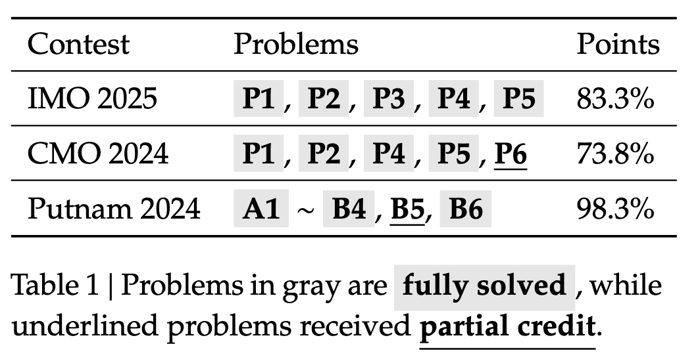

## 论文基本信息

标题：DeepSeekMath-V2: Towards Self-Verifiable Mathematical Reasoning

作者：DeepSeek-AI

链接：

代码：https://github.com/deepseek-ai/DeepSeek-Math-V2

框架图：

## 这篇论文在解决什么问题？

当前数学推理模型（如 R1）主要使用一种训练方式：

**最终答案奖励（final-answer reward）**

- 答案对 → +1
    
- 答案错 → 0
    

这种方案能快速提升 AIME、HMMT 这种“求数值答案”的任务，但**对“证明题”完全不够**：

### ❌ 两大硬伤

1. **正确答案 ≠ 正确推理**
    
    - 模型可能瞎蒙，逻辑错但答案碰巧对。
        
2. **证明题没“最终答案”可奖励**
    
    - IMO/CMO/Putnam 这种考试要求的是完整证明，不是数字的最终答案。
        

因此当前模型存在：

- 证明经常不严谨
    
- 验证他人证明时经常“误判”
    
- 自己写的证明自己看不出错
    

👉 _“推理模型会幻觉逻辑正确性”_ 成了数学 AI 的核心瓶颈。

## 关键思想：让模型 **学会验证自己** 的证明

论文提出的路线非常明确：

---

# **核心目标：让模型具备自我验证 (self-verification) 能力**

而不是仅依赖最终答案。

它的核心技术链条如下：

---

# ⭐ 方法核心：三重系统

## 1. Proof Verifier —— 训练一个能判断证明对不对的模型

输入：

- 问题 X
    
- 候选证明 Y
    

输出：

- 问题总结（如果有的话）
    
- 最终评分（0 / 0.5 / 1）（1 表示完整严谨且所有逻辑步骤明确的证明；0.5 表示证明逻辑合理但存在细微错误或细节遗漏；0表示包含致命逻辑错误或关键缺口的根本缺陷证明）
    

### Verifier 的训练方法

问题集：来自Art of Problem Solving (AoPS)比赛的17,503道题目。

候选证明：使用DeepSeek-V3.2-Exp-Thinking的一个变体生成了候选证明。由于该模型未针对定理证明进行优化，输出简洁但易出错，因为通过prompt让其通过多轮迭代完善证明，以提升全面性和严谨性。

专家打分：随机抽样了不同问题类型的证明，让专家按照上述标准对证明打分。

基于DeepSeek-V3.2-Exp-SFT的一个模型版本训练，使用 RL + 人类评分作为奖赏：

- **格式奖励**（判定是否按规范写了评分和问题总结）
    
- **得分奖励**（预测得分是否和专家一致，$1 − |s_i' − s_i|$）
    

结果：  一个能读懂证明、指出问题、给评分的模型。

---

## 2. Meta-Verifier —— 用第二个模型检查 Verifier 会不会瞎评价

Verifier 可能会：

- 胡编“错误点”
    
- 分析不到位但评分运气对上了
    

因此引入 **Meta-Verification**：

**Meta-Verifier 的任务：评估 Verifier 是否评价合理**，包括评估问题分析是否正确，以及这些问题是否能合理地推测得到评分。

也就是让模型学会：

👉 “检查别人写的 proof evaluation 是否合理”。

这就建立了一个 **两层验证链条**：

`Proof → Verifier → Meta-Verifier`

并将 Meta-Verifier 的评分加入 Verifier 奖励，使 Verifier 更可靠。

Meta-Verifier的训练方法和Verifier的训练方法一样，首先需要专家对Verifier的评价打分，然后训练时使用格式奖励以及与专家打分的一致性作为奖赏。

---

## 3. Proof Generator —— 生成证明，并学会自我评估

有了可靠的 Verifier作为奖励模型，就能训练一个更强的生成器了。

当生成器一次无法生成完全正确的证明时，通过迭代验证和完善可以提升结果。比如用外部Verifier分析生成器的证明，然后提示生成器解决Verifier提到的问题。

在这个过程中发现了一个关键的限制：当被要求同时生成证明和分析自己的证明时，生成器往往声称自己的证明是正确的，即使外部Verifier很容易发现问题。也就是说，虽然生成器可以基于外部反馈细化证明，但它无法像专用验证者那样严谨地评估自身工作。

因为我们可以赋予生成器真正的验证能力：

- 生成证明 Y
    
- 模型自己做分析self-analysis Z（按 verifier 的 rubric）
    
- Verifier对证明Y评分，meta-verification对self-analysis Z评分
    
- 最终奖励 = 格式奖励 * （证明的正确性奖励 + 自我评估的质量奖励（加权，DeepSeek用的权重是0.76和0.24））
    

这让模型产生了一个强烈动机：

> 承认错误比谎称正确奖励更高。
> 
> 最高的回报来自于正确证明并准确识别其严谨性。
> 
> 在提交最终证明前，先找到自己证明中的问题并修复 。
>

**这是 DeepSeekMath-V2 的突破点**：

它第一次把“自我审查机制”变成了奖励目标。

---

## 一个关键协同循环：Generation ↔ Verification

随着生成器变强，会生成更难判定的证明，Verifier 开始看不出问题。这样的数据可以用来训练加强Verifier，因此需要标注证明的正确性。但随着问题变得更难、错误变得更细微，人工标注会很耗时。

于是论文提出：**自动化标注 pipeline**

将多个 verification + 多个 meta-verification 组合：

1. 对于每个证明，生成 n 个验证分析（更有可能找到问题）
    
2. 对所有“指出错误”的分析做 m 次 meta-verification，如果大多数meta-verification都认可的话就说明这个分析是有效的
    
3. 检查最低分的那些分析，如果 至少k 个 分析 都是有效的 → 批准 label，给这个证明打上最低分
    
4. 如果所有的分析都没有检测出证明的问题，那么这个证明就是1分。否则丢弃或人工检查。
    

在最后2个训练迭代中，完全用了自动标注，无需人类。也做了质量校验，表明自动标注和专家标注的一致性很高。

结果：

- 数据越来越难
    
- Verifier 变得越来越强
    

形成一个循环：

`Verifier → 训练 Generator → 生成更难证明 → 改善 Verifier`

使用 **GRPO（Group Relative Policy Optimization）** 作为强化学习方法，按照上面所描述的方式，**迭代地优化证明验证能力和证明生成能力**。

- 在每一轮迭代中，首先优化**证明验证器（verifier）**。

- 然后，证明生成器（generator）从这个验证器的 checkpoint 初始化（意味着生成器一开始就带着“验证能力”），并进一步进行**证明生成方面的优化**。

- 从第二轮迭代开始，证明验证器不再仅仅从前一轮的验证器初始化，而是从一个 **融合了上一轮验证能力和生成能力** 的 checkpoint 初始化；这个 checkpoint 是通过 **rejection fine-tuning** 得到的。也就是说，新的 Verifier = 用高质量的 {Verifier样本 + Generator样本} 训练出来的。

---

# 实验结果：为什么能全球领先？

## 1. 一次生成（One-shot）

在同类数学证明 LLM 中：

- 全部类别（代数、几何数论、组合、凸性）均胜过 GPT-5 Thinking High、Gemini 2.5 Pro

## 2. 自我验证 + 迭代 Refinement

最多迭代 8 次，结果：

- Pass@1 和 Best@32 都持续上升
    
- 自己选择的“最佳证明”通常确实是最好的（说明评价能力学得很好）

## 3. 高计算量搜索（High Compute）

最终亮点（重磅）：

|竞赛|成绩|
|---|---|
|**IMO 2025**|5/6 完全解 + 金牌水平|
|**CMO 2024**|4 完全解 + 1 部分解|
|**Putnam 2024**|118/120（历史人类最高为 90）|

以及 ProofBench 测试上总体领先。

---

# 为什么这个方法会成功？（Insight）

深度原因有三点：

### 核心 Insight 1：

**数学不需要“知道答案”，但需要“知道证明哪里错了”。**  
这就是验证比生成更基础的事实。

### 核心 Insight 2：

**“找自己错误 → 修复”是学习数学最有效方式**  
人类数学家就是这样提高的  
DeepSeekMath-V2 把这个动力加入 RL 奖励，这正好利用 LLM 的能力。

### 核心 Insight 3：

**Verifier 能扩展，答案奖励不能扩展**  
评估正确性比生成正确性容易，所以验证器能随算力线性变强，并带动生成器提升。

# 这篇论文真正的突破

一句话总结：🚀 DeepSeekMath-V2 是第一套让模型真正“会检查自己证明”的大规模系统。

- 不依赖最终答案
    
- 不依赖外部 reference proofs
    
- 学习了“数学证明的审查标准”
    
- 能自我发现错误并修正
    
- 能自动构建更难验证的数据来继续提升验证器
    

这不仅仅是一个数学模型，而是：**一种可扩展的自我验证式推理训练框架**

未来可推广到：

- 安全推理
    
- 科研推理
    
- 多步逻辑系统
    
- NLP reasoning evaluation
    
- 自动 theorem proving（与 Lean/Isabelle 协同）

## 主要收获

## 参考资料
