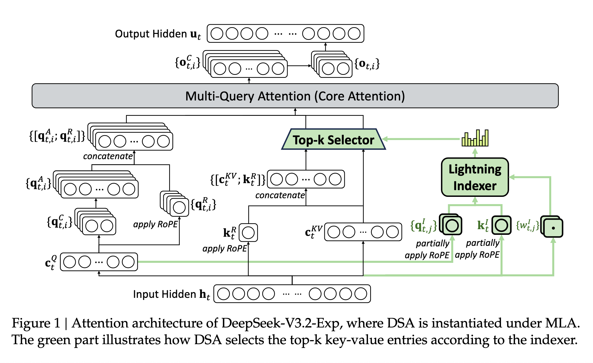
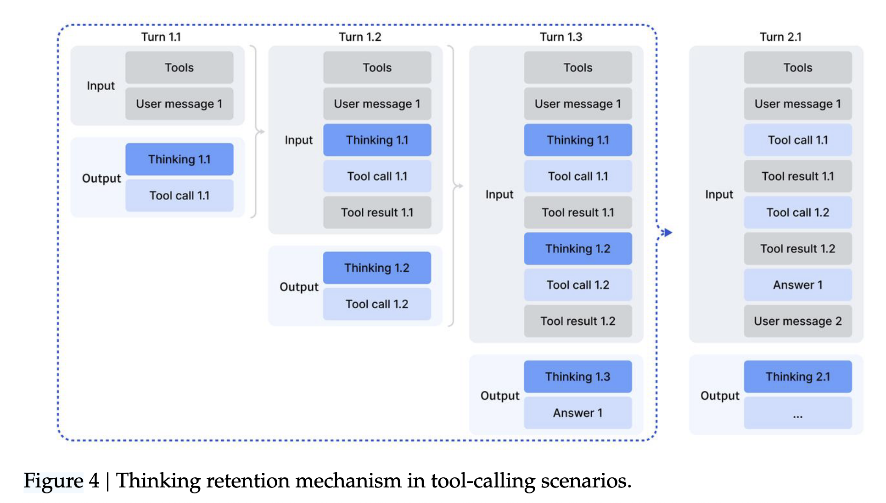
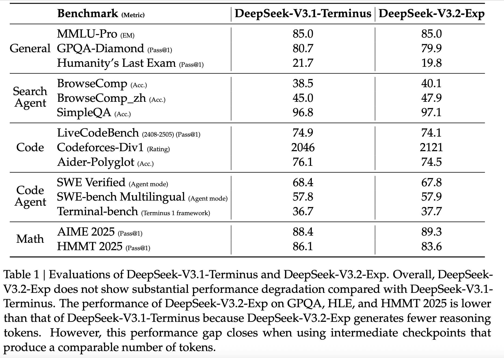
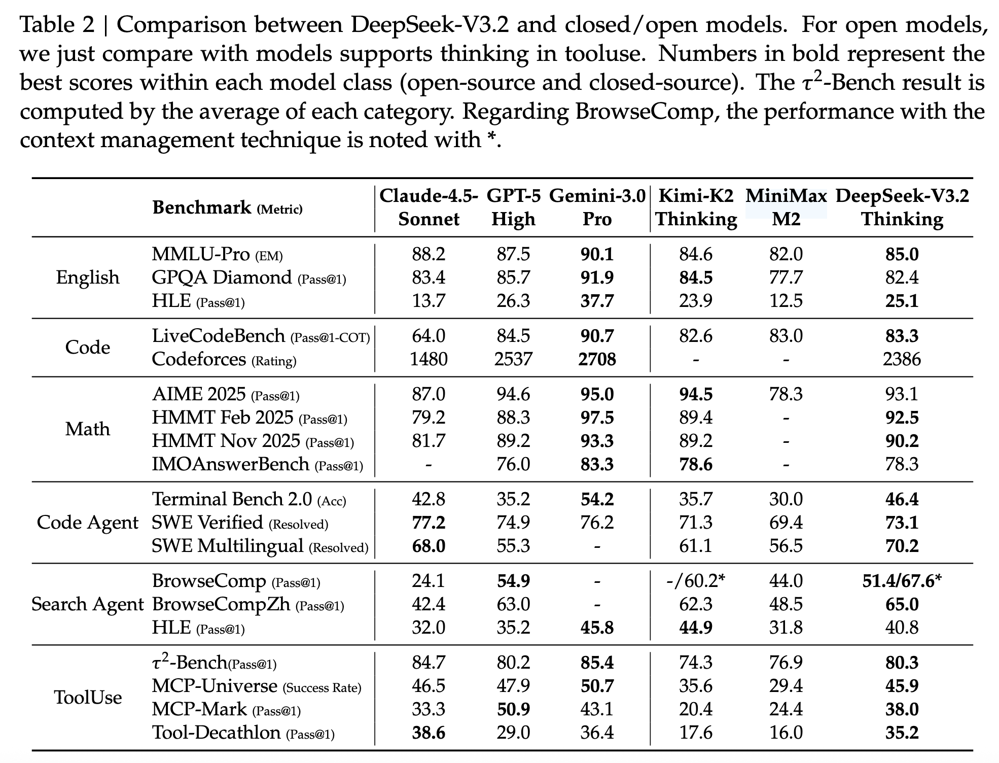
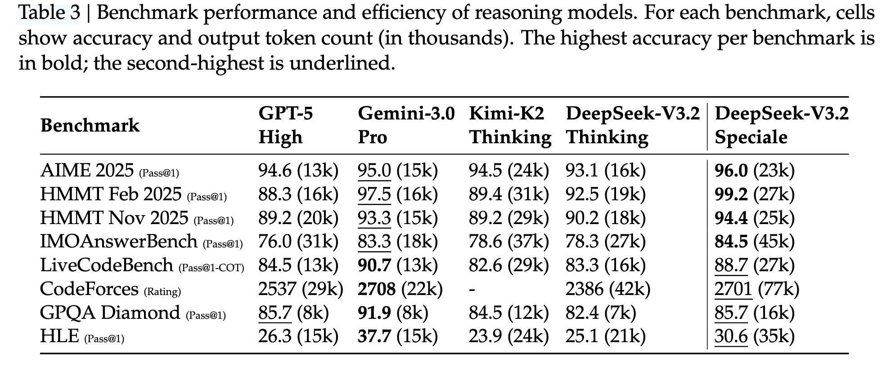
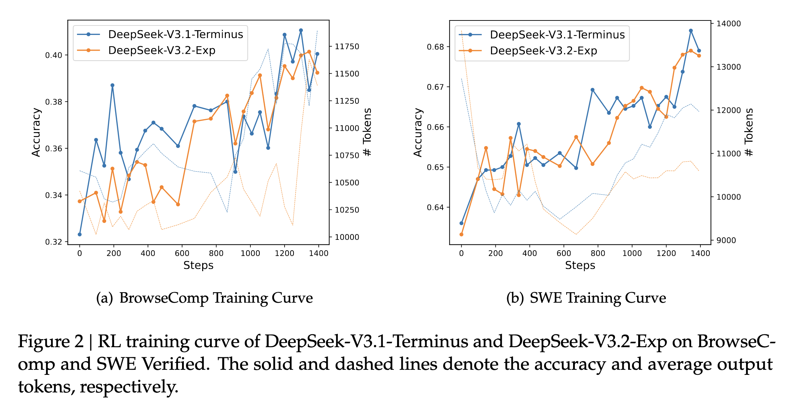
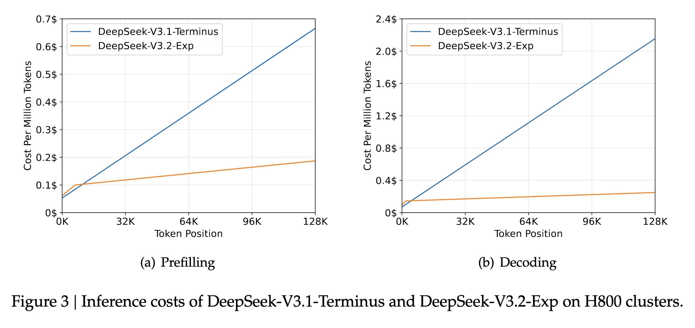

## 论文基本信息

标题：DeepSeek-V3.2-Exp: Boosting Long-Context Efficiency with DeepSeek Sparse Attention

作者：DeepSeek-AI

链接： https://github.com/deepseek-ai/DeepSeek-V3.2-Exp/blob/main/DeepSeek_V3_2.pdf

代码： https://github.com/deepseek-ai/DeepSeek-V3.2-Exp

模型： https://huggingface.co/deepseek-ai/DeepSeek-V3.2-Exp

## 核心亮点

DeepSeek-V3.2-Exp相比上一代模型DeepSeek-V3.1来说，唯一的架构改动点是在继续预训练中使用了DeepSeek Sparse Attention (DSA)。从名字来看就知道，这是一个实验性（Experimental）的版本，效果如何还需要广大用户的测试验证。

得益于新模型服务成本的大幅降低，官方 API 价格也相应下调，输入价格是原来的50%，输出token价值是原来的25%。

## 架构

**DSA原型​**​：主要由两个组件组成：闪电索引器（lightning indexer）和细粒度token选择机制。

**核心思路**：不是让每个 query token attend 所有历史 tokens，而是通过 **闪电索引器** 选择 top-k 重要的 key-value。

- **闪电索引器**：
    
    - 输入：query token 向量 + 历史 token 向量。
        
    - 输出：一个评分 $I_{t,s}$​，衡量 query 与历史 token 的相关性。
        
    - 实现：索引器头数量较少，并且可以实现 FP8 格式，因此计算效率很高 。

$I_{t,s}​=\sum_{j=1}^{H^I}​​w_{t,j}^I​⋅ReLU(q_{t,j}^I​⋅k_s^I​)$

- $H^I$表示索引器的头(Head)数量
- $q_{t,j}^I \in \mathbb{R}^{d^I}$和$w_{t,j}^I \in \mathbb{R}$来自query token $h_t \in \mathbb{R}^{d}$
- $k_{s}^I \in \mathbb{R}^{d^I}$来自历史token $h_s \in \mathbb{R}^{d}$
- 使用 ReLU 激活以提升吞吐
        
- **细粒度token选择机制**：根据闪电索引器计算出的索引分数，只保留相关性最高的若干 key-value，再进入注意力计算，降低复杂度。

- **与 MLA（Multi-Latent Attention）结合**
	- DeepSeek-V3.1-Terminus 使用 MLA 架构（一种高效注意力变体）
	- DSA 在 MLA 的 **MQA（Multi-Query Attention）模式**下实现，确保每个 latent vector（即 key-value entry）可被多个 query heads 共享，提升硬件利用率

- **复杂度**：
    
    - 原来 MLA 注意力复杂度： $O(L^2)$。
        
    - DSA： 主注意力降为 $O(Lk)$，其中 k是选择的token数量， $k \ll L$。
        
    - Indexer 仍是 $O(L^2)$，但因轻量化设计，实际成本远低于原始 MLA。

## 训练

**数据收集​**​：从DeepSeek-V3.1-Terminus的基础检查点开始（上下文长度为128K），训练数据与用于DeepSeek-V3.1-Terminus的128K长上下文扩展数据完全对齐。

​**​预训练阶段​**​：分为密集预热阶段和稀疏训练阶段。

- ​**​密集预热阶段​**​：
	- 先冻结主模型参数，只训练 闪电索引器，使其输出分布对齐原始稠密注意力分布。
	- 通过聚合所有注意力头的主注意力分数并沿序列维度进行L1归一化，生成目标分布。
	- 用 KL 散度 loss 来匹配 索引器 与 主注意力分布。
	- 学习率是10^−3，训练1000步，每个步骤由 16 个128K tokens的序列组成，总共是2.1B tokens。
- ​**​稀疏训练阶段​**​：
	- 启用 top-k 稀疏选择，训练主模型 + 闪电索引器。确保模型逐渐适应稀疏注意力。
	- 索引器仍通过 KL loss 对齐主注意力（但仅在选中的 Top-k token 上），而主模型的优化则来自语言模型损失 。
	- 学习率是7.3 × 10^−6，每个query token选择前2048个key-value tokens，训练了15000步，每个步骤由 480个128K tokens的序列组成，总共是943.7B tokens。

**​后训练阶段​**​：在继续预训练之后，进行后训练以创建最终的DeepSeek-V3.2-Exp。后训练也采用与稀疏继续预训练阶段相同的稀疏注意力方式。为了对引入 DSA 的影响进行严格评估，对于 DeepSeek-V3.2-Exp，维护了与 DeepSeek-V3.1-Terminus 相同的训练后管道、算法和数据。

- **专家蒸馏​**​: 为每个任务开发专门的模型（都从同一个预训练的 DeepSeek-V3.2检查点开始微调），并使用这些专家模型生成特定领域的数据进行最终检查点的训练。
	- 专家领域包括：写作、通用问答、数学、竞赛编程、逻辑推理、通用agent任务、agentic coding、 agentic search。所有领域都支持思考模式和非思考模式。都使用大规模RL训练。
	- 发现：在蒸馏数据上训练的模型达到的性能水平仅略低于特定领域专家的性能水平，通过后续的 RL 训练有效地**消除了性能差距**。
- ​**​混合RL训练​**​: 采用Group Relative Policy Optimization (GRPO)算法，将推理、agent和人类对齐训练合并为一个RL阶段（以前的DeepSeek模型是分阶段训练的），以平衡不同领域的性能，还能规避灾难性遗忘问题。
	- 对于推理和agent任务，采取基于规则的结果奖励、长度惩罚和语言一致性奖励
	- 对于通用任务，采用生成式奖励模型，其中每个提示都有自己的评估标准
	- 奖励设计仔细平衡了两个关键权衡：（1） 长度与准确性，（2） 语言一致性与准确性。

DeepSeek-V3.2和V3.2-Exp的预训练阶段、后训练阶段的方法是一样的。

为了探索扩展思维的潜力，开发了一种实验变体，DeepSeek-V3.2-Speciale。该模型在强化学习期间仅基于推理数据进行训练，且长度惩罚较小。此外还结合了DeepSeekMath-V2（Shao等，2025）中的数据集和奖励方法，以增强数学证明能力。

### Scaling GRPO

有一些稳定RL训练的技巧，可以看论文。
- we mask negative sequences that introduce significant policy divergence
- we preserve the expert routing paths used during sampling in the inference framework and enforce the same routing paths during training, ensuring that identical expert parameters are optimized.
- we preserve the truncation masks during sampling from πold and apply them to πθ during training, ensuring both policies share identical action subspaces.

### Thinking in Tool-Use

DeepSeek-R1发现工具使用中的思维 融入思考过程可以显著提升模型解决复杂问题的能力。

我们观察到，复制DeepSeek-R1的策略——在第二轮消息到达时丢弃推理内容——会导致显著的令牌效率低下。这种方法迫使模型在每次后续工具调用时都对整个问题进行冗余重新推理。

我们开发了专门针对工具调用场景设计的上下文管理

- 历史推理内容仅在对话中引入新用户消息时被丢弃。如果只附加工具相关的消息（例如工具输出），推理内容在整个交互过程中都会被保留。
- 当推理痕迹被移除时，工具调用的历史及其结果依然保留在上下文中。

Large-Scale Agentic Tasks

## 评估

**模型能力​**​：在一系列基准测试中评估了DeepSeek-V3.2-Exp，并与DeepSeek-V3.1-Terminus进行了比较。结果表明，DeepSeek-V3.2-Exp在长序列上的计算效率显著提高，同时在短上下文和长上下文任务上的性能没有显著下降。

- 在 **MMLU-Pro、Codeforces、SWE-bench、BrowseComp** 等多个 benchmark 上，**DeepSeek-V3.2-Exp 与 V3.1-Terminus 性能基本持平**
- 少数任务（如 GPQA、HLE、HMMT）略有下降，作者解释为：**V3.2-Exp 生成的推理 token 更少**，但若使用中间 checkpoint（生成 token 数相当），差距消失

DeepSeek-V3.2技术报告中补充了人类便好评估和长文本评估。

**人类偏好**： ChatbotArena的ELO排行榜上，DeepSeek-V3.1-Terminus和DeepSeek-V3.2-Exp的分数也非常接近。

**长文本评估**：在DeepSeek-V3.2-Exp发布后，使用了此前未见过的测试集进行了多次独立的长上下文评估。一个代表性的基准是AA-LCR3，其中DeepSeek-V3.2-Exp在推理模式下比DeepSeek-V3.1Terminus高出4分。在Fiction.liveBench的评估中，DeepSeek-V3.2-Exp在多个指标上始终优于DeepSeek-V3.1-Terminus。这些证据表明，DeepSeek-V3.2-Exp的基础检查点在长时间上下文任务中不会倒退。

**强化学习训练曲线**：两个模型在BrowseComp和SWE Verified上的性能在整个训练过程中稳步提高，曲线紧密对齐，这反映了DSA的训练稳定性。

**推理成本​**​：DSA将主模型的核心注意力复杂度从$O(L^2)$降低到$O(L*k)$，结合优化实现，DSA在长上下文场景中实现了显著的端到端加速。对于短序列预填充，专门实现了掩码MHA模式来模拟DSA，以达到更高的效率。

- 在 H800 GPU 上实测：
    - **Prefilling 阶段**：V3.2-Exp 成本显著低于 V3.1（尤其在长序列）
    - **Decoding 阶段**：成本优势更明显（因 MQA + 稀疏）

## 参考资料

