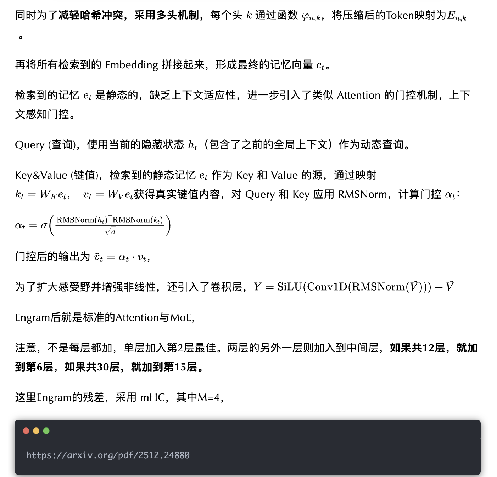
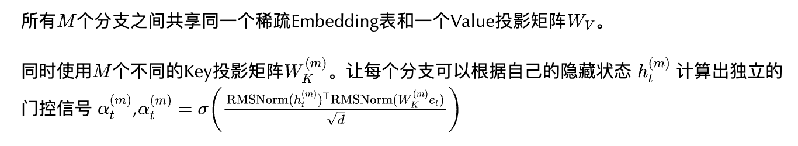

Engram，为大语言模型设计的条件记忆模块，加入一个外挂词典，可用于局部知识的快速查表，让模型进一步快速理解知识内容。

而Engram，简单理解，就是在某些层的前面，加上 N-Gram 的 Embedding，可以让模型更容易理解真实的短语、实体、固定搭配等。

Engram的结构如下图所示，

对于每个输入进行N-Gram处理，用2-gram和3-gram，为了提高语义密度，并且减少embedding大小，进行Tokenizer 压缩，

也就是语义相似，但表示不同的Token ID，进行等价规范化（例如：使用 NFKC 标准化、小写化等），变成规范的ID。

并且，将原始的 128k 词表压缩了 23%。

因为N-Gram组合的词表是巨大的，直接Embedding不切实际，所以这里采用哈希方式，

这，新出的Engram、mHC应该就是DeepSeek春节前要发模型V4或R2的架构了吧。

因为Engram的N-Gram Embedding的逻辑，只依赖于输入 Token，所以在计算之前就可以异步获取好，同时，自然语言 N-grams是长尾分布的，对于高频的Embedding可以缓存到GPU上，在推理阶段，基本上延迟很小。

分析Engram（条件记忆）与 MoE（条件计算）之间的结构互补性，在总参数量和训练计算量固定时，MoE 专家和 Engram 记忆之间存在U 型定律。

将大约 20%–25% 的非激活参数，重新分配给 Engram时，效果最佳，如下图a所示。

同时， 因为Engram 的  O(1) 查找开销，不随规模变大而增长，所以，在不考虑显存资源的情况下，符合Power Law，更大显存会持续带来收益，并且没有额外的计算量，如上图b。

在4种模型上进行了实验，Dense-4B、MoE-27B、Engram-27B、Engram-40B，其中激活参数均为3.8B，训练数据262B Tokens，详细参数设置如下：

整体结果上，总参数一样下，Engram-27B优于MoE-27B，同时扩大N-Gram Embedding参数，收益持续增加。

同时经过一系列分析，发现，

与 MoE 基线相比，Engram 模型在各层下有更低的KL 散度，曲线下降得更陡峭，说明模型能更快地完成特征组合，见下图a。

同时，发现Engram 第5层的表征，与MoE第12层的表征最为对齐，见下图b，c，说明Engram让浅层网络获得了深层网络的表征能力，有效的增加了模型的深度。

如果只增加一个 Engram 模块，第 2 层是最佳位置，如下所示，同时消融实验，发现多分支集成、上下文门控、Tokenizer 压缩很重要，卷积和变成4-gram作用没有很明显

多层会优于单纯，将同样的 1.6B Engram 拆分并放置在 第 2 层和第 6 层，效果优于单层。

定性分析Engram 的功能贡献，不让把 Engram 的输出，发现知识类榜单下降明显，仅剩29%–44%，推理类榜单下降不明显，保留81%–93% ，说明Engram主要影响世界知识的存储。

最后，

因为现在的tokenizer，没有了词语的概念，

所有利用n-gram来获取更多的连续语义的信息.

## 参考资料

[微信公众平台](https://mp.weixin.qq.com/s/im9x5pFTYRQcrph_etGOkA)

[mp.weixin.qq.com/s/SoacLxgG3AkwU7aLEIDIQQ](https://mp.weixin.qq.com/s/SoacLxgG3AkwU7aLEIDIQQ)

