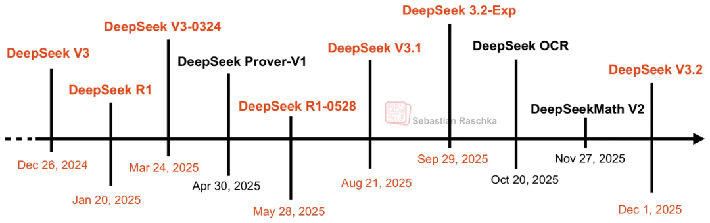

最近DeepSeek又又又开源了它的新模型，真的太强啦！心血来潮想总结下这些模型的主要特点/相比上一代的改进点，于是有了这篇文章。

DeepSeek的API文档中也有类似的说明： https://api-docs.deepseek.com/zh-cn/updates

## DeepSeek-LLM（67B / 7B等）

DeepSeek 在2023年11月底开源了名为 “DeepSeek-LLM” 的模型系列（包括 7B / 67B 基础模型 + Chat 版本）

论文地址： [DeepSeek LLM Scaling Open-Source Language Models with Longtermism](https://arxiv.org/abs/2401.02954)

模型地址： https://huggingface.co/collections/deepseek-ai/deepseek-llm-65f2964ad8a0a29fe39b71d8

Github地址： https://github.com/deepseek-ai/DeepSeek-LLM

**架构 / 能力 /定位**

- 这是一个较为“传统”的密集 decoder-only Transformer 架构（即标准的自注意力 + 前馈网络堆叠）

- 7B模型采取Multi-Head Attention，67B模型采取Grouped-Query Attention。

- 2个模型都使用2T tokens的英文 + 中文双语训练，倾向成为通用语言模型（不是刻意偏工具 / 推理方向）
    
- 在很多常见任务（写作、摘要、对话、翻译、常识问答）上，就开源模型而言，表现通常优于当时同规模的 LLaMA /其他开源模型。[GitHub](https://github.com/deepseek-ai/DeepSeek-LLM)
    
- 作为早期版本，它更多扮演“基础模型 / 研究基座”的角色，而不是高精尖推理模型
    

## DeepSeek-V2：稀疏 / 节省资源的迈进

DeepSeek 在 2024 年推出 DeepSeek-V2 版本，作为向更高效、更大规模模型演进的一步。

论文地址：[[2405.04434] DeepSeek-V2: A Strong, Economical, and Efficient Mixture-of-Experts Language Model](https://arxiv.org/abs/2405.04434)

模型地址： https://huggingface.co/collections/deepseek-ai/deepseek-v2-669a1c8b8f2dbc203fbd7746

Github： https://github.com/deepseek-ai/DeepSeek-V2

**架构 /技术特点**  
DeepSeek-V2 在多个方面做了结构性突破：

- **Mixture of Experts (MoE)** 架构：模型总参数为 236B，但对每个 token 只激活约 21B 参数（即稀疏激活）
    
- **Multi-head Latent Attention (MLA)** + **DeepSeekMoE**：为了减小 Key-Value 缓存 (KV cache) 的内存占用，DeepSeek-V2 引入 MLA，用 latent 表示压缩 KV，降低内存开销与 I/O 负载。
    
- **上下文长度扩展**：V2 支持较长上下文（128K）以适应大文本 / 长文档任务。
    
- **高效推理 / 训练资源节约**：  
      - 与早期的 67B 模型比，DeepSeek-V2 在训练上节省约 42.5% 成本。
      - KV 缓存压缩带来极大降低，KV cache 占用减少 ~93.3%。
      - 推理吞吐率提升显著，最高可达到原先版本的 5.76 倍。

- **预训练语料**：8.1 T tokens。
    

**能力 /表现 /反馈**

- 在多个语言 / 通用任务（包括问答、生成、摘要等）上，V2 的表现优于早期版本
    
- 有社区评价称 V2 是 “GPT-4 级别” 的开源模型，尤其在中英文能力、训练数据质量上做得比较好。[Medium](https://medium.com/%40seancheo/trying-out-deepseek-v2-a-new-open-source-llm-from-china-ece11369a08b)
    
- 其 “轻量 / 高效 / 大规模” 的特性使其更容易被研究者 /开发者部署与使用
    

**拓展 /变种 /衍生**

- **DeepSeek-V2-Lite**：一个轻量版本，参数更少（总参 ~15.7B，激活 ~2.4B，训练语料5.7T tokens）而仍保持 MoE 架构，用于更小资源环境部署。
    
- **DeepSeek-Coder-V2**：在 V2 中间检查点的基础上继续预训练6T tokens，专门强化代码 / 编程能力的模型版本。GitHub 中提到它是 “open-source Mixture-of-Experts code language model … performance comparable to GPT4-Turbo in code tasks” 的版本。[GitHub](https://github.com/deepseek-ai/DeepSeek-Coder-V2)
    
---

## DeepSeek-V2.5：通用 + 编程 融合优化

2024年12月，DeepSeek 在 V2 基础上推出 V2.5 版本，以期将通用聊天能力与代码 / 编程能力融合，提升模型在多任务 / 多技能上的表现，并在各个方面进行了优化，包括写作和指令遵循。

模型地址： https://huggingface.co/deepseek-ai/DeepSeek-V2.5

https://huggingface.co/deepseek-ai/DeepSeek-V2.5-1210

**架构 /优化方向**

- **融合 Chat + Coder 能力**：V2.5 实质上把 V2 的通用聊天模型 (DeepSeek-V2-Chat) 和 Coder 版本 (DeepSeek-Coder-V2-Instruct，专注代码能力) 做了融合 / 协调，使单一模型兼顾语言 + 编程任务。
    
- **对齐 / 人类偏好优化**：增强了对人类偏好的适应性 (alignment)，使输出更符合用户意图 / 风格。
    
- **版本升级 /补丁**：例如 “DeepSeek-V2.5-1210” 是一个子版本，在数学、代码、写作与推理等维度上都有具体提升。“数学从 74.8% 提升到 82.8%”、“LiveCodebench 从 29.2% 提升到 34.38%”，“在内部测试数据集中观察到了写作和推理相应的改进” 等。新版本的模型还优化了文件上传和网页摘要功能的用户体验。
    

## DeepSeek-V3

DeepSeek 团队于 2024 年底发布 V3 版本，替代之前的 DeepSeek-V2.5。

论文地址： https://arxiv.org/abs/2412.19437

模型地址： https://huggingface.co/collections/deepseek-ai/deepseek-v3-676bc4546fb4876383c4208b

GitHub地址： https://github.com/deepseek-ai/DeepSeek-V3
    

**主要特点 / 局限**

- V3 是一个 Mixture-of-Experts (MoE) 结构的语言模型，具有 671B 总参数规模，每个 token 激活约 37B 规模的子网络。

- 架构上，和V2一样，V3 使用 Multi-head Latent Attention (MLA) 与 DeepSeekMoE 架构以控制计算和效率。

- 开创了一种用于负载均衡的辅助无损策略，最大限度地减少了鼓励负载均衡带来的性能下降。

- 设置了多令牌预测（MTP）训练目标，并证明它有利于模型性能。它还可用于推理加速的推测解码。

- 设计了 FP8 混合精度训练框架，并首次在超大规模模型上验证了 FP8 训练的可行性和有效性。

- 通过算法、框架和硬件的协同设计，克服了跨节点 MoE 训练中的通信瓶颈，几乎实现了计算-通信的完全重叠。

- 在14.8T 多样化和高质量的tokens上预训练，且在整个训练过程中，没有遇到任何不可恢复的损失峰值或执行任何回滚。

- 引入了一种创新方法，将长思维链 （CoT） 模型（特别是 DeepSeek R1 系列模型之一）的推理能力提炼成标准 LLM，特别是 DeepSeek-V3。
    
- 强调在数学、编码、中文等任务上的能力，并与当时的开源与闭源模型竞争。

- 在通用生成 /对话 /问答 /摘要 /翻译等任务上，V3 在很多场景比 V2 系列显著提升，更适合作为“主模型”对外提供服务，能够处理更多复杂任务。

- API 上提供函数调用 / JSON 输出 /工具接口支持（与前代相比变得更完善）

---

## DeepSeek-V3-0324

这是 DeepSeek 在 2025 年 3 月 24 日发布的 V3 系列更新版本，是在原 V3 架构基础上的改进「checkpoint」版本。

https://huggingface.co/deepseek-ai/DeepSeek-V3-0324

**改进 / 优势**

- V3-0324 的模型结构与 DeepSeek-V3 **完全相同**，只是一个新的 checkpoint（权重更新、训练调优）。
    
- 该版本在推理性能、前端工具能力、汉语写作能力、中文搜索能力、函数调用等方面都有显著改进。
    
- 它继续支持函数调用 (function calling)、JSON 输出、FIM 完成等接口功能。
    

**用户 /社区反馈**

- 有用户在 Reddit 上表示 “V3 0324 显著优于 V3 OG（原版）” ([Reddit](https://www.reddit.com/r/SillyTavernAI/comments/1jk8ppf/deepseek_v3_0324_is_incredible/ "DeepSeek V3 0324 is incredible : r/SillyTavernAI - Reddit"))
    
- 有文章评价：在逻辑、编码、结构化问题解答方面有明显提升，有时甚至超过 Claude 3.7 在某些维度的表现。([Medium](https://medium.com/data-science-in-your-pocket/deepseek-v3-0324-vs-deepseek-v3-b4bd73e39bec "DeepSeek V3–0324 vs DeepSeek-V3 - Medium"))
    
- 部分社区文章把它称为“V3 的重大升级版”([Milvus](https://milvus.io/blog/deepseek-v3-0324-minor-update-thats-crushing-top-ai-models.md "DeepSeek V3-0324: The \"Minor Update\" That's Crushing Top AI ..."))
    

**总结**  
V3-0324 可视为对 V3 的中期强化补丁（checkpoint upgrade），在推理能力、工具调用、稳定性方面有较为显著提升，但不是架构上的重大革新。架构仍为原来的 V3，参数规模与设计保持一致。

---

## DeepSeek- R1

**DeepSeek-R1 / R1-Zero**：作为 DeepSeek 的 reasoning 方向探索版本（即更偏向让模型“思考”能力 / 逻辑推理能力），2025 年1月份发布。

论文地址： https://arxiv.org/abs/2501.12948

模型地址： https://huggingface.co/collections/deepseek-ai/deepseek-r1-678e1e131c0169c0bc89728d

- R1-Zero 是用纯强化学习 (RL)（无监督微调 / SFT）来训练出推理能力，但其初版存在可读性 / 语言混杂问题。
	
- R1 在 R1-Zero 基础上加入 cold-start 数据 + SFT + RL，使输出可读性、语言一致性、推理链等更稳定。
	
- R1 在一些 benchmark 上能与 OpenAI 的 o1 模型匹敌（甚至在某些任务上优于）
	
- R1 的推理链 / 多步思考过程被公开为 “thought chains” / 可观察思考过程（即模型自身的思考轨迹）([arXiv](https://arxiv.org/abs/2504.07128 "DeepSeek-R1 Thoughtology: Let's think about LLM Reasoning - arXiv"))
	
- 有研究指出 R1 输出在部分政治敏感 / 本地化语境下可能带有过滤 / 审查倾向。([arXiv](https://arxiv.org/abs/2505.12625 "R1dacted: Investigating Local Censorship in DeepSeek's R1 Language Model"))

- DeepSeek-R1-0528是DeepSeek-R1的小版本升级，通过利用增加的计算资源并在训练后引入算法优化机制，显着提高了其推理和推理能力的深度，还降低了幻觉率，增强了对函数调用的支持，提供了更好的vibe coding体验。它的整体性能现在已经接近O3和Gemini 2.5 Pro等领先模型。

## DeepSeek-V3.1

这是 DeepSeek 在 2025 年 8 月发布的 “新一代 V3 系列” 版本，是一个在架构与训练策略上有实质性改动的版本。

模型地址： https://huggingface.co/collections/deepseek-ai/deepseek-v31-68a491bed32bd77e7fca048f

**主要新特性 / 架构设计**

1. **Hybrid 推理 / 模式切换（Thinking / Non-Thinking）**
    
    - DeepSeek-V3.1 引入一种混合推理架构：一个模型同时支持 **Thinking 模式**（链式思考 / 中间过程推理）与 **Non-Thinking 模式**（直接输出答案）两种推理方式。用户/系统可以通过 chat 模板或切换标识来选择。
        
    - 在内部评测中，V3.1-Think 在推理效率上比 R1 更快，减少推理时的中间 token 耗费。
        
2. **更强的工具调用 / Agent 能力**
    
    - V3.1 在 post-training（后训练 / fine-tuning）阶段加强了工具调度、函数调用、agent 多步骤任务处理能力。
        
3. **上下文长度 / 训练扩展**
    
    - V3.1 支持更长上下文，目前主流版本支持 128K tokens 上下文长度（或已经扩展）
        
    - V3.1 是在 V3 基础上通过两阶段长上下文扩展方法进行了更多训练，32K 扩展阶段增加了 10 倍，达到 630B 代币，而 128K 扩展阶段增加了 3.3 倍，达到 209B 代币。
        
4. **优化精度 / 兼容更多数值格式**
    
    - V3.1 在内部支持多种精度格式（如 BF16, FP8, F32 等），以更好适配不同硬件 / 芯片平台。([Analytics Vidhya](https://www.analyticsvidhya.com/blog/2025/08/deepseek-v3-1-quiet-release-big-statement/ "DeepSeek V3.1: Quiet Release, Big Statement - Analytics Vidhya"))
        
    - 对于国内芯片生态进行了优化支持（如在公告中提到对国产芯片 / 生态的适配）([eWeek](https://www.eweek.com/news/deepseek-introduces-deep-thinking-mode/ "DeepSeek V3.1 Outperforms Popular R1 in Benchmarks - eWeek"))
        
5. **兼容 / 接口更新**
    
    - V3.1 在 API 文档中宣称支持函数调用、长上下文、Anthropic API 兼容等。([eWeek](https://www.eweek.com/news/deepseek-introduces-deep-thinking-mode/ "DeepSeek V3.1 Outperforms Popular R1 in Benchmarks - eWeek"))
        
    - 企业 / 开发者可通过同一模型实现 Non-Thinking 与 Thinking 模式，无需切换模型版本。([bentoml.com](https://www.bentoml.com/blog/the-complete-guide-to-deepseek-models-from-v3-to-r1-and-beyond "The Complete Guide to DeepSeek Models: V3, R1, V3.1 and Beyond"))
        

**版本稳定性 / 性能修正（Terminus）**

- 在 2025 年 9 月 22 日，DeepSeek 发布 **V3.1-Terminus** 版本，作为对 V3.1 的稳定性、输出一致性、语言混用（中英文混杂）、工具调用错误等问题的修正升级。
    
- V3.1-Terminus 主要改进包括语言一致性（减少中英文混杂、奇怪字符现象）、更稳定输出、更优化 agent / tool 使用性能。
    
- 在性能基准测试方面，V3.1-Terminus 相比 V3.1 在多个评测项目上略有提升（如 MMLU-Pro、GPQA、工具调用基准等）

---

## DeepSeek-V3.2-Exp

这是 DeepSeek 在 2025 年 9 月 29 日发布的 “实验性” 模型，作为 V3 系列向下一个大架构演进的过渡版本。

模型地址： https://huggingface.co/collections/deepseek-ai/deepseek-v32-68da2f317324c70047c28f66

**核心新机制 / 架构创新**

- **DeepSeek Sparse Attention (DSA)**：V3.2-Exp 引入了一个稀疏注意力机制（DeepSeek Sparse Attention），用于在长上下文场景下减少计算和内存开销，同时保持输出质量几乎不变。
    
- 架构上，V3.2-Exp 是在 V3.1-Terminus 基础上继续训练并注入 DSA 的版本。
    
- 在 benchmark 对比中，V3.2-Exp 在多个公开基准上的性能几乎与 V3.1-Terminus 相当。（为了严格评估引入稀疏注意力的影响，特意将 DeepSeek-V3.2-Exp 的训练配置与 V3.1-Terminus 保持一致。）
    

**效率 / 成本优化**

- 使用稀疏注意力机制后，在长文本 / 大上下文推理时，计算成本/内存开销大幅下降。公开资料称在长上下文场景下每百万 token 的推理成本低于 V3.1-Terminus 的一半。([Venturebeat](https://venturebeat.com/ai/deepseeks-new-v3-2-exp-model-cuts-api-pricing-in-half-to-less-than-3-cents "DeepSeek's new V3.2-Exp model cuts API pricing in half to ..."))
    
- DeepSeek 将相应地将 API 价格下调 50%+。([DeepSeek API Docs](https://api-docs.deepseek.com/news/news250929 "Introducing DeepSeek-V3.2-Exp"))
    

**局限 / 注意事项**

- 虽然在公开基准上表现相当，但 DeepSeek 官方和社区警告说，在真实用户场景的“长尾用例 / 异常输入”上，V3.2-Exp 仍需更广泛测试。
    
- 因为是较新的实验版本，某些边缘情况、稳定性、输出一致性、兼容性可能尚未完全打磨。
    

## DeepSeek 系列：各版本的总结对比

| 版本 / 模型                            | 时间 / 发布时期               | 架构 / 模型规模 / 激活方式等                                                                                          | 主要特性 / 所在定位                                                             | 与前代相比的改进 / 差异 /不足                                                                                                          |
| ---------------------------------- | ----------------------- | ---------------------------------------------------------------------------------------------------------- | ----------------------------------------------------------------------- | -------------------------------------------------------------------------------------------------------------------------- |
| **DeepSeek-LLM（或称 DeepSeek 基础系列）** | 2023 年11 月              | 公布有 7B / 67B 参数版本（Base 与 Chat）                                                                             | 作为 DeepSeek 的最早阶段模型，用来做通用语言理解 / 生成 / 对话                                 | 架构相对传统（decoder-only transformer + RoPE、分组 query attention 等），上下文长度为 4096；在能力上与当时主流开源 LLM 比较接近，但在大规模推理 / 复杂推理 / 工具调用等方面还受限。 |
| **DeepSeek-V2**                    | 2024 年 5 月（或中期）         | 混合稀疏架构（Mixture-of-Experts, MoE），采用 Multi-head Latent Attention (MLA)，总参数 236B，每 token 激活 ~21B。支持长上下文（128K） | 目标是在提升模型能力的同时显著降低资源 / 内存开销 / KV 缓存占用 / 推理成本                             | 与前代 DeepSeek-LLM 相比，在规模、稀疏计算、上下文长度、性能效率等多方面都有跳跃；训练成本比起全激活模型显著下降（节省 ~42.5%）；KV 缓存压缩（减少 ~93.3%）；推理吞吐率提升（5.76×）               |
| **DeepSeek-V2.5**                  | 2024 年后期                | 在 V2 基础上做进一步融合 / 优化，包括将通用模型 (V2-Chat) 与 Coder 模型融合 / 协调能力                                                  | 更好地兼顾 general 和 编码 (code) 能力；提升 instruction following、写作 / 推理能力等指标      | 相比 V2，在 instruction 对齐、编程能力、对任务的多样性适应上更强；但相比后续 V3 / R1 版本，其在复杂推理 / reasoning 任务上仍是下游补强对象                                   |
| **DeepSeek-V3（基线版）**               | 2024 年底至 2025 年初        | 混合稀疏 / MoE 设计（671B 模型规模，稀疏激活）                                                                              | 作为 DeepSeek 的“下一代”旗舰版本，是 V3 系列的基础版本                                     | 相比 V2 / V2.5，有到更大规模、更复杂能力与潜在能力空间；但在逻辑推理 / agent / 工具调用等场景仍需增强（这正是后续版本努力方向）                                                 |
| **DeepSeek-V3-0324**               | 2025 年 3 月 24 日         | 与 V3 基线模型架构相同，但用新的 checkpoint / 权重训练 / 调优                                                                  | 更好的推理、工具调用、稳定性表现                                                        | 相较于 V3 基线版，在推理能力、工具能力、稳定性等方面有“重大提升”但不是结构性变更                                                                                |
| **DeepSeek-R1**                    | 2025 年 1 月（首版） / 后续版本升级 | 基于 DeepSeek-V3 的架构（MoE + 稀疏 /激活机制）起始；总参数约 671B，激活参数约 37B（每 token 激活部分子网）                                   | 定位为 **推理 / 思考 / reasoning 模型**：不仅生成 /对话能力，也强调中间思考链、可解释推理、逻辑 /数学 /代码解题能力 | 相比以往 DeepSeek V3等通用模型，**R1 更强调思考链 / 解释路径 / 推理深度** 在 benchmark（数学、推理、代码）上据称可与 OpenAI o1 看齐 /竞争                           |
| **DeepSeek-V3.1**                  | 2025 年 8 月              | 架构升级：支持 **混合推理模式**（Thinking / Non-Thinking），更深入强化的工具 / agent 能力                                            | 旨在兼顾日常对话生成与复杂推理 / agent 调度能力                                            | 相比 V3 / V3-0324，在推理效率、工具调用、混合模式支持等方面有结构性改进                                                                                 |
| **DeepSeek-V3.1-Terminus**         | 2025 年 9 月（版本稳定包）       | 基于 V3.1 的稳定版本，对输出一致性、语言混杂、不稳定行为等做修正                                                                        | 更加适合生产环境 / 应用部署                                                         | 相比 V3.1，在稳定性、语言一致性、边界行为（异常输入）等方面改善                                                                                         |
| **DeepSeek-V3.2-Exp**              | 2025 年 9 月末             | 在 V3.1 基础上引入 **DeepSeek Sparse Attention (DSA)** 稀疏注意力机制，以降低计算 / 内存成本                                      | 面向长上下文 / 高效推理场景                                                         | 在长文本场景下效率 / 成本有显著改进；但作为实验版本，在边界稳定性 / 稳妥性上尚需更多验证                                                                            |

综合来看，DeepSeek 的演进路径可以概括为：

1. 从相对密集 / 传统 transformer 模型（DeepSeek-LLM）到稀疏 / MoE 架构（V2）。**既要模型能力强，也要效率 /资源成本低。**
    
2. 在稀疏架构基础上不断在效率、上下文长度、KV 缓存、路由优化等方面打磨（V2 → V2.5 → V3）。
    
3. 在 V3 架构基础上探索混合推理模式、工具 / agent 加强、输出一致性、思考链可解释性等方向（V3.1 / Terminus / V3.2 Exp）。
    
4. 从通用能力过渡到 **推理 / 思考能力导向**（R1 系列），即不只是生成 / 模拟语言，而是让模型“思考 / 推理 / 算法式解决问题”更强。
    
5. **能力向“推理 + 工具调用 + Agent 任务”拓展**： 随着版本推进，DeepSeek 越来越重视工具调用 (function / API)、多步骤 agent 任务、插件调用等复杂工作流场景。
    
6. **效率 / 成本压缩 / 硬件适配**：  V3.2-Exp 的稀疏注意力是为了解决在极长上下文场景下的计算 / 内存瓶颈；同时 V3.1 在支持多精度格式、适配本地 / 国产硬件方面下功夫。
    
7. **稳定性 / 一致性优化**：  V3.1-Terminus 的推出正是为了解决 V3.1 在输出一致性、语言混用、奇怪字符、模糊边缘行为等方面的问题，从而提升在应用/部署中的鲁棒性。
    
8. **“兼顾通用 + 专注推理”的折衷**：V3.1 的混合推理模式使得一个模型能同时兼顾日常对话/生成和复杂推理场景，是 DeepSeek 在宽泛能力与专精任务间的折中路径。