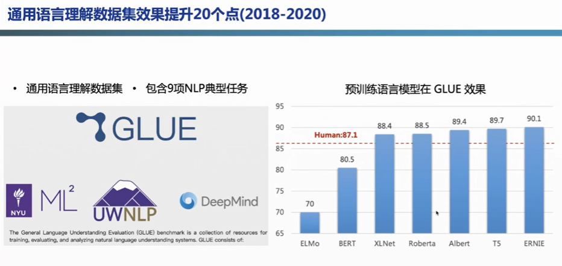

百度 杰出架构师 孙宇

目录

- 预训练模型原理与发展
- ERNIE 3.0 知识增强大模型
- 文心ERNIE平台及应用
- 预训练模型挑战与未来

预训练模型原理与优势

上图展示了一系列BERT之后的预训练工作。在预训练语言模型分类中，可以分为：

-   单向LM（语言模型）：GPT、GPT-2、GPT-3
    
-   双向LM：BERT、Roberta
    
-   端到端LM：T5、MASS
    
-   持续学习（continuallearning）+知识增强（knowledge）：ERNIE、ERNIE 2.0、ERNIE 3.0
    

基于这些基础模型，学术界做了下列扩展：

-   多语言模型：XLM、InfoXLM、ERNIE-M
    
-   多模态模型：VideoBERT、UNITER、ERNIE-ViL
    
-   模型压缩：MiniLM、TinyBERT、ERNIE-Tiny
    

还有一些基于特定任务的预训练模型：

-   相似度任务：SentenceBERT、ERNIE-Sim
    
-   生成任务：UniLM、MASS、ERNIE-Gen
    
-   领域模型：BioBERT、SciBERT、ERNIE-Health/Law/Financial

ERNIE 1.0

ERNIE（Enhanced Representation throughkNowledge IntEgration）指基于知识融合（knowledge masking）的新一代语义表示模型。ERNIE在做masking的时候，是以knowledge masking的方式，对词、短语、实体的完整语义进行masking的。

在 BERT 模型中，通过『哈』与『滨』的局部共现，即可判断出『尔』字，模型没有学习与『哈尔滨』相关的知识。而 ERNIE 通过学习词与实体的表达，使模型能够建模出『哈尔滨』与『黑龙江』的关系，学到『哈尔滨』是『黑龙江』的省会以及『哈尔滨』是个冰雪城市。

ERNIE 模型本身保持基于字特征输入建模，使得模型在应用时不需要依赖其他信息，具备更强的通用性和可扩展性。相对词特征输入模型，字特征可建模字的组合语义，例如建模红色，绿色，蓝色等表示颜色的词语时，通过相同字的语义组合学到词之间的语义关系。

此外，ERNIE 的训练语料引入了多源数据知识。除了百科类文章建模，还对新闻资讯类、论坛对话类数据进行学习，这里重点介绍下论坛对话建模。对于对话数据的学习是语义表示的重要途径，往往相同回复对应的 Query 语义相似。基于该假设，ERINE 采用 DLM（Dialogue Language Model）建模 Query-Response 对话结构，将对话 Pair 对作为输入，引入 Dialogue Embedding 标识对话的角色，利用 Dialogue Response Loss 学习对话的隐式关系，通过该方法建模进一步提升模型语义表示能力。

ERNIE 对实体概念知识的学习以及训练语料的扩展，增强了模型语义表示能力。为验证 ERNIE 的知识学习能力，研究者利用几道有趣的填空题对模型进行了考察。实验将段落中的实体知识去掉，让模型推理其答案。

2.0

在ERNIE 2.0，百度提出了持续学习的语义理解框架。在大数据和先验知识的基础上，构建了句法、语法、语义相关的一系列任务，这些任务会在框架内持续的训练学习，更新整个ERNIE模型，从而对下游任务有一个更好的理解。

ERNIE的框架也是基于Transformer，基于这个框架，百度构建了三大体系的预训练任务（pre-training task）：词感知（word-aware）、结构感知（structure-aware）、语义感知（semantic-aware）。

上图（左）展示了结构层面的语序关系：需要让ERNIE模型知道“春天播种，夏天浇水，秋天收获”的逻辑，这样模型才能更好的“理解”文本含义，故设计了文本语序的预测任务。

中间图片展示了结构层面的语义关系：百度从大规模语料中设计了“语义距离”的任务：

-   语义紧密：一篇文章中相邻的两个句子，可以认为是语义紧密。
    
-   同一话题：属于同一篇文章的两个句子，可以认为是同一话题。
    
-   语义无关：两个句子在不同文章中，可以认为是语义无关。
    

上图（右）展示了语义层面的逻辑关系，这些关系（因果、假设、递进、转折等）是通过无监督的方式从大规模语料中获取的，希望ERNIE能从中学习到一些逻辑知识。

3.0

在ERNIE 3.0时代业界出现了一些大模型，这些大模型有两个共同点：一是仅仅只是读更多的文字，比如扩大语料，这是模型增长的前提；二是很多大模型都是使用auto-regressive（自回归）方式进行的，GPT、盘古这些都使用了这种方式。百度ERNIE希望除了从更多更优质的文本中学习以外，还希望模型能从知识图谱学习到世界知识，这个世界知识能够更好的促进下游任务，除了文本生成以外，还希望能保留模型的理解能力。

ERNIE 3.0的整体框架显示：模型除了使用大规模语料外，还引入了百度知识图谱（包含5千万事实），共包含4TB语料。

ERNIE 3.0 4TB语料的来源，除了ERNIE 2.0中的对话、百科、wiki等语料之外，还加入了百度自有的搜索数据、互联网的web数据、QA问答的长文本/短文本，以及小说、诗歌、对联、医疗/法律/金融等领域数据，最后还引入了知识图谱的数据，并对优质数据进行了加权以便更好的引入这些数据。

在准备好语料之后，ERNIE建立了一个持续学习的框架，该框架基于Transformer-XL模型。之所以使用Transformer-XL结构，是因为该结构可以处理无尽文本。GPT-3中只能处理2048长度的文本，Transformer-XL中采用了片段递归（segment-level recurrence）机制使其可以处理基本无穷的文本。模型使用了一个深层（48层）网络，4096的hidden size，64头的attention。

这个模型会产出一个双分支结构的面向任务的表示（task-specific representation）。ERNIE的初衷是在一个模型内能完成理解和生成两个任务，理解任务使用了自编码的方式，生成任务使用了自回归的方式。两个任务模型的参数是非共享的（参数非共享的方式具有更好的效果）。百度在小规模语料上做了验证，非共享方式取得了更低的PPL，并且后面的曲线是逐渐扩大的，即优势逐渐扩大。这是一种求同存异的模式，“同”在于做了一个universal representation，“异”在于双分支结构。自编码和自回归的模型参数为L12H768A12（网络深度为12，768 hidden size，12头attention），这是ERNIE-based的模型，百度希望通过这个模型给业界带来大模型的应用新范式。

Universal representation是一个非常庞大接近百亿规模的模型，在中小企业是比较难应用的。如何让这些企业也能使用大模型呢？可以通过百度提供表示（representation）传输到用户，用户可以使用小的模型进行微调（fine-tuning），只更新上层小模型的参数，不会影响大模型，即可以使用比较少的资源获取大模型的能力。

ERNIE 3.0的学习任务，共分为3部分：

-   词感知（word-aware）预训练任务：沿用ERNIE 1.0的知识掩码（knowledgemasking）；新增了文档语言建模 （document language modeling），采取了增强自循环记忆机制（enhancedrecurrence memory mechanism，可自行查看ERNIE-doc相关论文）来增加模型的感受野。
    
-   结构感知（structure-aware）预训练任务：语义重组（semantic reordering）、语义距离（semantic distance）。
    
-   知识感知（knowledge-aware）预训练任务：是一个文本与知识平行的预训练方法。

对于一段文本，会利用知识图谱进行实体链接（entity linking），得到句子的SPO（Subject-Predicate-Object，实体关系对），并与原始文本进行拼接（concat），再使用拼接文本进行下游的knowledge masking任务（ERNIE 1.0）。这种方式在知识类任务以及信息抽取中都有比较显著的收益。

底座：通用的语义表示

不同任务的语义表示

问答数据，搜索数据，垂直领域的数据

## 参考资料

[冯仕堃：预训练模型哪家强？百度知识增强大模型探索实践！](https://mp.weixin.qq.com/s/ao61B-wjIYEgRKcHS3rV3g)

