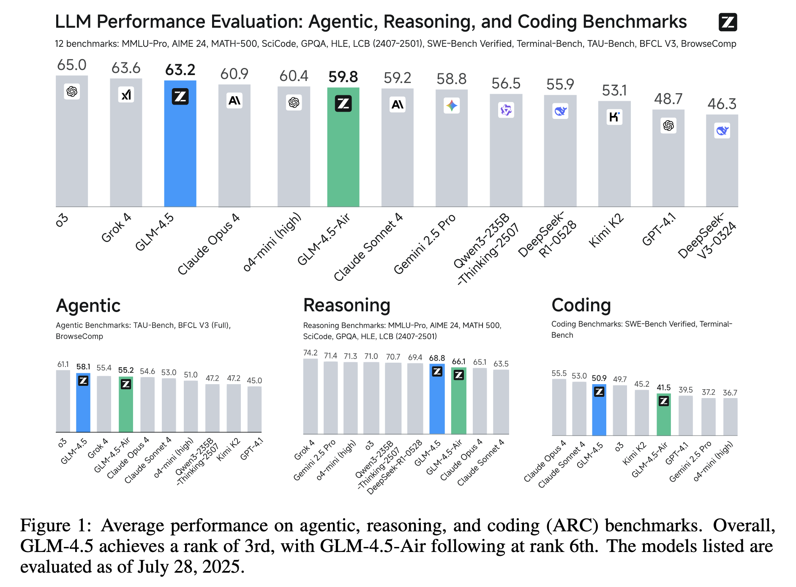
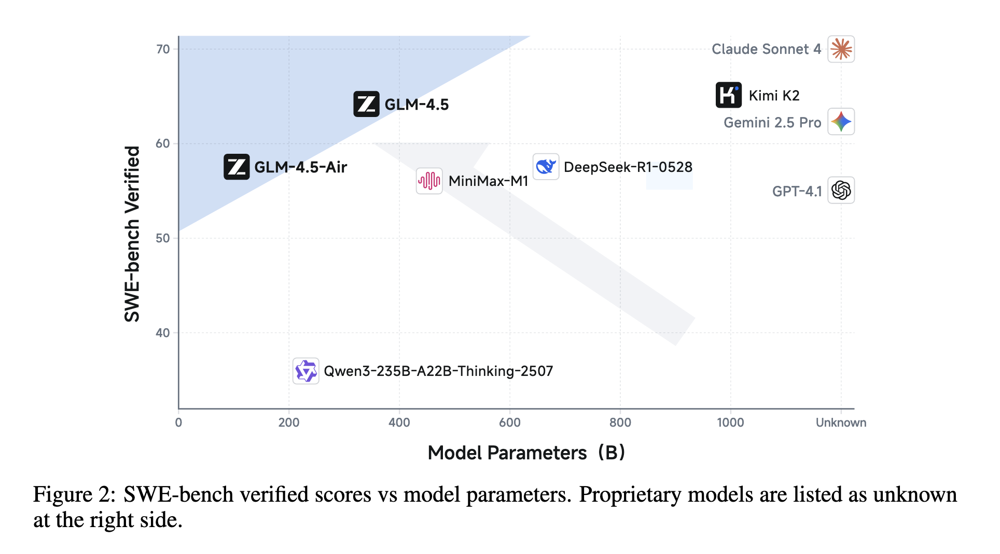
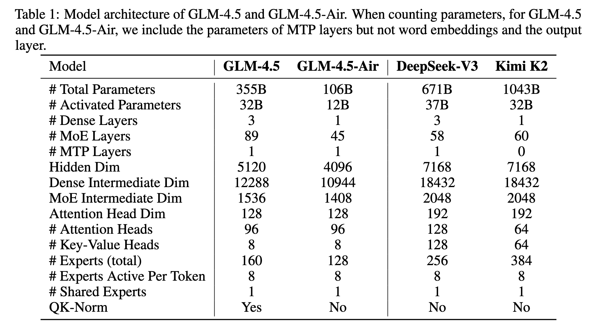
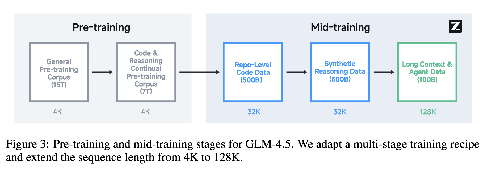
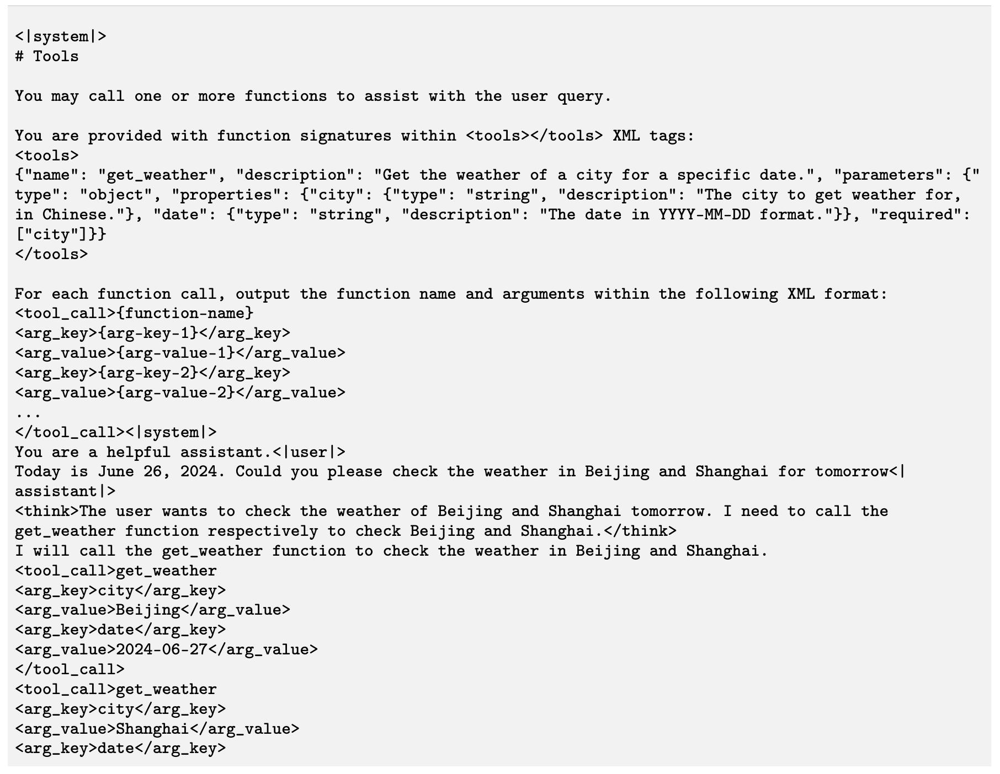
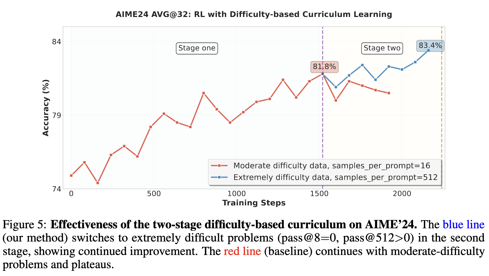
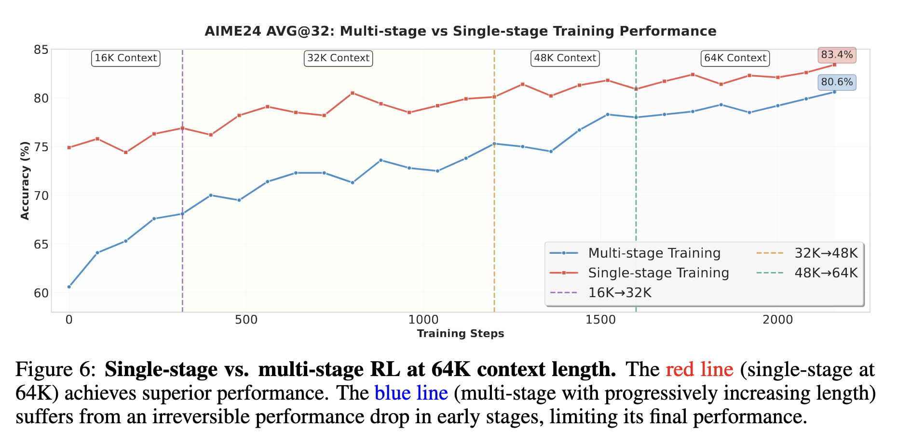
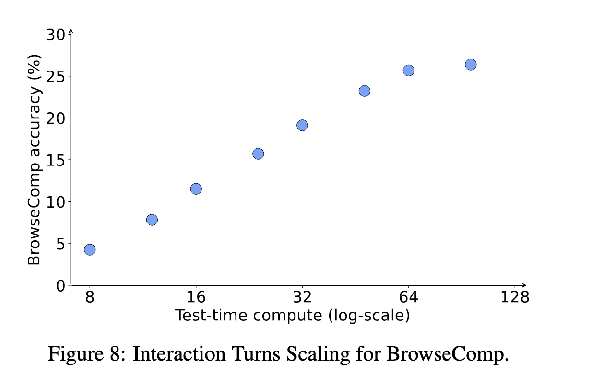
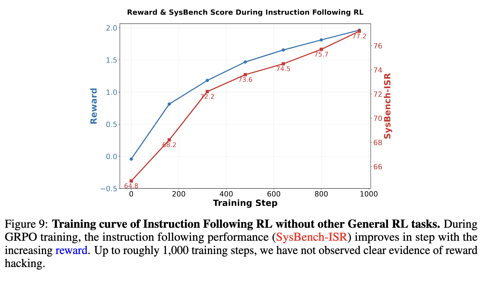

# 论文基本信息

标题：GLM-4.5: Agentic, Reasoning, and Coding (ARC) Foundation Models

作者：Zhipu AI & Tsinghua University

链接：http://arxiv.org/abs/2508.06471

代码：https://github.com/zai-org/GLM-4.5

GLM-4.5: 总参数355B，激活32B

GLM-4.5-Air: 总参数106B参数，激活12B

重点关注Agent能力、复杂推理能力、代码能力，认为这是衡量真正通用模型的标准。下图展示了GLM-4.5模型在这几个方面的能力水平，基本上都接近甚至超越Claude Sonnet 4的水平（仅指榜单）。

GLM-4.5-Air则和Qwen3-235B-A22B，MiniMax-M1等模型持平。

# 预训练
## 模型架构

- MoE层使用loss-free balance routing和sigmoid gates
- 减小模型的宽度（隐藏层维度和路由专家数量）并增加其高度（层数），因为作者发现越“高”的模型的推理能力越强。（Kimi K2是增加了专家数量）
- 使用具有部分 RoPE 的GQA
-  2.5 倍的注意力头（96 heads for a 5120 hidden dimension），虽然没有改善训练损失，但它会持续提高 MMLU 和 BBH 等推理基准的性能
- 结合QK-Norm来稳定注意力logit的范围。
- 添加一个 MoE 层作为 MTP（Multi-Token Prediction）层，以支持推理过程中的推测解码。

和其他模型架构的比较

## 预训练数据

包括来自网页、社交媒体、书籍、论文和代码存储库的文档。

1.网页：
- 训练数据的大部分来源，包括英文和中文。
- 将爬取到的网页分成不同质量分数的桶，**上采样高质量桶的数据，丢弃低质量桶中的数据**。
- 最高质量的数据训练超过 3.2 个 epoch
- 发现大量从模板自动生成并被分配了高分的相似网页，MinHash无法去除，使用SemDedup pipeline基于文档embeddings将这些网页去除。

2.多语言
- 来自爬取的网页和Fineweb-2
- 应用质量分类器来判断文档的教育效用，并对高质量的多语言文档进行**上采样**。

3.代码
- 来源于GitHub 和各种代码托管平台
- 经过基于规则的初步过滤，然后使用特定于语言的质量模型进行分类，将样本分为三个层次：高质量、中等质量和低质量。
- 同样地，**上采样高质量代码，同时排除低质量样本**。
- 使用**Fill-In-the-Middle**训练目标，该目标能让语言模型学会根据上下文预测中间缺失的内容，- 不仅依赖前文（prefix），还要考虑后文（suffix）。
- 分阶段从文本语料中选出代码相关的 Web 文档
	- 识别HTML代码标签的存在，或通过检测代码相关内容的FastText 分类器进行识别。
	- 使用专用模型对检索到的文档进行质量评估，分类为高、中或低质量类别，遵循基于质量的源代码采样策略。
	- 使用细粒度解析器重新解析选定的网页，以更好地保留代码的格式和内容。

4.数学和科学
- 来自网页、书籍和论文的数学和科学。
- 应用大型语言模型，根据数学和科学教育内容的比例对候选文件进行评分，并训练一个小的分类器来预测分数。预训练语料库中分数高于特定阈值的文档将被**上采样**。

GLM-4.5的预训练分成2阶段，在第一阶段，模型主要在通用的网页文档上进行训练。在第二阶段，在GitHub 的源代码、与编码、数学和科学相关的网页进行上采样。

## Mid-Training：提高推理和代理能力

这个阶段是为了加强模型在一些特定领域的能力，使用中等大小的特定领域数据集，包括指令数据。

### 领域数据集

1.Repo-level的代码训练
- 从同一存储库添加串联的代码文件以学习跨文件依赖关系。
- 将相关联的经过模型过滤的 issues、PRs 和 commits **合并到一个上下文中**。例如：
    - 一个 bug 报告（issue）
    - 修复这个 bug 的代码提交（PR）
    - 相关的代码更改（commits）
    - 这些都会被组合在一起，形成完整的上下文信息
- commits 以 **diff 格式**展示，diff 格式是显示代码更改的标准方式，通常包括：
	- `- 删除的代码行（红色）`
	- `+ 新增的代码行（绿色）`
- 将训练序列长度从 4K 扩展到 32K，以支持大型存储库。

2.合成推理数据训练
- 合成数学、科学和编码竞赛等推理数据。
- 方法是从网页和书籍中收集大量与推理任务相关的问题和答案，并用推理模型生成推理过程。

3.长文本和Agent训练
- 将训练序列长度从 32K 扩展到 128K
- 上采样预训练语料中的长文档
- 也使用了大规模的合成agent轨迹数据

### best-fit packing

预训练阶段 (Pre-training)：

- **没有使用**最佳适配打包 (best-fit packing)
	- BFP 是一种把多个较短文本拼接起来“填满”模型上下文窗口的方法——尽量把若干短文按大小组合，最大化每个训练样本利用整个上下文长度，从而减少在中间把一个重要长片段切断（truncation） 的情况。
- 原因：随机截断实际上是一种有效的数据增强策略
- 逻辑：在预训练阶段，模型需要学习语言的基本模式和知识，随机截断文档可以让模型接触到更多样化的文本片段，增加训练数据的多样性

中期训练阶段 (Mid-training)：

- **采用了**最佳适配打包策略
- 原因：避免截断推理过程或代码库级别的代码
- 逻辑：在这个阶段，模型需要学习更复杂的推理能力和理解完整的代码结构，截断会破坏这些重要的连续性信息

## 超参数

- 除了word embedding, bias, and weights for RMSNorm，其余参数用了**Muon优化器**
- Newton-Schulz iteration steps N to 5, momentum μ to 0.95, and scaled Muon’s update RMS to 0.2.
- 观察到Muon优化器可以加速收敛并容忍更大的批量
- 学习率使用**余弦衰减计划，而不是预热-稳定-衰减 （WSD） 计划**。
- 早期的实验表明，使用 WSD 训练的模型在一般基准（SimpleQA、MMLU）上表现较差，表明其在稳定阶段存在欠拟合。
- 学习率经历了从0到2.5e-4的热身阶段和到2.5e-5的衰减阶段，直到Mid-Training结束。
- 使用**批量大小预热策略**，在前 500B token 的训练中，批量大小从 16M token 逐渐增加到 64M token，并在剩余的训练中保持不变。
- 对于正则化，将权重衰减比设置为 0.1，并且没有使用 dropout。
- 在预训练阶段将最大序列长度设置为 4,096，并在Mid-Training阶段将其扩展到 32,768 和 131,072
- **在将序列长度扩展到 32K 时，将 RoPE 的基本频率从 10,000 调整为 1,000,000**，以获得更好的长上下文建模能力。
- 对于loss-free balance routing，将前 15T tokens的bias更新率设置为 0.001，其余tokens的bias更新率设置为 0.0。
- 应用了权重为 0.0001 的辅助序列水平平衡损失，以避免任何单个序列内的极端不平衡。
- 前 15T tokens的 MTP 损失权重 λ 设置为 0.3，剩余tokens设置为 0.1。

# Post-Training: 专家模型迭代

分为2个阶段
- **stage 1 (Expert Training)**：训练Reasoning, Agent,General chat三个专家模型
- **stage 2 (Unified Training)**：采用自我蒸馏技术来整合多个专家，最终提供一个能够通过深思熟虑推理和直接响应模式生成响应的混合推理模型。
## SFT

在Expert Training阶段，SFT主要提供一个冷启动作用，使用一小部分具有扩展思维链 （CoT） 响应的数据，为模型赋能基本的聊天、推理和工具使用能力。

在Unified Training阶段，SFT的目的是将不同专家模型的能力提炼成一个能够处理不同类型任务的混合推理通才。
- 从之前训练的专家模型中收集了数百万条数据，包括推理任务（数学、代码、科学等）、一般聊天（写作、翻译、摘要、闲聊等）、代理任务（基本工具使用、编码能力，特别是真实项目开发等）和 longcontext 理解任务，并使用最大上下文长度为 128K token 来训练基础模型。
- 平衡了包含完整推理的训练数据与缺乏明确思维过程的数据，允许模型在反思和即时响应模式下运行，从而创建一个混合推理模型。

此外还发现准备SFT数据的一些更好的策略：
- **减少函数调用模板中的字符转义**：大量的转义字符会增加模型的学习负担。
	- 作者提出了一种新颖的函数调用模板，该模板将函数调用键和值封装在类似 XML 的特殊标记中。这种方法大大减少了代码段中字符转义的必要性。

- **拒绝采样采取多阶段过滤pipeline**
	- （1）删除重复、过短、截断的样本，以及不符合有效推理格式的样本;
	- （2）对有客观答案的样本进行正确性验证;
	- （3）利用奖励模型过滤对主观问题的回答;
	- （4）对于工具调用场景，确保遵守正确的工具调用协议并验证轨迹是否达到预期的终端状态。
- **提示选择和响应水平缩放**
	- **过滤具有挑战性的提示并对其进行响应缩放**被证明是有效的。
	- 数据筛选实验：尝试根据响应长度删除后 50% 的提示，尽管只使用了一半的数据进行训练，但数学和科学任务提高了 2%-4%。
	- 响应扩展实验：对这些"困难提示"（hard prompts，即响应较长的提示）应用响应缩放，为每个提示生成4个不同的响应，而不是1个，又带来了1%-2%的额外改进。
- **自动代理 SFT 数据构建**
	- 1.代理框架和工具集合：构建工具生态系统
		- 收集现有的智能体框架和真实世界的工具API
		- 收集MCP服务器（Model Context Protocol服务器）
		- 自动化构建：使用LLM自动构造和模拟一批工具
	- 2.任务合成：基于工具自动生成训练任务
		- 成熟框架：让LLM理解框架功能，自动生成相关查询/任务
		- 零散工具：先选择代表性工具子集，然后类似地使用 LLM 来构建有关该子集的任务
		- 任务类型：包含单步和多步工具调用场景
	- 3.轨迹生成：为每个任务生成完整的执行过程
		- 使用现有LLM生成工具调用轨迹
		- **用户模拟**：让LLM扮演用户角色，将多步任务转换为多轮对话轨迹
	- 4.质量过滤：确保训练数据质量
		- 使用多个判断智能体评估任务是否成功完成
		- **只保留成功的轨迹**作为训练数据

## 推理 RL
推理 RL 侧重于增强模型在需要逻辑推理、结构化问题解决和可验证准确性的领域的能力。这包括数学、代码生成和科学推理等关键领域。

这些任务的一个决定性特征是其奖励信号的高精度，因为正确性通常可以通过编程或目标清晰度来确定。

采取GRPO框架，去掉KL损失项，**先在小模型上做实验，允许快速迭代和精确的消融研究**（下面展示的图都是小模型上的实验图）。

方法包括
1.**基于难度的课程学习**。
- 在强化学习过程中，模型的熟练程度不断发展，导致与静态训练数据不匹配。
- 早期应该采取相对简单的数据，后期加入难度升高的数据。
- 作者采取基于难度的两阶段 RL 课程。图5显示，这种两阶段方法使模型能够不断超越其性能上限。至关重要的是，为了保持高信号质量并降低噪声，第二阶段使用的所有问题都严格来自具有经过验证的正确答案的池。

2.**64K输出长度的单阶段RL**
- 先前的研究建议分多个阶段进行RL，并逐渐增加最大输出长度。
- 但作者们的实验表明，这种多阶段方法不如直接在最大目标长度64K下进行的单阶段RL过程有效。
- 由于最初的监督微调 （SFT） 已经将模型条件定为生成 64K 长度的响应，因此引入最大长度较短的 RL 阶段可能会导致模型“忘记学习”其长上下文能力
- 随着模型的平均输出长度减少，这通常会导致性能显着且不可逆转的下降。这种退化在最终的 64K 长度 RL 阶段很难恢复。

3.**动态采样的Temperature**：在模型训练似乎“停滞”时，主动引入可控的多样性（“噪音”）来帮助模型跳出可能的局部最优解，寻找更好的解决方案，但同时通过严格的检查防止多样性破坏已学到的良好性能。
- 训练过程中，会持续监控模型在一系列 Rollouts 中获得的平均奖励。当这个平均奖励值在一段时间内​​不再显著增长或开始稳定波动​​时，就认为模型进入了“​​收敛阶段​​”（Convergence Phase）。这意味着模型可能正在​​过度利用（over-exploiting）​​ 当前学到的策略，陷入了局部最优解，缺乏新的探索来找到更优解。
- 为了打破僵局，策略是​​主动提高采样温度​​。提高温度会使模型在生成下一步输出时，从概率分布中采样更分散，从而​​产生更多样化、更不可预测的 Rollouts​​。这相当于​​鼓励模型进行更多探索​​，尝试那些当前策略下概率较低但可能带来更高回报的行动或生成路径，有望帮助模型跳出局部最优，发现更好的策略。
- **盲目提高温度固然能增加多样性，但也伴随着风险**。温度过高会引入​​过多噪声​​，导致生成内容​​质量下降、不连贯或无意义​​，反而可能使模型性能​​退化​​，学到的策略变差。
- 为了在鼓励探索的同时​​确保模型性能不出现显著倒退​​，引入了一个​​基于验证集的性能监控机制​​：
1. ​​定期评估​​：在训练过程中，会定期在一个​​预留的、未见过的验证集​​上评估模型当前的表现。
2. ​温度扫描​​：在当前被认为“收敛”的模型基础上，​​尝试一系列不同的采样温度值​​（例如，从当前温度逐步向上增加），并在验证集上测试每个温度对应的模型性能。
3. 安全阈值​​：分析这些温度下的性能表现，​​选择那个能允许最大探索度（即最高温度）、但同时不会导致验证集性能比当前最佳性能下降超过1%的温度值​​。
4. 设定新温度​​：将这个选定的安全温度作为​​下一训练阶段的起始采样温度​​。

4.代码与科学 RL
- **代码RL**中，作者发现**损失计算的选择对于训练效率至关重要**。
- 如图 7（左）所示，与传统的序列均值损失相比，采用代币加权均值损失非常有益。加权方法提供了更细粒度、更稳定的梯度信号，从而显着加快收敛速度。该方法还有助于缓解序列级奖励固有的长度偏差，并有效抑制训练过程中过于简单或重复的“基本情况”样本的生成。
- 对于**科学RL**，作者对GPQA-Diamond基准的调查结果强调，**数据质量和类型是最重要的因素**。
- 如图 7（右）所示，与使用混合质量或未经验证的数据进行训练相比，仅使用专家验证的 RL 多项选择题可以显着提高性能。这一结果强调，即使对于多项选择题等简单格式的任务，严格过滤 RL 数据池以仅包含高质量、具有挑战性的实例对于有效的模型改进也至关重要。

## Agentic RL

### 数据收集和合成

针对网络搜索任务的数据合成管道
- ​目标​​：创建一种能够训练模型进行​复杂、多步骤网络信息检索​​的数据。
- 数据产出物：**要求苛刻的问答对（demanding question–answer pairs）​**​。这些问题不是简单直接的（如“中国的首都是哪里？”），而是需要​多步推理（multi-step reasoning）​ 并综合​​多个网页来源（multiple web sources）​ 的信息才能回答的复杂问题。
- **数据构建的两种方法**
	- ​​(1) 自动化管道（基于知识图谱的多跳推理）
	- ​(2) 人机回圈（Human-in-the-loop）：
		- 让人类专家参与数据制作。他们从​**​多个真实网页​**​中提取信息，并将其​**​选择性地模糊处理（selective obfuscation）​**​。
		- 创建​强化学习训练信号​：模型必须像解谜一样，根据被模糊化的上下文，推断出被替换的真实信息是什么。这为模型提供了一个非常明确的学习目标（reward）。

针对软件工程任务的评估基准
- 目标​：创建一个​​真实、可执行的软件开发基准​​，用于评估模型在编程任务上的能力。
- 来源​​：从代码托管平台GitHub上精心收集（curate）了大量的​​Pull Requests（拉取请求）​​ 和 ​​Issues（问题）​​。
- 内容：包括用户提示（User prompts）和可执行的单元测试（Executable unit tests）
- 评估环境：所有评估都在具有分布式系统的强化沙箱中运行，该系统既提供水平可扩展性，又提供强大的隔离保证。

### 通过强化学习和迭代自我蒸馏突破极限

**具有过程格式惩罚的结果监督**
- 对于网络搜索任务，将最终答案的正确性作为reward。
- 对于coding agents, 主要利用带有可验证测试用例的 SWE 数据进行 RL 训练。
- Web 搜索和 SWE 任务的 RL 训练导致其他任务和基准的普遍性能改进，例如一般工具使用和编码任务。
- 应用格式惩罚，以确保模型生成正确的工具调用格式。如果模型在代理跟踪生成过程中未能生成正确的工具格式，则该过程将停止，并且跟踪将获得零奖励。

**迭代蒸馏**
- 首先在初始冷启动模型上进行 RL 训练以提高agent性能。
- 一旦训练达到一定步数或趋于稳定，用第一阶段​**​经过RL训练后的模型​**​，去重新生成训练数据（即“回答”），然后用这些​**​高质量的新数据替换掉​**​最初用于SFT的​**​冷启动数据​**​。创建一个更优秀的SFT模型
- 然后在这个增强模型上进行进一步的RL训练，逐渐增加训练难度。

**通过交互轮次扩展Test-time Compute**
- 对于代理任务，观察到随着与环境交互的增加，性能显着提高。代理任务通过与环境不断交互来利用Test-time Compute。

## General RL

通用 RL 旨在全面提高模型的整体性能，修复潜在问题，并增强关键能力。

论文方法的核心是一个多源反馈系统，它协同了**基于规则的反馈、人类反馈 （RLHF） 和基于模型的反馈 （RLAIF）**。这种混合框架提供了更强大的训练信号，能够利用每个来源的独特优势：自动化规则的精确性、人类注释者的细致入微的判断以及人工智能驱动评估的可扩展性。

### 整体RL

整体 RL 的目标是跨不同领域的广泛性能提升。
- 构建了一个平衡的数据集：包含大约 5,000 个提示，涵盖 7 个主要类别、33 个次要类别和 139 个第三类别。
- 整体 RL 的奖励信号来自人类和人工智能反馈。
	- **人类反馈**：在偏好注释上训练奖励模型。注释者比较模型响应，并根据对指令遵循、安全性和事实正确性等多个维度的综合评估来分配偏好标签。
	- **模型反馈**：设计了单独的评分标准，具体取决于提示是否有客观的正确答案。
- 合并两个反馈源会产生更可靠、更具表现力的奖励信号，从而减轻每种方法的固有局限性。

### 遵循 RL 的指令

指令遵循 RL 提高了模型理解和满足复杂指令的能力。
- 创建了一个具有 7 种主要约束类型和 151 种次要约束类型的细粒度分类，涵盖内容要求、格式规则等。基于此分类法，组装了一组专用的具有挑战性的指令训练集，以涵盖每种约束类型。
- 反馈系统由**确定性验证规则、训练奖励模型和批评模型**组成。这种混合反馈系统的稳健性在 GRPO 训练中至关重要。作者观察到奖励黑客攻击的缓解，使策略模型能够实现指令遵循的持续和稳定改进，如图 9 所示。

### 函数调用 RL

函数调用 RL 分为基于规则的逐步 RL 和端到端多轮 RL。对于端到端的多轮 RL，首先训练专门的专家模型，然后将这些专家提炼成主模型。

**基于规则的逐步 RL**
- 对于具有明确工具调用过程的任务，为训练数据中的每个步骤/回合对正确的函数调用进行标注。
- 给定任务和前一步/轮次的函数调用，训练模型生成下一个助手响应，可以是函数调用，也可以是对用户的响应。
- 基于规则的奖励：包括格式奖励、答案正确性奖励，都正确才会给1分，否则0分。

**端到端多轮 RL**
- 模型首先生成完整的轨迹，然后根据任务完成情况获得奖励。
- 通过这种方式，模型可以通过工具反馈的不断试错来优化其行动策略，从而显着增强其自主规划和决策能力。
- 考虑了两种类型的复杂任务
	- 单轮多步骤任务：模型需要进行多步骤函数调用，并与环境交互才能完成此类任务。使用基于 MCP 服务器自动合成的复杂任务，以及一些具有可运行环境的开源代理数据集，例如 Agentgym。
	- 多轮多步骤任务：除了与工具执行环境交互外，模型还需要与LLM模拟的用户代理进行交互，以获取完整的任务信息并完成整体任务。
- 奖励：每一步的格式正确，且完成任务得1分，否则0分。是否完成任务由预定义规则或由 LLM 法官判断。

### Pathology RL

作为后训练的最后阶段，**通用RL需要纠正潜在的问题**，如语言混合、过度重复、格式错误等。

尽管在上述通用RL任务中惩罚此类行为是有效的，但是这样做样本效率低下，因为这些问题的低发生率很低（通常不到输出的1%）。

因此，作者通过识别极有可能触发这些病理行为的提示来策划目标数据集。对该数据集进行训练能够施加有效的惩罚，进一步降低这些问题行为的残余错误率。

## RL Infrastructure

使用团队开发的开源框架 Slime。

不同的 RL 任务受益于不同的调度方法。

对于通用 RL 任务或旨在增强模型推理能力的任务（例如，在数学和代码生成中），同步、共置的架构更有效。在此设置中，训练引擎和推理引擎驻留在同一个工作程序上。这与动态采样相结合，显着减少了 GPU 空闲时间并最大限度地提高了资源利用率。

对于代理任务，例如软件工程 （SWE） 中的任务，数据生成过程通常很漫长，并且涉及复杂的系统交互。为了确保代理环境能够连续运行并最大限度地提高数据吞吐量，采用了分解的异步模型。RL 框架的推出组件直接暴露给代理环境，而用于训练和推理的 GPU 则独立调度。这种解耦使代理环境能够不断生成新数据，而不会因训练周期而停滞不前。通过利用 Ray 框架的资源调度和异步功能，可以灵活地将推理和训练引擎放置在相同的 GPU 上或不同的 GPU 上。这种对同步和异步训练的双重支持允许不同的 RL 任务共享一组通用的训练和推理底层优化。

推出效率是 RL 训练中持续存在的瓶颈。为了解决这个问题，我们的基础设施支持 BF16 进行训练，同时利用 FP8 进行推理以加速数据生成阶段。在每次策略更新迭代期间，我们都会在模型参数被调度以进行部署之前，对模型参数执行在线、按块的 FP8 量化。这种动态量化可实现高效的 FP8 推理，显着提高数据收集过程的整体吞吐量。

# 评估

## 参考资料
