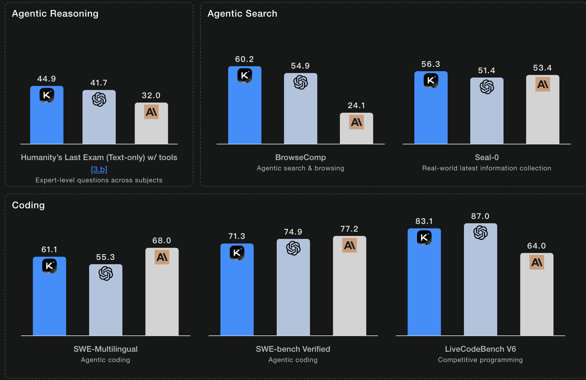
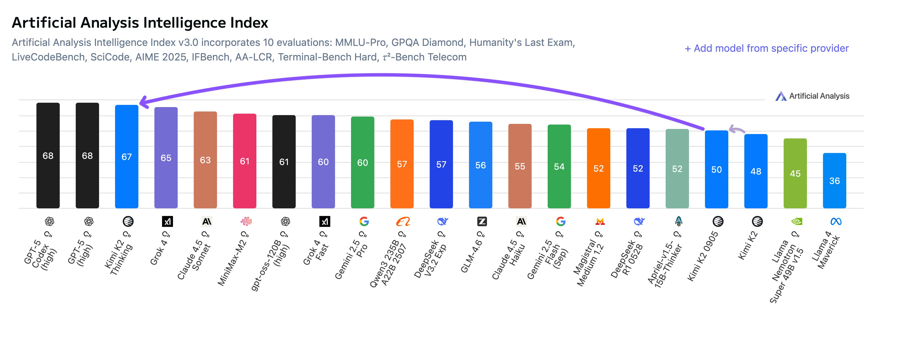
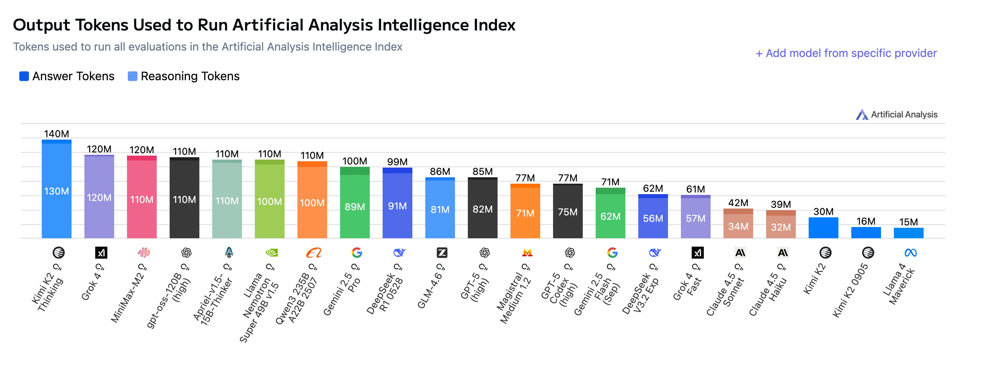
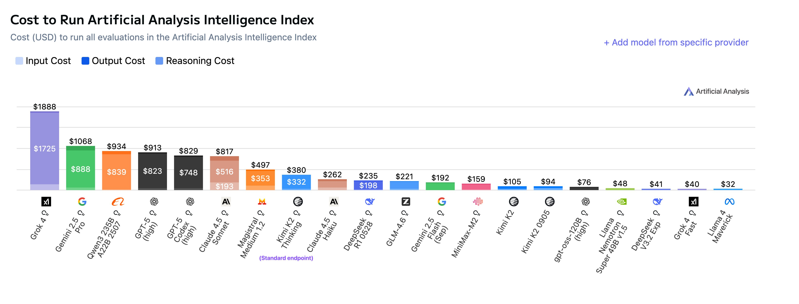
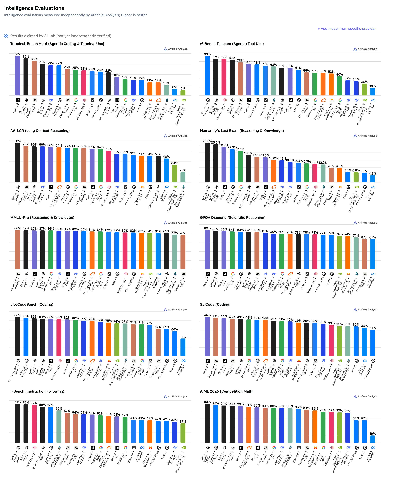

## 基本信息

Kimi这次开源了Kimi K2 Thinking模型，4个月和2个月前开源/更新了Kimi K2非思考模型[Kimi-K2](Kimi-K2.md)，从官方技术报告来看，Thinking模型有可能只做了后训练的改动。

技术报告： https://moonshotai.github.io/Kimi-K2/thinking.html

模型权重： https://huggingface.co/moonshotai

擅长：reasoning, agentic search（边想边搜，边搜边做）, and coding

细节：纯文本（无图像输入），256K 上下文窗口，以 INT4 精度原生发布，总参数 1T，激活参数32B（~594GB）

成本方面，`Kimi K2 Thinking` 的训练仅花了 460 万美元，比 `DeepSeek V3` 的 560 万还低，更不用说 `GPT-5` 的数十亿美元了。

## 榜单评估（来自官方）

它作为一个思考agent而构建，在使用工具的同时逐步推理，在Humanity's Last Exam （HLE）、BrowseComp 和其他基准测试中取得了最先进的性能，在推理、agent搜索、编码、写作和通用能力方面取得了重大进展。

Kimi K2 Thinking 可以在没有人工干预的情况下执行多达 200 – 300 次连续工具调用，在数百个步骤中连贯地推理以解决复杂问题。

创意写作：K2 Thinking 提高了完整性和丰富性。它表现出更强的风格和教学能力，以自然流畅的方式处理不同的语气和格式。它的写作变得更加生动和富有想象力——诗意的意象带有更深层次的联想，而故事和剧本则让人感觉更加人性化、情感化和目的性。它所表达的思想往往达到更大的主题深度和共鸣。

实用写作：K2 思维在推理深度、视角广度和指令依从性方面表现出显着的进步。它以更高的精度遵循提示，清晰、系统地满足每个要求——通常会扩展提到的每一点以确保全面覆盖。在学术、研究和长篇分析写作中，它擅长产生严谨、逻辑连贯且实质丰富的内容，使其在学术和专业环境中特别有效。

个人和情感：在解决个人或情感问题时，K2 Thinking 会以更多的同理心和平衡来回应。它的反思深思熟虑且具体，提供了细致入微的观点和可行的后续步骤。它帮助用户清晰而谨慎地做出复杂的决策——脚踏实地、实用且真正人性化的语气。

**榜单介绍**

Humanity's Last Exam （HLE）：一个精心设计的封闭式基准测试，涵盖 100 多个科目的数千道专家级问题

BrowseComp：这是一个专门为评估“网页浏览／信息检索／代理（agent）”能力而设计的基准。由 OpenAI 推出。模型或代理必须在网络上浏览、检索、并找到 **难以直接搜到** 的信息，例如要在大量网页中通过多步查找才能定位。

Seal-0：这是属于一个更大的基准系列 SealQA (“SEarch-Augmented Language models QA”) 中的一个子集。专注于“搜索增强语言模型”在有**冲突、噪声、误导性搜索结果**的环境下仍能得出正确答案的能力。Seal-0 是那个特别难／模型普遍失手的分支。

SWE‑Multilingual 及 SWE‑Bench Verify：这是归属于 SWE‑bench 系列（Software Engineering Benchmarks）中的不同子集：
- “Multilingual” 指的是多语言版本（不同编程语言、不同自然语言环境）版本。
- “Verified” 指的是经过人工过滤、质量更高、可靠性更强的子集。
模型在 **实际软件工程任务**（如 GitHub 问题修复、代码调试、补丁生成、不同语言／环境下）上的执行能力。

LiveCodeBench V6：是一个动态更新的基准测试平台，专为评估大型语言模型（LLMs）在代码处理能力上的表现而设计。设计理念包括实时性、多样化任务和持续更新。它从 LeetCode、AtCoder 和 CodeForces 等竞赛平台收集高质量编程问题，涵盖代码生成、代码执行、测试输出预测和代码自修复等多种能力评估。问题集定期更新，避免模型因过拟合静态数据集而获得不真实的高分。

## 其他榜单

来自： https://x.com/ArtificialAnlys/status/1986911675820446013

https://artificialanalysis.ai/models/kimi-k2-thinking

Artificial Analysis榜单中，Kimi K2 Thinking 在人工智能分析智能指数（Artificial Analysis Intelligence Index）中获得了 67 分，明显高于 gpt-oss-120b （61）、MiniMax-M2 （61）、Qwen 235B、A22B 2507 （57） 和 DeepSeek-V3.2-Exp （57），在专有模型中仅次于 GPT-5。

性能与成本：该模型在人工分析智能指数（Artificial Analysis Intelligence Index）的评测中使用了 **有史以来最多的 1.4 亿个 token**。  
然而，由于 Moonshot 官方 API 的定价为：
- 输入 token：每百万 $0.6 美元
- 输出 token：每百万 $2.5 美元（基础端点）
    
因此运行整套评测的总成本为 **$356**，低于主流前沿专有模型的运行成本。
Moonshot 还提供一个更快的 **Turbo 端点**，定价为：
- 输入 token：每百万 $1.15 美元
- 输出 token：每百万 $8 美元

在 Turbo 模式下，运行整套评测的总成本为 **$1172**——这使它成为仅次于 Grok 4 的第二昂贵模型。  不过，基础端点的输出速度较慢（约 **8 token/s**），而 Turbo 模式稍快（约 **50 token/s**）。

强大的代理性能：Kimi K2 Thinking 在代理环境中表现出特别的优势，正如它在人工分析代理指数中的 #2 位置所证明的那样 - 它仅次于 GPT-5。其优势主要来自于在 **τ²-Bench Telecom** 评测中取得 **93%** 的成绩。该基准测试模拟客户服务代理的工具使用场景，这是迄今为止我们独立测得的最高分。K2 Thinking 延续了前代 K2 Instruct 在长程任务与工具调用上的优势，并取得了显著进步。

开放权重中的顶级代码模型（Coding）：虽然 K2 Thinking 未能在任何代码任务中获得第一，但总体表现仍居前列：
- Terminal-Bench Hard：第 6 名
- SciCode：第 7 名
- LiveCodeBench：第 2 名
在开放权重模型中，它在每项评测中都位列第一或并列第一，  因此在 _Artificial Analysis Coding Index_（人工分析编码指数）中超越了此前的领导者 DeepSeek V3.2。

Humanity’s Last Exam 的最大飞跃：在 _Humanity’s Last Exam_（人类最后测试）评测中，K2 Thinking 取得 **22.3%（无工具）** 的成绩， 这是开放权重模型的**历史最高分**，仅次于 GPT-5 和 Grok 4。

冗长特性：Kimi K2 Thinking 在智能指数测试中共使用了 **1.4 亿个 token**，是 DeepSeek V3.2 的 **2.5 倍**，GPT-5 的 **2 倍**。与不太冗长的模型相比，这种高冗长性会带来更高的成本和更高的延迟。在 Mooshot 的基本端点上，K2 Thinking 比 GPT-5（高）便宜 2.5 倍，但比 DeepSeek V9（运行人工智能智能指数的成本）贵 3.2 倍

## 推理效率

为了克服低比特量化导致的性能大幅下降（尤其在模型的生成长度变得更长的情况下）的挑战，Kimi团队在后训练阶段采用了量化感知训练(QAT)，将 INT4 仅权重量化应用于 MoE 组件。它允许 K2 Thinking 支持原生 INT4 推理，生成速度提高了大约 2 倍，同时实现了最先进的性能。所有基准测试结果均在 INT4 精度下报告。

一些概念介绍：
- PTQ：训练后量化，将训练完成的模型权重通过特定的量化方法量化到对应的精度。
- QAT：训练感知量化，在训练阶段就让模型提前适应某部分的权重/激活被量化到更低比特数下产生的精度损失。通常来说相比PTQ流程更加复杂但精度损失更小。
- W(n)A(m)：模型权重(weight)使用n-bit，激活(activation)使用m-bit。

### 什么是量化感知训练？

**1. 首先，理解“量化”**

在AI模型中，权重和激活值通常以高精度格式存储，比如32位浮点数或16位浮点数。**量化**是一种模型压缩技术，它的核心思想是：**使用更低比特宽度的数据格式来表示这些权重和激活值**，例如从FP32降到INT8（8位整数）甚至INT4（4位整数）。

- **好处**：
    - **减小模型体积**：INT4的模型大小只有FP32模型的约1/8。
    - **加快推理速度**：整数运算在硬件上的计算速度通常远快于浮点运算。
    - **降低功耗和内存带宽**：移动设备和边缘设备非常看重这一点。

- **传统量化（训练后量化）的缺点**：
    最常见的方法是在模型**训练完成之后**，再将其权重转换为低精度格式。但这个过程会引入**量化误差**，因为从高精度到低精度的舍入操作会丢失信息。对于复杂的模型或低比特量化（如INT4），这种误差可能导致模型精度显著下降。

**2. 量化感知训练的核心思想**

QAT就是为了解决上述“精度损失”问题而诞生的。

**QAT的核心思想是：在模型训练的过程中，就模拟量化操作，让模型“提前感知”和“适应”未来在推理时会遇到的量化误差。**

可以把QAT想象成一场“带噪训练”：
- **传统训练**：学生在安静的环境下学习（高精度浮点数）。
- **训练后量化**：学生学完后，突然把他扔进一个嘈杂的考场（低精度整数），他可能发挥失常。
- **量化感知训练**：学生在学习期间，就在一个模拟的嘈杂环境中练习（前向传播时模拟量化），这样他就能学会如何在这种环境下依然做出正确判断，最终在真实考场中表现更好。

**3. QAT的工作流程**

一个典型的QAT流程如下：
1.  **预训练**：首先，在FP32精度下正常训练得到一个高精度的模型。
2.  **插入伪量化节点**：在这个训练好的模型图中，在需要量化的操作（如卷积、矩阵乘法）前后插入“伪量化”模块。这些模块在**前向传播**时，会模拟将FP32数值量化为低比特（如INT4），再反量化为FP32的过程。这样，前向计算中包含了量化误差。
3.  **微调训练**：使用训练数据对这个“改造后”的模型进行微调。在**反向传播**时，由于量化操作（如四舍五入）的导数几乎处处为零，无法直接求导，因此会使用**直通估计器** 来近似梯度，使得训练能够继续。
4.  **部署**：训练完成后，将这些伪量化模块替换为真正的定点整数运算，得到一个既保持高精度又具备高效推理能力的模型。

**总结：量化感知训练通过在训练阶段模拟量化噪声，让模型权重学会自我调整以适应未来的低精度表示，从而在最终量化部署时最大限度地保持模型的性能。**

### 为什么要做反量化？

核心原因在于：**绝大多数硬件（如CPU和GPU）的计算核心是为高精度浮点数计算设计的，它们无法直接对INT4数据进行数学运算。**

1. **硬件限制**：你可以把INT4权重想象成高度压缩的、打包好的货物。计算单元（ALU）是处理这些货物的“工厂流水线”，但这个流水线是为处理FP16或FP32这种“标准尺寸”的货物设计的。它不认识、也无法直接处理INT4这种“微型货物”。因此，在使用前，必须先把这些“微型货物”解压成“标准尺寸”。
    
2. **数值精度与稳定性**：INT4的数值表示范围非常有限（例如只有16个整数）。直接进行INT4之间的乘加运算，非常容易溢出（超过表示范围）或下溢（精度损失殆尽），导致计算结果完全错误。反量化为FP16/FP32后，计算是在一个更宽、更动态的数值范围内进行的，保证了计算的数值稳定性。

### 反量化是如何发生的？

这个过程并非像解压一个ZIP文件那样，将整个模型的权重都还原到FP16再开始计算，那样就失去了量化的意义。实际上，它是一个 **“即用即解压”** 的流水线操作。

我们以一次矩阵乘法为例（这是神经网络中最核心的操作）：  
`Y = X · W`

- `X` 是输入数据（激活值），通常是FP16精度。
    
- `W` 是模型权重，已经被量化为INT4格式存储在内存中。
    
- `Y` 是输出结果。
    

其计算步骤如下：

1. **内存加载**：从内存中将INT4格式的权重 `W_INT4` 加载到处理器的缓存或寄存器中。**这一步是量化的主要收益所在：INT4数据占用的内存带宽只有FP16的1/4，传输速度更快、更节能。**
    
2. **即时反量化**：在数据进入计算核心**之前**，一个专用的硬件单元或微指令会将这些 `W_INT4` **即时地**反量化为FP16（或FP32，取决于硬件和配置）格式，得到 `W_FP16`。
    
3. **高精度计算**：计算核心接收输入数据 `X_FP16` 和反量化后的权重 `W_FP16`，执行标准的FP16精度矩阵乘法，得到输出 `Y_FP16`。

### 现代硬件的优化：INT计算单元

值得注意的是，为了加速AI推理，**现代GPU和专用AI加速器已经开始集成可以直接执行低精度整数运算的硬件单元**。

在这种情况下，流程会有所不同：

1. 同样从内存加载 `W_INT4`。
    
2. 同样从内存加载 `X_FP16`。
    
3. 在计算之前，**输入数据 `X_FP16` 会被动态地量化为 INT8**（或类似精度），以匹配权重的精度。
    
4. **专用的INT计算核心** 直接执行 `X_INT8` 和 `W_INT4` 之间的整数矩阵乘法。
    
5. 得到的 `Y_INT32` 结果（因为整数乘加会累积到更高位宽）再反量化为最终的 `Y_FP16` 输出。
    

**即使在这个更先进的流程中，“反量化”步骤依然存在（第3步和第5步），只是它被整合进了计算流程，并且可能只在输入和输出端进行。**

### 将 INT4 仅权重量化应用于 MoE 组件

这句话是Kimi团队将QAT技术应用在Mixtral of Experts模型上的具体实践。我们来拆解它：

**1. INT4 仅权重量化**

- **INT4**：指的是量化的目标精度，即用4位整数来表示数值。这是目前非常激进的量化级别，能带来约8倍的模型压缩。
- **仅权重**：指的是**只对模型的权重进行量化，而激活值（前向传播过程中的中间结果）保持为较高的精度**（例如FP16或BF16）。
    - **为什么这么做？** 因为权重是静态的，一经确定就不会改变，量化它们相对简单且稳定。而激活值是动态的，对量化更敏感，保持其高精度可以更好地维持模型的表达能力和稳定性，尤其是在INT4这种低比特下。

**2. MoE 组件**

- **MoE**：混合专家模型。它不是单个巨大的模型，而是由许多“专家”网络和一个“门控网络”组成。
    - **门控网络**：根据输入，决定将数据分配给哪个或哪几个“专家”。
    - **专家网络**：一群专门处理不同子任务的小型神经网络。
- **MoE的优势**：在总参数量巨大的情况下（例如千亿级别），对于任何一个给定的输入，只有一小部分专家会被激活进行计算。这使得它在拥有极强能力的同时，计算成本远低于同等规模的稠密模型。

**3. 整体含义与动机**

“将 INT4 仅权重量化应用于 MoE 组件” 这句话的意思是：

**在Kimi的MoE模型中，他们使用量化感知训练的方法，专门将模型中各个专家网络的权重从高精度（如FP16）压缩到了INT4格式，而激活值和门控网络可能仍然保持较高精度。**

**这么做的动机非常明确：**

1.  **极致压缩，降低部署成本**：MoE模型的参数量极其庞大，是部署和推理的主要瓶颈。将这些“沉睡”在硬盘和内存中的专家权重用INT4表示，可以**dramatically 减小模型体积**，降低存储和加载的开销。
2.  **保持性能**：通过**QAT**，让专家网络在训练阶段就适应INT4的表示，从而在量化后性能损失降到最低。
3.  **计算效率最大化**：由于MoE的稀疏激活特性，对于每个Token，实际上只调用少数几个专家。将这些被调用专家的INT4权重从内存加载到计算核心的速度会快得多，并且可以在支持INT4计算的硬件上进行**高速的整数矩阵运算**，从而大幅提升推理速度。
4.  **权衡策略**：“仅权重量化”是一个明智的权衡。MoE模型已经通过稀疏激活节省了大量计算，如果再对动态的激活值进行激进的INT4量化，可能会引入过多噪声，影响门控网络的路由决策和专家的输出质量。因此，保持激活值的高精度是保证模型整体稳定性和精度的关键。

### 团队成员相关分享

**问：为什么要做QAT量化？**

在Kimi-K2模型上，Kimi内部有验证过在4-bit这个精度下，PTQ可以做到在能观测到的所有benchmark上近乎无损。

然而，当进入K2-Thinking的研发阶段，这个结论被推翻了：随着模型的生成长度变得越来越长，原本的block FP8推理精度和INT4 PTQ的结果呈现出了统计意义上的明显差别。一个可能的原因是随着decoding计算次数的增加，量化产生的误差被不断累积了。

此外，团队还观察到了INT4 PTQ的另一个劣势：依赖校准集。团队测试了一些在训练集中出现过，但未在PTQ校准集中出现的case，发现FP8模型可以很好地背诵下这些训练数据，而量化后的模型则会换一种表述方式甚至遗忘相关的内容。关于这个问题目前的大致猜测是当moe非常稀疏时，尽管已经用了较大规模的校准数据，仍然会有部分专家只被路由到了少量token，进而导致这些专家的量化结果产生明显的“失真”。

**问：怎么做的？**

weight-only QAT采用的就是常见的fake-quantization+STE（直通估计器）方案。保存原始的bf16权重，通过量化-反量化得到模拟精度损失后的权重，进行矩阵乘，反向传播时再将梯度直接更新到原始的bf16中。

这里面涉及：(1) QAT训练逻辑 (2) int4的完整推理流程 (3) QAT得到的模型到int4推理模型的转换 (4) RL rollout部署方案 (5) colocate更新训推框架中int4权重。

经过算法同学的多方验证，**以上这套QAT方案可以在整个post-training阶段不改变任何训练配方，不增加任何训练token数的前提下实现近乎无损**。具体反映在loss有非常非常微小的gap，而benchmark分数保持一致。

**问：为什么选择INT4而非MXFP4/NVFP4等更“先进”的格式**

gpt-oss就在后训练时用了MXFP4的QAT。Kimi是为了更好地支持非Blackwell架构硬件。在团队的quant scale粒度（1x32）下，INT4的表示能力是不输给以上两种FP4格式的（4bit总共就16个数，scale的灵活度也非常重要）。而且基于INT4的W4A16 MoE，业界已经有了相当高效的Marlin kernel实现。因此，单纯看W4A16这个场景，无论是从适配性、精度还是效率上，INT4都可以认为是一个足够优秀的选择了。

## 参考资料

Kimi官方技术报告

Artificial Analysis

DeepSeek

Kimi K2 Thinking模型发布并开源，该模型哪些信息值得关注？ - 刘少伟的回答 - 知乎
https://www.zhihu.com/question/1969558404759544488/answer/1970539327902679960

