## 论文基本信息

标题：KIMI K2: OPEN AGENTIC INTELLIGENCE

作者：Kimi Team

链接：https://github.com/MoonshotAI/Kimi-K2/blob/main/tech_report.pdf

代码：https://github.com/MoonshotAI/Kimi-K2

模型地址：https://huggingface.co/moonshotai/Kimi-K2-Instruct

## 📌 一句话总结：
Kimi K2 是一个 **1万亿参数、32B激活参数的 MoE 模型**，通过创新的训练优化器（MuonClip）、大规模智能体数据合成管道和强化学习框架，在**非思考模式下**实现了当前开源模型中最强的**智能体能力**和**代码能力**。

## 核心亮点总结

| 模块 | 创新点 | 作用 |
|---|---|---|
| **MuonClip 优化器** | 在 Muon 基础上引入 QK-Clip 技术，解决训练不稳定问题 | 训练 15.5T tokens 无 loss spike，提升 token 效率 |
| **智能体数据合成** | 构建 2W+ 合成工具 + 3K+ 真实工具，模拟多轮交互 | 训练模型掌握复杂工具调用任务 |
| **强化学习框架** | 结合可验证奖励（RLVR）+ 自我批判奖励（Self-Critique） | 提升模型在复杂任务中的泛化与对齐能力 |
| **模型架构** | 384 experts（稀疏度 48），64 注意力头，MLA 机制 | 在推理效率和性能之间取得平衡 |
| **评测结果** | SWE-bench Verified 65.8%、AIME 2025 49.5%、GPQA-Diamond 75.1% | 在非思考模式下超越多数开源/闭源模型 |

## 训练优化器：MuonClip

### 问题背景
- Muon 优化器虽然 token 效率高，但在大模型训练中容易出现 **attention logit 爆炸**，导致训练不稳定。

### 解决方案：QK-Clip
- **机制**：对 attention 的 query/key 权重做动态裁剪（per-head）
- **公式**：当某个 attention head 的最大 logit 超过阈值 τ（=100）时，按比例缩放 Wq 和 Wk
- **效果**：
  - 训练过程无 loss spike
  - 不影响最终模型性能（见论文附录 D）

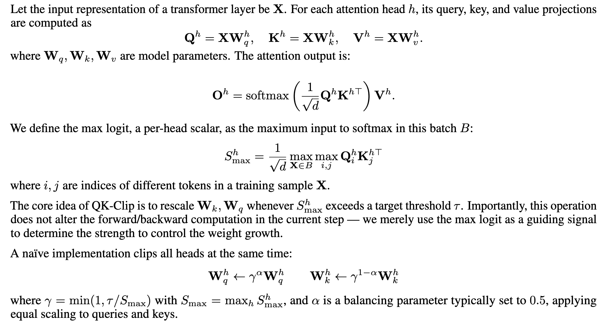

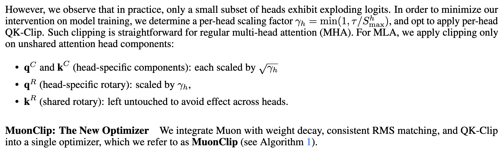

**实验过程**：
1. 使用原版 Muon 训练一个中等规模的53B 总参数， 9B 激活参数的混合专家（MoE） 模型。如图 2 （左）所示，最大注意力 logits 迅速超过 1000 的数量级，这表明注意力 logits 爆炸式增长在 Muon 训练中已经很明显。此级别的最大对数通常会导致训练期间的不稳定，包括显著的损失峰值和偶尔的背离。

2. 训练两个小规模的3B 总参数， 0.5B 激活参数的MoE 模型，一个使用普通 Muon，另一个使用 MuonClip（τ = 30）。应用 MuonClip 对损失曲线的影响可以忽略不计，对下游任务的评估显示，性能没有统计学上的显着下降。证明了 QK-Clip 不会降低模型性能，并确认 MuonClip 优化器保留了 Muon 的优化特性，而不会对损失轨迹产生不利影响。附录 D 中提供了实验设计和结果的详细讨论。 

3. 使用 τ = 100 的 MuonClip 训练大规模 MoE 模型 Kimi K2，并在整个训练运行过程中监控最大注意力对数（图 2 （右））。最初，由于 QK-Clip，logit 的上限为 100。在训练过程中，最大 logits 逐渐衰减到典型的工作范围，而无需对 τ 进行任何调整。重要的是，训练损失保持平滑和稳定，没有观察到峰值，如图 3 所示，验证了 MuonClip 在大规模语言模型训练中为注意力动态提供了稳健且可扩展的控制。

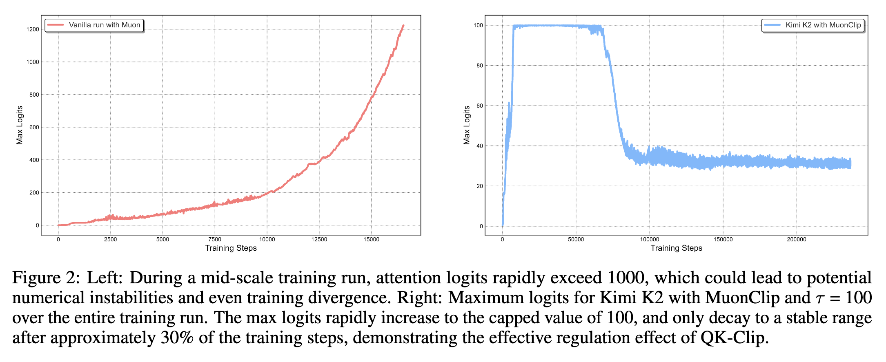

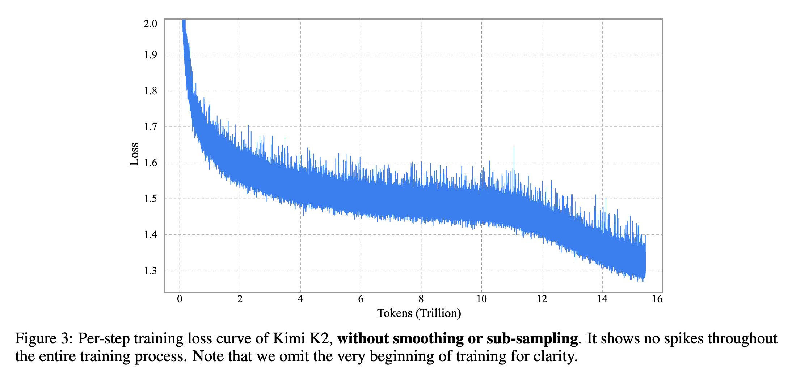

## 预训练数据：提升 token 效率

| 数据类型 | 处理方式 | 目的 |
|---|---|---|
| **知识类文本** | 使用 LLM 重述（rephrasing） | 避免重复训练，提升 token 效率 |
| **数学类文本** | 转换为“学习笔记”风格，支持多语言 | 增强数学推理能力 |
| **代码类文本** | 引入真实 GitHub PR + 合成代码 | 提升代码理解和生成能力 |
预训练中的 Token 效率是指在训练期间消耗的每个 Token 实现了多少性能提升。提高token效用（每个token提供的有效学习信号）增强了每个token对模型更新的影响，从而直接提高了token效率。当高质量token的供应有限并且必须最大限度地利用时，这一点尤其重要。提高token效用的一种朴素的方法是通过重复训练相同的token，但这可能导致过拟合和泛化程度降低。

与 Kimi K1.5 相比，Kimi K2 的预训练数据的一个关键进步是引入了合成数据生成策略来提高token效用。具体来说，采用精心设计的改写管道来放大高质量token的数量，而不会引起显著的过拟合。

知识类文本重述的方法包括
- Style- and perspective-diverse prompting：为了增强语言多样性，同时保持事实完整性，应用一系列精心设计的提示指导大型语言模型以不同的风格和不同的角度对原始文本进行忠实的改写。
- Chunk-wise autoregressive generation：为了保持全局一致性并避免长文档中的信息丢失，采用了基于块的自回归重写策略。文本被分成几个片段，单独改写，然后重新拼接在一起形成完整的段落
- Fidelity verification：为了确保原始内容和重写内容之间的一致性，执行保真度检查，将每个改写段落的语义对齐与其来源进行比较。这是训练前的初始质量控制步骤。

通过在 SimpleQA 上测试数据改写与多epoch重复的相应准确性来比较效果。用 K2 的早期检查点进行实验，并评估三种训练策略：(1) repeating the original dataset for 10 epochs, (2) rephrasing the data once and repeating it for 10 epochs, and (3) rephrasing the data 10 times with a single training pass.。如表 1 所示，这些策略的准确性不断提高，证明了基于改写的增强的有效性。将这种方法扩展到其他大规模知识语料库，并观察到类似的令人鼓舞的结果，每个语料库最多改写两次。

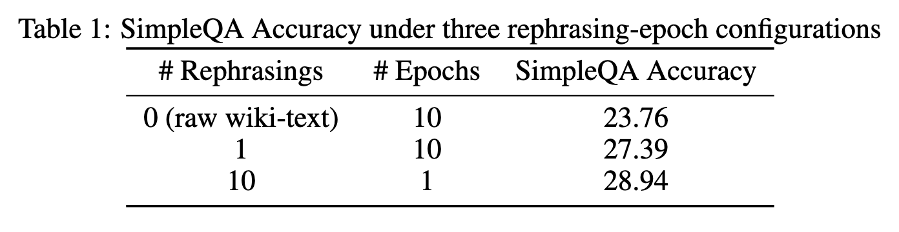

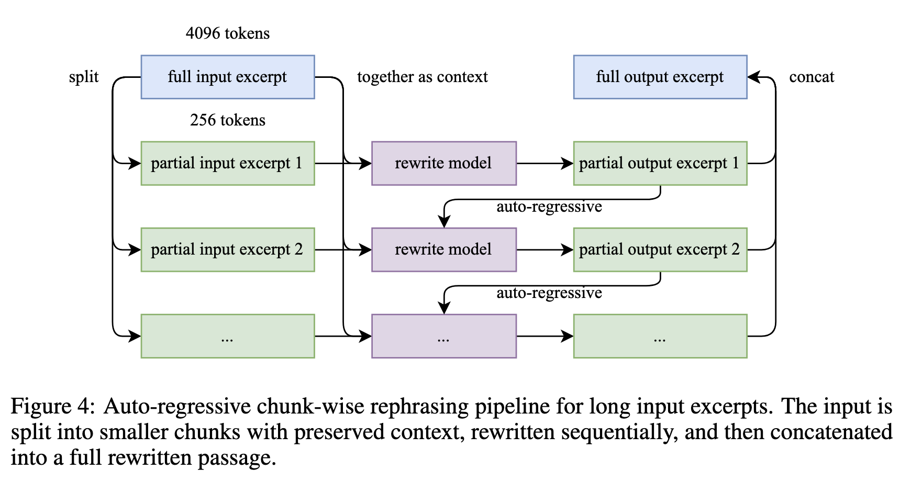

为了增强数学推理能力，遵循 SwallowMath中引入的方法，将高质量的数学文档重写为 “learning-note” 风格。此外，还通过将高质量的数学材料从其他语言翻译成英语来增加数据多样性。

Kimi K2 预训练语料库包含 15.5 万亿个精选的高质量数据token，跨越四个主要领域：Web 文本、代码、数学和知识。大多数数据处理管道都遵循 Kimi K1.5中概述的方法。对于每个领域都进行了严格的正确性和质量验证，并设计了有针对性的数据实验，以确保精选数据集实现高度多样性和有效性。

## 模型架构详解

该架构遵循与 DeepSeek-V3类似的设计，采用多头潜在注意力 （MLA）作为注意力机制。缩放定律分析表明，稀疏度的持续增加会带来显著的性能改进，这促使将专家数量增加到 384，而 DeepSeek-V3 中有 256。为了减少推理过程中的计算开销，将注意力头的数量减少到 64 个，而不是 DeepSeek-V3 中的 128 个。

- **类型**：MoE（Mixture-of-Experts）
- **总参数量**：1.04T
- **激活参数量**：32B
- **专家数量**：384（激活 8 个）
- **注意力机制**：MLA（Multi-head Latent Attention）
- **上下文长度**：支持 128K tokens（通过 YaRN 扩展）

|   |   |
|---|---|
|**Architecture**|Mixture-of-Experts (MoE)|
|**Total Parameters**|1T|
|**Activated Parameters**|32B|
|**Number of Layers** (Dense layer included)|61|
|**Number of Dense Layers**|1|
|**Attention Hidden Dimension**|7168|
|**MoE Hidden Dimension** (per Expert)|2048|
|**Number of Attention Heads**|64|
|**Number of Experts**|384|
|**Selected Experts per Token**|8|
|**Number of Shared Experts**|1|
|**Vocabulary Size**|160K|
|**Context Length**|128K|
|**Attention Mechanism**|MLA|
|**Activation Function**|SwiGLU|

### 架构对比（Kimi K2 vs DeepSeek-V3）：

| 指标    | K2    | DeepSeek-V3 |
| ----- | ----- | ----------- |
| 总参数量  | 1.04T | 671B        |
| 激活参数量 | 32B   | 37B         |
| 专家数   | 384   | 256         |
| 注意力头数 | 64    | 128         |
| 稀疏度   | 48    | 32          |
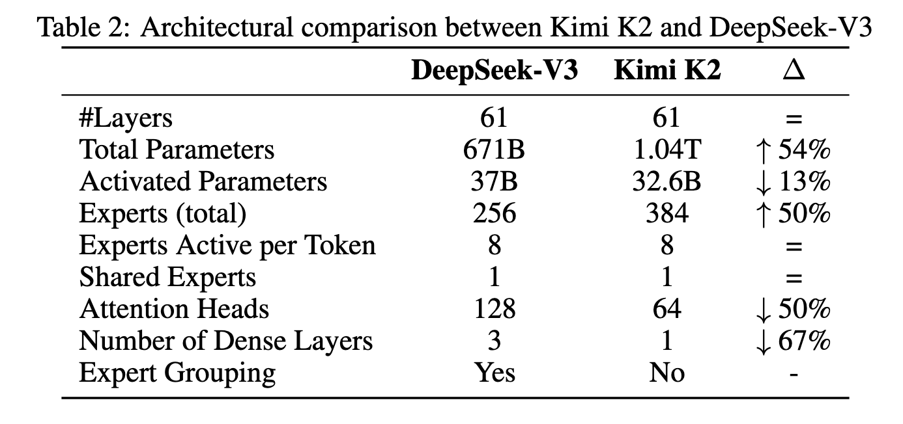

使用 Muon 开发了一种针对混合专家 （MoE） 模型系列量身定制的稀疏缩放定律。稀疏性定义为专家总数与激活专家数量的比率。通过精心控制的小规模实验，观察到在固定数量的激活参数（即恒定的 FLOP）下，增加专家总数（即增加稀疏性）会持续降低训练和验证损失，从而提高整体模型性能（图 5）。具体来说，在计算最优稀疏性缩放定律下，与稀疏度水平 8、16 和 32 相比，稀疏度 48 实现相同的验证损失 1.5，稀疏度 48 分别将 FLOP 降低了 1.69×、1.39× 和 1.15×。尽管增加稀疏性会带来更好的性能，但这种增益伴随着基础设施复杂性的增加。为了平衡模型性能与成本，对 Kimi K2 采用 48 的稀疏度，每次前向激活 384 名专家中的 8 名。

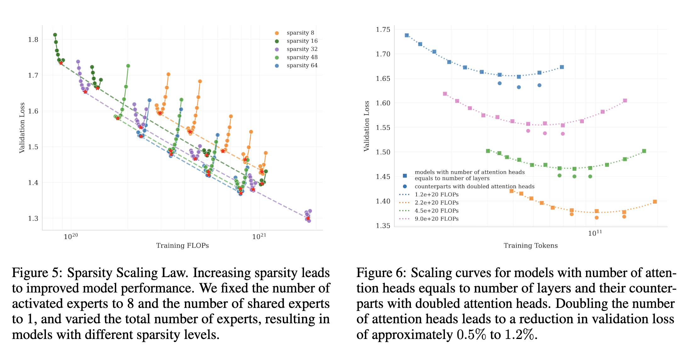

DeepSeek-V3将注意力头的数量设置为模型层数量的大约两倍，以更好地利用内存带宽并提高计算效率。然而，随着上下文长度的增加，注意力头的数量增加一倍会导致显着的推理开销，从而降低较长序列长度的效率。这成为智能应用中的一个主要限制，在智能应用中，高效的长上下文处理至关重要。例如，在序列长度为 128k 的情况下，将注意力头的数量从 64 个增加到 128 个，同时将专家总数固定为 384 个，导致推理 FLOP 增加 83%。为了评估这种设计的影响，论文进行了对照实验，在不同的训练 FLOP 下，比较了注意力头数量等于层数的配置与具有双倍头数的配置。在 iso-token 训练条件下，观察到在不同的计算预算中，将注意力头加倍只能适度改善验证损失（范围为 0.5% 到 1.2%）（图 6）。鉴于稀疏性 48 已经提供了强大的性能，双倍注意力头带来的边际收益并不能证明推理成本是合理的。因此选择 64 个注意力头。

## Training recipe

使用 MuonClip 优化器和 WSD 学习率计划在 4,096 个 token 上下文窗口中预训练模型，总共训练了 15.5T 个标记。前 10T 标记在经过 500 步预热后以 2e-4 的恒定学习率进行训练，随后是 5.5T 标记，余弦衰减从 2e-4 到 2e-5。权重衰减始终设置为 0.1，全局批量大小保持在 67M 个token。整体训练曲线如图 3 所示。 

在预训练即将结束时，进行了退火阶段，然后是长上下文激活阶段。批量大小保持在 67M 个标记，而学习率从 2e-5 衰减到 7e-6。在此阶段，该模型在 4000 亿个序列长度为 4k 的 token 上进行了训练，然后是另外 600 亿个序列长度为 32k 的 token。采用了YaRN方法将上下文窗口扩展到128k。

## 后训练：智能体能力构建

在后训练中也使用了Muon优化器，并推荐K2的微调也用该优化器。根据之前工作的结论，Muon预训练的检查点在Muon微调下会产生最佳性能。

论文构建了一个跨越不同领域的大规模指令调优数据集，遵循两个核心原则：最大化提示多样性和确保高响应质量。为此开发了一套针对不同任务领域量身定制的数据生成管道，每个管道都结合了人工注释、提示工程和验证流程。

采用K1.5和其他内部领域专业专家模型为各种任务生成候选响应，然后由LLM或基于人类的评委进行自动质量评估和过滤。

对于智能体数据创建了一个数据合成管道，通过多步骤、交互式推理来教授模型工具使用能力。

### 1. 智能体数据合成管道（Agentic Data Synthesis）

现代 LLM 代理的一项关键能力是它们能够自主使用不熟悉的工具，与外部环境交互，并通过推理、执行和纠错迭代地完善其作。

虽然现实世界的环境提供了丰富而真实的交互信号，但由于成本、复杂性、隐私和可访问性限制，它们通常难以大规模构建。Kimi团队开发了一个大规模模拟真实世界工具使用场景的管道，从而能够生成数以万计的多样化和高质量的训练示例。

#### 三阶段流程：

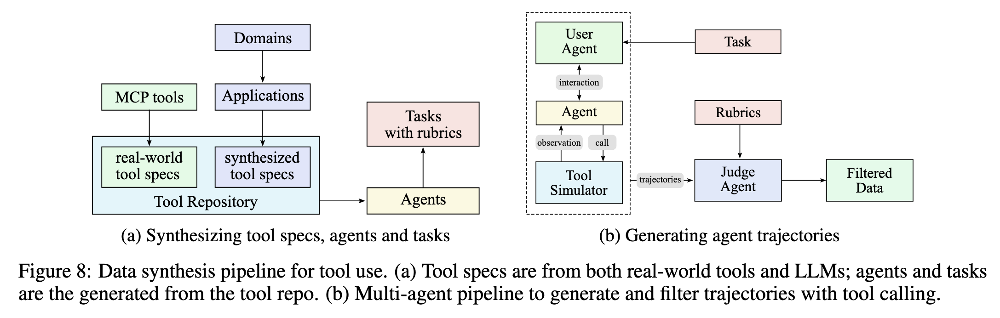

| 阶段 | 内容 | 说明 |
|---|---|---|
| **工具生成** | 3K 真实 MCP 工具 + 20K 合成工具 | 覆盖金融、软件、机器人等 8 大领域 |
| **任务与智能体生成** | 为每个工具组合生成智能体和任务 | 支持多轮交互、错误修正、工具组合调用 |
| **轨迹生成与过滤** | 使用模拟器 + 真实沙箱执行 | 保留成功率高的轨迹用于训练 |

通过两种互补的方法构建了一个全面的工具库。
- 利用现有的高质量工具规范，直接从 GitHub 仓库中获取 3000+ 个真实的 MCP（模型上下文协议）工具。
- 通过分层领域生成过程系统地发展合成工具：从关键类别（例如，金融交易、软件应用程序、机器人控制）开始，然后在每个类别中发展多个特定的应用领域。然后为每个领域合成专门的工具，具有清晰的接口、描述和操作作语义。这一过程产生了 20,000 多种合成工具。
图 9 通过 t-SNE 嵌入可视化了工具集合的多样性，表明 MCP 和合成工具都覆盖了工具空间的互补区域。

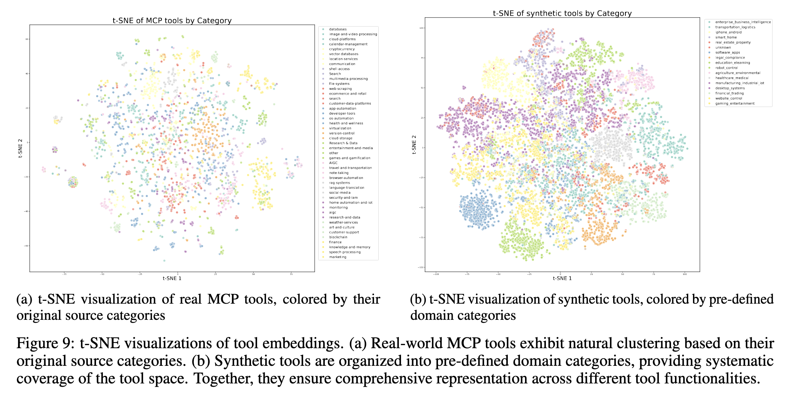

#### 特点：
- 代理多样性：通过合成各种系统提示并为它们配备存储库中不同的工具组合来生成数千个不同的代理。这创造了具有不同能力、专业领域和行为模式的多元化代理群体，确保广泛覆盖潜在用例。
- 基于评分标准（rubric）的任务生成：对于每个代理配置，都会生成从简单到复杂作的任务。每项任务都配有一个明确的评分标准，该评分标准指定了成功标准、预期的工具使用模式和评估检查点。
- **多轮交互**：模拟用户、工具、环境的完整交互链
- **自动评估**：基于 rubric 的 LLM judge 打分过滤。基于法学硕士的评委根据任务评分标准评估每条轨迹。只有符合成功标准的轨迹才会被保留用于训练，确保高质量的数据，同时允许任务完成策略的自然变化。
- **真实沙箱**：Kubernetes 容器，支持 1W+ 并发。虽然仿真提供了可扩展性，但它毕竟不是真实的，存在固有局限性。为了解决这个问题，用真实的执行沙箱来补充模拟环境，以应对真实性至关重要的场景，特别是在编码和软件工程任务中。这些真实的沙箱执行实际代码，与真实的开发环境交互，并通过测试套件通过率等客观指标提供真实反馈。这种组合确保模型能够从模拟场景的多样性和真实执行的真实性中学习，从而显着增强实际代理能力。

通过利用这种将可扩展的仿真与有针对性的真实世界执行相结合的混合管道，生成了多样化、高质量的工具使用演示，平衡了覆盖范围和真实性。合成数据生成的规模和自动化，加上真实执行环境提供的基础，通过质量过滤过程有效地实现了大规模拒绝采样。当用于监督微调时，这种高质量的合成数据在广泛的实际应用中证明了模型的工具使用能力的显着改进。

### 2. 强化学习框架（RL）

强化学习（RL）被认为比SFT具有更好的token效率和泛化性。基于K1.5的工作，继续在K2的任务多样性和训练FLOPs中扩展RL。为了支持这一点，开发了一个类似 Gym 的可扩展框架，该框架有助于在各种场景中进行 RL。

#### 两大奖励机制：

| 类型                        | 说明         | 示例任务           |
| ------------------------- | ---------- | -------------- |
| **可验证奖励（RLVR）**           | 结果可自动判断对错  | 数学题、代码题、逻辑题    |
| **自我批判奖励（Self-Critique）** | 模型自己评估输出质量 | 创意写作、开放问答、主观任务 |

#### Verifiable Rewards Gym

对于数学、词干和逻辑推理领域， RL 数据准备遵循两个关键原则，即覆盖范围多样和难度适中。

- 多样化的覆盖范围。对于数学和词干任务，结合专家注释、内部QA提取管道和开放数据集来收集高质量的QA对。在收集过程中，利用标记系统有意增加覆盖率不足的域的覆盖率。对于逻辑任务，数据集包含多种格式，包括结构化数据任务（例如，多跳表格推理、跨表聚合）和逻辑谜题（例如，24 局、数独、谜语、密码算术和摩尔斯电码解码）。

- 中等难度。RL提示集既不能太简单也不能太难，这两种方法都可能产生很少的信号并降低学习效率。使用 SFT 模型的pass@k准确性评估每个问题的难度，并仅选择中等难度的问题。

有效的指令遵循不仅需要理解显式约束，还需要了解隐式需求、处理边缘情况以及在扩展对话中保持一致性。通过混合验证框架来应对这些挑战，该框架将自动验证与对抗性检测相结合，并结合可扩展的课程生成管道。采用双路径系统来确保精度和稳健性：

- 混合规则验证。实施了两种验证机制：（1） 通过代码解释器对具有可验证输出（例如长度、样式约束）的指令进行确定性评估，以及 （2） 对需要对约束进行细致入微理解的指令的 LLM 作为判断的评估。为了解决模型可能声称指令履行而没有实际遵守的潜在对抗行为，合并了一个额外的黑客检查层，专门检测此类欺骗性声明。

- 多源指令生成。为了构建训练数据，采用三种不同的生成策略来确保全面覆盖：（1） 由数据团队开发的精心制作的复杂条件提示和评分标准（2）受AutoIF启发的代理指令增强，以及（3）专门用于生成探测特定故障模式或边缘情况的instructions的微调模型。这种多管齐下的方法确保了教学覆盖范围的广度和深度。

忠实性对于在多轮工具使用、自生成推理链和开放环境交互等场景中运行的代理模型至关重要。受FACTS Grounding评估框架的启发，训练了一个句子级忠诚度法官模型来执行自动验证。法官可以有效地发现在没有上下文支持证据的情况下提出事实主张的判决。它作为一种奖励模型，以提高整体忠诚度表现。

为了增强解决竞赛级编程问题的能力，从开源数据集和合成资源中收集问题及其评判者。为了确保合成数据的多样性和奖励信号的正确性，结合了从预训练数据中检索到的高质量人工编写的单元测试。

对于软件工程任务，从 GitHub 收集了大量的拉取请求和问题，以构建由用户提示/问题和可执行单元测试组成的软件开发环境。该环境建立在强大的沙盒基础设施之上，由 Kubernetes 提供支持，以实现可扩展性和安全性。它支持超过 10,000 个并发沙箱实例，性能稳定，非常适合竞争性编码和软件工程任务。

提高安全性的工作始于一组人工策划的种子提示，这些提示是手动制作的，以涵盖暴力、欺诈和歧视等普遍风险类别。

为了模拟复杂的越狱尝试（例如，角色扮演、文学叙事和学术话语），采用了具有三个关键组件的自动提示演变管道：

攻击模型：迭代生成对抗性提示，旨在从目标 LLM 引出不安全的响应。 
目标模型：生成对这些提示的响应，模拟潜在的漏洞。 
判断模型：评估交互以确定对抗性提示是否成功绕过安全机制。

每个交互都使用特定于任务的评分标准进行评估，使评委模型能够提供二元成功/失败标签。

#### Beyond Verification: Self-Critique Rubric Reward

为了将模型对齐扩展到具有可验证奖励的任务之外，引入了一个框架，用于从自我批评反馈中进行一般强化学习。这种方法旨在通过将从可验证场景中学到的能力扩展到更广泛的主观任务，使法学硕士与人类细致入微的偏好保持一致，包括乐于助人、创造力、推理深度、事实性和安全性。该框架使用自我批评评分标准奖励机制运行，其中模型评估自己的输出以生成偏好信号。为了引导 K2 成为称职的评委，策划了开源和内部偏好数据集的混合，并在 SFT 阶段初始化其批评能力。

在学习循环的第一个核心过程中，K2 Actor 为涵盖广泛用例的一般提示生成响应。然后，K2 评论家通过根据包含两个核心评分标准的组合进行成对评估来对所有结果进行排名（附录。F.1），代表了 Kimi 所珍视的 AI 助手的基本价值观，规范性评分标准（附录。F.2），旨在消除奖励黑客攻击，以及我们的数据团队为特定教学环境制作的人工注释评分标准。尽管某些评分标准可以指定为强制性评分标准，但 K2 保留了将其与内部先验进行权衡的灵活性。这种能力能够与其不断变化的策略行为进行动态和持续的一致性，确保模型的响应在适应特定指令的同时与其核心身份保持一致。

在学习循环的第一个核心过程中，K2 Actor 为涵盖广泛用例的一般提示生成响应。然后，K2 评论家通过根据包含两个核心评分标准的组合进行成对评估来对所有结果进行排名（附录。F.1），代表了 Kimi 所珍视的 AI 助手的基本价值观，规范性评分标准（附录。F.2），旨在消除奖励黑客攻击，以及我们的数据团队为特定教学环境制作的人工注释评分标准。尽管某些评分标准可以指定为强制性评分标准，但 K2 保留了将其与内部先验进行权衡的灵活性。这种能力能够与其不断变化的策略行为进行动态和持续的一致性，确保模型的响应在适应特定指令的同时与其核心身份保持一致。在 RL 训练期间，使用可验证信号对批评模型进行细化。根据可验证奖励提示生成的政策推出用于不断更新批评者，这是将 RLVR 的客观绩效信号直接提炼到其评估模型中的关键一步。这种迁移学习过程将其更主观的判断建立在可验证的数据中，允许可验证任务的性能提升增强批评者对缺乏明确奖励信号的复杂任务的判断。这种闭环过程确保批评者随着政策的发展不断重新调整其评估标准。

该框架将主观评估建立在可验证的数据中，能够与复杂的、不可验证的人类目标进行稳健且可扩展的一致性。

因此，这种整体调整在广泛的领域产生了全面的性能改进，包括用户意图理解、创意写作、复杂推理和细致入微的语言理解。

F.1核心标准

清晰度和相关性：评估响应在充分满足用户意图的同时简洁的程度。重点是消除不必要的细节，与中心查询保持一致，并使用有效的格式，例如简短的段落或紧凑的列表。除非特别要求，否则应避免冗长的逐项列出。当预期做出选择时，响应应明确提供单一的、明确的答案。

对话流畅性和参与度：评估回答对自然、流畅的对话的贡献，而不仅仅是简单的问答。这包括保持连贯性、对主题表现出适当的参与、提供相关的观察或见解、在适当的时候可能建设性地指导对话、明智地使用后续问题、优雅地处理假设或个人类比查询，以及有效地调整语气以适应对话环境（例如，同理心、正式、随意）。

客观和扎根的互动：评估响应保持客观和接地气的能力，直接关注用户请求的实质内容。它评估了元评论（分析查询的结构、主题组合、感知到的奇怪之处或交互本身的性质）和针对用户或其输入的无端奉承或过度赞美的避免。优秀的回应以尊重但中立的方式互动，优先考虑直接的、以任务为中心的帮助，而不是对对话动态的评论或通过赞美来讨好。

F.2规范性评分标准

初步表扬：回复不得以针对用户或问题的赞美开头（例如，“这是一个漂亮的问题”、“好问题！

明确理由：解释响应为何良好或如何成功满足用户请求的任何句子或子句。这与简单地描述内容不同。

该评估框架的一个潜在副作用是，即使在涉及歧义或主观的情况下，它也可能有利于显得自信和自信的回答。这源于当前评分标准中的两个关键限制：

避免自我限定：规范性规则禁止自我评估、明确免责声明或对冲语言（例如，“这可能不准确”、“我可能是错的”）。虽然这些短语可以反映认识上的谦逊，但它们经常被处罚为无信息性或表演性。

对清晰度和奇异性的偏好：当用户要求推荐或解释时，评分标准会奖励直接、果断的答案。在复杂或开放式场景中，这可能会抑制适当谨慎或多角度的反应。

因此，该模型有时可能会在模糊性、细微差别或认识谦虚更合适的领域夸大确定性。该框架的未来迭代可能会包含对校准不确定性的更细粒度的处理。

#### RL 训练技巧：
- **预算控制**：限制每题最大 token 数，避免冗长输出
- **PTX 损失**：防止遗忘预训练知识
- **温度衰减**：初期高温度鼓励探索，后期降低温度提升稳定性

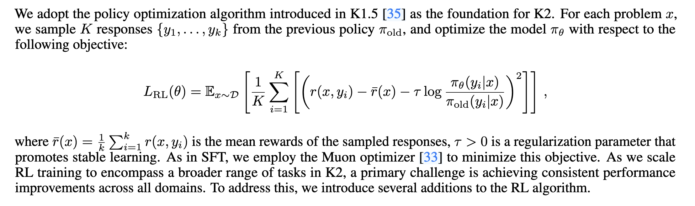

预算控制：人们普遍观察到，RL通常会导致模型生成的响应长度大幅增加[35,19]。虽然更长的响应可以使模型利用额外的测试时间计算来提高复杂推理任务的性能，但这些好处通常并不能证明其在非推理领域的推理成本是合理的。为了鼓励模型正确分配推理预算，我们在整个 RL 训练中强制执行每个样本的最大令牌预算，其中预算是根据任务类型确定的。超过此令牌预算的响应将被截断并分配惩罚，这会激励模型在指定限制内生成解决方案。根据经验，这种方法显着提高了模型的代币效率，鼓励在所有领域采用简洁而有效的解决方案。

PTX loss：为了防止在联合RL训练过程中可能遗忘有价值的高质量数据，我们整理了一个由手工选择的高质量样本组成的数据集，并通过辅助PTX损失将其集成到RL目标中[54]。该策略不仅利用了高质量数据的优势，还降低了过度拟合训练制度中明确存在的有限任务集的风险。这种增强极大地提高了模型在更广泛领域的泛化能力。

Temperature Decay：对于创意写作和复杂推理等任务，我们发现在训练的初始阶段通过高采样温度促进探索至关重要。高温使模型能够产生多样化和创新的响应，从而有助于发现有效的策略并降低过早收敛到次优解决方案的风险。然而，在训练的后期阶段或评估期间保持高温可能是有害的，因为它会引入过度的随机性并损害模型输出的可靠性和一致性。为了解决这个问题，我们采用了温度衰减计划，在整个训练过程中从探索转向开发。该策略确保模型在最有利的时候利用探索，同时最终收敛到稳定和高质量的输出上。

## 评测结果（非思考模式）

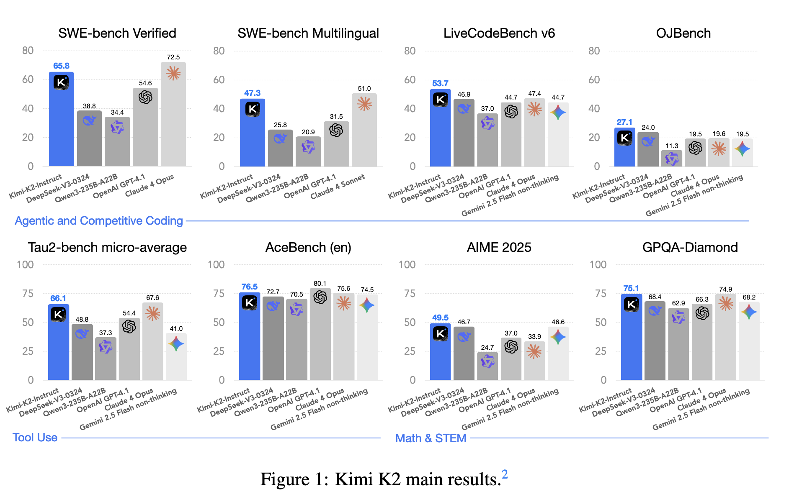

### 1. 代码能力（Coding）

| 数据集 | K2 得分 | 对比模型 |
|---|---|---|
| **SWE-bench Verified** | 65.8%（单轮） / 71.6%（多轮） | 接近 Claude 4 Opus（72.5%） |
| **LiveCodeBench v6** | 53.7% | 超越 DeepSeek-V3（46.9%） |
| **MultiPL-E** | 85.7% | 超越 Qwen3-235B（78.2%） |

### 2. 智能体能力（Agentic）

| 数据集 | K2 得分 | 对比模型 |
|---|---|---|
| **τ2-Bench** | 66.1% | 超越 DeepSeek-V3（48.8%） |
| **ACEBench** | 76.5% | 超越 Qwen3（70.5%） |

### 3. 数学与推理

| 数据集 | K2 得分 | 对比模型 |
|---|---|---|
| **AIME 2025** | 49.5% | 超越 GPT-4.1（37.0%） |
| **GPQA-Diamond** | 75.1% | 超越 DeepSeek-V3（68.4%） |

---

## 系统与基础设施

### 训练系统
- **硬件**：H800 GPU，256 卡并行
- **并行策略**：PP + EP + ZeRO-1，支持动态扩展
- **显存优化**：FP8 存储、CPU offload、选择性重计算

Kimi K2 在配备 NVIDIA H800 GPU 的集群上进行训练。H800集群中的每个节点都包含2 TB RAM和8个GPU，通过NVLink和NVSwitch在节点内连接。在不同节点之间，利用 8×400 Gbps RoCE 互连来促进通信。

大型语言模型的训练通常在动态资源可用性下进行。我们没有优化一种仅适用于特定资源量的并行策略，而是追求一种灵活的策略，允许 Kimi K2 在任意数量的节点上进行训练，该节点是 32 的倍数。

具有虚拟阶段的16路流水线并行性（PP）[28、53、38、57、47、21]、16路专家并行性（EP）[39]和ZeRO-1数据并行性[60]。

在此设置下，将模型参数存储在 BF16 中，将其梯度累积缓冲区存储在 FP32 中，需要大约 6 TB 的 GPU 内存，分布在由 256 个 GPU 组成的模型并行组上。优化器状态的放置取决于训练配置。当训练节点总数较大时，优化器状态是分布式的，将其每个设备的内存占用减少到可以忽略不计的水平。当训练节点总数较少（例如 32 个）时，我们可以将一些优化器状态卸载到 CPU。 这种方法允许我们在小型和大型实验中重用相同的并行度配置，同时让每个 GPU 为所有状态保留大约 30 GB 的 GPU 内存。其余的 GPU 内存用于激活，如第 2.4.3 节所述。这种一致的设计对于研究效率很重要，因为它简化了系统并大大加快了实验迭代。

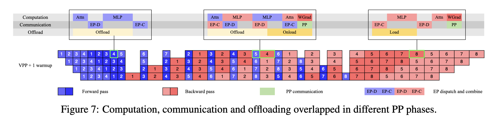

通过增加预热微批次的数量，我们可以将EP全对全通信与标准交错1F1B计划下的计算重叠[21,53]。相比之下，DualPipe [10]使参数和梯度所需的内存增加了一倍，因此需要增加并行度来补偿。增加 PP 会引入更多的气泡，而增加 EP（如下所述）会产生更高的开销。训练一个参数超过 1 万亿的大型模型的额外成本高得令人望而却步，因此我们选择不使用 DualPipe。

然而，交错的 1F1B 将模型分成更多阶段，引入了重要的 PP 通信开销。为了降低这种成本，我们将权重梯度计算与每个微批次的反向传递解耦，并与相应的PP通信并行执行。因此，除预热阶段外，所有 PP 通信都可以有效地重叠。

为了确保 1F1B 阶段的完全计算-通信重叠，K2 中的注意力计算时间减少（K2 有 64 个注意力头，而 DeepSeek-V3 中有 128 个注意力头），因此需要最大限度地减少 EP作的时间。这是通过采用最小可行的 EP 并行化策略来实现的，特别是 EP = 16。使用较小的 EP 组还可以放松专家平衡限制，无需进一步调整即可实现接近最佳的速度。

在为参数、梯度缓冲区和优化器状态预留空间后，每个设备上的剩余 GPU 内存不足以容纳完整的 MoE 激活。为了确保激活内存适合约束，特别是对于在 1F1B 预热阶段积累最大激活的初始流水线阶段，采用了以下技术。

Selective recomputation: 重新计算应用于廉价、高占用空间的阶段，包括LayerNorm、SwiGLU和MLA上投影[10]。此外，在训练期间会重新计算 MoE 下投影，以进一步减少激活内存。虽然是可选的，但这种重新计算可以保持足够的 GPU 内存，防止在早期训练阶段因专家不平衡而导致的崩溃。

FP8 storage for insensitive activations: MoE 上投影和 SwiGLU 的输入被压缩为 FP8-E4M3，采用 FP32 比例的 1× 128 个图块。小规模实验显示没有可测量的损失增加。由于我们在初步研究中观察到的性能下降的潜在风险，我们不在计算中应用 FP8。

Activation CPU offload: 所有剩余的激活都卸载到 CPU RAM。复制引擎负责流式传输卸载和加载，与计算和通信内核重叠。在 1F1B 阶段，我们卸载前一个微批次的正向激活，同时预取下一个微批次的后向激活。预热和冷却阶段的处理方式类似，总体模式如图 7 所示。尽管由于 PCIe 流量拥塞，卸载可能会对 EP 流量产生轻微影响，但我们的测试表明 EP 通信仍然完全重叠。

### RL 系统
- **共址架构**：训练与推理引擎共用 GPU，30 秒内完成参数更新
- **参数广播**：使用 checkpoint engine 实现高效参数同步
- **长轨迹支持**：支持中断/恢复机制，避免长任务阻塞
- 支持长期、多轮次代理任务的训练

## 主要收获

## 参考资料

Kimi-K2的总结

Kimi-K2论文原文