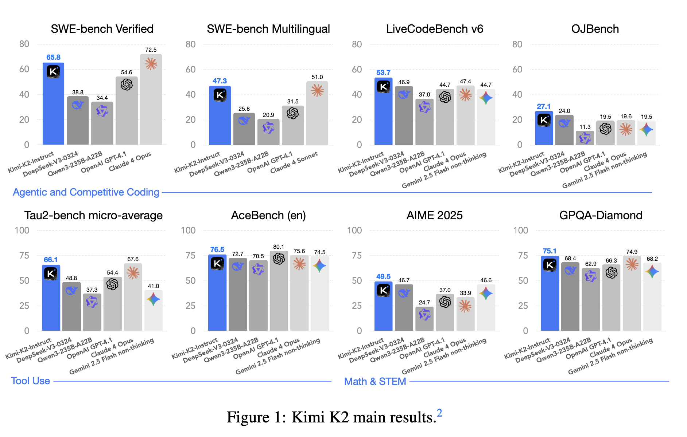

## 论文基本信息

标题：KIMI K2: OPEN AGENTIC INTELLIGENCE

作者：Kimi Team

链接：https://github.com/MoonshotAI/Kimi-K2/blob/main/tech_report.pdf

代码：https://github.com/MoonshotAI/Kimi-K2

https://huggingface.co/moonshotai/Kimi-K2-Instruct

框架图：

## 背景

这篇论文是 **Kimi K2 的技术报告**，由月之暗面（Moonshot AI）团队发布，介绍了他们最新的开源大模型 **Kimi K2**，并重点讲解了其在**智能体能力（Agentic Intelligence）**方面的突破。

## 相关研究
有哪些相关研究？如何归类？谁是这一课题在领域内值得关注的研究员？

## 📌 一句话总结：
Kimi K2 是一个 **1万亿参数、32B激活参数的 MoE 模型**，通过创新的训练优化器（MuonClip）、大规模智能体数据合成管道和强化学习框架，在**非思考模式下**实现了当前开源模型中最强的**智能体能力**和**代码能力**。

---

## 一、核心亮点

| 模块 | 创新点 | 作用 |
|---|---|---|
| **MuonClip 优化器** | 在 Muon 基础上引入 QK-Clip 技术，解决训练不稳定问题 | 训练 15.5T tokens 无 loss spike，提升 token 效率 |
| **智能体数据合成** | 构建 2W+ 合成工具 + 3K+ 真实工具，模拟多轮交互 | 训练模型掌握复杂工具调用任务 |
| **强化学习框架** | 结合可验证奖励（RLVR）+ 自我批判奖励（Self-Critique） | 提升模型在复杂任务中的泛化与对齐能力 |
| **模型架构** | 384 experts（稀疏度 48），64 注意力头，MLA 机制 | 在推理效率和性能之间取得平衡 |
| **评测结果** | SWE-bench Verified 65.8%、AIME 2025 49.5%、GPQA-Diamond 75.1% | 在非思考模式下超越多数开源/闭源模型 |

---

## 二、模型架构详解

- **类型**：MoE（Mixture-of-Experts）
- **总参数量**：1.04T
- **激活参数量**：32B
- **专家数量**：384（激活 8 个）
- **注意力机制**：MLA（Multi-head Latent Attention）
- **上下文长度**：支持 128K tokens（通过 YaRN 扩展）

|   |   |
|---|---|
|**Architecture**|Mixture-of-Experts (MoE)|
|**Total Parameters**|1T|
|**Activated Parameters**|32B|
|**Number of Layers** (Dense layer included)|61|
|**Number of Dense Layers**|1|
|**Attention Hidden Dimension**|7168|
|**MoE Hidden Dimension** (per Expert)|2048|
|**Number of Attention Heads**|64|
|**Number of Experts**|384|
|**Selected Experts per Token**|8|
|**Number of Shared Experts**|1|
|**Vocabulary Size**|160K|
|**Context Length**|128K|
|**Attention Mechanism**|MLA|
|**Activation Function**|SwiGLU|

### 架构对比（Kimi K2 vs DeepSeek-V3）：

| 指标 | K2 | DeepSeek-V3 |
|---|---|---|
| 总参数量 | 1.04T | 671B |
| 激活参数量 | 32B | 37B |
| 专家数 | 384 | 256 |
| 注意力头数 | 64 | 128 |
| 稀疏度 | 48 | 32 |

---

## 三、训练优化器：MuonClip

### 问题背景：
- Muon 优化器虽然 token 效率高，但在大模型训练中容易出现 **attention logit 爆炸**，导致训练不稳定。

### 解决方案：QK-Clip
- **机制**：对 attention 的 query/key 权重做动态裁剪（per-head）
- **公式**：当某个 attention head 的最大 logit 超过阈值 τ（=100）时，按比例缩放 Wq 和 Wk
- **效果**：
  - 训练过程无 loss spike
  - 不影响最终模型性能（见论文附录 D）

---

## 四、预训练数据：提升 token 效率

| 数据类型 | 处理方式 | 目的 |
|---|---|---|
| **知识类文本** | 使用 LLM 重述（rephrasing） | 避免重复训练，提升 token 效率 |
| **数学类文本** | 转换为“学习笔记”风格，支持多语言 | 增强数学推理能力 |
| **代码类文本** | 引入真实 GitHub PR + 合成代码 | 提升代码理解和生成能力 |

---

## 五、后训练：智能体能力构建

### 1. 智能体数据合成管道（Agentic Data Synthesis）

#### 三阶段流程：
| 阶段 | 内容 | 说明 |
|---|---|---|
| **工具生成** | 3K 真实 MCP 工具 + 20K 合成工具 | 覆盖金融、软件、机器人等 8 大领域 |
| **任务与智能体生成** | 为每个工具组合生成智能体和任务 | 支持多轮交互、错误修正、工具组合调用 |
| **轨迹生成与过滤** | 使用模拟器 + 真实沙箱执行 | 保留成功率高的轨迹用于训练 |

#### 特点：
- **真实沙箱**：Kubernetes 容器，支持 1W+ 并发
- **多轮交互**：模拟用户、工具、环境的完整交互链
- **自动评估**：基于 rubric 的 LLM judge 打分过滤

---

### 2. 强化学习框架（RL）

#### 两大奖励机制：

| 类型 | 说明 | 示例任务 |
|---|---|---|
| **可验证奖励（RLVR）** | 结果可自动判断对错 | 数学题、代码题、逻辑题 |
| **自我批判奖励（Self-Critique）** | 模型自己评估输出质量 | 创意写作、开放问答、主观任务 |

#### RL 训练技巧：
- **预算控制**：限制每题最大 token 数，避免冗长输出
- **PTX 损失**：防止遗忘预训练知识
- **温度衰减**：初期高温度鼓励探索，后期降低温度提升稳定性

---

## 六、评测结果（非思考模式）

### 1. 代码能力（Coding）

| 数据集 | K2 得分 | 对比模型 |
|---|---|---|
| **SWE-bench Verified** | 65.8%（单轮） / 71.6%（多轮） | 接近 Claude 4 Opus（72.5%） |
| **LiveCodeBench v6** | 53.7% | 超越 DeepSeek-V3（46.9%） |
| **MultiPL-E** | 85.7% | 超越 Qwen3-235B（78.2%） |

### 2. 智能体能力（Agentic）

| 数据集 | K2 得分 | 对比模型 |
|---|---|---|
| **τ2-Bench** | 66.1% | 超越 DeepSeek-V3（48.8%） |
| **ACEBench** | 76.5% | 超越 Qwen3（70.5%） |

### 3. 数学与推理

| 数据集 | K2 得分 | 对比模型 |
|---|---|---|
| **AIME 2025** | 49.5% | 超越 GPT-4.1（37.0%） |
| **GPQA-Diamond** | 75.1% | 超越 DeepSeek-V3（68.4%） |

---

## 七、系统与基础设施

### 训练系统
- **硬件**：H800 GPU，256 卡并行
- **并行策略**：PP + EP + ZeRO-1，支持动态扩展
- **显存优化**：FP8 存储、CPU offload、选择性重计算

### RL 系统
- **共址架构**：训练与推理引擎共用 GPU，30 秒内完成参数更新
- **参数广播**：使用 checkpoint engine 实现高效参数同步
- **长轨迹支持**：支持中断/恢复机制，避免长任务阻塞

---

## 实验
论文中的实验是如何设计的？

用于定量评估的数据集是什么？代码有没有开源？

论文中的实验及结果有没有很好地支持需要验证的科学假设？

## 未来方向

## 主要收获

## 参考资料
