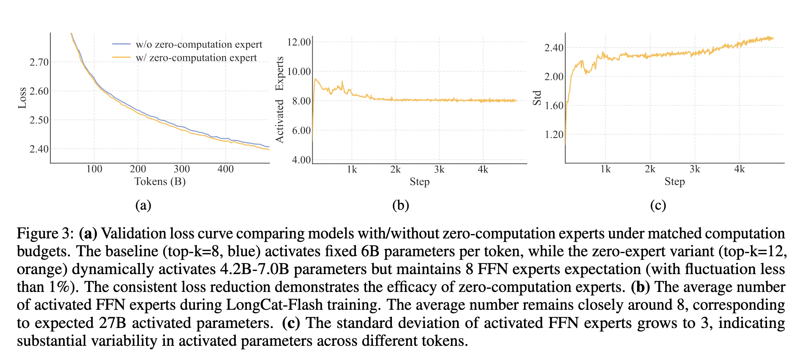

# 论文基本信息

标题：

作者：

链接：

代码：https://github.com/meituan-longcat/LongCat-Flash-Chat

前往 https://longcat.ai/ ，立即与 LongCat-Flash-Chat 开启对话。该模型是一个非思考模型。

框架图：

# 背景

其主要贡献可概括为三个方面：

1. **可扩展的架构设计**：通过引入“零计算专家 (Zero-computation Experts)”和“快捷连接 MoE (Shortcut-connected MoE)”，在模型层面实现了动态计算资源分配和通信效率优化。零计算专家可以在参数量 560 B，使得每个token 依据上下文需求仅动态激活 18.6B~31.3 B 参数，实现算力按需分配和高效利用。为控制总算力消耗，训练过程采用 PID 控制器实时微调专家偏置，将单 token 平均激活量稳定在约 27 B。
    
2. **有效的模型扩展策略**：开发了一套确保大规模训练稳定、高效的框架，包括超参数迁移 (hyperparameter transfer)、模型增长初始化 (model growth initialization) 以及一个多管齐下的稳定性套件。
    
3. **面向 Agent 能力的多阶段训练流程**：通过精心设计的预训练、中训和后训练流程，特别是利用多智能体合成框架生成高质量 Agent 数据，系统性地培养模型的复杂任务解决能力。
    

整体看起来，区别于其他抄V3架构换数据重训就交活儿的MoE，得益于LongCat-Flash在算法和工程层面做了大量的联合创新设计，模型在 30 天内完成了超过 20 万亿 token 的预训练，并在 H800 GPU 上实现了超过 100 TPS 的推理速度，成本低至每百万输出 token 0.70 美元。

# 核心架构创新

## 零计算专家

[Site Unreachable](https://www.alphaxiv.org/overview/2410.07348v1)

下一个Token预测表现出固有的计算异构性。难的Token可能需要耗费更多的计算资源才能预测准确，而简单的Token，可能极少的计算就能预测。推测解码也证明了这种现象，小型的草稿模型能够可靠地预测大模型的大多数简单Token。

那对MoE专家来说，就是有的Token可能不需要那么多专家来解决问题，LongCat对此引入了零计算专家（Zero-Computation Experts），零计算专家，是直接返回输入内容作为输出，没有不引入任何额外计算，所以当路由器选中零计算专家时，相当于跳过一次 Expert FFN 计算，实现不同Token消耗不同算力的需求。

在LongCat里，标准专家512个，零计算专家256个，激活专家12个， 这里你就能理解为啥官方说，激活参数是18.6B~31.3B，

12个专家都选了零计算专家，那就是18.6B激活参数（因为还有一些embedding、MLA等计算），

12个专家都选了标准专家，那就是31.3B激活参数

防止模型过度使用标准专家，忽略零计算专家，还设计了PID控制器来调节专家偏置项（这个机制能够自动调节专家的选择倾向，确保平均激活的专家数量保持在预期范围内），同时加入设备级负载均衡损失，确保平均激活专家数稳定。

Token使用标准专家示例如下，可以发现一些连词、标点等，需要的专家计算就比较少。

图中可以看到
- 使用零计算专家的性能相比不使用来说，Loss更低。
- LongCat-Flash训练过程中的平均激活的专家数量是8个，对应着27B参数量。
- 激活的FFN专家数量的标准差增长到3，表明模型能够根据输入复杂度动态调整每个token的计算资源

## 快捷连接 MoE

在大规模分布式训练中，MoE模型的瓶颈往往在通信，LongCat提出快捷连接MoE（Shortcut-Connected MoE），让前一层Dense FFN的计算 与 当前MoE层的通信并行执行，扩大了计算-通信重叠窗口，提升系统吞吐量。

在传统的 MoE 模型执行范式中，计算和通信是严格串行的。系统必须先执行一次全局通信操作（All-to-All），将不同序列中的词元（token）路由到各自指定的专家（expert）所在的计算设备上，然后才能开始并行的专家计算。这个通信过程的延迟会成为一个显著的瓶颈，导致计算设备闲置，从而限制了整个系统的吞吐量。

为克服这一限制，LongCat-Flash 采用了 ScMoE 架构。其核心实现方法是引入一个**跨层的快捷连接（cross-layer shortcut）**，这个连接对模型的执行管线（execution pipeline）进行了重新排序。具体而言，这一关键创新**允许前一个模块中的密集 FFN（Dense FFN）计算，与当前 MoE 层的通信（包括词元的分发 dispatch 和合并 combine 阶段）并行执行**。

通过这种方式，ScMoE 创造了一个比传统共享专家（shared-expert）设计更为可观的计算-通信重叠窗口。原本用于等待通信的时间，现在被前一个模块的密集计算所填充，从而极大地提升了硬件利用率和系统整体效率。

这项架构创新为训练和推理带来了显著的系统级优势：

- **对于大规模训练**：扩展后的重叠窗口使得前一模块的计算能够与 MoE 层的分发和合并通信阶段完全并行，从而提升训练速度。
    
- **对于高效推理**：ScMoE 能够实现一种 **“单批次重叠 (Single Batch Overlap)”** 流水线，理论上可将每个输出词元的时间（TPOT）降低近 50%。此外，它还允许不同层级的通信模式并发执行：节点内的张量并行（Tensor Parallelism）通信（通过 NVLink）可以与节点间的专家并行（Expert Parallelism）通信（通过 RDMA）完全重叠，从而最大化了总网络带宽的利用率。

## 为可扩展性设计的方差对齐 (Variance Alignment Design for Scalability)

在设计大规模语言模型时，一个核心挑战是，在小模型上表现优异的架构设计在规模扩大后可能会变得不稳定或性能下降。技术报告指出，通过广泛的实验和理论分析，团队发现特定模块中的“方差错位 (variance misalignment)”是导致这一问题的关键因素。为解决此问题，LongCat-Flash 针对其架构中的 MLA（Multi-head Latent Attention）和 MoE 模块分别提出了方差对齐技术。

- **针对 MLA 的尺度校正 (Scale-Correction for MLA)**
    

LongCat-Flash 采用了一种改进的 MLA 机制，该机制引入了尺度校正因子  和 ，以解决非对称低秩分解中固有的方差不平衡问题。

这个问题的根源在于，在初始化时，查询（query）和键（key）向量中不同部分的方差与其来源的维度成正比。具体来说，内容部分  和  的方差分别与压缩后的维度  和  相关，而旋转位置编码部分  的方差则与完整的模型维度  相关。当 、 和  这几个维度值不同时，这种维度差异会导致初始化阶段的注意力分数不稳定，从而在模型扩展时造成性能下降和不可预测性。

为解决此问题，该技术的核心思路是**将低秩路径产生的向量部分的方差，重新缩放到一个统一的参考尺度上**，这里选用完整的模型维度作为参考。这是通过定义如下的缩放因子来实现的：

将这两个尺度不变的校正因子整合进 MLA 的计算中，可以有效中和由维度差异引起的方差不匹配，确保注意力计算的初始状态是良好条件的。

- **针对专家初始化的方差补偿 (Variance Compensation for Experts Initialization)**
    

LongCat-Flash 采用了细粒度专家策略，即将每个传统意义上的专家（expert）再分割为 m 个更细粒度的单元，以增强组合的灵活性。然而，这种设计的性能对其他架构选择（如专家总数、top-k 值等）非常敏感。

团队观察到，专家分割会导致初始化阶段 MoE 层输出方差的降低，于是提出了一种方差补偿机制来抵消这种影响。该机制在专家聚合输出后，应用一个缩放因子 。其公式表述为：

其中  是在 mN 个细粒度专家上的路由器输出。

缩放因子  的推导基于对两种主要方差缩减来源的量化：

1. **门控稀释 (Gating Dilution)** ：将 N 个原始专家分解为 mN 个细粒度专家，迫使 softmax 门控函数将其概率质量分散到更大的专家池中。这导致单个门控值  的量级按比例减小，从而使输出方差近似降低了 m 倍。
    
2. **维度降低 (Dimensional Reduction)** ：每个细粒度专家的中间隐藏层维度被减少了 m 倍。在均匀参数初始化的假设下，单个专家的输出方差也会因此减少 m 倍。
    

为了在初始化时保持 MoE 层的输出方差与分割前一致，补偿因子  必须同时抵消这两种效应。因此，最终的组合方差补偿因子被确定为：

通过这些经过理论分析和实验验证的方差对齐设计，LongCat-Flash 确保了其架构在从小规模验证到大规模训练的过程中，能够保持稳定和可预测的性能。

# 预训练策略与流程

预训练过程遵循一个三阶段课程，并结合了多种策略来提升效率和稳定性。

 **2.1. 训练课程学习**
    

- **第一阶段**：通用基础模型训练。在约 20 万亿 token 上进行训练，序列长度为 8192，旨在建立一个稳固的基础模型。
    
- **第二阶段**：推理和编码能力增强。使用数万亿的高质量数据，进一步提升模型在特定领域的专业能力。
    
- **第三阶段**：长上下文扩展。通过在长文本语料库上训练，将上下文长度从 8k 逐步扩展到 128k。
    

 **2.2 训练策略**
    

- **路由稳定性**：通过监控路由器权重的余弦相似度和两种损失（LM loss 和 LB loss）的梯度范数比，来防止负载均衡损失过度主导。
    
- **激活稳定性**：引入“隐藏 z-loss”（hidden z-loss），对隐藏状态中数值过大的元素进行惩罚，以抑制大规模激活现象。
    
- **优化器稳定性**：将 Adam 优化器中的 epsilon (ε) 参数设置为一个极小值 (1e-16)，以避免其干扰优化器的自适应机制。
    

- **Hyperparameter Transfer**：基于宽度缩放理论，在小型的代理模型上寻找最优的初始化方差和学习率等超参数，然后通过理论公式将其迁移到大规模的目标模型上。
    
- **Model Growth Initialization**：训练从一个预训练好的半尺寸（14层）模型开始，通过“层堆叠”（layer stacking）技术将其扩展为目标尺寸（28层）的初始化检查点，相比随机初始化能实现更优的性能。
    
- **训练稳定性套件**：
    

**2.3 数据策略**
    

- 采用多阶段数据清洗流程，并实施两阶段数据混合计划，在训练后期逐步增加 STEM 和代码等高质量推理数据的比例。
    
- 对所有训练数据进行严格的去污染（Decontamination）处理，以防止测试集数据泄漏。

# 后训练：聚焦高级能力

后训练框架旨在全面提升模型在推理、编码、Agent 任务和通用指令遵循等方面的能力。

- **3.1 推理和编码**
    

- **数学**：采用“角色”（persona）和“自指令”（self-instruct）范式生成多样化问题，并结合多模型投票和奖励模型验证来确保答案质量。
    
- **编码**：数据来源多样，并通过一个基于 Agent 的系统自主解决真实软件工程问题，生成高质量的训练轨迹。
    

- **3.2 Agentic Tool Use**
    

- **核心理念**：将 Agent 任务的难度分解为三个维度：**信息处理复杂性、工具集复杂性和用户交互复杂性**。
    
- **数据合成**：构建了一个多智能体数据合成框架，由不同的 Agent（如 UserProfileAgent、ToolSetAgent 等）分工协作，系统性地生成覆盖不同难度维度的高质量、高挑战性的 Agent 任务。
    

- **3.3 通用能力**
    

- **指令遵循**：为解决复杂约束难以满足的问题，提出了“反向提示生成”策略，即从满足约束的答案反向生成查询。
    
- **安全**：构建了一个包含 40 多个安全类别的精细化内容安全策略，并通过一个两阶段的数据合成器生成符合安全准则的响应。

# 训练基础设施 (Training Infrastructures)

LongCat-Flash 的训练基础设施核心设计原则是**兼具可扩展性与精确性**。为了在数万个加速器上进行高效且稳定的训练，团队构建了一套集成了精确度控制、故障检测、性能优化和自动化运维的综合性系统。

#### 数值精度控制与故障检测

在规模庞大的集群中，硬件的浮点运算误差和静默数据损坏 (Silent Data Corruption, SDC) 是必须解决的难题。

- **ULP 评估**: 为了量化并减少不同硬件或算子实现的浮点误差，团队采用了 ULP (Unit in the Last Place) 作为评估指标。他们将加速器（BF16 格式）的计算结果与 CPU（FP32 格式）的“真实值”进行比较，ULP 误差值越小，代表精度越高。通过这个方法，团队可以系统性地验证训练中所有算子的数值精度。
    
- **SDC 检测机制**: SDC 指的是数据在无任何系统警告的情况下发生损坏，这对模型性能是致命的。为此，团队实现了一种高效的**片上在位算子重计算**机制。他们发现在反向传播过程中，FlashAttention 的梯度计算对 SDC 最为敏感。因此，通过在计算流中对这部分算子进行重计算并比对两次结果的位差异，可以有效检测 SDC 的发生。这种检测被巧妙地安排在计算的空闲阶段，以平衡检测覆盖率和性能开销。
    

#### 确定性与性能的kernel优化

为了保证实验的可复现性，训练过程中的所有计算和通信算子都强制实现了**确定性**，确保了任何训练步骤在多次重跑后都能得到位对齐的相同损失值。

- **确定性 FAG (FlashAttention Gradients)**: 默认的 FAG 实现是非确定性的，因为其内部的原子加法操作缺乏顺序保证。团队通过使用有限的额外工作空间，以确定的顺序累加瓦片（tiles），开发了一个高效的确定性 FAG kernel。结合双缓冲流水线、优化的分块策略和负载均衡，其性能达到了非确定性版本的 95%。
    
- **确定性 ScatterAdd**: 在梯度聚合中，ScatterAdd 算子因需要串行执行而成为性能瓶颈。团队设计了一种分层归约算法，将其并行化到所有可用的处理器上，性能与非确定性版本持平。
    
- **优化的 Grouped GEMM**: 针对专家网络中计算密度低的 Grouped GEMM，团队通过双缓冲流水线、对角线分块（减少 L2 缓存冲突）和 HBM 带宽控制等手段，实现了 5%-45% 的速度提升。
    
- **融合的 GemmAdd**: 为了解决梯度累加中的带宽瓶颈，团队将 FP32 的加法操作融合到 GEMM 的尾声中，避免了中间结果的写回，实现了 3.12 倍到 3.86 倍的加速。
    

#### 大规模训练的分布式策略

ScMoE with chunk

训练架构以**专家并行组 (EP)** 为核心，每个组包含 32 个加速器。在此基础上，结合了上下文并行（CP）、流水线并行（PP）和数据并行（DP）进行扩展。

- **ScMoE 架构的通信优化**: EP 会引入昂贵的通信开销（dispatch 和 combine 操作）。LongCat-Flash 采用的 ScMoE 架构通过一个跨层快捷连接，允许前一层的稠密 FFN 计算与当前 MoE 层的通信并行执行，从而极大地增加了计算与通信的重叠窗口。
    
- **Token 维度分块**: 为了进一步压榨重叠效益，MoE 层的计算沿着 Token 维度被切分为两个块。这使得稠密 FFN 的计算不仅可以与通信重叠，两个通信块之间也可以相互重叠，最终将非重叠的通信时间占比从 25.3% 降至 8.4%。
    
- **V-ZB 流水线并行算法**: 为解决传统流水线并行策略中各阶段内存使用不均的问题，团队采用了 V-ZB 算法。该算法平衡了所有阶段的内存使用，并将峰值内存降低到 60GB 以下，同时实现了理论上的零气泡流水线效率。
    

#### 可靠性与可观测性

- **可靠性**: 训练的可用性达到了 **98.48%**。这得益于一套全自动的故障检测和恢复机制，包括能将训练暂停时间缩短至 2-4 秒的异步检查点技术。整个训练过程中的 20 次故障全部由系统自动处理，无需人工干预。
    
- **可观测性**: 结合了细粒度的 PyTorch profiler 和粗粒度的运行时分析工具，能够快速定位流水线气泡、通信等待和掉队节点等问题。同时，一个度量平台持续追踪损失、权重、梯度等关键指标，用于快速评估模型状态。
    

# 推理与部署 (Inference and Deployment)

LongCat-Flash 的推理系统同样基于**模型-系统协同设计**的理念，在 H800 GPU 上实现了高达 100 TPS 的吞吐量和低延迟。

LongCat的输出可以达到100+ tokens/s，很快，当然还有MTP提速，还有就是矮胖型（28层）也发挥了作用。

#### 模型特定的推理优化

overlapping strategy整体架构图

- **计算与通信协同 (SBO 调度策略)**: 针对 ScMoE 架构，团队设计了**单批次重叠 (Single Batch Overlap, SBO)** 的四阶段流水线执行策略。与需要两个批次才能隐藏通信开销的DeepSeek-V3的 TBO（Two Batch Overlap） 不同，SBO 在单个批次内即可有效隐藏通信延迟。
    

- **阶段 1**: 需要单独执行，因为 MLA 的输出将作为后续阶段的输入。
    
- **阶段 2**: 在 Dense FFN 和 Attn 0（QKV 投影）的同时进行all-to-all分发。这种overlap至关重要，因为通信开销过大，促使我们将 attention 过程拆分。
    
- 阶段 3: 独立执行 MoE GEMM，其延迟将受益于wide EP 部署策略。
    
- 阶段 4: 在all-to-all 合并的同时重叠执行 Attn 1（核心 Attention 和输出投影）以及 Dense FFN。
    

- **降低 KV 缓存**: 模型采用的 MLA 注意力机制本身就具有出色的 KV 缓存压缩能力，极大地减少了存储和带宽压力。这对于 SBO 流水线至关重要，因为它降低了无法被重叠的 Attention 计算部分的延迟。
    
- **投机解码**:
    

- **轻量级草稿模型**: 使用一个单层的稠密网络作为多令牌预测（MTP）头，而不是一个复杂的 MoE 层。实验证明，这种设计在几乎不损失接受率（约 90%）的情况下，显著降低了生成草稿令牌的延迟。
    
- **降低验证开销**: 采用 C2T 方法，在验证前使用一个分类模型过滤掉很可能被拒绝的令牌，从而减少了目标模型的验证计算量。
    

#### 系统级推理技术

- **最小化调度开销**:
    

- **CUDA Graph 融合**: 为了减少kernel启动开销，团队将目标模型前向、验证和草稿模型前向这三个过程融合成一个单一的 CUDA Graph。
    
- **多步重叠调度器**: 由于 LongCat-Flash 的单步前向延迟极低，单步预调度不足以完全隐藏 CPU 开销。因此，团队实现了一个可以一次性调度未来多步计算的调度器，确保了 GPU 的持续满载运行。
    

- **自定义kernel**:
    

- **MoE GEMM (SwapAB)**: 在解码阶段，当 token 数量很少时，常规的 GEMM 实现效率低下。团队采用 SwapAB 技术，将权重作为左矩阵，激活值作为右矩阵，更好地利用了张量核心的计算粒度，提升了利用率。
    
- **通信kernel**: 利用 NVLink Sharp 的硬件加速广播和交换机内归约功能，开发了比 NCCL 和 MSCCL++ 效率更高的自定义通信kernel。
    

- **量化**: 采用细粒度的块状量化方案。同时，通过分析各层激活值的数值范围和量化误差，实施了**逐层混合精度量化**策略。对于数值范围极大或量化误差显著的特定层，保持较高的精度，从而在几乎不损失模型准确率的情况下获得了性能提升。
    

#### 部署与性能

- **部署架构**: 采用**PD-Disaggregated**架构，将预填充和解码阶段部署在不同的节点上独立优化。为了降低预填充节点向解码节点传输 KV 缓存的开销，采用了逐层传输的方式，有效降低了高并发下的首字返回时间。
    
- **实测性能**:
    

- 在 128 个 H800 GPU 的配置下，bf16 精度的 LongCat-Flash 实现了 **100.5 TPS/user** 的惊人速度。
    
- 这个性能对于 Agent 应用至关重要，它能将通常需要多次模型交互的 Agent 任务中的单轮工具调用延迟控制在一秒以内。
    
- 基于 H800 GPU 每小时 2 美元的成本假设，这相当于每百万输出 token 的价格仅为 **$0.7**。

# **性能评估**

LongCat-Flash 的基准测试性能

LongCat-Flash 的基准测试性能表格

LongCat-Flash 在通用知识、智能体工具使用、编程和指令遵循四大核心能力上，都表现出色。

- 通用知识能力： 模型在 ArenaHard-V2 对抗性基准测试中排名第二（得分86.50），证明了其强大的通用对话和知识能力。同时，在 MMLU（89.71）和 CEval（90.44）等基础测试中也保持了高水平，以更少的参数量达到了与国内顶尖模型相当的性能，效率更高。
    
- 智能体（Agent）工具使用： LongCat-Flash 在这方面优势明显。在工具使用基准 τ2-Bench 上，其表现超越了参数量更大的模型。在处理复杂任务的 VitaBench 基准中，更是以 24.30 的分数排名第一。
    
- 编程能力： 模型展现了扎实的编程和代码执行能力。它在模拟真实终端操作的 TerminalBench 中排名第二（得分39.51），并在软件工程能力基准 SWE-Bench-Verified 中取得了 60.4 的高分。
    
- 指令遵循能力： 这是 LongCat-Flash 最突出的优势之一。它在衡量复杂指令遵循能力的 IFEval 基准中排名第一（得分89.65）。同时，在中英文指令集 COLLIE（57.10）和 Meeseeks-zh（43.03）上也均位列榜首，展示了其对复杂指令的精准理解和执行能力。
# 主要收获

# 参考资料

[# 美团开源的LongCat有这么多技术细节！附实测案例](https://mp.weixin.qq.com/s/PZ1inn3TQs5nJxP3a3RYtQ)

[# LongCat-Flash 技术报告解读：算法和infra一起卷出花来](https://mp.weixin.qq.com/s/6AQI4B4D2BF8Q3lDqmF_vw)

