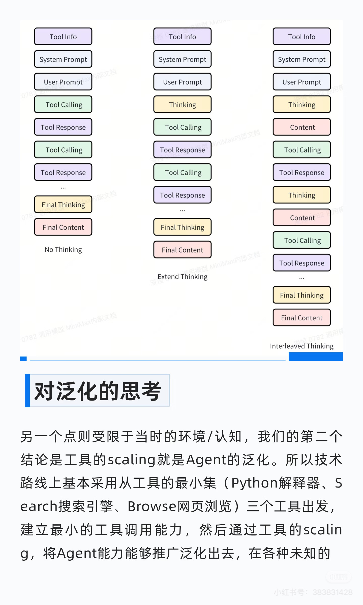

# MiniMax M2：高效开源大模型的全景解读

2025年10月27日，MiniMax 正式发布并开源了最新的大语言模型 —— **MiniMax M2**。  
这款模型的推出在国内外 AI 社区引起广泛关注，被视为在“高效 MoE 架构、Agent 能力优化、低成本推理”方向上的一次重要实践。以下将从架构设计、能力特点、性能表现到实际应用场景，对 M2 模型进行系统梳理。

## 一、总体概况

MiniMax M2 是 MiniMax 公司在继 M1 系列之后推出的全新一代大模型。  
与以往版本不同，M2 从一开始就面向 **开发者工作流** 与 **智能体（Agent）执行系统** 设计，强调实用性与成本效能的平衡。

- **发布日期**：2025 年 10 月 27 日
    
- **开源许可**：MIT（允许自由修改与商用）
    
- **主要定位**：用于代码生成、自动化工具链调用、长链推理与复杂任务规划的高效通用模型。

## 二、模型规模与架构设计

MiniMax M2 的总体参数量约为 **2300 亿**，但每次推理仅激活约 **100 亿参数**，这是典型的 **Mixture-of-Experts（MoE）稀疏架构**。  
这种设计既保持了大模型的表达能力，又大幅降低了实际计算成本。

其核心架构特征包括：

- **稀疏激活**：通过专家路由机制，每个 token 只激活部分专家，从而减少计算量。
- **全注意力（full-attention）机制**：MiniMax NLP负责人表示确实在预训练阶段尝试使用 SWA 将全注意力模型转换为类似 OSS 的结构。但是发现它损害了多跳推理的性能，所以最后使用的是全注意力。
	- 没有采用Lightning Attention（线性注意力的一种变体），原因也是因为性能损失。
	- 使用 QK Norm，每个注意力头都有自己独特的、可学习的 RMSNorm
    
- **优化的 FFN 结构**：在保持精度的前提下提升并行效率。
- **上下文窗口**：最高支持约 **20 万 token**，适合长文档、代码库、研究论文等超长输入任务。
- **思考模式（Interleaved Thinking）**：模型在输出时可交替生成 `<think>...</think>` 标签中的内部推理内容，用于辅助多步决策与工具调用。
    

## 三、核心能力与应用方向

M2 的主要能力集中在两大方向：  
**1）高智能度的编码与调试支持；**  
**2）面向多工具、多步推理的智能体应用。**

具体包括：
- **多文件代码编辑与生成**：支持跨模块重构、自动修复与重编译循环。
- **终端 / IDE 集成**：可嵌入开发环境，辅助自动化测试与构建。
- **浏览器与工具链调用**：具备基础的检索、执行、脚本生成与反馈修正能力。
- **长文档分析与信息提炼**：得益于超大上下文，可直接处理完整论文、项目文档或大型数据库。
    

## 四、性能表现与官方基准

根据官方公布的评测结果，MiniMax M2 在多项主流 benchmark 上表现接近甚至超过部分闭源顶级模型：
- **代码与软件工程基准**：如 SWE-bench、HumanEval、LeetCode-Auto 等，表现位于开源模型前列。
- **Agent 执行任务**：在 Terminal-Bench、BrowseComp 等多步推理任务中表现突出。工具使用和指令遵循也很强。
- **语言理解与生成**：在 MMLU、BBH 等综合基准中维持与主流闭源模型接近（低于）的水准。
    

模型在使用工具和深度搜索的能力都非常接近了海外最好的模型，在编程上逊色于海外最好的模型，但是也已经到了国内最好的一档。  
  
这个里面有一些算法和认知上的提升，Minimax团队会陆续做一些分享（期待！）。 但是**最核心的只有一点：要做出来符合要求的模型，首先要我们自己能用起来**。因此开发到业务甚至后台的同事，跟算法同学一起花了大量的精力构造环境和评测，开始越来越多的用到日常工作中。  
  
当能把这些复杂场景做好之后，在传统的大模型任务，比如知识、数学等，团队发现把积累的方法迁移过来之后很自然就能取得非常好的结果。比如一个比较流行的整合了10个测试任务的Artificial Analysis榜单，排到了全球前五：

## 五、推理性能与成本

M2 的另一大亮点是推理性能与性价比。得益于 MoE 架构的稀疏激活设计，模型在实际调用中显著降低了 GPU 负载。

- **推理速度**：在官方测试环境下，token 生成速度（TPS）约为 100 tokens/秒（还在快速提升）。
- **成本优势**：在相同任务下，成本仅为Claude 4.5 Sonnet的 8%，推理速度快了近一倍。
	- 定价是0.3美元每百万输入Token，1.2美元每百万输出Token
	- 该模型输出非常长，与 Grok 4 相同。因此虽然便宜，但是总成本不一定低。
- **吞吐能力**：支持高并发调用，适合企业级部署或在线服务场景。

## 六、部署与使用

MiniMax M2 的开源策略非常友好。模型权重已发布在 Hugging Face 平台，用户可直接下载并在本地或云端部署。地址： https://huggingface.co/MiniMaxAI/MiniMax-M2

- **支持框架**：vLLM、SGLang 等高性能推理引擎。
- **部署指南**：官方提供详细的使用说明与命令模板。
- **API 服务**： https://platform.minimaxi.com/docs/guides/text-generation
- **Agent产品**：目前在免费提供MiniMax Agent, 直到服务器撑不住为止。 https://agent.minimaxi.com/
	- **Lightning高效模式:** 高效极速版Agent, 在对话问答/轻量级搜索/轻量级代码场景极速输出, 且在效果上以强大agentic能力升级对话类产品体验。
	- **Pro专业模式:** 专业agent能力, 在复杂长程任务上最佳表现, 擅长深度研究/全栈开发/PPT/报告撰写/网页制作等等。
    
需要注意的是，在使用 M2 进行多步推理时，应保留模型生成的 `<think>` 标签内容，以保证智能体逻辑的稳定性。

价格 VS 效果，这里的效果用Artificial Analysis上10个测试集的平均分来表示：

价格 VS 推理速度：

## 技术分享

来自xhs

@Haohai.Sun  为什么M2是Full Attention
- **还做linear/sparse attention吗？ 一直在做，但是在工业系统里真的打过Full Attention还有些距离。** 要考虑的点很多，比如code/math场景、agent场景、多模态、Long CoT效果怎样、RL能不能scale上去、低精度运算下有没有坑，interleave thinking怎么弄，线上怎么做cache，怎么做speculative decoding...
- **为什么要做Efficient Attention？ 为了省算力** ，同算力消耗下有更好的效果。实际上softmax attention能力还没打到上限（算力有限）。
- **怎么做一个效果足够好的Linear/Sparse/Hybrid Attention模型？最大的问题不是结构设计，而是评测的局限性。**
	- “只要你把bench建出来，我自然能找到办法打上去“
	- **Benchmark不够全面。** A榜单上去了，发现了B问题，做B榜单；B榜单上去了，发现C问题，做C榜单...模型越进步，评测越难做
	- **观测成本高。** 多跳推理任务的预训练代理指标可以用BBH subtask: dyck language（测试模型是否能理解和判断括号是否成对匹配、嵌套正确。），但不是所有任务在预训练阶段都可以被观测。另外，模型不scale上去永远不知道会发生什么，很多问题在小规模试验中无法暴露。
	- **其他变量。** 变量太多，不同结构在不同数据分布下的表现大相径庭，不同结构适配的优化器也差异巨大。
- **Efficient Attention的基建差的多。** 包括训练、推理。
- 下一步是什么？**Scaling这件事依旧是主旋律，Context Length是其中的关键之一**，不管是Pretrain还是PostTrain，Context Length增长的趋势越来越明显。当GPU算力的增速慢于Data长度增长带来的算力压力增加的时候，Linear/ Sparse Attention的收益会被逐渐释放。**我们需要提前准备些东西**:
	- 1. 更多模态、信息更加丰富的长文数据;
	- 2.更合理的评测体系和实验范式，帮助更快的迭代;
	- 3.更完善的训推基建，榨干GPU的潜力。

- **sliding window attention(swa)最后没有用，因为实验效果不行。** 
	- minimax是CPT范式变成Hybrid SWA的思路，这里考虑了做层间混合和层内混合两种，做层内混合的出发点是这样层间的计算强度是均衡的，不管是训练做PP策略，还是推理的时候做PP或者AF分离都更友好。但是具体表现是Context越长性能下降越显著。
	- GPT-OSS、CWM、Gemma用了swa，可以分析下这些模型的性能，特别是长文。

@朱锦 什么是好的Reasoning数据
- 数据质量
	- CoT的质量体现为逻辑完整而不过度冗余。比如IF类型的任务上，过于简略的CoT往往导致模型跳步或过度自信。
	- Response做了多样性的格式混淆（而不是过拟合某些榜单的格式pattern），并且在多方向融合实验中观察到了显著的收益。
	- 对于CoT和Response中可能存在的Badcase，如幻觉、指令不遵循、逻辑错误等，进行了规则+LLM-as-a-judge的清洗。并且持续迭代这个Misalignment消除的链路，越来越坚信所有的Badcase都有其对应的脏训练数据，而数据质量的提升必然会有模型表现上的回响。

- 数据分布的难度和多样性。
	- math和code数据是Reasoning能力提升的关键。这两类数据带来的Reasoning能力往往能给所有的任务带来收益，比如STEM和IF。
	- 但仍然需要足够多样的数据覆盖更多的domain，比如逻辑推理、科学类、指令遵循、以及开放创意类任务。不同领域的任务有相异的思考范式，Reasoning 的多样性是能力泛化的基础。
	- 在实验中也注意到更加难、复杂的query对模型的训练更有效，所以要根据passrate(for verifiable)或复杂度评分(non-verifiable)进行数据分布的调整。

- 数据Scaling
	- 当数据质量和多样性都过关时，数据规模的提升总能带来显著收益。不论是增加query数量、做 1Q 多A、多 epoch 训练，甚至是混合不同方向的数据带来更多的训练步数，模型都会稳步变好。
	- 数据Scaling是一个非常工程化的问题，所以尝试根据任务特点对所有的数据做了归并，分为Verifiable和Non-Verifiable两条数据管线进行了自动化数据合成与处理。Reasoning团队几乎全部由实习生组成，这个数据管线很好地保证了团队的协作效率和数据产出的一致性。

- 后续工作
	- 一个是复合能力，比如知识+reasoning,以及在Agent场景下工具对Reasoning任务的增益。
	- 另一个是如何融合Verifiable和 Non-Verifiable两类任务，比如不同domain上的CoT的融合与Reasoning能力的泛化，以及训练方式的统一。

@浚恒 Agent向谁对齐: Agent泛化
- 第一，在开源榜单上有还不错的能力，因为开源榜单代表了很多纯粹的能力。
- 第二，模型在不同的新工具、各种Code IDE/Cli、Agent脚手架以及其他用户可能使用的场景上，都有足够稳定的表现，即模型必须拥有足够好的泛化能力。
	- Agent需要Interleaved Thinking能力，即在完成一个单独任务过程中，thinking可以出现在所有位置，不是只能在开头thinking。这样设计主要有两个原因，第一是长程的代理任务上下文很长，只在开头thinking很难确保长程的指令遵循;第二个原因更关键一些，Agent任务和普通的推理任务最大的区别是Agent加入了模型外的扰动(工具返回内容)，因此LLM需要对于这样的扰动是稳定的，并且能从这些信息中探索有用的内容，而模型的思考能够完美满足这两点需求。这一特性对模型Agent效果的提升起到了非常关键的作用。
		- 因为M2采用Interleaved Thinking能力，因此在Agent任务中，需要保留全部的上下文，包括thinking内容(这一点和推理模型不同，推理模型使用中通常会把前文的thinking内容删掉)。
	- 工具的scaling就是Agent的泛化。所以技术路线上基本采用从工具的最小集(Python解释器、Search搜索引擎、Browse网页浏览)三个工具出发建立最小的工具调用能力，然后通过工具的scaling，将Agent能力能够推广泛化出去，在各种未知的工具上都能有比较好的表现。项目沿着这样的技术路线推动的比较顺利，Benchmark的分数很快就达到了比较不错的水平。
	- 但随着认知的加深，会发现Agent的泛化不仅仅是工具的泛化这一件事儿。模型在Benchmark上表现良好，但如果环境进行了变化，比如换一个脚手架，模型能力会大幅下降，这距离我们一个好的“实用性”的模型的目标还差很多。又经过团队内部的深入讨论，我们觉得Agent的泛化是在模型一切可能的操作空间上的扰动适应 这件事。举例来说，如图中，对于一次Agent任务轨迹，最初的输入是工具信息(ToolInfo)系统指令(System Prompt)、用户指令(User Prompt)以及环境(包括工具集、代码文件等等)，输出是思考内容(Thinking)、最终回复(Content)，模型与环境交互，拿到工具返回(ToolResponse)，然后交替进行，直到能够完成整个的任务。而工具调用的scaling相当于只是在上述轨迹中，对最初输入的ToolInfo进行了泛化能力的提升，而对轨迹中其他部分的扰动基本没有考虑。
	- 基于上述的思考，我们团队内部设计了一整套覆盖全轨迹泛化的数据链路 。通过这样链路产生的数据，可以保证在绝大多数的扰动下，都能有比较稳定的工具表现。我们的一些实验结果也是非常令人振奋的，在内部测试中，我们尝试了很多基本没有考虑过的冷门的脚手架，模型在上面的表现都是超出预期的，无论是工具调用还是指令遵循，都得到了良好的泛化。
- 未来的一些工作
	- 积累了非常多的关于Agent/泛化数据相关的认知，很多想法还没有实施落地。未来会在泛化上做更深入的探索。
- 增加推理长度or增加工具轮数哪一个对agent更重要？从实验结果看，在大多数agent任务中增加轮次是更优的，但对于某些需要推理的任务来说单轮thinking的增加是必要的。一个理想的pattern应该是thinking长度能够在关键步骤自适应的调整。

## 参考资料

[MiniMax M2 & Agent，大巧若拙 - MiniMax News](https://www.minimaxi.com/news/minimax-m2)

[X](https://x.com/zpysky1125/status/1982715183102660664)

[x.com/ArtificialAnlys/status/1982714153375854998](https://x.com/ArtificialAnlys/status/1982714153375854998)

