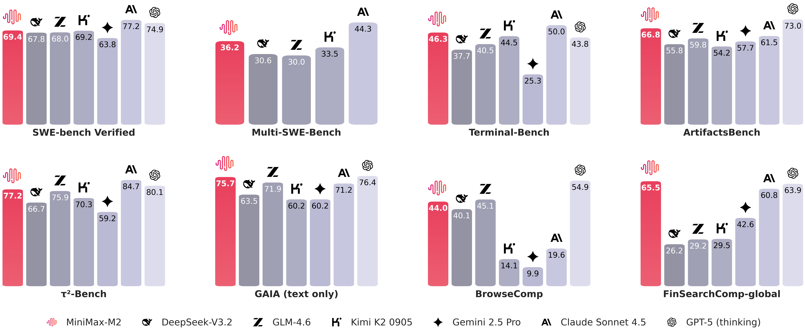

# MiniMax M2：高效开源大模型的全景解读

2025年10月27日，MiniMax 正式发布并开源了最新的大语言模型 —— **MiniMax M2**。  
这款模型的推出在国内外 AI 社区引起广泛关注，被视为在“高效 MoE 架构、Agent 能力优化、低成本推理”方向上的一次重要实践。以下将从架构设计、能力特点、性能表现到实际应用场景，对 M2 模型进行系统梳理。

## 一、总体概况

MiniMax M2 是 MiniMax 公司在继 M1 系列之后推出的全新一代大模型。  
与以往版本不同，M2 从一开始就面向 **开发者工作流** 与 **智能体（Agent）执行系统** 设计，强调实用性与成本效能的平衡。

- **发布日期**：2025 年 10 月 27 日
    
- **开源许可**：MIT（允许自由修改与商用）
    
- **主要定位**：用于代码生成、自动化工具链调用、长链推理与复杂任务规划的高效通用模型。

## 二、模型规模与架构设计

MiniMax M2 的总体参数量约为 **2300 亿**，但每次推理仅激活约 **100 亿参数**，这是典型的 **Mixture-of-Experts（MoE）稀疏架构**。  
这种设计既保持了大模型的表达能力，又大幅降低了实际计算成本。

其核心架构特征包括：

- **稀疏激活**：通过专家路由机制，每个 token 只激活部分专家，从而减少计算量。
    
- **全注意力（full-attention）机制**：MiniMax NLP负责人表示确实在预训练阶段尝试使用 SWA 将全注意力模型转换为类似 OSS 的结构。但是发现它损害了多跳推理的性能，所以最后使用的是全注意力。
	- 没有采用Lightning Attention（线性注意力的一种变体），原因也是因为性能损失。
	- 使用 QK Norm，每个注意力头都有自己独特的、可学习的 RMSNorm
    
- **优化的 FFN 结构**：在保持精度的前提下提升并行效率。
    
- **上下文窗口**：最高支持约 **20 万 token**，适合长文档、代码库、研究论文等超长输入任务。
    
- **思考模式（Interleaved Thinking）**：模型在输出时可交替生成 `<think>...</think>` 标签中的内部推理内容，用于辅助多步决策与工具调用。
    

## 三、核心能力与应用方向

M2 的主要能力集中在两大方向：  
**1）高智能度的编码与调试支持；**  
**2）面向多工具、多步推理的智能体应用。**

具体包括：

- **多文件代码编辑与生成**：支持跨模块重构、自动修复与重编译循环。
    
- **终端 / IDE 集成**：可嵌入开发环境，辅助自动化测试与构建。
    
- **浏览器与工具链调用**：具备基础的检索、执行、脚本生成与反馈修正能力。
    
- **长文档分析与信息提炼**：得益于超大上下文，可直接处理完整论文、项目文档或大型数据库。
    

## 四、性能表现与官方基准

根据官方公布的评测结果，MiniMax M2 在多项主流 benchmark 上表现接近甚至超过部分闭源顶级模型：

- **代码与软件工程基准**：如 SWE-bench、HumanEval、LeetCode-Auto 等，表现位于开源模型前列。
    
- **Agent 执行任务**：在 Terminal-Bench、BrowseComp 等多步推理任务中表现突出。工具使用和指令遵循也很强。
    
- **语言理解与生成**：在 MMLU、BBH 等综合基准中维持与主流闭源模型接近（低于）的水准。
    

模型在使用工具和深度搜索的能力都非常接近了海外最好的模型，在编程上逊色于海外最好的模型，但是也已经到了国内最好的一档。  
  
这个里面有一些算法和认知上的提升，Minimax团队会陆续做一些分享（期待！）。 但是**最核心的只有一点：要做出来符合要求的模型，首先要我们自己能用起来**。因此开发到业务甚至后台的同事，跟算法同学一起花了大量的精力构造环境和评测，开始越来越多的用到日常工作中。  
  
当能把这些复杂场景做好之后，在传统的大模型任务，比如知识、数学等，团队发现把积累的方法迁移过来之后很自然就能取得非常好的结果。比如一个比较流行的整合了10个测试任务的Artificial Analysis榜单，排到了全球前五：

## 五、推理性能与成本

M2 的另一大亮点是推理性能与性价比。  
得益于 MoE 架构的稀疏激活设计，模型在实际调用中显著降低了 GPU 负载。

- **推理速度**：在官方测试环境下，token 生成速度（TPS）约为 100 tokens/秒（还在快速提升）。
    
- **成本优势**：在相同任务下，成本仅为Claude 4.5 Sonnet的 8%，推理速度快了近一倍。
	- 定价是0.3美元每百万输入Token，1.2美元每百万输出Token
	- 该模型输出非常长，与 Grok 4 相同。因此虽然便宜，但是总成本不一定低。
    
- **吞吐能力**：支持高并发调用，适合企业级部署或在线服务场景。
    

这些数据基于厂商的优化环境（如 FP8 量化与 vLLM/SGLang 框架），实际效果仍需用户自行验证。

## 六、部署与使用

MiniMax M2 的开源策略非常友好。模型权重已发布在 Hugging Face 平台，用户可直接下载并在本地或云端部署。

地址： https://huggingface.co/MiniMaxAI/MiniMax-M2

- **支持框架**：vLLM、SGLang 等高性能推理引擎。
    
- **部署指南**：官方提供详细的使用说明与命令模板。
    
- **API 服务**：提供API接口： https://platform.minimaxi.com/docs/guides/text-generation

- **Agent产品**：目前在免费提供MiniMax Agent, 直到服务器撑不住为止。 https://agent.minimaxi.com/
	- **Lightning高效模式:** 高效极速版Agent, 在对话问答/轻量级搜索/轻量级代码场景极速输出, 且在效果上以强大agentic能力升级对话类产品体验。
	- **Pro专业模式:** 专业agent能力, 在复杂长程任务上最佳表现, 擅长深度研究/全栈开发/PPT/报告撰写/网页制作等等。
    

需要注意的是，在使用 M2 进行多步推理时，应保留模型生成的 `<think>` 标签内容，以保证智能体逻辑的稳定性。

价格 VS 效果，这里的效果用Artificial Analysis上10个测试集的平均分来表示：

价格 VS 推理速度：

## 七、典型应用场景

**推荐使用场景：**

1. **开发者工作流自动化**  
    支持代码重构、单元测试生成、错误修复、持续集成分析等。
    
2. **智能体系统（Agent Framework）**  
    可作为核心模型执行多步工具调用和决策。
    
3. **知识型任务与长文档处理**  
    适合法律、科研、技术资料等复杂文本的长上下文分析。
    

**不推荐场景：**

- 对事实性要求极高、需可验证来源的任务（例如法律判定、医疗诊断）。
    
- 高风险、需强可解释性的自动决策系统。
    

## 参考资料

[MiniMax M2 & Agent，大巧若拙 - MiniMax News](https://www.minimaxi.com/news/minimax-m2)

[X](https://x.com/zpysky1125/status/1982715183102660664)

[x.com/ArtificialAnlys/status/1982714153375854998](https://x.com/ArtificialAnlys/status/1982714153375854998)

