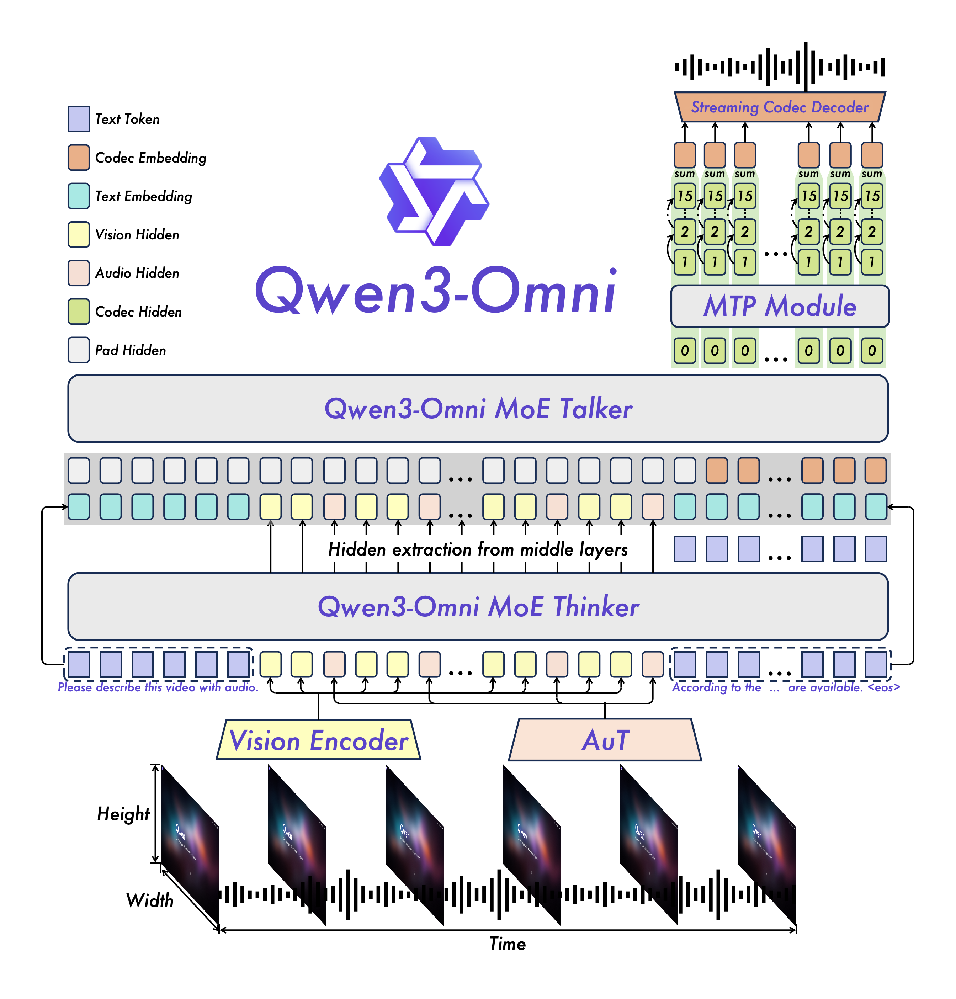

## 论文基本信息

标题：Qwen3-Omni Technical Report

作者：Qwen Team

链接：https://arxiv.org/abs/2509.17765

代码：https://github.com/QwenLM/Qwen3-Omni

Demo: https://huggingface.co/spaces/Qwen/Qwen3-Omni-Demo

blog: [Qwen](https://qwen.ai/blog?id=fdfbaf2907a36b7659a470c77fb135e381302028&from=research.research-list)

框架图：

## 简介

Qwen3-Omni是什么？

- 它是 **阿里巴巴通义千问团队**推出的新一代大模型。
    
- “Omni”意思是 **全能** —— 这个模型不仅能处理文字，还能处理 **图片、语音、视频**，可以做到真正的多模态理解和生成。
    
- 简单说，它能听、能看、能说，还能写。

主要特点：

- **原生全模态**：这是它最厉害的地方。以前的AI模型可能擅长一两种能力（比如只擅长文字，或者只擅长看图），但一旦让它学别的，原来的能力就会下降。Qwen3-Omni做到了​**​同时精通文本、图像、音频、视频​**​，而且各项能力都不打折，没有“偏科”。

- **强大的性能**：Qwen3-Omni在36项音频及音视频基准测试中斩获32项开源SOTA与22项总体SOTA，超越Gemini-2.5-Pro、Seed-ASR、GPT-4o-Transcribe等闭源强模型，同时其图像和文本性能也在同尺寸模型中达到SOTA水平。

- **多语言**：Qwen3-Omni支持119种文本语言交互、19种语音理解语言与10种语音生成语言。

- **更快响应**：Qwen3-Omni纯模型端到端音频对话延迟低至211ms，视频对话延迟低至507ms。

- **长音频**：Qwen3-Omni支持长达30分钟音频理解。

- **个性化**：你可以通过“系统提示”（System Prompt）来定制它的​**​回复风格和“人设”​**​。比如，你可以让它扮演一个专业的医生、一个幽默的朋友，或者用特定的口吻和你对话。

- **工具调用**：Qwen3-Omni支持function call，实现与外部工具/服务的高效集成。
    
- **开源通用音频Captioner**：开源Qwen3-Omni-30B-A3B-Captioner，低幻觉且非常详细的通用音频caption模型，填补开源社区空白。

## 模型架构

Qwen3-Omni采用Thinker-Talker架构：Thinker负责文本生成，Talker专注于流式语音Token生成，直接接收来自Thinker的高层语义表征。为实现超低延迟流式生成，Talker通过自回归方式预测多码本序列：在每一步解码中，MTP模块输出当前帧的残差码本，随后Code2Wav合成对应波形，实现逐帧流式生成。

- ​**​Thinker（思考者）​**​：负责“大脑”的工作，处理所有输入的信息（文字、图片、声音），进行深度理解和思考，并生成要回复的​**​文本内容​**​。
    
- ​**​Talker（说话者）​**​：负责“嘴巴”的工作，它接收Thinker的指令，专门负责将文本内容转换成​**​非常自然、流式的语音​**​说出来。

- **创新架构设计**
    
    AuT：音频编码器采用基于2000万小时音频数据训练的AuT模型，具备极强的通用音频表征能力。
    
    MoE：Thinker与Talker均采用MoE架构，支持高并发与快速推理。
    
    多码本技术：Talker采用多码本自回归方案——每步生成一个编解码帧，MTP模块同步输出剩余残差码本。
    
- **全模态不降智**
    
    在文本预训练早期混合单模态与跨模态数据，可实现各模态混训性能相比纯单模态训练性能不下降，同时显著增强跨模态能力。
    
- **卓越的语音对话与指令跟随能力**
    
    Qwen3-Omni在语音识别与指令跟随任务中达到Gemini-2.5-Pro相同水平。
    
- **实时音频和音视频交互**
    
    AuT，Thinker, Talker + Code2wav全流程全流式，支持首帧token直接流式解码为音频输出。

## 模型性能

Qwen3-Omni在全方位性能评估中，其单模态任务表现与类似大小的Qwen系列单模态模型持平，尤其在音频任务中展现显著优势。该模型在36项音视频基准测试中，36项测试中的32项取得开源领域最佳性能，22项达到SOTA水平，性能超越Gemini-2.5-Pro、Seed-ASR、GPT-4o-Transcribe等性能强大的闭源模型。

## 实验
论文中的实验是如何设计的？

用于定量评估的数据集是什么？代码有没有开源？

论文中的实验及结果有没有很好地支持需要验证的科学假设？

## 未来方向

**Qwen3-LiveTranslate-Flash** 是一款基于大语言模型的高精度、高响应、高鲁棒性的多语言实时音视频同传模型。依托Qwen3-Omni强大的基座能力、海量多模态数据、百万小时音视频数据，Qwen3-LiveTranslate-Flash 实现了覆盖18种语言的离线和实时两种音视频翻译能力。[Qwen](https://qwen.ai/blog?from=home.latest-research-list&id=4266edf7f3718f2d3fda098b3f4c48f3573215d0)

核心亮点：

- **多语言和方言**：支持中文、英文、法语、德语、俄语、意大利语、西班牙语、葡萄牙语、日语、韩语、印尼语、泰语、越南语、阿拉伯语、印地语、希腊语、土耳其语等主要官方语言和普通话、粤语、北京话、吴话、四川话、天津话的方言翻译。
    

- **视觉增强**：首次引入视觉上下文增强技术，让 Qwen3-LiveTranslate-Flash 不仅“听得懂”，还能“看得懂”，通过识别和利用口型、动作、文字、实体等多模态信息，有效应对嘈杂音频环境以及一词多译词场景下的翻译不准问题。
    

- **3秒延迟**：轻量的混合专家架构与动态采样策略实现最低3秒延迟的同传体验。
    

- **无损同传**：采用语义单元预测技术缓解跨语言翻译的调序问题，实现与离线翻译几乎无损的翻译质量。
    

- **音色自然**：海量语音数据训练，可以根据原始语音内容自适应调节语气和表现力的拟人音色。

## 主要收获

## 参考资料
