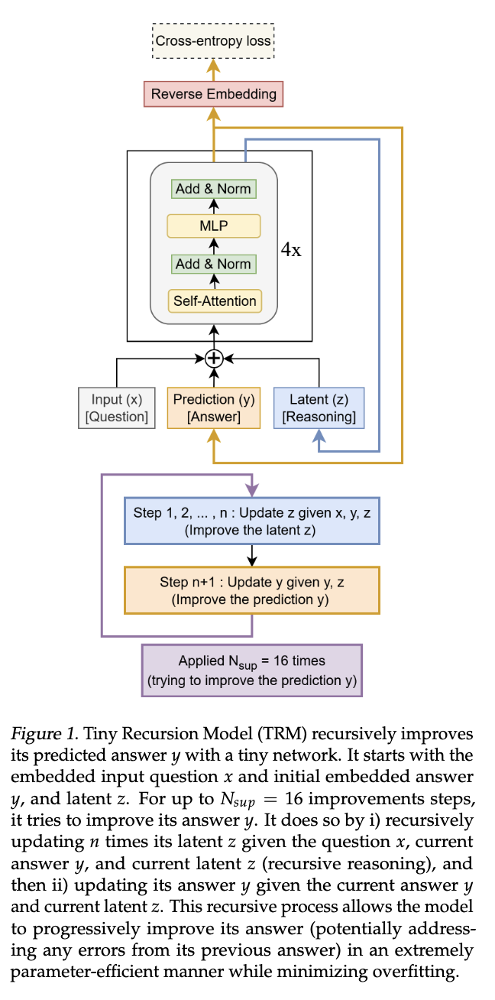
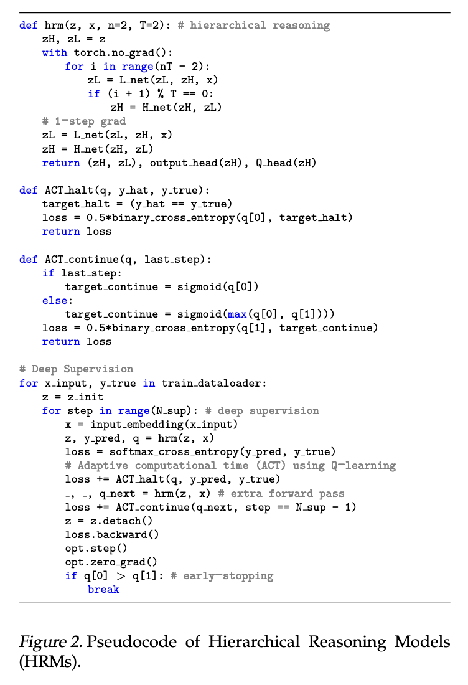
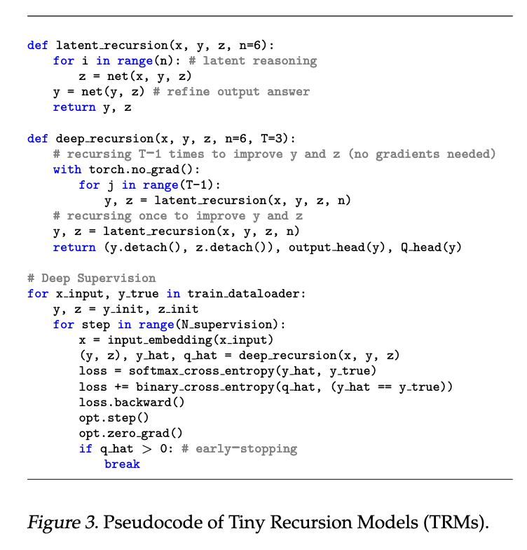
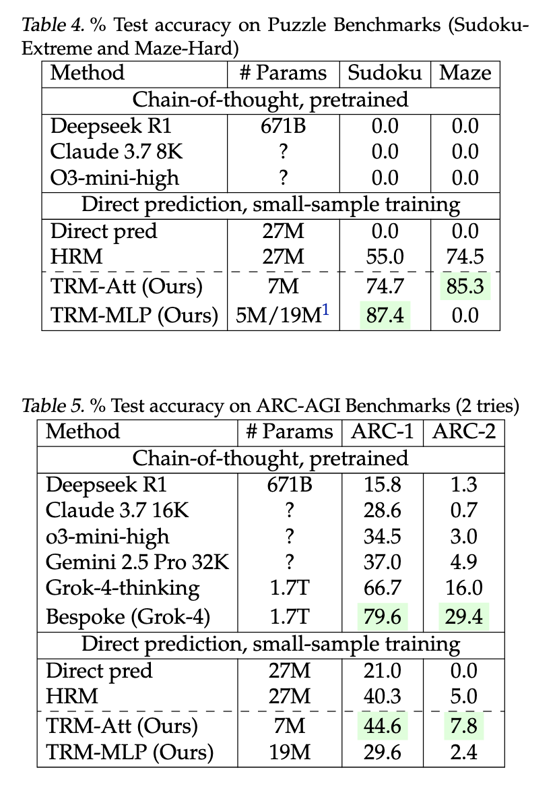

## 论文基本信息

标题：Less is More: Recursive Reasoning with Tiny Networks

链接：http://arxiv.org/abs/2510.04871

代码：https://github.com/SamsungSAILMontreal/TinyRecursiveModels

这篇论文题为 **《Less is More: Recursive Reasoning with Tiny Networks》**（少即是多：用微型网络实现递归推理），发表于 2025 年 10 月，由 Samsung SAIL Montréal 的 **Alexia Jolicoeur-Martineau** 提出。  
它的核心思想是：**小网络 + 深度递归 = 智能推理能力**。

一句话总结：

> **Tiny Recursive Model（TRM）通过简单的递归推理过程，让一个7M参数的两层小网络在复杂推理任务上超过大型语言模型。它展示了小模型通过“逐步思考”也能实现强泛化。**

框架图：




## 🧠 研究背景与动机

当前大型语言模型（LLM）虽然强大，但：

- 在 **复杂推理任务（如 Sudoku、Maze、ARC-AGI）** 上表现依然不理想；
    
- 依赖 **Chain-of-Thought（CoT）** 与 **Test-Time Compute（TTC）** 提升推理，但这很耗时、脆弱；
    
- ARC-AGI-2 基准上，甚至像 Gemini 2.5 Pro 这样的顶级模型也只有 4.9% 的准确率。
    

为此，研究者提出要寻找一种更**高效、更小、更可靠的推理方法**。

---

## 🧩 背景模型：HRM（Hierarchical Reasoning Model）

之前的工作 **HRM（层级推理模型，Wang et al., 2025）** 是一个重要起点：

- 使用 **两个小 Transformer 网络**：
    
    - 低频网络 fL：高频递归更新；
        
    - 高频网络 fH：低频递归更新；
        
- 模仿生物大脑的“层级处理与多时间尺度活动”；
    
- 每个样本迭代多次（称为 **deep supervision**），让模型逐步改进答案；
    
- 使用 **Adaptive Computation Time (ACT)** 动态决定是否提前停止递归。
    

📊 HRM 在小样本任务上效果突出：

- Sudoku Extreme：55%
    
- Maze Hard：75%
    
- ARC-AGI-1：40%
    
- ARC-AGI-2：5%
    

但作者指出它存在三个问题：

1. **理论不严谨**（依赖隐函数定理与“固定点”假设）；
    
2. **实现复杂**（两个网络 + Q-learning + 额外 forward pass）；
    
3. **生物学类比模糊**（难以解释哪些部分真正有效）。
    


---

## ⚙️ 本文提出的新方法：TRM（Tiny Recursive Model）

TRM 是对 HRM 的极度简化与优化版本。

|特性|HRM|TRM|
|---|---|---|
|网络数量|两个 (fL, fH)|一个 tiny 网络|
|参数量|27M|7M|
|层数|4 层|2 层|
|是否使用固定点近似|✅|❌|
|是否使用 Q-learning|✅|❌|
|是否需要额外 forward pass|✅|❌|

### 🔁 关键思想：**递归改进答案**

TRM 反复调用同一个小网络：

1. 输入包括问题 (x)、当前答案 (y)、以及隐藏状态 (z)；
    
2. 网络先更新 (z)，再用 (z) 改进 (y)；
    
3. 如此递归多次（最多 16 次），逐步优化答案。
    

这个过程模仿“人类思考”：

> 想一想 → 改一改 → 再想一想 → 再改一改。

### 📜 简化伪代码：

```python
def latent_recursion(x, y, z, n=6):
    for i in range(n):
        z = net(x, y, z)  # 推理更新
    y = net(y, z)     # 改进答案
    return y, z
```

通过多步监督训练，模型学会“每次都能让答案更好”。



---

## 🧩 TRM 的主要改进与创新点

### 1️⃣ 去掉固定点假设与隐函数定理

不再假设网络达到平衡点，而是直接全程反向传播，提升了稳定性与理论严谨性。

### 2️⃣ 单一网络架构

通过输入中是否包含 x/y 来区分“推理”与“更新”任务，因此不再需要两个独立网络。

### 3️⃣ 少层但多次递归

发现：

> **2 层 tiny 网络 + 深度递归（≈40步）**  
> 比 **4 层大网络 + 少递归** 泛化更好。

这体现了论文标题的核心思想：**Less is More**。

### 4️⃣ attention-free 结构（在小输入上更优）

在 Sudoku（9x9）这类小固定输入长度任务上，用 MLP 替代自注意力能更好泛化。

### 5️⃣ 改进 ACT：去掉额外 forward pass

ACT 仅预测“是否应停止”，无需第二次前向计算，效率更高。

### 6️⃣ 使用 EMA 稳定训练

引入 **Exponential Moving Average** 平滑权重变化，防止小数据过拟合。

---

## 📈 五、实验结果

|任务|模型|参数量|准确率|
|---|---|---|---|
|**Sudoku-Extreme**|HRM|27M|55%|
||TRM (MLP)|5M|**87.4%**|
|**Maze-Hard**|HRM|27M|74.5%|
||TRM (Attention)|7M|**85.3%**|
|**ARC-AGI-1**|HRM|27M|40.3%|
||TRM|7M|**44.6%**|
|**ARC-AGI-2**|HRM|27M|5.0%|
||TRM|7M|**7.8%**|

值得注意的是：

> TRM 仅 7M 参数，却击败了 Gemini 2.5 Pro、DeepSeek R1、o3-mini 等超大模型。

---



## 🧭 总结与启示

**论文核心结论：**

> “强推理能力 ≠ 大模型。  
> 递归 + 深监督 能让小模型表现出强大的思考能力。”

**关键收获：**

1. 深度递归是一种高效的“思维模拟”机制；
    
2. 参数少、结构简单反而能减少过拟合；
    
3. 在小数据、小任务场景下，小模型可超越 LLM；
    
4. HRM → TRM 的演化展示了“复杂理论”向“实用工程”的简化路径。
    

---
