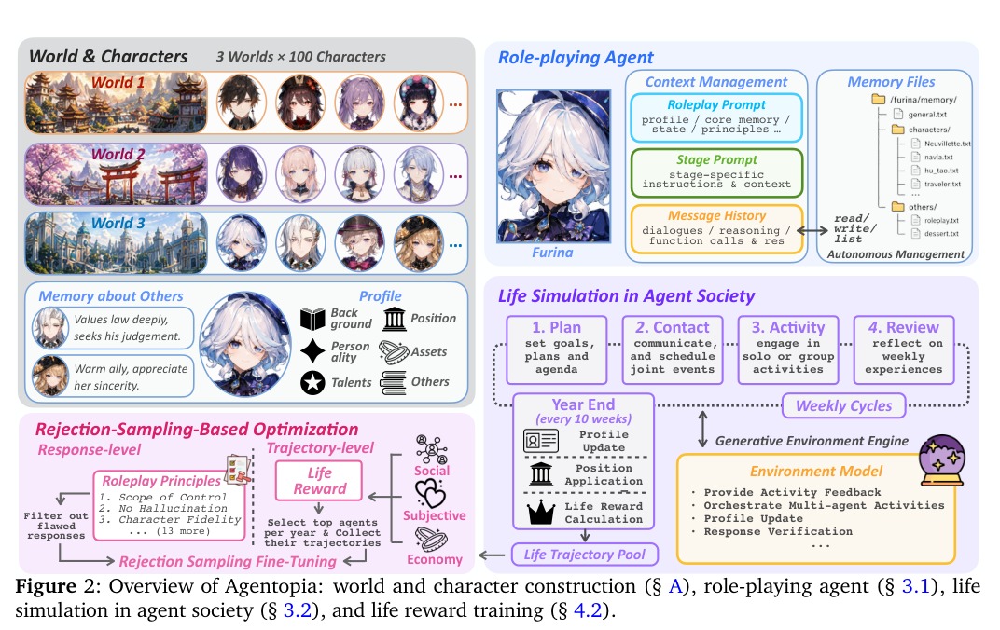
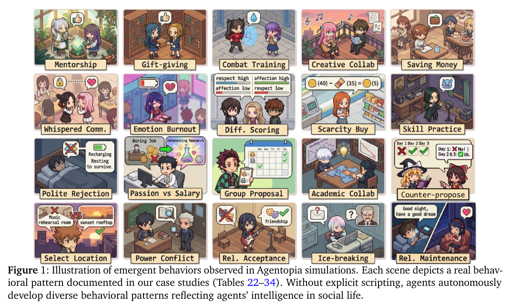

## 论文基本信息

标题：Agentopia: Long-Term Life Simulation and Learning in Agent Societies

作者：Xintao Wang（复旦，CoSER / InCharacter / BookWorld 一作，本文通讯）、Sirui Zheng、Hongqiu Wu、Weiyuan Li、Jen-tse Huang 等

链接：arXiv 2606.07513v1（2026-06-05）

代码：https://github.com/Neph0s/Agentopia

框架图：

涌现行为（Figure 1，每格都是 case study 里的真实行为，无一条脚本化）：

> **一句话 TLDR**：把 agent 社会模拟从「天」拉长到「10 模拟年」（3 世界 × 100 agent），定义模仿人类幸福感的 life reward（社交 / 主观 / 经济三维），再用它做拒绝采样微调，反过来提升底座 LLM 的拟人度——下游 CoSER Test 涨 15.6%。核心主张：**agent 可以像人一样通过「过日子」变得更像人，不需要人类数据**。

## 背景

**要解决的问题**：人类数据快用尽了，未来 AI 需要靠经验学习（Silver & Sutton 的 *Era of Experience*）。既然人是在社会生活里长大的，agent 能不能也在 agent 社会里「活」出拟人能力？

**现有工作卡在哪**：

[1] **社会模拟侧**（Generative Agents、Humanoid Agents、Project Sid、Aivilization）：绝大部分 LLM 调用烧在低层物理操作上——「收集 2 个小麦做 1 袋面粉」「捡起瓶子、走到某处」，模拟尺度停在**天**级，长期社会动态（成长、竞争、亲密关系、资源分配）根本展开不了。

[2] **角色扮演侧**（CoSER、Character-LLM、RoleLLM、CharacterGLM）：聚焦单次对话内的人设保真和用户体验，不模拟角色自己的人生；优化重度依赖人类数据（贵、难 scale）。

**科学假设**：给足够长的模拟社会生活 + 一个模仿人类 well-being 的奖励，LLM 能自己长出社交智能和拟人度，且这种能力能泛化到下游角色扮演任务。

**与相邻系统的定位对比**（论文 Table 1）：

| | Gen. Agents | Project Sid | Aivilization | **Agentopia** |
|---|---|---|---|---|
| 时间尺度 | 天 | 天 | 周 | **年（10 年）** |
| agent 数 | 25 | 50 | ~10,000 | 100 |
| 动作空间 | 预定义 | 预定义 | 预定义 | **自由文本** |
| 环境反馈 | 规则 | 规则 | 规则 | **LLM** |
| 记忆 | 检索 | 检索 | 固定 scratchpad | **文件系统** |
| 技能成长 / 经济 / 职业 | ✗/✗/✗ | ✗/✓/✓ | ✓/✓/✓ | ✓/✓/✓ |
| 奖励 / 训练 | ✗/✗ | ✗/✗ | ✓/✗ | **✓/✓** |

Agentopia 是唯一**闭环到训练**的（其他系统都只模拟不回流）。代价是 agent 规模只有 100（Aivilization 一万），换来了时间深度。

## 相关研究

- **社会模拟一系**：Generative Agents（25 agent / 2 天，开party 的涌现）→ Humanoid Agents（引入马斯洛需求）→ Project Sid（Minecraft，涌现分工/规则/文化传播）→ BookWorld（从小说构建 agent 社会做故事生成）→ Aivilization（万级 agent，生产与经济）。
- **角色扮演一系**：数据（Character-LLM、RoleLLM、CoSER）、评测（RoleEval、InCharacter、LifeChoice、CharacterEval）、优化（CogDual、CPO、HER 探索 RL，卡在奖励信号难对齐人类）、机理（Persona Vector、Assistant Axis、Emotion Concepts）。
- 值得关注：**复旦 Xintao Wang 这一系**（CoSER → BookWorld → Agentopia，是同一条主线：从抽取真人数据 → 用小说建 agent 社会 → 让 agent 自己过日子造数据）。可与 [[EvolvingWorld]] 对照看，两篇是同期同赛道的不同解法。

## 核心亮点

### 1. 关键取舍：砍掉低层操作，只模拟抽象社交

这是能跑 10 年的**唯一前提**。作者明确论证过：真·实时感知框架（agent 从教室走到操场，每一刻观察所有人在干嘛）计算成本不可承受，而且会把绝大部分算力花在移动/拿东西这些和社交智能无关的事上。

于是接受 LLM 回合制生成的本质，把时间离散成 **周**（不是秒/动作）。用「更少的 LLM 调用换更高的社交交互密度」，token 效率是长程模拟的第一性约束。

### 2. 模拟流程：周为单位的四阶段循环

实验参数：每年 `n_w=10` 周，每周 `n_c=5` 轮沟通、`n_d=5` 个活动日。

**周结算（自动，先于一切 agent 行动）**：
- 满足感衰减：mood / social / esteem 各衰减当前值的 15%（物质满足不衰减，由经济系统控制）。依据是**享乐适应理论**（hedonic adaptation）——人对既有幸福会脱敏
- 发工资（职位薪水 + 角色固定额外收入）
- 衰减机制制造了**内生动机循环**：什么都不干 → 满足感掉 → 被迫去找活动。这是整个模拟不塌成「所有人躺平」的关键设计

**四阶段**：

| 阶段 | 做什么 |
|---|---|
| 1. Plan | 回顾目标和上周，定周计划，选**生活水准**（frugal $100 / moderate $200 / comfortable $300 / luxurious $500 每周）。可用 `read_file`/`update_file` 读写自己的计划 |
| 2. Contact | 5 轮配对沟通（多人对话推迟到 joint activity）。每轮收到新消息 + 过去三周沟通史，决定联系谁、做什么动作。轮次结束后系统统一裁决哪些联合活动成立（处理取消、去重、时间冲突） |
| 3. Activity | 5 天每天一个活动，四类：**joint**（多人多轮）/ **solo**（默认，学习/工作/消费）/ **encounter**（环境模型给闲着的人安排的偶遇）/ **public**（公共活动，自主报名） |
| 4. Review | 写周记（作为短期记忆进入后续上下文），据此更新记忆文件 |

**年末三件事**：环境模型按一年经历增量更新 profile（性格/天赋/技能数值）→ 职位申请（竞争有限空缺，环境模型按能力排序）→ 结算 life reward。

**动作 vs 函数调用是分开的两套**：`<role_action>` 标签包裹的是真实行动（contact / propose_joint_activity / respond_invitation / cancel_joint_activity），由系统解析执行；函数调用是记忆读写。这个分离值得注意——行动要被世界裁决，记忆操作不需要。

### 3. 记忆：文件系统 + 三层上下文

**记忆文件**（长期记忆）：
- `general.txt` 个人笔记和计划、`characters/<who>.txt` 对某人的认知、`others/<name>.txt` 任意主题
- 三个函数：`read_file` / `update_file` / `list_files`，agent 自己决定记什么、更新什么、丢什么
- **强制 read-before-write**：同一次调用内没读过就不许写，保证更新是在已有内容上叠加而不是盲目覆盖
- 两种进上下文的方式：最近访问文件的**摘要**自动进 roleplay prompt；**全文**由 agent 按需主动检索

**关系不单独建模**——这是我认为最优雅的一处设计。系统里没有 relationship 表，关系就存在双方各自 `characters/<对方>.txt` 的自由文本里。一套机制天然表达朋友、恋人、陌生人、宿敌，而且**天然支持单向关系**（A 把 B 当挚友，B 觉得 A 只是同事）——后面 case study 里最好的几个故事全靠这个才成立。

**三层上下文**：
1. **Roleplay prompt**（跨阶段共享）：完整人设 + 近期周记（短期记忆）+ 记忆文件摘要（长期记忆）+ 世界观规则 + 角色扮演原则
2. **Stage prompt**：阶段专属指令和上下文（如 Contact 阶段的排期规则和沟通历史）
3. **Message history**：本阶段内累积的多轮消息，含对话、函数调用及结果、压缩后的推理过程

### 4. 环境模型：生成式环境引擎

一个**无状态 LLM**，取代硬编码规则，一人身兼：活动可行性判定与结果生成、状态变化数值给定（vitality / fulfillment 变化不是规则算的，是它按活动内容判的）、joint activity 里选下一个说话人、生成公共活动和偶遇、职位申请排序、年末更新 profile、**按 16 条原则过滤劣质回复**。

**Location system 的由来值得记**：早期实验发现不给地点信息，agent 会大量幻觉环境细节和物体。于是给每个世界生成一组地点，强制 joint/encounter 活动必须指定地点。——「用最小的结构化 grounding 压住幻觉」，比加一堆约束 prompt 有效。

**16 条角色扮演原则**（response filtering 用，直接可复用）：

| 原则 | 说明 |
|---|---|
| Scope of control | 只控制自己的言行，不替别人决定结果和想法 |
| No hallucination | 只引用上下文里有的信息，不编造物体/事件 |
| Character consistency | 性格和行为模式匹配既定人设 |
| Cognitive boundaries | 知识和认知边界匹配角色身份背景 |
| Motivation consistency | 行为要有合理内在动机支撑 |
| State consistency | 身心状态（疲劳、伤病）不能突变 |
| Emotional continuity | 情绪变化要渐进 |
| Natural relationship progression | 关系不能突进，陌生人到挚友要有过程 |
| No parroting | 同样内容不重复三次以上，对话要有实质推进 |
| No AI assistant behavior | 不说客服腔/助手腔 |
| Substantive dialogue | 给新信息，不原地打转 |
| Selective disclosure | 说多少取决于关系，陌生人不掏心掏肺 |
| Independent self | 有自己的目标、偏好、好恶 |
| Colloquial speech | 日常对话用口语 |
| Directness | 直接说，不堆废话和限定语 |
| First-person perspective | 言行思用第一人称，动作描写可省主语 |

### 5. Life Reward：三维，全部外部判定

设计原则：**用人类 well-being 当先验来定义 agent 奖励**，让 agent 朝人类目标优化，从而自然长出情绪智能和社交智能。三维都由外部给，不许自评。

**Social Reward（社交地位）**——设计最精细的一维：
1. 每个 agent 私下给社交圈每个人打 **affection（好感）** 和 **respect（尊重）** 两个分（0-100）。这两维来自社会认知的 **Warmth-Competence 模型**（Fiske et al. 2007）
2. **明确告知打分不公开**——防止 agent 因社交压力给虚高分。这是个很实在的工程细节
3. 分数按排名重标定到 0-100（第一名 100、末位 0），消除不同 agent 打分尺度差异
4. 建两张加权有向图，跑 **Weighted PageRank**
5. 收敛后加 **Mutual Affection Bonus**：`S'_i = Σ_j w_ji · (1 + α·w_ij) · S_j`——被自己看重的人看重，权重更高。理论依据是 Sociometer Theory
6. 两图分数取平均

**Subjective Reward（主观满足）**：马斯洛四维（mood / material / social / esteem）年度累计，**低于全体 25 分位触发惩罚**，vitality 过低独立惩罚。`r_subj = (ΣΣ f_wd − n_p·λ_p) / (n_w·D)`

**Economy Reward**：`年末存款 − 年初存款`。同时捕捉赚钱能力和花钱智慧。

**Total**：三者各自 z-score 归一后加权求和。

### 6. Life Reward Training：拒绝采样，不是 RL

**为什么不用 RL**：horizon 太长——每个 agent 每模拟年数百次 LLM 调用，一次模拟跑十年。PPO 端到端不可行，GRPO 的多 rollout 求基线也不可行（每个 agent 只有一条人生轨迹，没法重开）。

**Advantage 的构造（这块设计最聪明）**：
- Return：`G_t = Σ γ^k r_{t+k}`（折扣未来奖励和）
- 归一化：除以折扣有效 horizon `(1−γ)/(1−γ^{T−t+1})`，消除不同时间步累积年数不同带来的尺度差
- **基线用 agent 自己上一年的 return**：`A_t = G^norm_t − G^norm_{t−1}`
- 意义：衡量的是「**比自己的过去有没有进步**」，不是跨 agent 比绝对水平。这样就不会奖励那些一开始人设条件就好的 agent（社交天赋高、家里有钱）——他们的高绝对分来自设计而非行为质量
- 补丁：每个时间步内**独立**取 top 25%，不做全局排名（因为初始步没有前一年，虚设 G_0=0 会虚高首年 advantage）

**训练数据**：选每期 advantage top 25% 的 agent，把它 那一期的**全部**轨迹收进来 → 过滤（格式错误、引用不存在角色、违反 16 条原则的回复剔掉）→ 混 50% Tulu 3 自蒸馏数据（按 output token 计）防灾难性遗忘 → SFT 1 epoch，30 节点 × 8×H100，lr 1e-5。

作者自己指出：因为 advantage 衡量的是自我提升而非绝对排名，选出的轨迹覆盖各种人设和背景的「好行为」，**不会收敛到同质化行为模式**。

## 实验

### 设置

- **三个世界**，各 100 个独立设计的角色，跑 10 模拟年：
  - **The Apartment**：纽约合租公寓，年轻白领/学生/艺术家 —— 看陌生人如何自发形成社区
  - **Arcane Academy**：魔法学院 —— 看结构化机构里的复杂关系
  - **The Campus**：中国高中（2020 年设定）—— 看校园社交网络形成，**这个世界用中文跑**
- **主模型**：Qwen3.5-397B-A17B（agent 和环境模型都是它），失败时 fallback Gemini 3 Flash 重生成
- **世界与角色构建**：Claude Opus 4.6 增量生成（每次给世界观 + 已有角色摘要 + 关系矩阵，逐个加人到 100），**一致性检查用 Claude Code 自动跑**（查货币单位不统一、重复人设、A 觉得 B 是挚友但 B 说是陌生人这类矛盾、引用了世界里不存在的人）
- **封闭社区设计**：确保角色背景里提到的每个人大概率都是世界里可交互的 agent，防止 agent 去联系不存在的人

### 模拟分析

**奖励趋势**：主观和经济奖励平均呈上升趋势；社交奖励整体平稳（因为它是相对排名，所有人一起进步不体现）。

**奖励-行为相关性**（24 个指标 × 3 维奖励的 Pearson 相关）：
- 总奖励与各满足感维度、社交评价、**token 消耗**正相关，与惩罚最强负相关（r=−0.50）
- 社交奖励几乎只跟声誉指标相关（被尊重/被喜欢 r=0.68，设计使然），但也跟主动/被动联系数（0.09/0.15）、发起/参与联合活动数（0.15/0.19）正相关——**社交参与度确实换得来社交地位**
- 经济奖励主要由存款积累（0.56）和额外赚钱次数决定，技能是间接正因子

**财富与流动性**：
- **无马太效应**：三个世界基尼系数都在降。原因很朴素——agent 之间几乎没有经济互动（只有送礼能转移财富且极少用），各赚各的，初始优势没有复利机制
- **但奖励排名极其固化**：头尾四分位有 72–79% 概率年年原地不动，单年内几乎没人从底部跳到顶部。中间层流动性高（保持率 48–56%）

**模型对比**（5 个模型各控 20 个 agent 同场竞技，z-score）：
- Gemini-3-Flash 总奖励最高（+0.10），主观幸福和关系导向指标强（社交满足 +0.32、尊重 +0.52），但**极度回避公共活动**（−0.96）
- GPT-5-mini 经济指标领先（存款 +0.38、技能 +0.71），但社交满足垫底（−0.62）、情绪垫底（−0.44）
- Qwen3.5-397B 调整后社交奖励最高（Δ=+0.13，且是从最低起点爬上来的）
- **一个清晰的社交-经济权衡**：经济强的模型社交弱，社交强的模型经济弱
- 方法学细节：社交奖励要减掉「模拟前基线」（只用初始人设互评一次）才公平，因为有些角色天生讨喜——Init 列跨模型从 −0.23 到 +0.27，不校正就是在比人设分配

### 训练结果

**模拟内**（Qwen3.5-397B-Agentopia vs 基线，4 年，两个世界平均）：

| 指标 | 基线 | 训练后 | Δ |
|---|---|---|---|
| 被尊重人数 | 9.5 | 11.8 | **+24.2%** |
| 被喜欢人数 | 6.9 | 8.0 | **+15.9%** |
| 互相尊重 | 7.2 | 8.3 | +15.3% |
| 社交满足 | 63.7 | 69.9 | +9.7% |
| 尊重满足 | 43.4 | 45.5 | +4.8% |
| 经济奖励 | 1077 | 1104 | +2.5% |
| 主观奖励 | 49.9 | 50.8 | +1.8% |
| 物质满足 | 43.2 | 36.8 | **−14.8%** |
| 公共活动 | 8.7 | 9.3 | +7.1% |
| 独处活动 | 19.3 | 15.5 | **−19.8%** |
| 技能提升 | 13.3 | 9.3 | **−29.6%** |

**下游泛化**（CoSER Test，Qwen3-235B 当 judge）：

| 模型 | 剧情一致 | 拟人度 | 角色忠实 | 剧情质量 | 平均 |
|---|---|---|---|---|---|
| Claude 4.5-Opus | 63.74 | 64.28 | 58.45 | 63.24 | **62.43** |
| Gemini 3-Pro | 65.95 | 60.42 | 58.34 | 62.49 | 61.80 |
| **Qwen3.5-397B-Agentopia** | 41.02 | 49.67 | 46.93 | 59.01 | **49.16** |
| Claude 4.5-Sonnet | 47.18 | 36.02 | 47.55 | 50.09 | 45.21 |
| Qwen3.5-397B（基线） | 39.60 | 40.16 | 40.32 | 49.97 | 42.51 |
| CoSER 70B | 35.05 | 31.16 | 32.28 | 45.33 | 35.95 |

整体 +15.6%，拟人度 +23.7%、角色忠实度 +16.4%。

### 计算成本（这一节比结果更值得记）

单个世界 10 年模拟：**137 亿 token / 56.7 万次 LLM 调用 / 186 小时墙钟**（部署 3 个 FP8 实例的 Qwen3.5-397B）。

| 世界 | 输入(M) | 输出(M) | 调用(K) | 时长(h) |
|---|---|---|---|---|
| The Campus | 19,041 | 425 | 544 | 201.3 |
| Arcane Academy | 11,302 | 315 | 572 | 174.2 |
| The Apartment | 9,699 | 317 | 584 | 183.2 |

- **输入 token 占 97%**（每周 133M 输入 vs 3.5M 输出）——每次生成都要塞完整人设和记忆
- **随时间线性膨胀**：每周运行时间从 ~80 分钟涨到 ~140 分钟，因为记忆和上下文一直在长
- **角色扮演 agent 占 95% 输入 token**；环境模型的开销里 joint activity 占 70%+
- 结论：**记忆增长是长程模拟的头号计算瓶颈**，上下文和记忆管理策略是刚需不是优化项

## Case Study（这部分是全文最有意思的地方）

约 60 个细粒度行为案例（13 个主题）+ 9 个纵向案例，全部无脚本。纵向案例几条：

**成长与转变**
- **Linyu**：九年里累积了全模拟最大的单维人格变化（自信 +50、内向 −30），靠三条互相强化的路径——心理咨询、艺术练习、社交暴露
- **Dr. Grant**：靠自己一个个介绍攒起五人小圈子，等网络能自持后，**第一个被视作理所当然的恰恰是那个连接所有人的人**
- **Sebastian**：接受降薪 56% 去做攀岩，情绪值涨 112%

**关系演化（三条都在打脸常识）**
- **Qiu & Lu Jing**：合作长期任务时友谊达峰，任务结束后悄然瓦解。Lu Jing 的好感十年稳定在 88–92，Qiu 的从 80 滑到 60——**同一段关系，两种关系模型：情感联结 vs 实用价值**
- **Leo**：每年都被 20 个人喜欢，社交奖励却跌 41%。摊得太薄，每段关系都变浅
- **Jun**：主动拿社交广度换深度，社交奖励连跌九年，但情绪从 72 涨到 97、个人满足感涨 57.6%——**直接反驳「社交广度 = 幸福感」的假设**

**经济与资源**
- **两个 agent 同样起薪 $280/周**，十年后存款差 20 倍（$22,651 vs $1,148），但两人情绪都高——差距反映的是生活优先级，不是幸福水平
- **Cassandra**：社交巅峰（情绪 100、社交满足 99）的同一年 vitality 悄悄掉到 10，触发五年下行螺旋，十年末 vitality 只有 8（起点 65）**再没恢复**
- **Chen Yue**：十年记录 237 次活动、75% 是社交，但每一次都是角色绑定的（辅导、协调工作），没有一段同辈关系——**社交满足十年卡在 23–24**

## 局限（作者自陈 + 我的补充）

**作者列的**：
1. **回合制**与人类实时感知本质不同（但实时感知的算力代价会让长程模拟不可行，是被迫的取舍）
2. **幻觉**：文本生成缺乏物理世界约束，上下文管理 + 地点系统 + 原则过滤只能缓解
3. **环境与数值系统**难以对齐真实社会
4. **优化与对齐的两个缺口**：① 无法保证 life reward 真的对齐人类 well-being；② **Agentopia 是 agent 社会不是人类社会——所有反馈都来自 AI，训出来的 LLM 能否对齐人类认知仍是开放问题**
5. 算力受限：没做更多世界/更多 agent/更长时间/更多模型家族；轨迹选择是「选中的 agent 那一年全要」，没做细粒度 credit assignment

**我的补充判断**：

- **「训练」名不副实**。本质是在筛选过的轨迹上做 SFT。作者坦白了原因（horizon 太长），但 "life reward training" 这个命名把方法说得比实际重——真正的贡献是**奖励设计和轨迹筛选准则**，不是优化算法。
- **奖励塑形的副作用被话术盖过去了**。训练后技能提升 −29.6%、独处活动 −19.8%、物质满足 −14.8%。论文解释成「经济奖励激励储蓄而非消费，映射真实的消费-储蓄权衡」。更朴素的读法是：**奖励里没有「技能」这一项，模型就把不给分的行为砍掉了**。技能掉 30% 尤其值得警惕——技能明明是经济奖励的间接正因子（论文自己的相关性分析说的），砍它说明模型学的是短期刷分而不是长期经营。这是轻度 reward hacking，不是生活智慧。
- **对比有选择性**。正文强调「超过 Claude-4.5-Sonnet」，但同表 Claude 4.5-Opus 62.43、Gemini 3-Pro 61.80，微调后 49.16 还差一大截。而且 judge 用 Qwen3-235B 评 Qwen3.5 微调模型——**同家族裁判评同家族选手**，这个方法论漏洞全文没讨论（对比 [[EvolvingWorld]] 做了三家族 judge 交叉验证 + 人评 κ 校准，Agentopia 这块明显更弱）。
- **社交奖励是零和的**，rank-based。所有 agent 一起进步时它不动，这既是设计意图也是隐患：训练信号里社交那一维本质在鼓励「相对压过别人」，而这未必是人类 well-being 的正确近似。
- **奖励排名 72–79% 固化**这个结果本身很值得玩味——模拟社会复现了真实社会的阶层黏性，但作者只做了描述没有归因。是人设初始条件决定的？还是行为的马太效应？论文没拆开。

## 主要收获

1. **可以马上抄走的三件东西，都不依赖模拟框架**：
   - **16 条角色扮演原则 + 用它做 response filtering**（不只训练时过滤，推理时也能当 reject-and-regenerate 的判据）。里面「Selective disclosure（说多少取决于关系）」「Natural relationship progression（关系不能突进）」「No AI assistant behavior」这几条正好打在陪伴/角色扮演产品的常见 badcase 上。
   - **三层上下文划分**（roleplay prompt / stage prompt / message history）：把「跨阶段不变的人设」和「阶段专属指令」和「本轮消息」物理分开，缓存友好且不易串味。
   - **文件系统式长期记忆 + 强制 read-before-write**。这条约束比「让模型自己管记忆」重要得多——它把「盲目覆盖」这个高频失败模式直接堵死了。

2. **「关系不建模，只存双方各自的记忆」是个可以直接迁移的设计决策**。省掉一整套关系状态机，还白送了单向关系、认知偏差、误解——这些恰恰是长期陪伴产品里最有价值的东西（用户觉得和 AI 是挚友，AI 的记忆里也该有它自己的版本）。case study 里最好的三个故事（Qiu/Lu Jing、Leo、Jun）没有这个设计根本讲不出来。

3. **衰减机制是防止长期模拟塌陷的关键**。满足感每周衰减 15% 造出内生动机循环——不动就掉分，掉分就得动。任何长期自主 agent 系统都会面对「跑着跑着没事干了」的问题，这是个便宜且有效的解法（且理论依据是真的享乐适应）。

4. **advantage 用「自己的过去」当基线，这个 trick 值得记在通用工具箱里**。凡是「每个样本只有一条轨迹、没法重开做 group baseline」的场景（长程 agent、用户长期行为、个性化），跨样本比绝对值一定会奖励初始条件，比自我提升才对。副产品是不会把行为模式训得同质化。

5. **成本数据是这篇最有实操价值的部分**：137 亿 token / 次，输入占 97%，且随时间线性膨胀。**决定了它现阶段是研究品不是生产方案**。如果想在自己产品里做类似的「用模拟造数据」，第一个要解的不是奖励设计而是上下文压缩——否则第三年开始成本会失控。

6. **和 [[EvolvingWorld]] 对照看，两篇是同一问题的两条路**：
   - EvolvingWorld：**从书里反向工程**出状态轨迹，拆成 7 个可监督子任务做 SFT。有 ground truth（后文验证），但受限于公版书语料
   - Agentopia：**让 agent 自己生成**人生轨迹，用外部奖励筛选。不需要人类数据，但所有信号都来自 AI 闭环
   - 共同结论：**长程角色扮演的瓶颈不是「像不像」，是「状态怎么随时间演化」**。两篇都验证了针对性构造这类数据能让小/开源模型在特定维度超过闭源大模型
   - 若要落地，EvolvingWorld 的 hidden tracker（弱证据先攒够再提交为人设更新）和 Agentopia 的记忆文件 + 衰减机制，其实是互补的两块

7. **一个反面教训**：奖励维度决定行为，没进奖励的能力会被主动牺牲。设计 reward 时要显式检查「我没给分的那些行为，掉下去我能接受吗」——Agentopia 技能 −29.6% 就是没做这个检查的结果。

## 参考资料

- 论文：arXiv 2606.07513v1（2026-06-05）
- 代码：https://github.com/Neph0s/Agentopia
- 同作者主线：CoSER (ICML 2025) → BookWorld (ACL 2025) → Agentopia
- 直接对比系统：Generative Agents (Park et al., 2023)、Project Sid (AL et al., 2024)、Aivilization (Fan et al., 2026)
- 理论依据：Maslow 需求层次 (1943)、Warmth-Competence 模型 (Fiske et al., 2007)、Sociometer Theory (Leary, 2012)、Hedonic Adaptation (Headey, 2014)、Era of Experience (Silver & Sutton, 2025)
- 同期同赛道：[[EvolvingWorld]]
