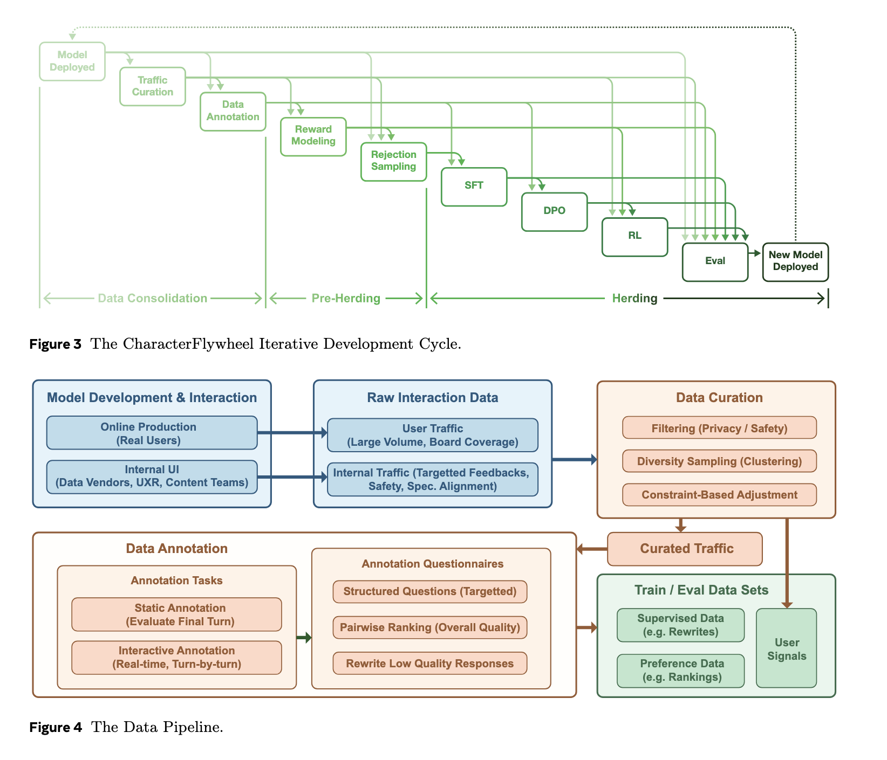
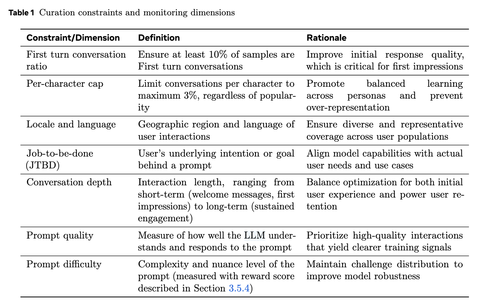
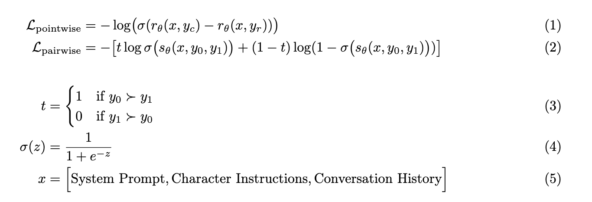
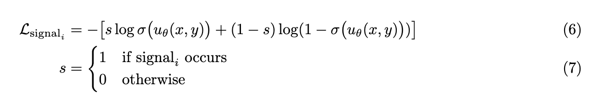
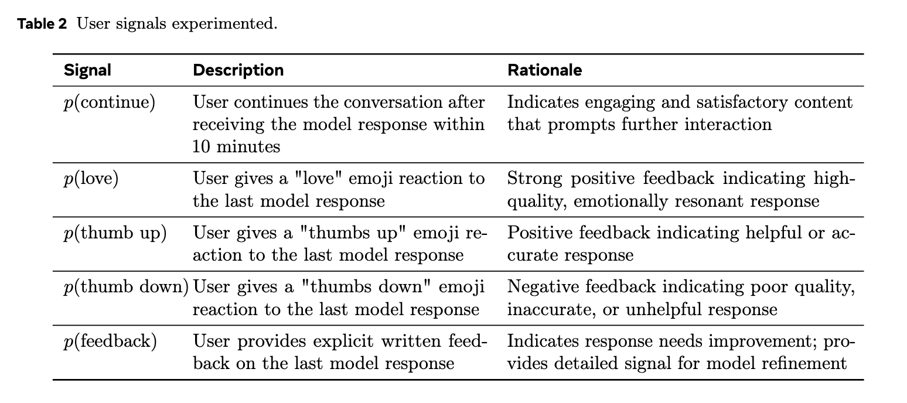
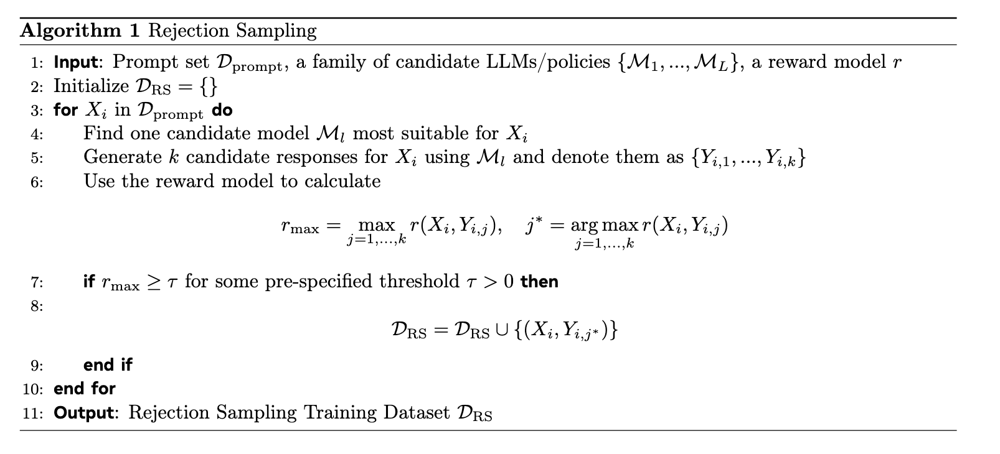
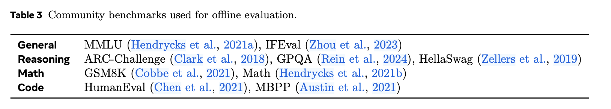
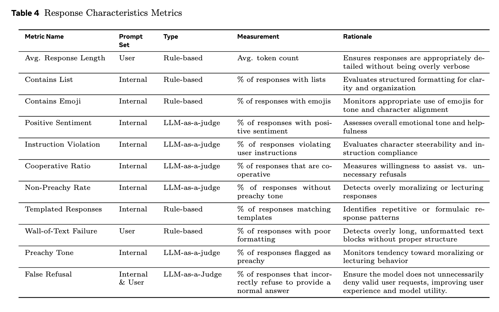

## 论文基本信息

标题：

作者：

链接：

代码：

框架图：

## 数据处理流程

数据整理流程包含三个阶段：

**第一阶段（过滤）**： 我们应用严格的过滤来确保数据集在隐私和安全方面是干净的

**第二阶段（多样性采样）**：我们利用 MultiRay (MetaAI2022MultiRay)，这是一个基于 Meta AI 基础设施构建的平台，支持并行模型处理相同的数据块。具体来说，我们使用 DRAMA-1B (drama) 来计算用户流量的文本嵌入。然后，我们应用一种基于聚类的采样方法，该方法会剪除嵌入空间中距离较近的提示信息以消除冗余，最终保留一定比例的过滤后数据。

**第三阶段（基于约束的调整）**： 最终处理阶段在多个维度上应用约束条件。我们采用分层抽样方法，使统计数据与原始流量分布或预先设定的目标水平保持一致。表 [1](https://arxiv.org/html/2603.01973?_immersive_translate_auto_translate=1#S2.T1 "Table 1 ‣ 2.2.1 Curation Pipeline ‣ 2.2 Data Curation and Annotation ‣ 2 Methodology ‣ CharacterFlywheel: Scaling Iterative Improvement of Engaging and Steerable LLMs in Production") 总结了关键约束条件和监控维度。

## 标注

内部流量和精选的生产流量都会输入到我们的标注流程中，用于大规模和针对性强的细粒度标注。为了简化标注任务并保持标注员​​的专注，我们会向标注员提供角色描述（姓名、特征和指令）、对话历史记录以及最新的待评估回复。

我们采用两种标注方法：

**静态标注： 标注员会获得来自内部或生产环境流量的完整对话历史记录。他们会评估每次对话中的最终回复。**

**交互式聊天标注： 标注员与角色实时互动，根据角色描述进行轮流对话。每轮对话结束后，他们会对角色的回答进行评估。**

两种方法中，标注者都会针对目标回复执行以下一项或多项任务：**（i）回答关于回复质量的结构化问题；（ii）根据回复的吸引力对备选回复进行两两排序；或（iii）根据预定义的指南重写低质量回复。** 在整个开发过程中，具体问题会根据在线反馈、新功能（例如图像生成）以及观察到的需要进行针对性修复的模型故障而不断演变。然而，我们始终包含两个核心问题，以应对最常见的故障模式：**（i）回复是否为虚假拒绝 ；（ii）回复是否为模板化回复** ——即在多个回复或对话中重复出现的模式或短语。

**角色可控性** 除了用于互动参与度的标准交互式聊天标注之外，我们还开展了一项独立的交互式聊天标注工作流程，专注于角色契合度。我们要求标注者对模型进行轻微的挑战，以评估其是否能够遵循标注界面中高亮显示的角色特征或指令。与标准标注一样，标注过程中每个回合都会提供两个备选答案。但是，现在我们要求标注者标记违反角色描述的答案，并在两个备选答案均不成立的情况下，提供符合角色描述的重写答案。

**为了生成成对排序任务的备选答案**，我们采用两种方法：(i) 从预定义池中的策略模型进行采样；(ii) 使用专家设计的思路重写提示生成答案。与 [2.2.1](https://arxiv.org/html/2603.01973?_immersive_translate_auto_translate=1#S2.SS2.SSS1 "2.2.1 Curation Pipeline ‣ 2.2 Data Curation and Annotation ‣ 2 Methodology ‣ CharacterFlywheel: Scaling Iterative Improvement of Engaging and Steerable LLMs in Production") 节中的筛选过程类似，生成的成对比较结果会根据一系列约束条件进行过滤，例如答案长度差异和表情符号数量差异。此过滤步骤可防止偏好模型（详见 [2.3.1](https://arxiv.org/html/2603.01973?_immersive_translate_auto_translate=1#S2.SS3.SSS1 "2.3.1 Preference Models ‣ 2.3 Reward Models ‣ 2 Methodology ‣ CharacterFlywheel: Scaling Iterative Improvement of Engaging and Steerable LLMs in Production") 节）过度拟合诸如答案长度之类的表面特征。虽然答案长度可能与质量相关，但不应是影响偏好的主要因素。

## 奖励模型

由于互动指标无法区分，我们开发了一系列代理模型，为优化主要聊天模型提供可区分的奖励。这些代理模型利用当前对话和系统提示作为上下文，对模型生成的回复进行评分。该评分是一个综合奖励信号，它结合了偏好模型和多个辅助模型的输出，这些辅助模型用于预测用户行为信号。这些辅助模型使用来自生产环境的真实用户交互数据进行训练。

**偏好模型作为主要奖励组件，而用户信号模型则提供辅助奖励，以帮助平衡训练目标并缓解过拟合。** 我们采用这种分层方法，是基于以下观察：尽管经过广泛的过滤，在线用户信号数据仍然存在固有的噪声，而偏好数据则可以进行精细化的质量和组成控制。偏好模型和用户信号模型都提供了评估指标，我们在离线评估期间会监控这些指标，以便在部署前验证模型改进。

### 偏好模型

我们训练了 Bradley-Terry 奖励模型 （ bradley1952rank ） 用于偏好学习和评估。**我们采用两种建模范式——逐点建模和成对建模——以提供互补的信号。** 逐点建模独立地对每个响应进行评分，并通过比较标量奖励来确定偏好。成对建模则联合编码两个响应，并直接判断哪个更优。

两个模型均使用 **Llama 3.1 70B** ( grattafiori2024llama ) 的权重进行初始化，并在整合后的偏好数据集上进行训练。**我们使用逐点模型的得分来指导强化学习训练**。然而，**在评估过程中，我们同时使用逐点模型和成对模型计算胜率**。这种双模型评估有助于缓解奖励作弊 ( bai2022training ) 的问题，并实现更稳健的模型选择。

### 用户信号模型

当用户在生产环境中与我们的模型交互时，他们会表现出各种行为，例如提供明确的反馈、使用表情符号进行反应、重新生成响应等等

为了利用这些信号，我们训练了一组用户信号模型，并在优化过程中尝试使用它们。对于大多数信号模型，我们训练一个**二元分类器**来预测是否触发了某个用户信号。形式上，给定与公式 [5](https://arxiv.org/html/2603.01973?_immersive_translate_auto_translate=1#S2.E5 "Equation 5 ‣ 2.3.1 Preference Models ‣ 2.3 Reward Models ‣ 2 Methodology ‣ CharacterFlywheel: Scaling Iterative Improvement of Engaging and Steerable LLMs in Production") 相同的上下文 x 和模型响应 y ，训练损失如下：

对于大多数用户信号，我们尝试使用 Llama 3.1 的 8B 和 70B 模型初始化 uθ （ grattafiori2024llama ） 。与偏好模型不同，**我们主要使用较小的 8B 模型**，因为它参数高效且足以拟合信号数据。表 [7](https://arxiv.org/html/2603.01973?_immersive_translate_auto_translate=1#S3.T7 "Table 7 ‣ 3.3.4 Quality and Failure Modes ‣ 3.3 Response Characteristics ‣ 3 Results ‣ CharacterFlywheel: Scaling Iterative Improvement of Engaging and Steerable LLMs in Production") 总结了我们在开发过程中探索的所有用户信号。值得注意的是，**我们最终仅使用 p​(continue) 和 p​(thumb up) 模型作为拒绝采样数据选择的信号**，因为它们展现出了稳定可靠的性能（详情见 [3.5.5](https://arxiv.org/html/2603.01973?_immersive_translate_auto_translate=1#S3.SS5.SSS5 "3.5.5 User Signal Models ‣ 3.5 Analysis & Discussion ‣ 3 Results ‣ CharacterFlywheel: Scaling Iterative Improvement of Engaging and Steerable LLMs in Production") 节）。我们注意到，如何有效地利用用户信号进行强化学习训练仍然是一个开放的研究问题，我们鼓励进一步的研究以充分挖掘其潜力。

## 微调和对齐

### 拒绝抽样

为了引导模型的优化方向与偏好模型所指示的方向一致，我们直接对用户流量应用拒绝采样，以创建拒绝采样训练集。算法 [1](https://arxiv.org/html/2603.01973?_immersive_translate_auto_translate=1#alg1 "Algorithm 1 ‣ 2.4.1 Rejection Sampling ‣ 2.4 Fine-Tuning and Alignment ‣ 2 Methodology ‣ CharacterFlywheel: Scaling Iterative Improvement of Engaging and Steerable LLMs in Production") 描述了我们的拒绝采样流程，该流程从用户流量 𝒟prompt 构建拒绝采样数据集 𝒟RS 。与其他静态 SFT 数据集不同，拒绝采样数据集 𝒟RS 会随着每次模型更新而重建，利用最新的用户流量 𝒟prompt 。虽然拒绝采样本质上是一个离策略过程，但我们力求使数据集尽可能保持最新，以包含推理时的输出，从而近似于在策略设置，因为已有研究表明这可以提高强化学习的性能 （ he2025nondeterminism ） 。虽然为了提高推理效率，我们只在生产环境中部署了 70B的模型，但我们使用相同的 CharacterFlywheel 流程并行开发了一系列 405B的模型，并将它们纳入候选池中，用于拒绝采样数据生成。

### SFT和DPO

CharacterFlywheel 的模型训练过程首先在 Llama 3.1 70B 检查点上进行监督式微调 (SFT)。训练数据集包含以下数据：(1) 来自定期更新的内部交互式聊天记录的 RJS 数据；(2) 来自定期更新的用户流量的 RJS 数据；(3) 内部安全数据；(4) 功能和工具调用数据，例如图像生成和搜索；(5) 用于故障模式的临时内部和用户数据；以及 (6) Llama 3.1 训练后的 SFT 数据 ( grattafiori2024llama ) 。SFT 之后，使用 DPO 对检查点进行进一步训练，训练数据集包含少量偏好数据，例如内部安全偏好数据、图像生成数据和 Llama 3.1 偏好数据 ( grattafiori2024llama ) 。尽管 DPO 的策略性与预期不符 （ tang2024understanding ） ，但我们观察到，将 DPO 视为针对紧急安全性和风格问题的局部补丁，在生产环境中仍然有效，且不会过度复杂化整体训练过程。我们在 SFT 和 DPO 阶段都采用了 Llama 3.1 数据，以在社区基准测试中保持竞争力，同时利用强化学习 (RL) 更专注于优化用户参与度指标。数据混合比例经过精心调整，以确保最佳性能。

### 强化学习

在 SFT 和 DPO 之后，我们进一步采用在线强化学习来提高模型质量。我们考虑两种强化学习训练损失：标准在线 DPO （ qi2024online ） 和 GRPO 变体 （ shao2024deepseekmath ）， 后者针对分布式训练进行了重要性抽样校正 （ wu2025llamarl ） 。

虽然我们在产品开发初期使用了在线 DPO 损失，但后来我们切换到了 GRPO，因为它在 A/B 测试中获得了更好的用户参与度，如第 [3.5.3](https://arxiv.org/html/2603.01973?_immersive_translate_auto_translate=1#S3.SS5.SSS3 "3.5.3 Online DPO vs. GRPO ‣ 3.5 Analysis & Discussion ‣ 3 Results ‣ CharacterFlywheel: Scaling Iterative Improvement of Engaging and Steerable LLMs in Production") 节所示。然而，在第 [2.1](https://arxiv.org/html/2603.01973?_immersive_translate_auto_translate=1#S2.SS1 "2.1 Development Cycle ‣ 2 Methodology ‣ CharacterFlywheel: Scaling Iterative Improvement of Engaging and Steerable LLMs in Production") 节中，CharacterFlywheel 开发周期中，除了选择具体的 RL 损失之外，还有其他一些设计选择可能比具体使用哪种 RL 损失更具影响力。

我们采用单轮优化模型：使用静态提示（即固定的部分对话历史），仅优化最终回复。虽然这种设置避免了模拟完整对话的复杂性，但可能会影响策略内属性。然而，当我们使用接近策略的提示和紧凑的模型迭代循环时，这种半在线方法仍然能够有效地优化参与度。第 [3.5.2](https://arxiv.org/html/2603.01973?_immersive_translate_auto_translate=1#S3.SS5.SSS2 "3.5.2 On-policy vs. Off-policy ‣ 3.5 Analysis & Discussion ‣ 3 Results ‣ CharacterFlywheel: Scaling Iterative Improvement of Engaging and Steerable LLMs in Production") 节展示了在在线强化学习中使用接近策略的提示的重要性。此外，在对用于强化学习的在线流量提示进行采样时，我们选择那些能够引发低 RM 分数或提示内 RM 分数方差较高的回复的提示 （ sun2025uncertainty ） 。第 [3.5.4](https://arxiv.org/html/2603.01973?_immersive_translate_auto_translate=1#S3.SS5.SSS4 "3.5.4 Variance-based Downsampling ‣ 3.5 Analysis & Discussion ‣ 3 Results ‣ CharacterFlywheel: Scaling Iterative Improvement of Engaging and Steerable LLMs in Production") 节解释了其原理。这可以弥补模型的不足，从而实现更有效的策略内修正 （ lu2025onpolicydistillation ） 。

### 风格伪模式缓解

为了防止优化过度注重表面风格而牺牲实质质量，我们采用了一种伪影缓解流程，在整个训练过程中监控和控制训练数据和模型输出中的风格模式。这些伪影包括响应长度、格式和表情符号的使用。

具体来说，我们将人工制品特征定义为对话历史和回复的函数，它返回以下两种结果之一：(i) 二元指示符（例如，回复是否包含“我感觉……”之类的短语）；(ii) 实数值测量值（例如，回复中表情符号的数量）。实际上，大多数特征仅取决于回复本身，而与之前的上下文无关。

我们从两个数据源中跟踪这些特征：

偏好数据： 我们比较_选择回答与拒绝_回答（或高分回答与低分回答）之间的特征出现频率（针对二元特征）和特征分布（针对实值特征）。这有助于识别可能与较高偏好标签或奖励存在虚假相关性的风格模式。

拒绝采样数据： 我们还通过比较_已接受和已拒绝的_候选输出，分析拒绝采样流程中的特征统计数据。这有助于检测那些不成比例地影响接受决策的因素，即使这些因素与明确的成对偏好无关。

此外，我们追踪模型在 SFT、DPO 和 RL 之后各个检查点的迭代过程，以确定特定训练阶段是否会导致这些特征发生显著变化。特征集会随着模型的演化而持续更新。总体而言，此过程旨在防止风格特征的意外峰值与奖励或选择信号产生关联，从而避免在训练过程中被浅层优化。

## 评估与反馈循环

### 线下评估

我们进行全面的线下评估，以确保不仅比上一版本有所改进，而且保障响应质量。评估分为以下五个方面：

社区基准测试 ：虽然我们的主要关注点是用户参与度而非实用性，但我们也评估模型在大型语言模型 (LLM) 排名中常用的标准社区基准测试上的性能。我们的目标并非追求最先进水平，而是确保模型在事实性和实用性问题上都能表现稳健。表 [3](https://arxiv.org/html/2603.01973?_immersive_translate_auto_translate=1#S2.T3 "Table 3 ‣ 2.5.1 Offline Evaluation ‣ 2.5 Evaluation and Feedback Loop ‣ 2 Methodology ‣ CharacterFlywheel: Scaling Iterative Improvement of Engaging and Steerable LLMs in Production") 列出了我们使用的所有基准测试。

人工对比：为了评估新模型是否优于旧版本，我们对新模型的响应进行了并排人工对比。标注流程与我们在 2.2.2 节中描述的交互式聊天偏好标注流程类似：在每个回合中，标注者都会看到来自两个模型的响应。为了确保公平比较并防止对话历史记录偏向任何模型，我们会随机选择一个响应（来自任一模型）来继续下一回合的对话，而不管哪个响应更受欢迎。此评估在公开发布之前进行，此时在线流量数据尚未可用。

奖励模型胜率：由于我们训练了奖励模型以进行优化，因此我们也报告了它们在离线评估中的胜率。胜率衡量的是，在给定相同提示集的情况下，奖励模型选择新模型响应而非旧模型响应的频率。我们评估了三种类型的奖励模型：逐点偏好模型和成对偏好模型（详见 2.3.1 节）。用于计算胜率的提示集会定期更新，更新流程详见 2.2.1 节。为了防止过拟合，用于离线评估和模型训练的流量对话样本完全分开。

自定义生产指标：我们开发了一套专门的指标，用于在整个开发过程中评估我们的聊天模型。对于每个模型版本，我们首先使用第 2.2.1 节中描述的流程，生成针对精心挑选的流量提示的响应。然后，我们使用 LLM 作为评判标准或基于规则的方法计算这些生成响应的指标。在开发过程中，我们根据效率方面的考虑，迭代地完善了这套指标，添加或删除指标。表 4 总结了整个开发过程中监控的最重要指标。评估提示集与所有训练提示集完全分开。

### 在线评估

为了评估用户参与度的提升，我们会针对每次模型更新或有前景的训练方案变更，在生产环境中进行在线 A/B 测试 （ kohavi2020trustworthy ） 。在这些测试中，符合条件的用户会被随机分配到测试组（接收更新后的模型）或对照组（接收当前基线模型）。这种随机化是独立的，并且符合平台限制；我们通常会将 10% 的流量分配给每个组，以平衡工程速度、风险和统计效力。我们使用一致的纳入标准和累积曝光日志来定义分析人群，并在为期一周的观察期内评估各项指标。对于每次测试，我们会将用户参与度广度指标和用户参与度深度指标的提升百分比作为衡量成功的主要指标。

## 安全和隐私

CharacterFlywheel 模型开发流程在严格的持续监控和安全标准框架下运行。我们沿用 Llama 3.1 （ grattafiori2024llama ） 的安全标准，其主要目标是最大限度地减少安全违规和误拒，从而构建一个优先考虑无害输出的系统。我们采用分层式自动和人工评估系统，并以关键安全规则和风险标准为指导。

该系统的关键组成部分包括：

分层评估 ：安全分类器在多个阶段自动执行，包括角色自动生成、角色更新、模型更新、用户在线交互和用户流量采样（第 [2.2.1](https://arxiv.org/html/2603.01973?_immersive_translate_auto_translate=1#S2.SS2.SSS1 "2.2.1 Curation Pipeline ‣ 2.2 Data Curation and Annotation ‣ 2 Methodology ‣ CharacterFlywheel: Scaling Iterative Improvement of Engaging and Steerable LLMs in Production") 节），这些阶段均在 CharacterFlywheel 模型迭代过程中进行。此外，针对不同情况，例如不确定角色和已举报角色，还会触发人工审核。

故障闭环设计：在角色创建阶段，如果任何必要的安全规则未满足，系统会自动拒绝创建，防止发布不安全的角色。对于存在疑问的情况，系统会提交人工审核以做出最终决定。在用户交互阶段，系统会自动拒绝不安全的提示和模型响应，从而确保所有交互都符合既定的安全标准。对于模型更新，只有成功通过自动化评估和红队测试的模型才能部署到生产环境。

与安全措施类似，我们在上游数据管理流程（第 [2.2.1](https://arxiv.org/html/2603.01973?_immersive_translate_auto_translate=1#S2.SS2.SSS1 "2.2.1 Curation Pipeline ‣ 2.2 Data Curation and Annotation ‣ 2 Methodology ‣ CharacterFlywheel: Scaling Iterative Improvement of Engaging and Steerable LLMs in Production") 节）中应用隐私规则，包括对高风险标识符进行基于模型和基于规则的检查，以确保下游处理（包括标注和训练）中不包含任何可识别实体的信息。

## 图像生成

媒体生成对于现代社交聊天产品至关重要，我们集成了图像生成功能，以支持我们为用户提供社交价值的主要目标。除了标准功能之外，该功能的创新之处在于利用视觉内容积极增强对话互动。具体而言，我们针对两种不同的场景开发了图像生成功能：

显式生成： 用户明确地提示模型创建图像，其功能类似于标准的多模态聊天机器人。

隐式生成： CharacterFlywheel 中的一种新机制，其中 LLM 会在确定视觉内容将丰富对话时自主决定触发图像生成。

我们将此问题建模为一个智能体工具调用任务 （ schick2023toolformerlanguagemodelsteach ） ，其中语言模型学习在交互过程中何时触发图像生成以及提供哪些生成参数，包括独立的下游文本到图像（T2I）模型 （ dai2023emuenhancingimagegeneration ） 所需的图像提示。鉴于该任务固有的主观性，特别是对于隐式图像生成而言，数据标注面临着巨大的挑战。为了解决这个问题，我们强制执行多评审标注，以仅保留高度一致的数据。我们特别要求在两个关键维度上达成一致：1）在当前对话回合触发图像生成的恰当性；2）图像提示在捕捉完整对话上下文（包括历史）方面的质量。我们收集偏好数据用于训练图像生成的偏好模型，然后使用这些模型在相应的训练阶段构建 SFT 和 DPO 数据集。

## 主要收获

## 参考资料
