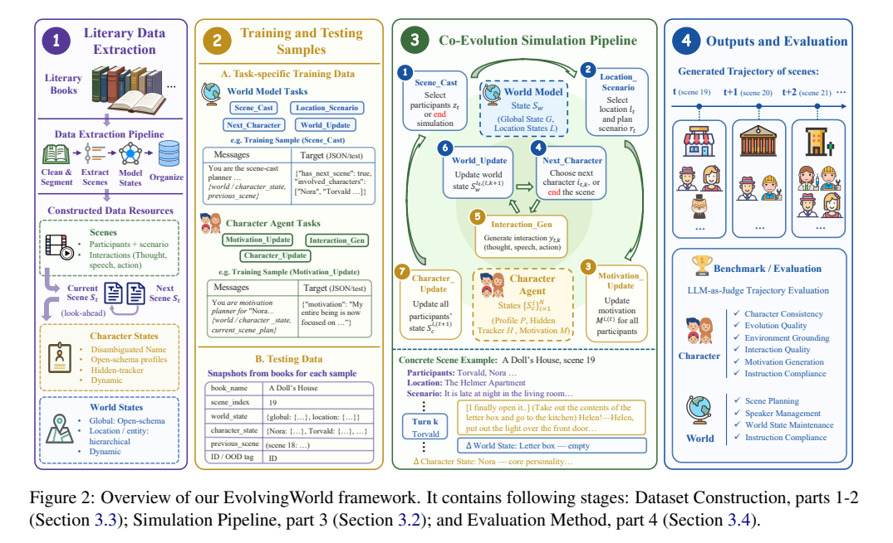
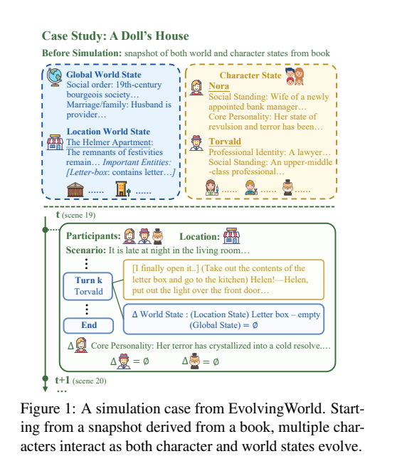

## 论文基本信息

标题：EvolvingWorld: An Open-Schema Framework for Co-Evolving Role-Play Agents and World Model in Interactive Literary World

作者：Qing Zong, Yue Guo, Mengxin Yang, Yiwen Guo, Yangqiu Song（HKUST KnowComp 组 + 腾讯光子 LIGHTSPEED + 华中科大）

链接：arXiv 2607.17250v1（2026-07-19）

代码：https://github.com/HKUST-KnowComp/EvolvingWorld（数据+代码开源，限研究用途）

框架图：



模拟案例（《玩偶之家》）：



> **一句话 TLDR**：把「文学世界模拟」从静态人设模仿重新定义为长程过程——角色互动、场景推进的同时，角色档案和世界状态被持续更新且互相耦合（角色打开信箱→信箱变空；世界变化→角色动机改变）。框架拆成 7 个可独立监督训练的子任务，配 57 本书构造的 138K 训练数据 + 222 测试快照 + 20 指标轨迹级评测。

## 背景

**要解决的问题**：现有 LLM 角色扮演只能做「下一句像不像这个角色」，做不到「随着故事推进，角色和世界一起演化」。真实的文学模拟中，角色会修正信念、动机、关系，地点/物品/背景条件也在变。目标不只是生成下一句合理台词，而是**跨场景维持连贯的角色状态和世界状态**。

**现有系统的三类短板**：

[1] 大多数 persona agent 只靠静态 profile + 短对话上下文（ChatHaruhi、RoleLLM、DITTO、CharacterGLM 等），人设不会变。

[2] 多智能体沙盒环境（Generative Agents、LARP）要手工搭建单一世界，无法扩展到多样的文学世界。

[3] 书籍类系统要么只做单场景角色扮演（CoSER、AdaMARP），要么只做部分长程更新——BookWorld 只更新角色的目标/状态和全局事件字段，缺完整档案演化、地点/实体级世界更新、可训练的子任务监督。

**论文主张**：文学世界模拟需要 **open-schema 共演化**。

- **Open-schema（开放模式）**：不给所有书套同一套固定字段模板，而是让系统按每本书自行推断该追踪哪些维度——侦探要记「调查习惯」，维多利亚孤儿要记「社会地位」；世界维度可以是校规、阶级制度、政治秩序或超自然体系。
- **共演化（co-evolution）**：角色和世界状态保持耦合——角色行为可以重塑地点和社会秩序，世界变化反过来改变动机和档案。
- 难点在于：追踪哪些维度、什么时候证据足以更新档案、局部事件如何传播到全局/地点/实体状态。

## 相关研究

- **角色扮演 agent**：从脚本（RoleLLM）、自对齐（DITTO、SimsChat）到训练式人格模拟（CharacterLLM、CharacterGLM、CoSER）、多模态（MMRole）、记忆检索（TailorRPA）。共同点：persona 是静态锚点。
- **多智能体与世界模型**：社会模拟（Generative Agents）和游戏环境（LARP、CharacterBox）靠固定沙盒；CoSER/AdaMARP 没有世界建模；BookWorld 有 world agent 但用固定 schema 且世界状态是静态的。LLM-based world model 和 open-schema 事件抽取（AutoSchemaKG）是新兴方向，但没人用到互动文学世界上。
- **评测**：从流畅度转向行为评测（CharacterEval、CharacterBench），少数工作有轨迹级评测（AdaMARP），但「状态演化的质量」没人量化过。
- 值得关注：HKUST KnowComp（宋阳秋组，本文 + AutoSchemaKG）、复旦 CoSER/BookWorld 一系、AdaMARP。

## 核心亮点

### 1. 两个耦合模块

**Character Agent（演员）**：
- 每个角色用 open-schema 档案表示：只给参考维度，让 LLM 按书的题材/背景/风格自行选择、合并、新增字段。
- 除单个角色外，还支持**环境**（environment）和**角色团体**（character group）作为特殊行动单元——环境事件（如暴风雨来袭）和集体行动（如一家人一起进门）走同一个互动循环。
- **档案持续演化**：开放档案里每个维度都可演化，不像以前只更新记忆/心理状态几个预定义字段。
- **隐藏追踪器（hidden tracker）**——本文最有意思的机制：档案各维度演化速度不同（情绪变得快，性格要累积证据才变）。弱证据/苗头先单独存进 hidden tracker，不直接进档案；跨场景反复出现的信号累积够了才提交为档案更新。这防止单次事件轻率改写人设，同时允许渐进变化。更新时同时考虑「维度本身的可变性」和「累积的隐藏证据」。

**World Model（导演+场记）**：
- 维护**全局世界状态**（历史背景、社会制度等，open-schema）+ **地点级物理状态**。
- 地点可嵌套（房子→房间）或原子并列（房外的路）；每层地点维护详细描述 + 所有重要非角色实体及其状态（如「窗边立着圣诞树」「信箱：内有信件」）。
- 全局和地点状态都随角色互动自动更新，不需要人工预定义沙盒。

### 2. 状态的形式化定义

场景步 t 时，模拟器维护：

- 世界状态 `S_w^(ℓ,t) = (G^(t), L^(ℓ,t))`：G 是开放 schema 的全局状态，L 是地点 ℓ 的描述+实体状态
- 角色状态 `S_c^(i,t) = (P^(i,t), H^(i,t), M^(i,t))`：P 开放档案、H 隐藏追踪器、M 场景级动机

观测是**按模块裁剪的视图**，不是全量状态：World Model 看全局+相关地点+参演角色状态；Character Agent 只看自己的状态+当前地点的世界状态。角色没有上帝视角，互动历史里只能看到自己的内心思维。

### 3. 七个子任务的流水线分解

核心思路：把「模拟一个场景」拆成固定执行流水线，每步输入输出明确，都能单独构造监督数据。

**场景开始（每场一次）**：

| #   | 任务                | 执行者             | 输入→输出                                                    |
| --- | ----------------- | --------------- | -------------------------------------------------------- |
| 1   | scene_cast        | World Model     | 全部角色状态 → 本场参演角色集合 z_t，或判定整个模拟结束（`has_next_scene: false`） |
| 2   | location_scenario | World Model     | 参演角色 → 地点 ℓ_t + 情节规划 r_t（scenario）                       |
| 3   | motivation_update | Character Agent | 各角色自身状态 + 情节规划 → 本场动机 M（每个参演角色一条）                        |

**场景内循环（每轮一次）**：

| #   | 任务              | 执行者             | 输入→输出                                                                |
| --- | --------------- | --------------- | -------------------------------------------------------------------- |
| 4   | next_character  | World Model     | 互动历史 → 下一个行动者（角色/环境/角色团体），或判定本场结束                                    |
| 5   | interaction_gen | Character Agent | 行动者视角观测 + 情节 + 历史 → 一条互动 y，混合三种成分：`[思维]`、台词（纯文本）、`(动作)`；历史里只有自己的思维可见 |
| 6   | world_update    | World Model     | 该互动 → 是否更新全局/地点状态（如信箱→空；无变化输出 ∅）                                     |

**场景结束（每场一次）**：

| #   | 任务               | 执行者             | 输入→输出                                                |
| --- | ---------------- | --------------- | ---------------------------------------------------- |
| 7   | character_update | Character Agent | 整场互动 + 场景结束时的世界状态 → 更新每个参演角色的档案+隐藏追踪器；未参演角色和其他地点原样保留 |

跑完 7 步 = 一次场景级状态转移，回到任务 1 开下一场，重复直到收尾。每个任务的训练样本格式统一为「system prompt + 状态观测(JSON) → 目标输出(JSON/文本)」，如 scene_cast 的目标就是 `{"has_next_scene": true, "involved_characters": ["Nora", "Torvald"]}`。

**为什么这个分解重要**：把「多轮一致性」这种难以直接优化的目标转化成了若干有明确标签的中间任务，比端到端训对话数据可控得多。Character Agent 和 World Model 用同一底座**分开训练**两套权重，推理时组装成完整 pipeline。

## 数据构造

**选书**：跟随 CoSER，从 Goodreads Best Books Ever 榜选 57 本代表作，全文取自 Project Gutenberg（公版书，全英文——《玩偶之家》《傲慢与偏见》《雾都孤儿》《变形记》《爱丽丝》等）。类型分布：文学小说 59.6%、冒险 21.1%、悬疑哥特 10.5%、戏剧 5.3%、奇幻 3.5%。**只选按时间顺序叙事的书**——这是关键前提：后文可以作为 look-ahead（前瞻）证据，状态更新有真实文本依据，而不是 LLM 自己脑补。例：懒散学生失败后反思，后文出现持续努力的场景，才确认这次反思是真实的性格状态变化。

**抽取 LLM**：Gemini-2.5-Pro。三个阶段：

[1] **场景抽取**：书切 chunk，抽结构化场景（摘要、scenario、关键角色、多轮互动）。互动是 actor-content 对，actor 可以是单角色或角色团体；内容按模拟格式标记（`[思维]`/台词/`(动作)`）。跨 chunk 截断的场景把残段接到下一 chunk 继续抽。
[2] **角色构建**：先做别名归一（"Mr. Smith"/"John"/"Father" → "John Smith"），场景内引用全部标准化；用每个角色最早的几个相关场景初始化 open-schema 档案 + hidden tracker；然后逐场景更新档案（用后文做 look-ahead 校验）。
[3] **世界构建**：地点同样做别名标准化；初始化全局+各地点状态；逐互动更新（LLM 判断该互动是否造成持久变化）。

**穿插的清洗**：每条互动送 LLM 精修——去掉混进台词里的思维、保持私人思维与口头发言分离、统一为行动者的第一人称视角。

### 一个具体例子：《玩偶之家》从原文到训练样本

**核心思想一句话**：数据合成是模拟的**反向工程**。书里已经写好了「正确答案轨迹」——谁出场、在哪、说了什么、世界怎么变。合成工作就是把这条轨迹重放一遍，在每个决策点「截图」：此刻模拟器应该看到什么（输入观测）→ 书里实际发生了什么（监督标签）。抽取时构造的输入视图和推理时模拟器的观测完全同构，所以训出来的模型能直接插进 pipeline。

以下按流程走一遍（引号内容来自论文 Figure 1 的真实例子，标〔示意〕的是为讲清楚补的合理示例）。

**Step 1：原文 → 结构化场景**

《玩偶之家》全文切成数千词的 chunk，每个 chunk 让 Gemini-2.5-Pro 抽出 JSON。到第三幕结尾，得到 scene 19：

```json
{
  "scenario": "It is late at night in the living room...（深夜的客厅，圣诞派对刚散场...）",
  "key_characters": [
    {"name": "Nora Helmer", "description": "〔场景前的她〕", "experience": "〔她在本场的角色/行为〕", "motivation": "〔进场前的所思所想〕"},
    {"name": "Torvald Helmer", ...}
  ],
  "interactions": [
    ...,
    {"characters": ["Torvald Helmer"],
     "content": "[I finally open it..] (Take out the contents of the letter box and go to the kitchen) Helen!—Helen, put out the light over the front door..."},
    ...
  ],
  "summary": "..."
}
```

抽取规则的几个关键点：每条互动**必须以 `[思维]` 开头**（原文没写就从行为合理推断）；叙述文也要转成互动格式（原文写 "The children walked into room together" → 抽成 `[We need to stay together] (walk into room together)`）；氛围/天气/非角色事件用 `Environment` 当行动者；不许出现 "the crowd"「众人」这种模糊主体，具名的群体要展开成个人列表；同一角色连续多轮合并成一条；场景在 chunk 边界被切断就标 `truncated`，残段拼到下一 chunk 续抽。

**Step 2：角色构建（两步）**

先**别名归一**："Mr. Helmer"/"Torvald" → "Torvald Helmer"，所有场景里的引用统一替换。

再造**初始档案**：把 Nora 出现的所有场景数据给 LLM，要求「**倒推**故事开始前她是什么样的人」——明确规则：不许剧透（只在故事中途才形成的关系/特质不能写进初始档案），从约 19 个参考维度（Physical Description、Social Standing、Core Personality、Speech Patterns、Core Fears、Key Relationships、Supernatural Powers……）里**自选/合并/自造**——这就是 open-schema 的落地方式。得到初始档案如「Social Standing: Wife of a newly appointed bank manager...」。

然后**逐场景更新**（数据合成的核心一步）。对每个场景的每个参演角色跑一次「Dynamic Profile Update」prompt，输入 = 当前档案 + hidden tracker + 刚完成的场景（含全部互动）+ **下一场景全文（仅作 look-ahead 参考）**，一次输出 5 样东西：

[1] 维度推理：哪些维度稳定（外貌、核心恐惧）、哪些动态（关系、目标、心理状态）
[2] 新 hidden tracker（<300 词，覆盖旧版）：记录还没到阈值的信号——潜在变化的苗头、累积的心理压力、未解决的张力
[3] 是否更新档案的判断 + 更新后的完整档案：本场有实质可观察的变化（关系转折/改变目标的决定/创伤），或 tracker 里累积的信号加上本场刚好过阈值 → 更新；轻微瞬时反应 → 不更。scene 19 里 Nora 的更新：Core Personality →「Her terror has crystallized into a cold resolve（她的恐惧已结晶为冷静的决绝）」
[4] 50-80 词第三人称**短描述**（当前身份 + 眼下意图）——这是给 scene_cast 任务当输入用的压缩视图，避免选角时塞几十个完整档案
[5] **下一场的增强动机**：参考下一场景的实际内容，反写「她进入下一场时的内心驱动」——要求能自然引出下一场的实际言行（可以写「打算与 X 对质」），但不许剧透下一场的结果

Look-ahead 的用法被严格限定：只用来判断「当前变化是否有意义」，所有输出只能反映**当前场景结束时**的状态，不许泄露未来。

**Step 3：世界构建（两步）**

初始化：全局状态从 15 个参考维度自选（本书选出「Social order: 19th-century bourgeois society...（19 世纪资产阶级社会）」「Marriage/family: Husband is provider...（丈夫是供养者）」等）；每个地点生成描述 + 重要实体清单（明确排除人物），可选平铺或含子地点两种结构——Helmer 公寓：「The remnants of festivities remain...（派对余迹尚存），Important Entities: [Letter-box: contains letter...（信箱：内有信件）]」。

逐互动更新标注：把一场的互动编号 0,1,2... 批量送入，附**两种 look-ahead**——全局 look-ahead = 紧接着的互动序列（可跨场景），地点 look-ahead = 同一地点未来的互动（可能来自几场之后）。LLM 只对「造成持久变化」的互动输出**完整的新状态**（不是 diff；要删掉被推翻的旧信息、压缩篇幅，状态是快照不是流水账；多数互动应当不触发更新）。Torvald 取走信件那一条互动 → 触发地点更新：Letter-box → empty；全局无变化 → ∅。

**Step 4：沿时间线切出 7 类训练样本**

到这里，整本书变成了一条完整的「状态轨迹」：每个场景 t 都有场景前状态、cast、地点、scenario、各角色动机、互动序列、逐互动的世界状态、场景后的角色状态。7 类样本就是在不同决策点截取「输入视图 → 真实标签」。以 scene 19 为例：

| 任务                       | 该样本的输入（模拟器视角）                                                       | 该样本的标签（来自抽取结果）                                                                                                         |
| ------------------------ | ------------------------------------------------------------------- | ---------------------------------------------------------------------------------------------------------------------- |
| scene_cast               | 全局状态（18 场后）+ 全部角色的 50-80 词短描述 + 场景 18 的 scenario 和互动                | `{"has_next_scene": true, "involved_characters": ["Nora Helmer", "Torvald Helmer", ...]}`——即场景 19 的实际参演者               |
| location_scenario        | 上行输入 + 选定 cast + 候选地点列表                                             | `{"location": "The Helmer Apartment", "scenario": "It is late at night in the living room..."}`——场景 19 的实际地点和 scenario |
| motivation_update（Nora）  | Nora 的档案+tracker + 场景 19 的 scenario                                 | Step 2-[5] 反写的增强动机——因为它是从场景 19 实际内容倒推的，天然能「解释」她接下来的言行                                                                  |
| next_character           | 多轮对话：第 k 轮输入 = 前 k−1 条互动                                            | 第 k 轮标签 = 场景 19 第 k 条互动的实际 actor（"Torvald Helmer"）；最后一轮 = END                                                          |
| interaction_gen（Torvald） | Torvald 的完整档案+动机 + 地点状态 + scenario + 互动史（**他人的 `[思维]` 已剥除**，只留他自己的） | `"[I finally open it..] (Take out the contents of the letter box...) Helen!—..."`——书里抽出的原互动                            |
| world_update             | 当前全局+地点状态 + 刚发生的互动                                                  | Step 3 的标注：Letter-box → empty（多数互动的标签是「无更新」）                                                                           |
| character_update（Nora）   | Nora 场景前状态 + 整场互动 + 场景结束时的世界状态                                      | Step 2 的输出：新档案（terror→cold resolve）+ 新 tracker                                                                         |

样本量的对应关系：motivation_update 和 character_update 都是 24,977 = 训练集里的（场景, 参演角色）对数；next_character 一场一个多轮对话（116,789 个回合 ≈ 每场 8 次选人 + END）；interaction_gen 按（场景, 行动者）组织成多轮对话，样本比 character_update 多（40,554），因为环境和角色团体也是行动者但不做档案更新；world_update 论文未明说如何从 13 万条互动压到 17,832 个样本，从构造方式看应是按批组织且只保留有更新判断价值的部分。

**Step 5：为什么这样设计（两个关键）**

[1] **Look-ahead 让标签「有据可查」**：状态更新的 ground truth 不是抽取 LLM 的自由发挥，而是被书的后文验证过的（懒散学生的反思，要等后文出现持续努力才算真变化）；动机标签更直接——从实际发生的下一场倒推，训练时「动机→行为」的对齐天然成立。这是一种 hindsight relabeling（事后重标注）思路。
[2] **抽取与模拟严格镜像**：每类样本的输入视图（谁能看到什么状态、思维对谁可见、用短描述还是完整档案）和推理时模拟器的观测构造完全一致，SFT 后模型无缝插进 pipeline，没有 train/inference 的观测错配。

**数据统计**：

| 项目           | 数量                                                                                              |
| ------------ | ----------------------------------------------------------------------------------------------- |
| 书            | 57                                                                                              |
| 抽取场景         | 9,763                                                                                           |
| 抽取互动         | 132,800                                                                                         |
| 去重角色         | 3,311                                                                                           |
| 去重地点         | 1,888                                                                                           |
| 训练样本（7 任务合计） | 138,596                                                                                         |
| 测试快照（ID/OOD） | 222（116/106）                                                                                    |
| 角色档案维度词表     | 581 个（高频：Social Standing、Core Personality、Key Relationships、Professional Identity）              |
| 世界状态维度词表     | 136 个（高频：Cultural Values & Moral Expectations、Social Order & Class、Economy & Material Survival） |

**分布特征**（中位数）：每本书 160 场景 / 43 角色 / 25 地点；每场景 8 条互动、3 个角色；每角色 2 次档案更新（均值 6.1，长尾到 301）；每地点 2 次状态更新。覆盖从紧凑中篇到多角色长篇的复杂度谱系。

**各任务训练数据量**（ShareGPT 格式；next_character 和 interaction_gen 是多轮对话，一个样本含多个 assistant 回合）：

| 任务 | 样本数 | assistant 回合数 |
|------|--------|-----------------|
| scene_cast | 7,983 | 7,983 |
| location_scenario | 7,958 | 7,958 |
| next_character | 14,315 | 116,789 |
| world_update | 17,832 | 17,832 |
| interaction_gen | 40,554 | 108,831 |
| character_update | 24,977 | 24,977 |
| motivation_update | 24,977 | 24,977 |
| **合计** | **138,596** | **309,347** |

**token 长度**（cl100k_base）：scene_cast 最长（中位约 11.2k——要枚举全部角色，为控长每个角色只放最新短描述而非完整档案）；location_scenario 约 8k（枚举全部候选地点，不展开实体状态）；中间四个任务 4.9-6k；character_update 最短约 2.8k（只更一个角色）。据此定训练截断长度 32,768。

**切分策略**：10% 书完全留作 OOD（out-of-distribution，训练时完全没见过的书）；其余一半是 train/test 书（前 70% 场景训练、后 30% 采 ID 测试快照）、一半 train-only 书（全部进训练）。每个测试快照 = 某时间点的完整角色状态+全局状态+地点状态+前一场景，模拟从这里继续往下跑。只采至少 5 条互动的有效场景；每本 train/test 书最多 5 个 ID 快照，每本 OOD 书最多 20 个 OOD 快照。

## 评估框架

轨迹级 LLM-as-Judge（让强模型当裁判打分），分 CHARACTER 和 WORLD 两大族，共 10 维度 20 子指标（0-100 分；CHARACTER 11 个 + WORLD 9 个）。带 ⋆ 的维度（演化质量、世界状态维护）是本框架首创的评测视角。

**CHARACTER 6 维度（11 指标）**，核心问题：把角色名字遮住，输出还认得出是这个角色吗？

- **角色一致性 CC**：
  - 档案忠实度 PF——知识/技能/行为不越档案边界（普通农夫不能突然懂高等魔法理论）、符合年龄/阶级/时代背景、不凭空出现未记载的能力
  - 说话风格忠实度 SSF——用档案定义的语言特征（口头禅/句式/方言）、语气符合人格而非通用「AI 助手腔」、自然不模板化
  - 动机驱动行为 MDB——决策可追溯到核心动机而非随机行为、思维/行动/台词三者逻辑一致、核心价值观没有重大剧情触发不突变
- **演化质量 EQ ⋆**：
  - 档案更新忠实度 PUF——每条写入档案/追踪器的内容都有场景内触发事件为证据（因果链，不编造）、跨过阈值的重要变化进档案而微弱信号进追踪器（阈值判断）、不过度也不漏更新（档案保持简洁稳定、追踪器不沦为流水账）
  - 档案演化平滑度 PES——幅度匹配（闲聊只留轻信号、大事件才大更新）、渐进性（性格/关系变化经过合理过渡阶段而非跳变）、方向一致性（连续更新逻辑连贯，追踪器信号攒够后转正自然可追溯）
- **环境接地 EG**（分「普通角色」和「环境角色」两套标准）：
  - 环境感知 EA——普通角色：对全局状态合理反应（战时紧张、物资匮乏时节约）、注意到地点当前状态、跨场景状态变化后能察觉调整；环境角色：环境描写与全局/地点状态一致（毁坏的建筑不能描述成完好）
  - 环境利用 EU——普通角色：感官细节、用地点内物品推进剧情、烘托氛围不在「白房间」里对话；环境角色：多感官丰富度、场景元素利用、氛围与叙事节奏匹配
- **互动质量 IQ**：
  - 上下文响应 CR——不忽略关键信息/问题、对他人动作合理反应（递来的东西要接或拒，不能无视）、对盟友/敌人/陌生人的语气和信任有区分且随剧情动态调整
  - 叙事推进 NP——每轮有信息增量不炒冷饭、制造悬念留钩子、前文伏笔在合适时机回收
- **动机生成 MG**：动机质量 MQ——贴合当前人格/目标/关系、考虑当前世界状态和场景（危险场景不生成休闲动机）、具体可执行不空泛
- **指令遵循 IC**：只输出自己角色的内容不代言他人、思维/动作/台词格式正确、长度合理

**WORLD 4 维度（9 指标）**：

- **场景规划 SP**：
  - 选角合理性 CSR——出场角色服务当前叙事（冲突场景对立角色同台）、与当前叙事线直接相关、不引入无关角色、不漏掉该出场的关键角色
  - 地点与情节合理性 LSR——地点是选定角色合理会面之处、scenario 给出具体可演的戏剧设定、与上一场自然衔接、设定适配选定角色
  - 场景连贯性 SCC（全轨迹指标）——连续场景构成有方向的叙事弧而非随机拼贴、转场自然、节奏合理（重要情节充分展开）、叙事线索有引入-发展-收束，不烂尾
- **发言管理 SM**：轮次与场景编排 TSO——选最该回应的角色而非轮流转、环境描写在恰当时机插入（转场/大事件）、多角色场景合理组合集体行动、核心角色戏份与叙事重要性成比例（过场角色完成功能后自然淡出）、收尾时机在自然叙事节点（不在高潮戛然而止、无事发生不拖沓）
- **世界状态维护 WSM ⋆**：
  - 全局更新敏感度 GUS——不过度更新（闲聊不触发）、不漏更新（战争/王国覆灭必须记）、正确区分局部 vs 全局影响
  - 全局状态准确度 GSA——事实准确、被推翻/过时的信息及时清退、表达简洁不堆冗余
  - 地点更新敏感度 LUS——正确区分临时变化 vs 持久变化
  - 地点状态准确度 LSA——空间逻辑自洽、重要实体列表准确反映在场实体、同一地点跨场景描述一致
- **指令遵循 IC**

**打分机制**：每个子指标一个独立 judge，只喂该指标相关的输入和评分细则。基准分 50，judge 先列优点（每条 +1~10）再列缺点（每条 −1~10），最终分 = min(100, max(0, 50 + Σ加分 − Σ减分))。

**聚合**：场景级指标逐场景打分后跨场景平均；PES 按每个角色的参演场景打分、按出场次数加权平均；SCC 在完整轨迹上评长程组织。CHARACTER/WORLD 总分 = 各子指标简单平均，缺失指标记为无效而非静默填充。

**崩溃罚分**：模型因格式不合规导致模拟提前终止时（基础设施错误如 API 超时不罚），按报错任务归责到 World Model 或 Character Agent，两条罚分并行：
- IC 罚分 = min(50, 50/ln(n+1))，n 为崩溃前该模型的成功调用数——第一次调用就崩直接罚满 50（IC 归零），成功几百次后才崩也仍罚约 8-10 分，保证「最终崩了」永远反映在分数里
- 指标罚分：按固定的任务→指标映射（如 interaction_gen 崩 → 罚 PF/SSF/MDB/EA/EU/CR/NP；world_update 崩 → 罚 GUS/GSA/LUS/LSA），受罚指标分 × N/(N+1)（N 为已完成场景数，等效追加一个 0 分虚拟场景）；一个场景都没跑出来的直接记 0

## 实验

### 设置

- **训练**：LoRA（rank 64 / alpha 128 / dropout 0.05），LLaMA-Factory，2 epochs，lr 2e-5，最长序列 32,768 token，有效 batch 64/GPU，bf16 + FlashAttention-2；**混 1:1 的 Tulu3 通用指令数据**保通用能力（跟随 CoSER 惯例）；vLLM 推理。底座：Llama-3.1-8B-Instruct、Qwen2.5-7/14/32B-Instruct、Qwen3-4B-Instruct。
- **对比模型**：10 个闭源 API、11 个开源模型、角色扮演基线 CoSER 和 Crab（它们只有 role-play 数据，故只当 Character Agent 评，World Model 配同底座未训练模型）。EW 模型 = 同底座分开训练的 Character Agent + World Model。
- **两种训练混合**：EW-F（full，保持构造数据的自然任务分布，主实验默认）vs EW-B（balanced，7 任务等量采样）。两者整体趋势相似，孰优随底座和评测角色而变。
- **模拟规模**：每个测试快照最多 20 场、每场最多 50 轮互动。主 judge：Claude-4.6-Sonnet。

### 主结果（三条发现）

**[1] EW 增益来自「学状态演化」而非「学对话模仿」**。同底座下 EW 训练在 Character 和 World 两侧都涨；对比只用 role-play 数据训的 CoSER/Crab，优势巨大——Qwen-7B：EW 45.53 vs CoSER 18.98 / Crab 18.32；Llama-8B：EW 45.99 vs CoSER 24.92 / Crab 21.65（Character Avg）。长程角色扮演必须建模角色+世界状态的耦合演化，只模仿对话不够。

**[2] EW 改善「受控的角色演化」和「更精确的环境接地」**。增益集中在角色一致性、演化质量、互动推进。有个细节：Environment Utilization 有时下降但 Environment Awareness 一致上升——说明学到的是「更准确的环境接地」而非「乱用环境细节」。

**[3] World Model 任务普遍比 Character 任务难**——显式结构化状态追踪是预训练覆盖不足的能力（叙事续写预训练见得多，状态追踪见得少）。EW 训练在长程场景连贯、轮次编排、地点级更新上提升最明显。**Qwen-32B (EW) 的 World Avg 达到 59.87，超过 Claude-4.6-Sonnet（57.54）和 Gemini-2.5-Flash（59.76）**。

**闭源模型排名**（Claude-4.6-Sonnet judge）：

| 模型 | Character Avg | World Avg |
|------|--------------|-----------|
| Claude-4.6-Opus | **94.97** | **77.76** |
| GPT-5.3-Chat | 85.36 | 72.61 |
| Gemini-2.5-Pro | 85.20 | 71.07 |
| Claude-4.6-Sonnet | 89.23 | 57.54 |
| Gemini-3.1-Pro-Preview | 82.14 | 72.37 |
| Kimi-K2.5 | 75.89 | 68.16 |
| GPT-4o | 67.65 | 63.21 |
| DeepSeek-V3-0324 | 64.10 | 57.58 |

（注意 Sonnet 的 World 分异常低——它的 WSM 各项方差极大，如 GUS 38.93±24.04，可能是格式遵循问题。）

### 与 BookWorld 的正面对比

BookWorld 只更新角色的 goals/states 和一个全局 event 字段，档案和关系不变，世界状态不维护。同一测试集、4 个未训练底座上，EvolvingWorld 全部胜出：

- Character Avg：Gemini-3.1-Pro-P 81.94 vs 70.83；GPT-5.3 85.52 vs 70.64；Llama-8B 32.52 vs 13.38；Qwen-14B 34.06 vs 26.74。增益最大的正是演化类指标（PUF、PES、MQ）——BookWorld 在 IQ/MG 上惨（GPT-5.3 下 40.58/31.28 vs EW 的 77.90/80.16）。
- World Avg：全线小胜到大胜（Llama-8B 47.39 vs 28.69）。
- **长度分析（Figure 3）**：随场景数从 3→15，BookWorld 的 PES（档案演化平滑度）和 SCC（场景连贯性）持续退化；EvolvingWorld 缓解退化，**PES 甚至随轨迹变长而上升**——结构化状态更新对长程模拟的价值直接可见。

### 消融

**角色/世界状态更新机制**（GPT-5.3 + Llama-8B）：
- 去掉角色状态更新：演化类指标崩（GPT-5.3 的 IQ 从 77.90→27.18、MG 80.16→25.54）。
- 去掉世界状态更新：世界侧崩（WSM 68.40→58.88，SCC 58.65 vs 69.04）。
- **两者耦合**：去世界更新会连带削弱角色侧接地和互动；去角色更新进一步伤害世界侧连贯和编排。长程模拟依赖两者共同演化。

**Hidden Tracker**（GPT-5.3）：去掉后 PUF 掉 12.60（77.90→65.30）、PES 掉 2.60，平均掉 7.60。确认「弱证据先累积再提交」对档案演化时机判断很重要。

**Open vs Fixed Schema**（GPT-5.3）：换成固定 schema（角色压成 background/personality/relationships/goals/current_state 五字段，世界压成 setting/social_rules/institutions/conflicts/current_events），角色侧平均掉 1.25、世界侧掉 1.35。开放 schema 有一致但不大的优势——主要价值在适配多样书目，不是单点大杀器。

### ID/OOD 泛化

全底座训练后 ID、OOD 都大幅超未训练基线；OOD 有时略低于 ID，但 Character Agent 好几个设置下 **OOD 反超 ID**（如 Qwen2.5-32B：OOD 57.61 vs ID 56.63）。说明学到的是「书→世界」的通用能力，不是背训练分布。

### Judge 稳健性 + 人评

- 换三个不同家族 judge（Claude-4.6-Sonnet / Gemini-2.5-Pro / GPT-5.1-Chat）重评：Character 侧三家 top-6 完全一致且前三顺序一致；World 侧整个 top-6 排名三家完全相同。评测信号稳定，不是单一 judge 的偏好。
- 人评：60 条轨迹、3 个模型对、3 名英语母语标注员（每条约 1 小时，共 180 标注）。人类多数票 vs judge 偏好的样本级一致率 85-100%；维度级一致率 Character 90-100%、World 81.7-100%；标注员内部一致性 Fleiss's κ=0.8。LLM-as-Judge 可信度做得比较扎实。

### 下游应用：视频生成

概念验证：结构化场景（世界状态+角色状态+细粒度互动）直接当视频生成模型的 prompt，用 LingBot 逐场景生成再按叙事顺序拼接，展示了《爱丽丝》四场景连贯视频。说明这套结构化表示对下游创作应用（可控互动世界、视频化）有直接价值。

## 未来方向 / 局限

[1] **世界是单一客观状态**——文学角色常对同一世界有不同感知和错误记忆（A 觉得世界善意 B 觉得敌意；记错东西放哪了）。主观世界建模会大幅增加系统复杂度，留给未来。
[2] **上下文长度限制**——只追踪每个地点的「重要实体」，不是环境里所有实体。未来可借助视觉等信息密度更高的模态。
[3] **语料限于公版经典英文书**（版权约束），未覆盖现代小说/游戏/用户创作世界。框架本身 open-schema 无领域本体，理论上可迁移；OOD 实验也支持泛化性。
伦理：数据是转换/抽象表示非原文复制；仅限研究用途，不可商用。

## 主要收获

1. **「多轮一致性」可以拆成可监督的中间任务来训**。7 任务分解 + look-ahead 证据构造 ground truth，是把长程目标转化为 SFT 可优化形式的干净方案。比起端到端灌对话数据，能明确教模型「什么时候该更新、更新什么」。消融证明角色/世界两侧缺一不可且互相耦合。
2. **Hidden tracker 是人设演化两难的工程解**。角色扮演产品里「用户长期交互后人设漂移 vs 人设僵死」是真实痛点——多时间尺度演化（快变维度直接更、慢变维度先攒证据）+ 弱证据缓冲区的设计可直接借鉴到产品的长期记忆/人设更新机制里。PUF -12.6 的消融说明这个缓冲区不是装饰。
3. **World Model 能力是预训练洼地**。结构化状态追踪训练数据少，所以针对性 SFT 能让 32B 开源模型超过 Claude-4.6-Sonnet。对做后训练的启示：找「预训练覆盖不足但可构造监督信号」的能力点，小模型也能打大模型。
4. **评测设计可参考**：per-metric 独立 judge + 轨迹级分层聚合 + 提前崩溃罚分 + 多 judge 家族交叉验证 + 人评校准（报 κ 和一致率）。「更新敏感度」（不过度更新/不漏更新）和「状态准确度」（含过时信息清退）拆开评的思路对评测涉及状态维护的系统通用。
5. **迁移到中文/产品场景的成本**：数据全英文，138K 样本不能直接用；但抽取 pipeline 的 prompt 全在附录 K，open-schema 设计无领域绑定，换中文书/剧本语料可复用流程。选「按时间顺序叙事」的语料是硬前提。
6. Environment Utilization 降但 Awareness 升的现象提醒：评「用没用环境」要和「用得对不对」分开，否则会奖励乱塞环境细节。

## 参考资料

- 论文：arXiv 2607.17250v1
- 代码/数据：https://github.com/HKUST-KnowComp/EvolvingWorld
- 直接对比基线：BookWorld (Ran et al., 2025)、CoSER (Wang et al., 2025b)、Crab (He et al., 2025)、AdaMARP (Xu et al., 2026b)
- 同组相关：AutoSchemaKG（open-schema 知识图谱构建，ACL 2026）
