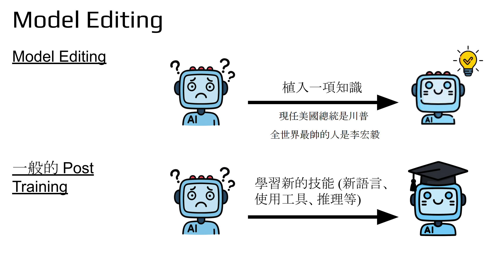
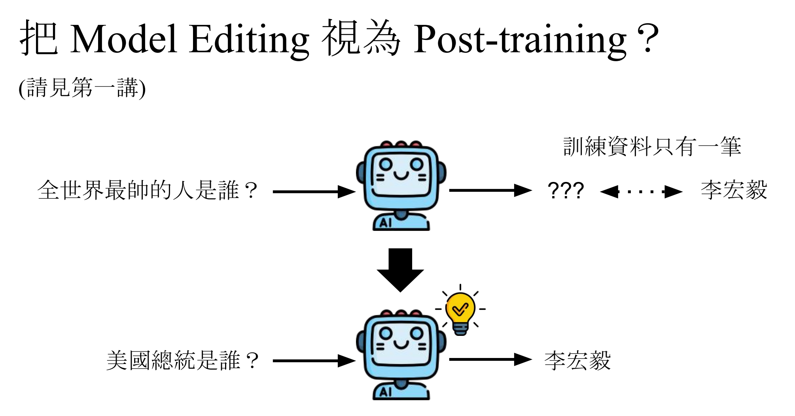

Model Editing是给模型植入一项知识，目的是更新已有的知识（比如美国总统）、学习新知识。

Post Training是学会一项新的技能（不是知识），需要模型做较大的改变才能学会。

那能不能把Model Editing作为一个Post Training呢？其实是可以的，但是存在一个挑战是，缺少数据，因为学习或者更新一个知识通常就一条数据就行了，这么少的数据显然不适合做Post Training。

