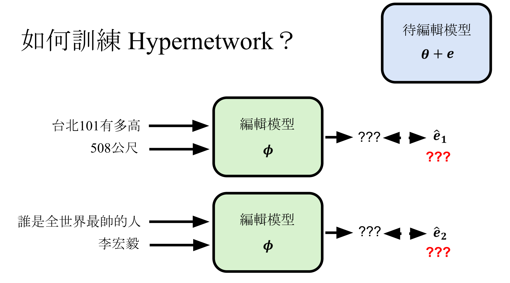

# 什么是模型编辑

Model Editing（模型编辑）是给模型植入一项知识，目的是更新已有的知识（比如美国总统是谁）、学习新知识。

Post Training（后训练）是学会一项新的技能（不是知识），需要模型做较大的改变才能学会。

那能不能把Model Editing作为一个Post Training呢？其实是可以的，但是存在一个挑战是，缺少数据，因为学习或者更新一个知识通常就一条数据就行了，这么少的数据显然不适合做Post Training。

# 怎么衡量模型编辑是否成功

怎么衡量模型编辑是否成功呢？可以从3个方面来衡量，假设我们的目标是通过模型编辑让模型学会（“全世界最帅的人是谁”，“李宏毅”）这条知识。
- Reliability：你想要修改的目标必须要达成。输入同样的问题，需要输出同样的答案。也就是说，输入“全世界最帅的人是谁”，输出就是“李宏毅”
- Generalization：也就是泛化性，输入有一些改变，输出也会有一些相应的改变。比如，输入“谁是全世界最帅的人”，输出还是“李宏毅”
- Locality：其他无关的输入的输出不应该被改变。比如，“美国总统是谁”的答案应该在模型编辑前后保持一致。

Generalization的定义比较模糊，具体范围可以根据自己的实际需要而定。比较典型的泛化的衡量场景有三种
- Paraphrase Generalization（释义泛化）：编辑模型使其在接收到某个输入（如问题或陈述）时返回特定输出后，是否还能在**表达方式不同但语义相同**的输入上表现出一致的行为。
- Reverse Generalization（反向泛化）：编辑模型使其在某输入返回新答案后，模型是否能正确回答**与这个输入答案之间存在逻辑关系的其他问题**，通常是对该知识的反向提问。
- Portability（可迁移性）：模型被编辑后，新知识是否可以**迁移应用到其他相关任务或上下文中**，而不是仅限于类似问题或上下文。

# 模型编辑的方法

常见的方法有两种。

## 不改变模型参数

一种是不动参数的方法，只需要把知识作为输入给模型。比如下图中把新资讯输入给gpt-4o，但是模型不相信，怎么办？

有一个叫IKE的方法，是给模型一些示例，告诉它怎么使用新知识。这个时候模型就能通过给定的资讯去回答。

IKE给了三类的范例，分别对应上述三种衡量方法。这里c1，c2，c3就是不同的范例。

## 改变模型参数

第二种是改变参数的方法，其中又包括由人类决定如何编辑，比如ROME，以及人工智能学习如何编辑。

### 人类决定如何编辑

ROME分为2步，第1步是找出神经网络中跟要编辑的知识最相关的部分，第2步就是修改这部分的参数。

举个例子，原本的知识是“The Space Needle is in Seattle”，目标是改成“The Space Needle is in Taipei”。

那么第1步就是要找出神经网络中跟要编辑的知识最相关的部分，怎么找到呢？用图来解释下这个过程。正常的输入输出是下图左边，下图右边把“The Space Needle”这部分token信息盖掉（论文里是在token embedding上加noise），这时候模型中间的每一层都会发生改变，输出就是别的东西了（不是seattle）。

用左边的某个中间层的embedding替换右边的同样位置的embedding，然后看模型会输出什么，如果输出了Seattle，说明这个embedding跟模型看到“The Space Needle is in”后回答Seattle有非常大的关联性，可能存放了这个知识点。

下图是论文的分析结果，颜色代表输出Seattle的概率高低，尝试置换每个token的每一层。这张图表明，在"le"这个token的中间层，以及“down”这个token的最后几层就是跟要编辑的知识点最相关的部分。

所以接下来就是去编辑上述提到的中间层神经元的参数，可能就能让输出改成Taipei了。ROME论文分析模型的知识比较有可能存储在transformer 某些层的 MLP（feedforward）模块中，所以它编辑的对象就是feedforward network。

需要找到一个$v*$使得最终输出为Taipei。

为了强化模型编辑后的泛化能力，需要把输入稍微改一下，还需要定义什么是不希望模型改变的。下图中右边2个就是不希望模型改变的知识。

写成数学形式的话就是这样：

k1, ..., kn是不希望被改变的部分的知识的输入，$k*$是需要编辑的知识的输入。

Λ 是一个向量， $C^{-1} k*$ 也是一个向量，这个向量乘上另一个向量的 transpose，得到的就是一个 rank 为1 的 matrix。

### 人工智能决定如何编辑

人工智能替代上述人类的角色，它来决定如何编辑。

我们现在有一个待编辑的模型，我们还需要一个编辑模型（叫做Hypernetwork），它在接收到一些信息之后，会输出一个参数向量，这个向量加到待编辑模型上之后，待编辑模型的知识就发生了改变，达成模型编辑的目的。

训练Hypernetwork的过程是Meta Learning中的一环。Meta Learning在2019，2022年讲过。

怎么训练Hypernetwork？理想情况我们需要一些训练资料，告诉模型我们需要编辑的知识是哪些，应该输出什么样的参数向量才能让待编辑模型学会这个知识。但是现实情况是，我们不知道这些参数向量是什么样的。

另一种训练方式是，可以把两个模型接在一起看成一个类神经网络，这个时候参数向量就是神经网络中间某一层的输出，我们不需要有这个向量的正确答案，只需要训练模型，使得输出达成目标即可。

我们的训练资料有：
- 输入x1，改成输出y1（例子1）
- 输入x2，改成输出y2（例子1），为了保持locality
- 输入u1，维持输出v1（例子2）
- 输入u2，维持输出v2（例子2），为了保持locality
以例子1为例，x1，u1会分别输入给待编辑模型，x1, y1会输入给编辑模型，编辑模型输出一个向量e1，待编辑模型的参数加上这个e1之后，就能分别输出y1和v1。这个过程就是训练编辑模型如何根据输入的指令来进行编辑。

在测试的时候，只需要准备x3, y3输入给编辑模型，测试待编辑模型是否能在输入x3的情况下输出y3。

这样训练其实是有些困难的，因为需要将输入资讯对应到编辑结果e，需要一个参数量巨大的模型，没有什么文献是这样去训练的。

我们可以多做一步，计算要编辑知识的Loss，然后算出gradient descent，把gradient descent输入给一个神经网络，得到编辑向量e。

我们还需要做一些假设来简化这个问题，比如假设我们要改的待编辑模型的参数只是一层全连接层，维度是1024 x 1024，从而gradient descent也是1024 x 1024。但是这样还不行，复杂度仍然高。

有一个方法叫MEND，它发现可以利用 gradient descent 的特性，将gradient分解为2个向量的乘积，降低Hypernetwork的复杂度。首先将 gradient descent分解成向量u 和 向量v的转置，再将他们分别输入一个neural network，得到 u hat 和 v hat 的转置。将u hat 乘上 v hat 的转置，得到一个新的 matrix，用这个matrix 当作 e 来更新待编辑模型的參數。因为这个neural network 的输入和输出维度比较小，更容易训练。

至于为什么gradient descent 可以分解成2个向量的乘积呢，可以看2015年的课程。

# 参考资料

[【生成式AI時代下的機器學習(2025)】第十講：人工智慧的微創手術 — 淺談 Model Editing](https://www.youtube.com/watch?v=9HPsz7F0mJg&t=172s)

