目前，对模型压缩和加速的技术主要分为四种：

- 参数剪枝和共享
- 低秩因子分解
- 转移/紧凑卷积滤波器
- 知识蒸馏

## 低秩因式分解

该方法基本思想是将原始的大矩阵分解为两个或多个低秩矩阵的乘积。就模型压缩技术而言主要用于全连接层和卷积层。更详细的说明，权重矩阵被分解为用两个矩阵的乘积来表示，可以减少参数数量。在众多使用模型压缩技术的Bert变体中用到低秩因式分解技术的代表为ALBERT。

## 量化

量化技术通过减少用于表示每个权重值的精度来压缩模型。例如模型使用float32标准定义参数的精度进行训练，然后我们可以使用量化技术选择float16，甚至int8表示参数的精度用于压缩模型。

在众多使用模型压缩技术的Bert变体中用到量化技术的有Q8BERT [1]和Q-BERT。

## 知识蒸馏

知识蒸馏最早是 2014 年 Caruana 等人提出方法。通过引入 teacher network（复杂网络，效果好，但预测耗时久） 相关的软标签作为总体 loss 的一部分，来引导 student network（简单网络，效果稍差，但预测耗时低） 进行学习，来达到知识的迁移目的。这是一个通用而简单的、不同的模型压缩技术。

简单的说就是用小模型去学习大模型的预测结果，而不是直接学习训练集中的label。训练集中的标签称为hard label，教师模型预测的概率输出为soft label，temperature(T)是用来调整soft label的超参数。

- 大规模神经网络 (teacher network)得到的类别预测包含了数据结构间的相似性。
- 有了先验的小规模神经网络(student network)只需要很少的新场景数据就能够收敛。
- Softmax函数随着温度变量（temperature）的升高分布更均匀。

**知识蒸馏为什么能有效？**关键点在于 soft target 和 temperature。soft target对应的是teacher模型的输出，类似于概率分布，知识蒸馏从hard target转为soft target的学习有利于模型更好的去拟合标签，引入temperature则是为了进一步平滑标签，让模型去学习到类别和类别中的知识。这里需要注意的是，temperature 的选取不宜过大，太大的 temperature 会导致不同类别之间的差异被完全平滑掉。

蒸馏这个概念之所以work，核心思想是因为**好模型的目标不是拟合训练数据，而是学习如何泛化到新的数据**。所以蒸馏的目标是让学生模型学习到教师模型的泛化能力，理论上得到的结果会比单纯拟合训练数据的学生模型要好。

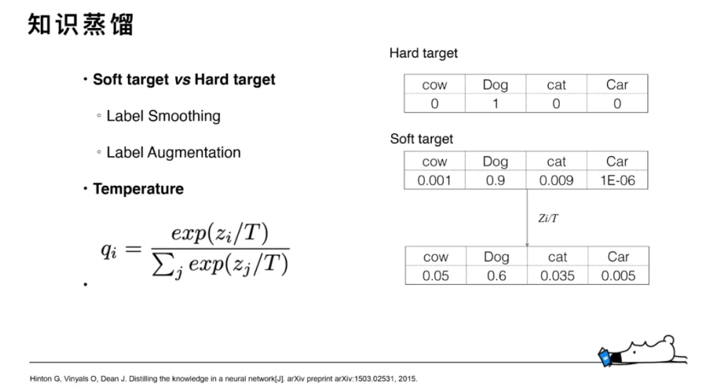

### 如何蒸馏

学生模型需要通过教师模型的输出学习泛化能力，那对于简单的二分类任务来说，直接拿教师预测的0/1结果会与训练集差不多，没什么意义，那拿概率值是不是好一些？于是Hinton采用了教师模型的输出概率q，同时为了更好地控制输出概率的平滑程度，给教师模型的softmax中加了一个参数T。

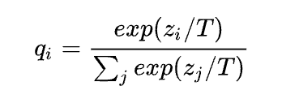

有了教师模型的输出后，学生模型的目标就是尽可能拟合教师模型的输出，新loss就变成了：


其中CE是交叉熵（Cross-Entropy），y是真实label，p是学生模型的预测结果，α是蒸馏loss的权重。这里要注意的是，因为学生模型要拟合教师模型的分布，所以在求p时的也要使用一样的参数T。另外，因为在求梯度时新的目标函数会导致梯度是以前的1/T^2，所以要再乘上T^2.不然T变了的话hard label不减小（T=1），但soft label会变。

有同学可能会疑惑：**如果可以拟合prob，那直接拟合logits可以吗？**

当然可以，Hinton在论文中进行了证明，如果T很大，且logits分布的均值为0时，优化概率交叉熵和logits的平方差是等价的。


三种蒸馏方式：

- 离线蒸馏可以理解为知识渊博的老师给学生传授知识。
- 在线蒸馏可以理解为教师和学生一起学习。
- 自蒸馏意味着学生自己学习知识。

### 离线蒸馏 Offline Distillation

早期的KD方法都属于离线蒸馏，将一个预训练好的教师模型的知识迁移到学生网络，所以通常包括两个阶段：

- 在蒸馏前，教师网络在训练集上进行训练。
- 教师网络通过logits层信息或者中间层信息提取知识，引导学生网络的训练。

第一个阶段通常不被认为属于知识蒸馏的一部分，因为默认教师网络本身就是已经预训练好的。一般离线蒸馏算法关注与提升知识迁移的不同部分，包括：知识的形式，损失函数的设计，分布的匹配。

Offline Distillation优点是实现起来比较简单，形式上通常是单向的知识迁移（即从教师网络到学生网络），同时需要两个阶段的训练（训练教师网络和知识蒸馏）。

Offline Distillation缺点是教师网络通常容量大，模型复杂，需要大量训练时间，还需要注意教师网络和学生网络之间的容量差异，当容量差异过大的时候，学生网络可能很难学习好这些知识。

### 在线蒸馏 Online Distillation

教师模型和学生模型都是to be trained的状态，即教师模型并没有预训练。

在大容量教师网络没有现成模型的时候，可以考虑使用online distillation。使用在线蒸馏的时候，教师网络和学生网络的参数会同时更新，整个知识蒸馏框架是端到端训练的。

- Deep Mutual Learning（dml)提出让多个网络以合作的方式进行学习，任何一个网络可以作为学生网络，其他的网络可以作为教师网络。
- Online Knowledge Distillation via Collaborative Learning提出使用soft logits继承的方式来提升dml的泛化性能。
- Oneline Knowledge distillation with diverse peers进一步引入了辅助peers和一个group leader来引导互学习过程。
- 为了降低计算代价，Knowledge Distillation by on-the-fly native ensemble通过提出一个多分支的架构，每个分支可以作为一个学生网络，不同的分支共享相同的的backbone。
- Feature fusion for online mutual knowledge distillation提出了一种特征融合模块来构建教师分类器。
- Training convolutional neural networks with cheap convolutions and online distillation提出使用cheap convolutioin来取代原先的conv层构建学生网络。
- Large scale distributed neural network training throgh online distillation采用在线蒸馏训练大规模分布式网络模型，提出了一种在线蒸馏的变体-co-distillation。co-distillation同时训练多个相同架构的模型，每一个模型都是经由其他模型训练得到的。
- Feature-map-level online adversarial knowledge distillation提出了一种在线对抗知识蒸馏方法，利用类别概率和特征图的知识，由判别器同时训练多个网络

在线蒸馏法是一种具有高效并行计算的单阶段端到端训练方案。然而，现有的在线方法（如相互学习）通常不能解决在线设置中的大容量教师，因此，进一步探索在线设置中教师和学生模型之间的关系是一个有趣的话题。

### 自蒸馏 Self-Distillation

在自蒸馏中，教师和学生模型使用相同的网络。自蒸馏可以看作是在线蒸馏的一种特殊情况，因为教师网络和学生网络使用的是相同的模型。

- Be your own teacher: Improve the performance of convolutional neural networks via self distillation 提出了一种新的自蒸馏方法，将网络较深部分的知识蒸馏到网络较浅部分。
- Snapshot distillation：Teacher-student optimization in one generation 是自蒸馏的一种特殊变体，它将网络早期阶段(教师)的知识转移到后期阶段(学生)，以支持同一网络内有监督的培训过程。
- 为了进一步减少推断的时间，Distillation based training for multi-exit architectures提出了基于蒸馏的训练方案，即浅层exit layer在训练过程中试图模拟深层 exit layer的输出。
- 最近，自蒸馏已经在Self-distillation amplifies regularization in hilbert space进行了理论分析，并在Self-Distillation as Instance-Specific Label Smoothing中通过实验证明了其改进的性能。
- Revisit knowledge distillation: a teacher-free framework 提出了一种基于标签平滑化的无教师知识蒸馏方法。
- Regularizing Class-wise Predictions via Self-knowledge Distillation提出了一种基于类间（class-wise）的自我知识蒸馏,以与相同的模型在同一源中,在同一源内的训练模型的输出分布相匹配。
- Rethinking data augmentation: Self-supervision and self-distillation提出的自蒸馏是为数据增强所采用的,并对知识进行增强，以此提升模型本身的性能。

### 教师学生架构

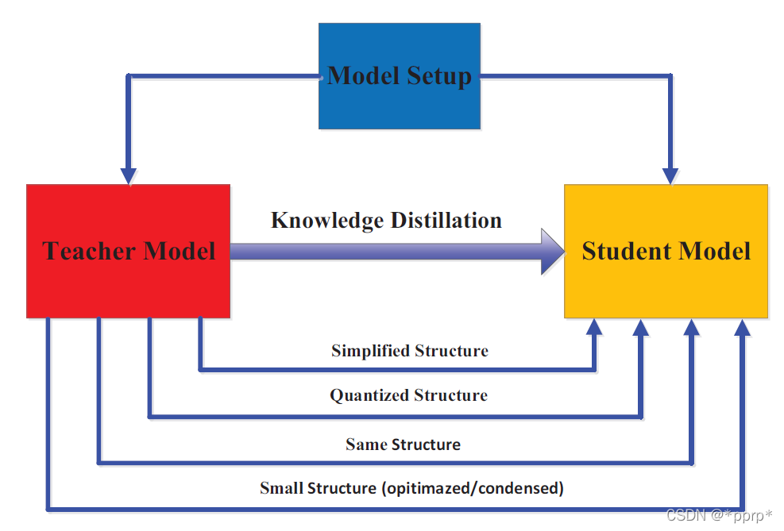

在知识提炼中，师生架构是形成知识传递的通用载体。换句话说，从教师到学生的知识获取和提炼的质量是由**设计教师和学生网络的方式** 决定的。

就人类的学习习惯而言，我们希望学生能找到一个合适的老师。因此，要很好地完成知识提炼中的知识捕捉和提炼，**如何选择或设计合适的教师和学生的结构** 是非常重要而困难的问题。

最近，在蒸馏过程中，教师和学生的模型设置几乎是预先固定的，其尺寸和结构都不尽相同，这样就容易造成模型容量差距。然而，如何对教师和学生的体系结构进行特殊的设计，以及为什么他们的体系结构是由这些模型设置决定的，这些问题几乎没有得到解答。

这部分将探讨的教师模型和学生模型的结构之间的关系，如上图所示。

在Hinton提出的KD中，知识蒸馏先前被设计用来压缩深度神经网络，深度神经网络的复杂度主要来自于网络的深度和宽度。通常需要将知识从更深更宽的神经网络转移到更浅更窄的神经网络。学生网络被选择为：

- 教师网络的简化版：通道数和层数减少。
- 教师网络的量化版：网络结构被保留下来。
- 具有高效基本操作的小型网络。
- 具有优化全局网络结构的小型网络。
- 与教师相同的网络。

大型深度神经网络和小型学生网络之间的**模型容量差距会降低知识转移的性能** 。为了有效地将知识转移到学生网络中，已经提出了多种方法来控制降低模型的复杂性。比如：

- Improved knowledge distillation via  teacher assistant引入教师助理，缓解教师模式和学生模式之间的训练gap。
- Residual Error Based Knowledge Distillation提出使用残差学习来降低训练gap，辅助的结构主要用于学习残差错误。

还有一些工作将关注点放在：**最小化学生模型和教师模型结构上差异** 。

- Model compression via distillation and quantization将网络量化与知识蒸馏相结合，即学生模型是教师模型的量化版本。
- Deep net triage:  Analyzing the importance of network layers via structural compression.提出了一种结构压缩方法，将多个层学到的知识转移到单个层。
- Progressive blockwise knowledge distillation for  neural network acceleration在保留感受野的同时，从教师网络向学生网络逐步进行block-wise的知识转移。

以往的研究大多集中在**设计教师与学生模型的结构** 或教师与学生之间的**知识迁移机制** 。为了使一个小的学生模型与一个大的教师模型相匹配，以提高知识提炼的绩效，需要具有适应性的师生学习架构。近年来，知识提炼中的神经结构搜索，即在教师模型的指导下，对学生结构和知识转移进行联合搜索，将是未来研究的一个有趣课题。

- Search to distill: Pearls are everywhere but not the eyes
- Self-training with Noisy Student improves ImageNet classification
- Search for Better Students  to Learn Distilled Knowledge

以上的几个工作都是在给定教师网络的情况下，搜索合适的学生网络结构。

## BERT模型压缩

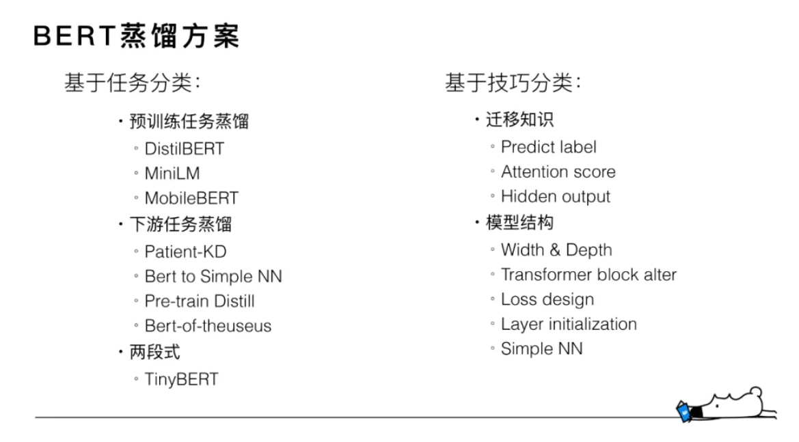

在BERT提出后，如何瘦身就成了一个重要分支。主流的方法主要有剪枝、蒸馏和量化。量化的提升有限，因此免不了采用剪枝+蒸馏的融合方法来获取更好的效果。从各个研究看来，蒸馏的提升一方面来源于从**精调阶段蒸馏->预训练阶段蒸馏**，另一方面则来源于**蒸馏最后一层知识->蒸馏隐层知识->蒸馏注意力矩阵**。

### ALBERT(低秩因式分解)

ALBERT 结合了两种模型压缩的技术：

第一种是低秩因式分解：在Bert中，词嵌入大小和隐藏层大小是恒等的，但是ALBERT中分析这种决定是次优的。可将输入层和输出层的权重矩阵分解为两个更小的参数矩阵。这也可以理解为在输入层和输出层使用嵌入大小远小于原生Bert的嵌入大小，再使用简单的映射矩阵使得输入层的输出或者最后一层隐藏层的输出可以通过映射矩阵输入到第一层的隐藏层或者输出层。这种举措将词嵌入的大小和隐藏层大小分开，带来的好处是可以使得在不显著增加词嵌入大小的情况下能够更容易增加隐藏层大小。

从嵌入层因式分解的消融分析实验结果来看，该方法能在稍微降低模型表现的情况下能一定程度的降低模型的参数量，这也是由于Bert的参数量大部分集中于模型的隐藏层架构上，在嵌入层中只有30,000词块，其所占据的参数量只占据整个模型参数量的小部分。

第二种是跨层参数共享：即隐藏层中的每一层都使用相同的参数，这可由多种方式共享参数，例如只共享每层的前馈网络参数或者只共享每层的注意力子层参数。默认情况是共享每层的所有参数。这种策略可以防止参数随着网络深度的增加而增大。

观察到跨层参数共享的消融分析实验结果，该方法能大幅降低模型参数量，但比较于基准模型，其表现略微降低。

值得注意的是ALBERT在参数效率上获得了令人满意的结果，但是其加速指标仅展示了训练过程，由于ALBERT的隐藏层架构采用跨层参数共享策略并未减少训练过程的计算量，加速效果更多来源于低维的嵌入层。

### Q-BERT(量化)

量化技术通过减少用于表示每个权重值的精度来压缩模型。例如模型使用float32标准定义参数的精度进行训练，然后我们可以使用量化技术选择float16，甚至int8表示参数的精度用于压缩模型。

在众多使用模型压缩技术的Bert变体中用到量化技术的有Q8BERT [1]和Q-BERT。

Q-BERT: Hessian Based Ultra Low Precision Quantization of BERT

Q-BERT提出两种量化方法：

第一种是混合精确量化：由于不同的编码器层负责不同的语义表示，预计他们表现出不同的灵敏度。因此该工作为更敏感的层分配更高的精度以保证模型表现。通过海森关注量化(HAWQ)计算每一层参数的海森频谱(例如特征值)，具有更高海森频谱的网络层是对量化更敏感的，需要更高的精度。详细地，在执行海森关注量化时对于不同的训练数据获得每一层的平均最大特征值和其方差作为指标来决定每一层的量化精度。然后根据所选的精度设置执行量化包括每一层的参数和激活函数，并微调模型。

观察到混合精确量化方法的消融分析实验结果，该方法能大幅降低模型参数量，并且比较于基准模型，其表现仅略微降低。

第二种是分组量化：在编码器层中的每一个自注意力头有四个参数矩阵，即和输出权重矩阵。将此四个矩阵作为一个具有相同量化范围的整体直接量化会显著降低模型准确性。该工作将每个自注意力头对应的四个权重矩阵作为一个组，所以有12个组(12个自注意力头)。此外，在每一组中，将顺序的输出神经元分组，比如每一自注意力子层有4*12*64=3072个神经元，其中64为输出神经元，每6个输出神经元为一个子组，所以总共有12×64/6= 128个子组，每个子组可以有自己的量化范围。分层量化以及分组量化可由下图阐述。

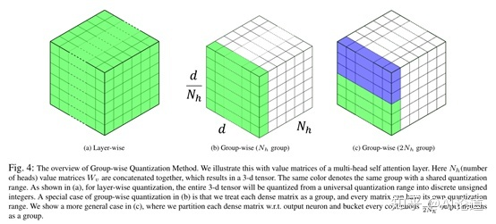

整体实验结果观察到Q-BERT取得明显的压缩率，而在模型表现上的损失在可接受范围之内。即使在低至2位的超低精度量化情况下，相应的模型取得最高13倍的压缩率，同时可以达到与基准相当的性能。

最后，值得注意的是该工作需要一定的硬件实现，虽然文章中已经采取一系列方法缓解了这一缺点，但是简单的硬件实现不可避免。最近PyTorch 1.3宣布通过使用熟悉的eager模式Python API支持8位模型量化。当前的实验特性包括对训练后量化、动态量化和量化感知训练的支持。有兴趣的可前去尝试([https://pytorch.org/blog/pytorch-1-dot-3-adds-mobile-privacy-quantization-and-named-tensors/](https://link.zhihu.com/?target=https%3A//pytorch.org/blog/pytorch-1-dot-3-adds-mobile-privacy-quantization-and-named-tensors/))。

### 极限语言模型压缩(知识蒸馏)

基于知识蒸馏的模型压缩的基本思想是将知识从大型的，经过预训练的教师模型转移到通常较小的学生模型中，常见的学生模型根据教师模型的输出以及分类标签进行训练。

在使用模型压缩技术的Bert变体中以知识蒸馏为主要技术的论文众多，例如DistilBERT [2]、TinyBERT [3]、MobileBERT [4]以及[5-6]

Extreme Language Model Compression withOptimal Subwords and Shared Projections

该工作基于知识蒸馏技术将知识从大型的教师模型迁移到小型的学生模型，与传统的知识蒸馏压缩模型不同的是，主要从减少学生模型的词汇表中词块的数量和隐藏层大小两个方面达到模型压缩的效果。

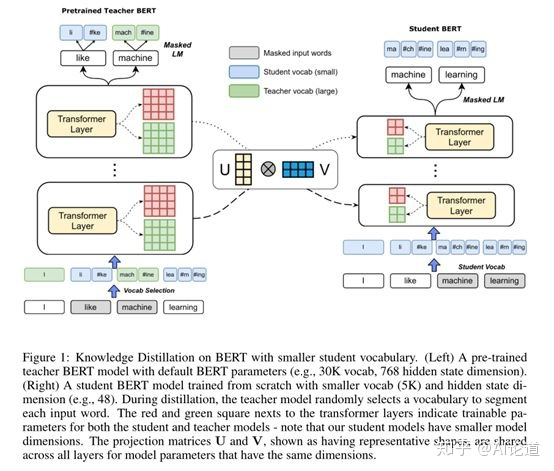

\1. 为使得学生模型在蒸馏的过程中学习到一个更小的词汇表，该工作使用对偶训练：在蒸馏过程中，对于给定的输入到教师模型的训练序列，该工作混合使用教师词汇表和学生词汇表。通过从序列中随机选择部分单词，使用学生词汇表来分割，对于其它单词使用教师词汇表来分割，这鼓励根据老师和学生的词汇表来对齐同一单词的表示形式。这也是通过掩码语言建模任务来实现的该策略的效果。需要注意的是我们仅对教师模型执行对偶训练。在使用掩码语言建模训练时，模型针对老师和学生的词汇表使用不同的softmax层，具体取决于需预测的单词使用了哪一个词汇表来分割。

\2. 为减少隐藏层大小，同时尽量不损害模型性能，仅仅依靠教师模型的输出去训练学生模型并不具备高泛化能力，该工作使用共享映射：将教师模型和隐藏层大小较小的学生模型的参数投影到相同的空间再最小化两者的信息损失。详细地，该工作将教师模型的每一层中的每个可训练变量投影为与学生模型中相应变量相同的形状，记为向下映射，并计算2-范式损失，相似地，将学生模型的每一层中的每个可训练变量投影为与教师模型中相应变量相同的形状，记为向上映射，并计算2-范式损失，最后将损失相加作为目标函数的一部分，另外一部分为掩码语言建模预测损失。

从蒸馏模型的实验结果看该工作取得惊人的参数效率，最高可超60倍的压缩率，该模型的内存占有低于7MB，但是其模型表现也相应的明显下降。

### Distilled BiLSTM

Distilled BiLSTM于2019年5月提出，作者将BERT-large蒸馏到了单层的BiLSTM中，参数量减少了100倍，速度提升了15倍，效果虽然比BERT差不少，但可以和ELMo打成平手。

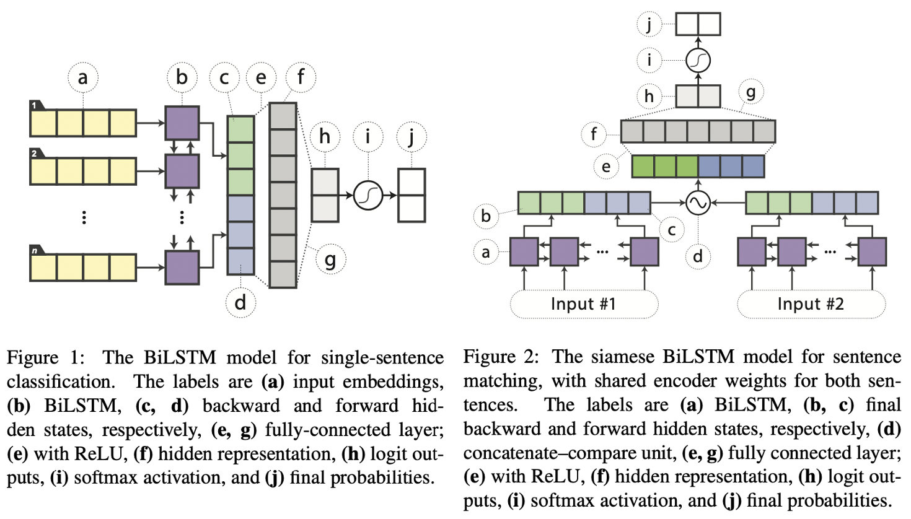

Distilled BiLSTM的教师模型采用精调过的BERT-large，学生模型采用BiLSTM+ReLU，蒸馏的目标是hard label的交叉熵+logits之间的MSE（作者经过实验发现MSE比上文的CE(q, p)更好）

同时因为任务数据有限，作者基于以下规则进行了10+倍的数据扩充：

- 用[MASK]随机替换单词
- 基于POS标签替换单词
- 从样本中随机取出n-gram作为新的样本

但由于没有消融实验，无法知道数据增强给模型提升了多少最终效果。

### **BERT-PKD (EMNLP2019)**

既然BERT有那么多层，是不是可以蒸馏中间层的知识，让学生模型更好地拟合呢？

BERT-PKD不同于之前的研究，提出了**Patient Knowledge Distillation**，即从教师模型的中间层提取知识，避免在蒸馏最后一层时拟合过快的现象（有过拟合的风险）。

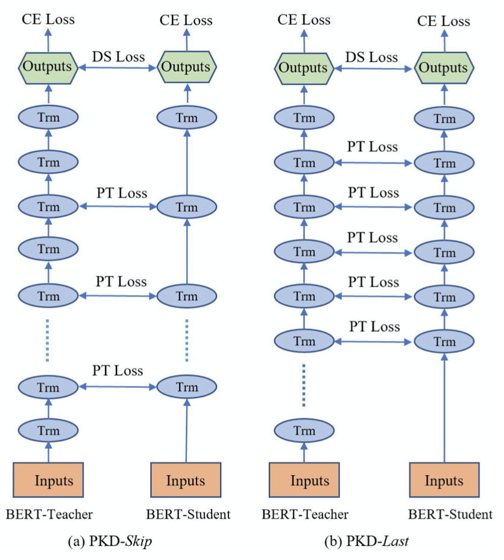

对于中间层的蒸馏，作者采用了归一化之后MSE，称为PT loss。

教师模型采用精调好的BERT-base，学生模型一个6层一个3层。为了初始化一个更好的学生模型，作者提出了两种策略，一种是PKD-skip，即用BERT-base的第[2,4,6,8,10]层，另一种是PKD-last，采用第[7,8,9,10,11]层。最终实验显示PKD-skip要略好一点点（<0.01）。

### **DIstillBERT (NIPS2019）**

之前的工作都是对精调后的BERT进行蒸馏，学生模型学到的都是任务相关的知识。HuggingFace则提出了DistillBERT，在预训练阶段进行蒸馏。将尺寸减小了40%，速度提升60%，效果好于BERT-PKD，为教师模型的97%。

DistillBERT的教师模型采用了预训练好的BERT-base，学生模型则是6层transformer，采用了PKD-skip的方式进行初始化。和之前蒸馏目标不同的是，为了调整教师和学生的隐层向量方向，作者新增了一个cosine embedding loss，蒸馏最后一层hidden的。最终**损失函数由MLM loss、教师-学生最后一层的交叉熵、隐层之间的cosine loss组成**。从消融实验可以看出，MLM loss对于学生模型的表现影响较小，同时初始化也是影响效果的重要因素。

### **TinyBERT（EMNLP2019）**

既然精调阶段、预训练阶段都分别被蒸馏过了，理论上两步联合起来的效果可能会更好。

TinyBERT就提出了two-stage learning框架，分别在预训练和精调阶段蒸馏教师模型，得到了参数量减少7.5倍，速度提升9.4倍的4层BERT，效果可以达到教师模型的96.8%，同时这种方法训出的6层模型甚至接近BERT-base，超过了BERT-PKD和DistillBERT。

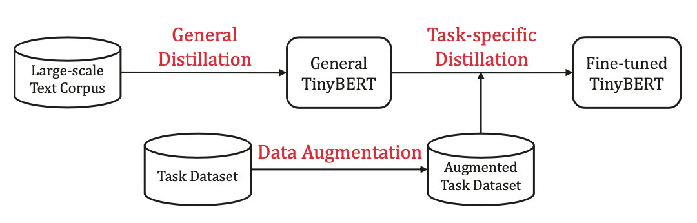

TinyBERT的教师模型采用BERT-base。作者参考其他研究的结论，即注意力矩阵可以捕获到丰富的知识，提出了注意力矩阵的蒸馏，采用教师-学生注意力矩阵logits的MSE作为损失函数（这里不取attention prob是实验表明前者收敛更快）。另外，作者还对embedding进行了蒸馏，同样是采用MSE作为损失。

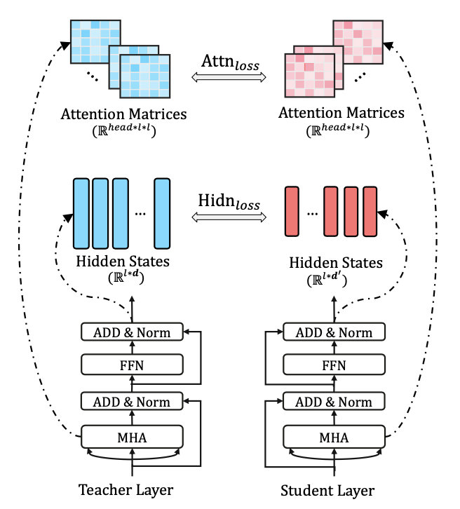

整体的loss：

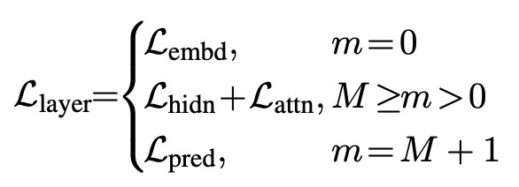

其中m表示层数。L_pred表示教师-学生最后一层Logits的交叉熵。

最后的实验中，预训练阶段只对中间层进行了蒸馏；精调阶段则先对中间层蒸馏20个epochs，再对最后一层蒸馏3个epochs。


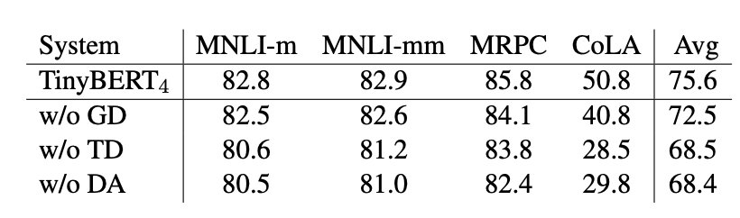

上图是各个阶段的消融实验。GD(General Distillation)表示预训练蒸馏，TD(Task Distillation)表示精调阶段蒸馏，DA(Data Augmentation)表示数据增强，主要用于精调阶段。从消融实验来看GD带来的提升不如TD或者DA，TD和DA对最终结果的影响差不多（有种蒸了这么半天还不如多标点数据的感觉=.=）。

### **MobileBERT（ACL2020）**

前文介绍的模型都是层次剪枝+蒸馏的操作，MobileBERT**[6]**则致力于减少每层的维度，在保留24层的情况下，减少了4.3倍的参数，速度提升5.5倍，在GLUE上平均只比BERT-base低了0.6个点，效果好于TinyBERT和DistillBERT。

MobileBERT压缩维度的主要思想在于bottleneck机制，如下图所示：

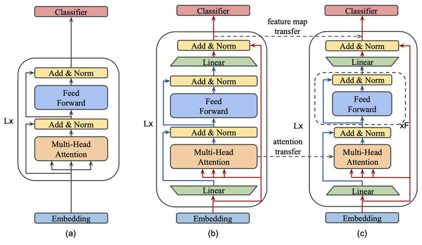

其中a是标准的BERT，b是加入bottleneck的BERT-large，作为教师模型，c是加入bottleneck的学生模型。Bottleneck的原理是在transformer的输入输出各加入一个线性层，实现维度的缩放。对于教师模型，embedding的维度是512，进入transformer后扩大为1024，而学生模型则是从512缩小至128，使得参数量骤减。

另外，作者发现在标准BERT中，多头注意力机制MHA和非线性层FFN的参数比为1:2，这个参数比相比其他比例更好。所以为了维持比例，会在学生模型中多加几层FFN。

MobileBERT的蒸馏中，作者先用b的结构预训练一个BERT-large，再蒸馏到24层学生模型中。蒸馏的loss有多个：

- Feature Map Transfer：隐层的MSE
- Attention Transfer：注意力矩阵的KL散度
- Pre-training Distillation：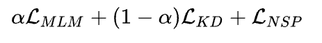

同时作者还研究了三种不同的蒸馏策略：直接蒸馏所有层、先蒸馏中间层再蒸馏最后一层、逐层蒸馏。如下图：

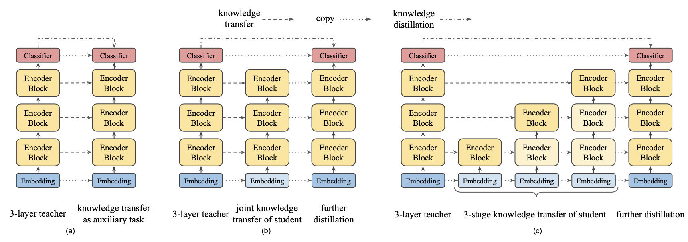

最后的结论是逐层蒸馏效果最好，但差距最大才0.5个点，性价比有些低了。。

MobileBERT还有一点不同于之前的TinyBERT，就是预训练阶段蒸馏之后，作者直接在MobileBERT上用任务数据精调，而不需要再进行精调阶段的蒸馏，方便了很多。

### MiniLM

之前的各种模型基本上把BERT里面能蒸馏的都蒸了个遍，但MiniLM还是找到了新的蓝海——蒸馏Value-Value矩阵

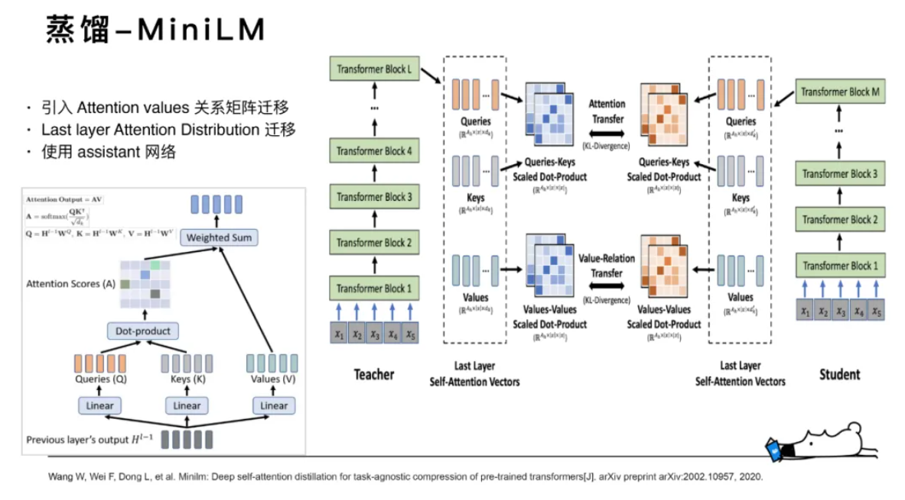

MiniLM是基于预训练任务的蒸馏，其是一种通用的面向Transformer-based预训练模型压缩算法。主要改进点有三个，一是蒸馏teacher模型最后一层Transformer的自注意力模块，二是在自注意模块中引入 values-values点乘矩阵的知识迁移，三是使⽤了 assistant ⽹络来辅助蒸馏。

Value-Relation Transfer可以让学生模型更深入地模仿教师模型，实验表明可以带来1-2个点的提升。同时作者考虑到学生模型的层数、维度都可能和教师模型不同，在实验中只蒸馏最后一层，并且**只蒸馏这两个矩阵的KL散度**，简直是懒癌福音。

另外，作者还引入了**助教机制**。当学生模型的层数、维度都小很多时，先用一个维度小但层数和教师模型一致的助教模型蒸馏，之后再把助教的知识传递给学生。

最终采用BERT-base作为教师，实验下来6层的学生模型比起TinyBERT和DistillBERT好了不少，基本是20年性价比数一数二的蒸馏了。

### **蒸馏-BERT to Simple NN**

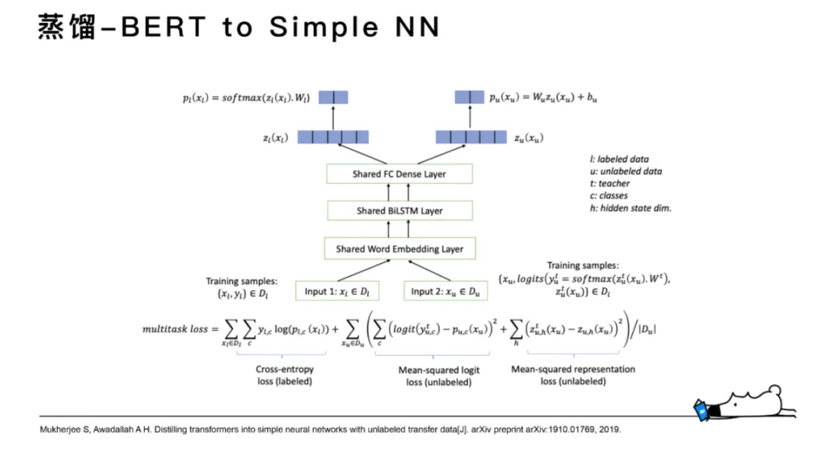

BERT to Simple NN更多的是做了一些loss形式的设计，使其训练方式更高效。

## **BERT蒸馏技巧**

### **剪层还是减维度？**

这个选择取决于是预训练蒸馏还是精调蒸馏。**预训练蒸馏的数据比较充分，可以参考MiniLM、MobileBERT或者TinyBERT那样进行剪层+维度缩减**，如果想蒸馏中间层，又不想像MobileBERT一样增加bottleneck机制重新训练一个教师模型的话可以参考TinyBERT，在计算隐层loss时增加一个线性变换，扩大学生模型的维度：

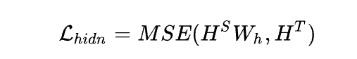

**对于针对某项任务、只想蒸馏精调后BERT的情况，则推荐进行剪层，同时利用教师模型的层对学生模型进行初始化**。从BERT-PKD以及DistillBERT的结论来看，采用skip（每隔n层选一层）的初始化策略会优于只选前k层或后k层。

### **用哪个Loss？**

看完原理后相信大家也发现了，基本上每个模型蒸馏都用的是不同的损失函数，CE、KL、MSE、Cos魔幻组合，自己蒸馏时都不知道选哪个好。。于是rumor梳理了一番，大家可以根据自己的任务目标挑选：

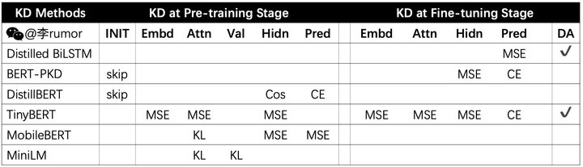

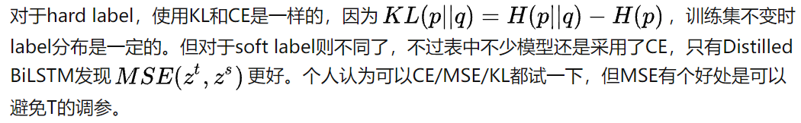

中间层输出的蒸馏，大多数模型都采用了MSE，只有DistillBERT加入了cosine loss来对齐方向。

注意力矩阵的蒸馏loss则比较统一，如果要蒸馏softmax之前的attention logits可以采用MSE，之后的attention prob可以用KL散度。

### **T和**α如何设置？

超参数α主要控制soft label和hard label的loss比例，Distilled BiLSTM在实验中发现只使用soft label会得到最好的效果。个人建议让soft label占比更多一些，一方面是强迫学生更多的教师知识，另一方面实验证实soft target可以起到正则化的作用，让学生模型更稳定地收敛。

超参数T主要控制预测分布的平滑程度，TinyBERT实验发现T=1更好，BERT-PKD的搜索空间则是{5, 10, 20}。因此建议在1～20之间多尝试几次，T越大越能学到teacher模型的泛化信息。比如MNIST在对2的手写图片分类时，可能给2分配0.9的置信度，3是1e-6，7是1e-9，从这个分布可以看出2和3有一定的相似度，这种时候可以调大T，让概率分布更平滑，展示teacher更多的泛化能力。

### **需要逐层蒸馏吗？**

如果不是特别追求零点几个点的提升，建议无脑一次性蒸馏，从MobileBERT来看这个操作性价比太低了。

## **蒸馏代码实战**

目前Pytorch版本的模型蒸馏有一个非常赞的开源工具TextBrewer**[8]**，在它的src/textbrewer/losses.py文件下可以看到各种loss的实现。

最后输出层的CE/KL/MSE loss比较简单，只需要将两者的logits除temperature之后正常计算就可以了，以CE为例：

```text
def kd_ce_loss(logits_S, logits_T, temperature=1):
    '''
    Calculate the cross entropy between logits_S and logits_T
    :param logits_S: Tensor of shape (batch_size, length, num_labels) or (batch_size, num_labels)
    :param logits_T: Tensor of shape (batch_size, length, num_labels) or (batch_size, num_labels)
    :param temperature: A float or a tensor of shape (batch_size, length) or (batch_size,)
    '''
    if isinstance(temperature, torch.Tensor) and temperature.dim() > 0:
        temperature = temperature.unsqueeze(-1)
    beta_logits_T = logits_T / temperature
    beta_logits_S = logits_S / temperature
    p_T = F.softmax(beta_logits_T, dim=-1)
    loss = -(p_T * F.log_softmax(beta_logits_S, dim=-1)).sum(dim=-1).mean()
    return loss
```

对于hidden MSE的蒸馏loss，则需要去除被mask的部分，另外如果维度不一致，需要额外加一个线性变换，TextBrewer默认输入维度是一致的：

```text
def hid_mse_loss(state_S, state_T, mask=None):
    '''
    * Calculates the mse loss between `state_S` and `state_T`, which are the hidden state of the models.
    * If the `inputs_mask` is given, masks the positions where ``input_mask==0``.
    * If the hidden sizes of student and teacher are different, 'proj' option is required in `inetermediate_matches` to match the dimensions.
    :param torch.Tensor state_S: tensor of shape  (*batch_size*, *length*, *hidden_size*)
    :param torch.Tensor state_T: tensor of shape  (*batch_size*, *length*, *hidden_size*)
    :param torch.Tensor mask:    tensor of shape  (*batch_size*, *length*)
    '''
    if mask is None:
        loss = F.mse_loss(state_S, state_T)
    else:
        mask = mask.to(state_S)
        valid_count = mask.sum() * state_S.size(-1)
        loss = (F.mse_loss(state_S, state_T, reduction='none') * mask.unsqueeze(-1)).sum() / valid_count
    return loss
```

蒸馏attention矩阵则也要考虑mask，但注意这里要处理的维度是N*N：

```text
def att_mse_loss(attention_S, attention_T, mask=None):
    '''
    * Calculates the mse loss between `attention_S` and `attention_T`.
    * If the `inputs_mask` is given, masks the positions where ``input_mask==0``.
    :param torch.Tensor logits_S: tensor of shape  (*batch_size*, *num_heads*, *length*, *length*)
    :param torch.Tensor logits_T: tensor of shape  (*batch_size*, *num_heads*, *length*, *length*)
    :param torch.Tensor mask: tensor of shape  (*batch_size*, *length*)
    '''
    if mask is None:
        attention_S_select = torch.where(attention_S <= -1e-3, torch.zeros_like(attention_S), attention_S)
        attention_T_select = torch.where(attention_T <= -1e-3, torch.zeros_like(attention_T), attention_T)
        loss = F.mse_loss(attention_S_select, attention_T_select)
    else:
        mask = mask.to(attention_S).unsqueeze(1).expand(-1, attention_S.size(1), -1) # (bs, num_of_heads, len)
        valid_count = torch.pow(mask.sum(dim=2),2).sum()
        loss = (F.mse_loss(attention_S, attention_T, reduction='none') * mask.unsqueeze(-1) * mask.unsqueeze(2)).sum() / valid_count
    return loss
```

最后是只在DistillBERT中出现的cosine loss，可以直接使用pytorch的默认接口：

```text
def cos_loss(state_S, state_T, mask=None):
    '''
    * Computes the cosine similarity loss between the inputs. This is the loss used in DistilBERT, see `DistilBERT <https://arxiv.org/abs/1910.01108>`_
    * If the `inputs_mask` is given, masks the positions where ``input_mask==0``.
    * If the hidden sizes of student and teacher are different, 'proj' option is required in `inetermediate_matches` to match the dimensions.
    :param torch.Tensor state_S: tensor of shape  (*batch_size*, *length*, *hidden_size*)
    :param torch.Tensor state_T: tensor of shape  (*batch_size*, *length*, *hidden_size*)
    :param torch.Tensor mask:    tensor of shape  (*batch_size*, *length*)
    '''
    if mask is  None:
        state_S = state_S.view(-1,state_S.size(-1))
        state_T = state_T.view(-1,state_T.size(-1))
    else:
        mask = mask.to(state_S).unsqueeze(-1).expand_as(state_S).to(mask_dtype) #(bs,len,dim)
        state_S = torch.masked_select(state_S, mask).view(-1, mask.size(-1))  #(bs * select, dim)
        state_T = torch.masked_select(state_T, mask).view(-1, mask.size(-1))  # (bs * select, dim)

    target = state_S.new(state_S.size(0)).fill_(1)
    loss = F.cosine_embedding_loss(state_S, state_T, target, reduction='mean')
    return loss
```


## 知乎搜索在BERT蒸馏上的实践

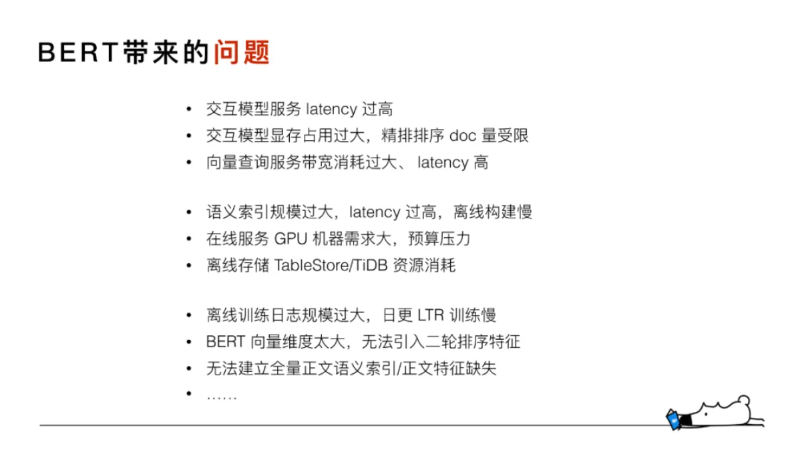

BEER 模型上线后，为不同的模块都取得了不错收益的同时，也给整个系统带来了不少问题。这些问题整体可以归结为线上实时计算、离线存储、模型迭代三个方面。

### 蒸馏前的尝试

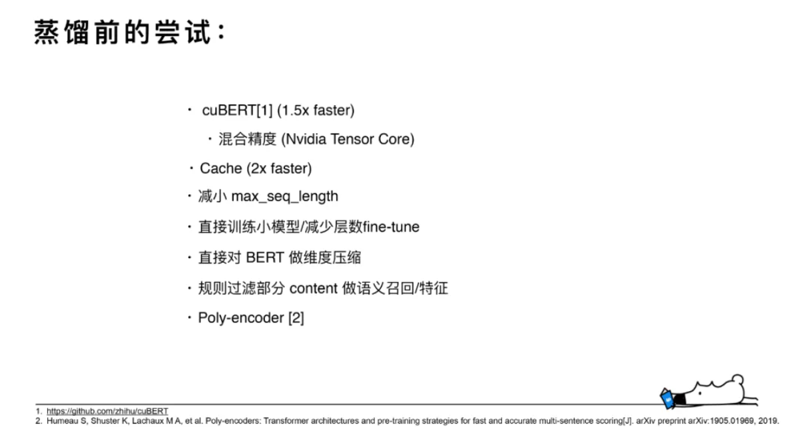

BERT 交互模型的部署放弃了使用原生TF serving，而是在cuda 的基础上用c++ 重写了模型的加载和serving，加上混合精度的使用。在我们的业务规模上，线上实时性能提高到原来的约 1.5 倍，使BERT交互模型满足了的最低的可上线要求。在这个基础上，对线上的 BERT 表示模型增加 cache，减少约 60% 的请求，有效减少了GPU 机器资源的消耗。

另一个思路是尝试给BERT在横向和纵向维度上瘦身。横向上，一方面可以减小serving 时 max_seq_length长度，减少计算量；另一方面可以对表示向量进行维度压缩来降低存储开销。这两种尝试在离线和在线指标上都有不同程度的损失，因此被放弃。纵向上，主要是减少模型的深度，即减少 transformer层数。这对于显存和计算量都能得到显著的优化。前期尝试过直接训练小模型，以及使用BERT-base若干层在下游的相关性任务上进行fine-tune。这两种方案，在离线指标上的表现就没法达到要求，因此也没有上线。

针对 doc数量过大，存储开销过大和语义索引构建慢的问题。在这方面做了一个妥协的方案：通过wilson score 等规则过滤掉大部分低质量的 doc，只对约 1/3 的doc 存储表示向量和构建语义索引。该方案会导致部分文档的相关性特征存在缺失。对于表示模型存在的低交互问题，尝试Poly-encoder（Facebook方案）将固定的 768维表示向量转为多个head的形式，用多个head做attention的计算，保证性能在部分下降的前提得到部分精度的提升。

### 蒸馏

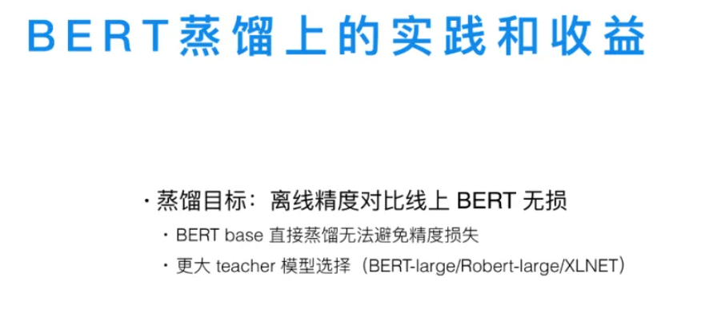

在做 BERT蒸馏前其实已经做了很多尝试，但是多少都会有精度的损失。因此，我们做蒸馏的第一目标是离线模型对⽐线上 BERT精度⽆损。但对BERT-base 直接进行蒸馏，无论如何都没办法避免精度的损失，所以我们尝试用更大的模型（比如BERT-large/Robert-large/XLNET）来作为 teacher 进行蒸馏。这些多层的模型均在我们知乎全量语料先做pretrain，再做fine-tune，得到微调后的模型再做蒸馏。

**蒸馏-Patient KD**

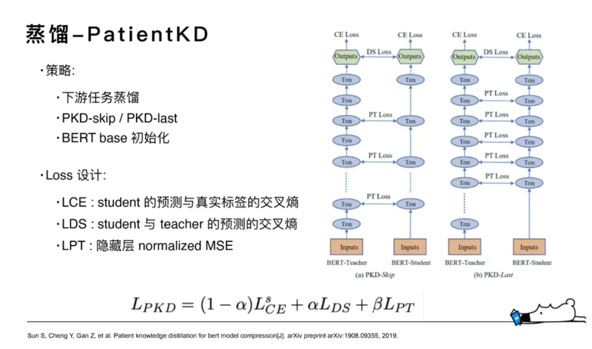

我们对交互模型和表示模型都做了蒸馏，主要采用了Patient KD模型的结构设计，Student模型基于BERT-base的若干层运用不同的策略进行参数的初始化，去学习Robert-large大模型的方案。

其中知识迁移主要有三部分：student的预测与真实标签的交叉熵、student与teacher的预测的交叉熵和中间隐层的向量之间的normalized MSE。

**BERT交互模型蒸馏**

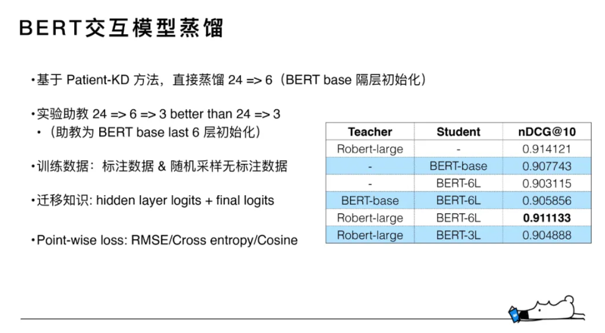

对于我们选的teacher模型Robert-large，单纯预训练模型其nDCG指标为0.914，线上之前使用的BERT-base 是0.907，若对BERT-base的若干6层直接去做fine-tune能达到的最高指标是0.903，对比于BERT-base精度会损失很多。

我们这块做了一些尝试，基于Robert-large从24层蒸馏到6层的话能到0.911，能超过线上BERT-base的效果。

训练数据方面，我们经历了点击日志数据挖掘到逐渐建立起完善的标注数据集。目前，相关性任务训练和蒸馏主要均基于标注数据集。标注数据分为 title和 content两部分，Query 数量达到 10w+ 的规模，标注 doc 在 300w ~ 400w 之间。

**BERT表示模型蒸馏**

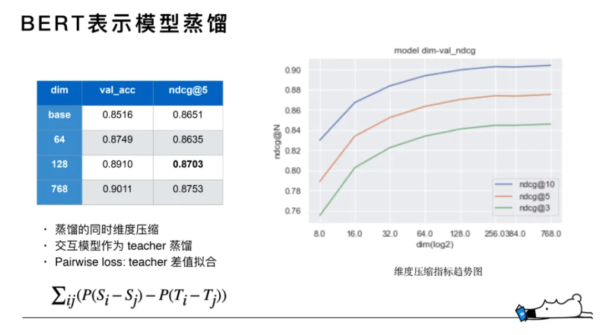

在BERT表示模型上，蒸馏时我们希望对向量维度和模型层数同时进行压缩，但蒸馏后得到的student模型表现不及预期。所以最后上线的方案中，表示模型层数还是维持了12层。在蒸馏时，为了提高精度，选取交互模型作为teacher进行蒸馏。因为交互模型是query和doc之间的打分，交互模型得到的logits与表示模型点乘后的打分在数量值会有较大差值，所以用pairwise形式通过teacher差值拟合来进行loss的计算。

在维度压缩方面我们做了对比实验，BERT模型输出做 average pooling 后接全连接层分别压缩至8维到768维。如图所示，128维和64维的表现跟768维差别不大，在上线时选择维度为64和128进行尝试，两者在线上表现没有太明显的差异，最终选择了64维的方案，把模型的维度压缩了12倍，存储消耗更低。

**蒸馏的收益**

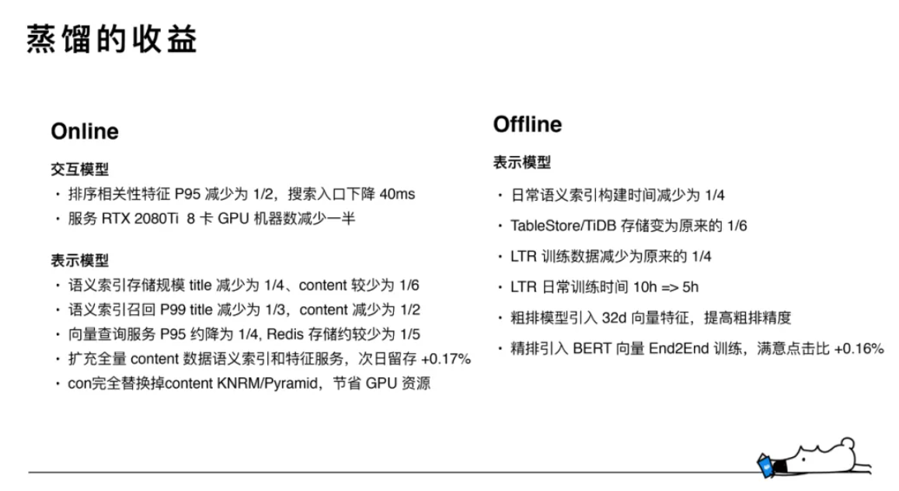

**在线方面：**

交互模型的层数从12层压缩到6层，排序相关性特征P95减少为原本的1/2，整体搜索入口下降40ms，模型部署所需的GPU机器数也减少了一半，降低了资源消耗。

表示模型语义索引存储规模title减为1/4，content维度从768维压缩至64维，虽然维度减少了12倍，但增加了倒排索引doc的数量，所以content最终减为1/6，

语义索引召回也有比较大的提升，title减少为1/3，content减少为1/2。精排模块需要线上实时查询离线计算好的向量，所以查询服务也有提升。

**离线方面：**

表示模型语义索引的构建时间减少为1/4，底层知乎自研的TableStore/TIDB存储减为原来的1/6，LTR训练数据和训练时间都有很大的提升，粗排早期用的是BM25等基础特征，后来引入了32维的BERT向量，提升了精排精度。

## 工具

**哈工大讯飞联合实验室全新推出模型裁剪工具包TextPruner**

项目地址：http://textpruner.hfl-rc.com

或访问：https://github.com/airaria/TextPruner

TextPruner提供了3种裁剪模式，分别为**词表裁剪**（Vocabulary Pruning），**Transformer裁剪**（Transformer Pruning）和**流水线裁剪**（Pipeline Pruning）。

- **词表裁剪**：预训练模型通常包含对具体任务来说冗余的词表。通过移除词表中未在具体任务未出现的token，可以实现减小模型体积，提升MLM任务速度的效果；
- **Transformer裁剪**：另一种裁剪方式是裁剪每个transformer模块的大小。TextPruner找到并移除每个transformer中“不重要”的注意力头和全连接层神经元，从而在减小模型体积的同时把对模型性能的影响尽可能降到最低；
- **流水线裁剪**：在该模式中，TextPruner对给定模型依次分别进行Transformer裁剪和词表裁剪，对模型体积做全面的压缩。


## 总结

上述的各项对BERT进行模型压缩的工作都在该领域取得一定的进展，例如参数效率都取得很好的成果，但每一项工作还是有的各种限制，例如训练与推断速度在多种场景下也是极其重要的，所幸的是，以上所介绍的方法并不完全互相冲突，在工业界应用中尝试将多种方法协同使用也是不错的选择。除此之外，上述工作的共有限制是由经验老道的作者针对BERT模型的各项缺点进行定向分析来提出模型压缩的办法，即以手动的启发式或者规则的方法，这种方式往往是次优的。那么能不能由机器去自动学习如何压缩和加速模型，这可以从AutoML [7]等领域研究，我们期待并努力着。

References.

[1] Zafrir O, Boudoukh G, Izsak P, et al.Q8bert: Quantized 8bit bert[J]. arXiv preprint arXiv:1910.06188, 2019.

[2] Sanh V, Debut L, Chaumond J, et al.DistilBERT, a distilled version of BERT: smaller, faster, cheaper andlighter[J]. arXiv preprint arXiv:1910.01108, 2019.

[3] Jiao X, Yin Y, Shang L, et al.Tinybert: Distilling bert for natural language understanding[J]. arXiv preprintarXiv:1909.10351, 2019.

[4] Sun Z, Yu H, Song X, et al. MOBILEBERT:TASK-AGNOSTIC COMPRESSION OF BERT FOR RESOURCE LIMITED DEVICES[J].

[5] Mukherjee S, Awadallah A H. DistillingTransformers into Simple Neural Networks with Unlabeled Transfer Data[J]. arXivpreprint arXiv:1910.01769, 2019.

[6] Sun S, Cheng Y, Gan Z, et al. Patient knowledge distillation for bert model compression[J]. arXiv preprint arXiv:1908.09355,2019.

[7] He Y, Lin J, Liu Z, et al. Amc: Automlfor model compression and acceleration on mobile devices[C]//Proceedings of the European Conference on Computer Vision (ECCV). 2018: 784-800.

## 参考资料

[知乎搜索文本相关性与知识蒸馏](https://mp.weixin.qq.com/s/ybMXgjoZC-Ej8MFBnYGtCw)

[BERT 蒸馏在垃圾舆情识别中的探索](https://segmentfault.com/a/1190000023275852)（蒸馏，textcnn）

[关于BERT的模型压缩简介](https://zhuanlan.zhihu.com/p/110934513)

[BERT模型蒸馏完全指南（原理/技巧/代码）](https://zhuanlan.zhihu.com/p/273378905)（rumor）

[模型压缩实践收尾篇——模型蒸馏以及其他一些技巧实践小结](https://zhuanlan.zhihu.com/p/124215760)（邱震宇）

[【NLP笔记】Bert模型压缩(蒸馏|剪枝|量化)小记](https://zhuanlan.zhihu.com/p/282777488)

[知识蒸馏 | 综述：蒸馏机制](https://mp.weixin.qq.com/s/zEEACz7O7qSyo7DRpi1bSA)（三种蒸馏方式）

[ACL'22 | 陈丹琦提出CoFi模型剪枝，加速10倍，精度几乎无损](https://mp.weixin.qq.com/s/0VO036qHI8JYfYu_r-3Tgw)

[深度神经网络模型蒸馏Distillation](https://zhuanlan.zhihu.com/p/71986772)  #td 

[深度学习中的知识蒸馏技术（上）](https://zhuanlan.zhihu.com/p/353472061) #td 

[知识蒸馏综述：代码整理](https://mp.weixin.qq.com/s/TbDpGrpsIYG3khsXrazyHw) #td 

