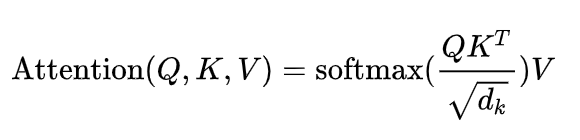
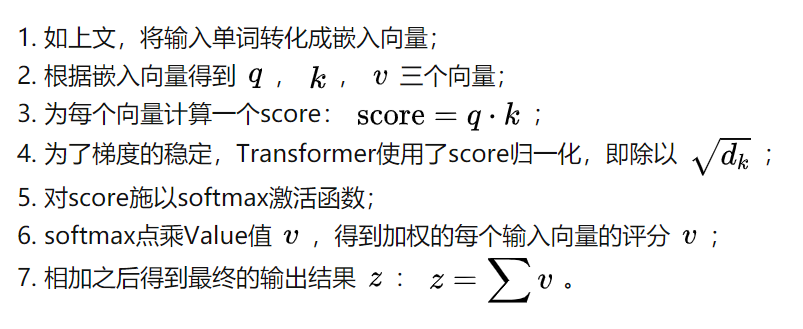
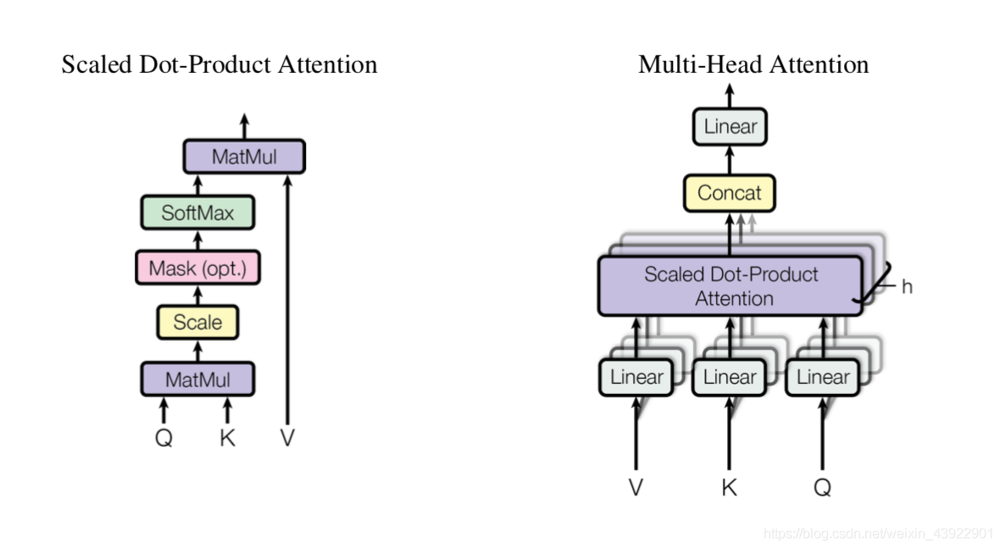

# Attention

attention有很多种形态，大家通常会说5种：hard attention，soft attention，Global Attention，local attention，self attention。


**hard attention** ：
Hard Attention不会选择整个encoder的隐层输出做为其输入，它在t时刻会依多元伯努利分布来采样输入端的一部分隐状态来进行计算，而不是整个encoder的隐状态。在 hard attention 里面，每个时刻 t 模型的序列 [ St1,…,StL ] 只有一个取 1，其余全部为 0，是 one-hot 形式。也就是说每次只focus 一个位置。


**soft attention** ：
对于hard attention，soft attention 每次会照顾到全部的位置，只是不同位置的权重不同罢了。


**global attention** ：
global attention 顾名思义，forcus 全部的 position。它 和 local attention 的主要区别在于 attention 所 forcus 的 source positions 数目的不同。


**Local Attention** :
Local Attention只 focus 一部分 position，则为 local attention
global attention 的缺点在于每次都要扫描全部的 source hidden state，计算开销较大，为了提升效率，提出 local attention，每次只 focus 一小部分的 source position。

## self attention
**动机**：说起self-attention的提出，是因为rnn存在非法并行计算的问题，而cnn存在无法捕获长距离特征的问题，因为既要又要的需求，当看到attention的巨大优势，《Attention is all you need》的作者决定用attention机制代替rnn搭建整个模型，于是Multi-headed attention，横空出世。

Self-Attention原始的形态：$softmax(XX^T)X$

- $XX^T$是一个矩阵乘以它自己的转置，可以看成矩阵的每个向量分别与其他向量计算内积。

- 向量的内积**表征两个向量的夹角，表征一个向量在另一个向量上的投影**。**投影的值大，说明两个向量相关度高**。

- 更进一步，这个向量是词向量，是词在高维空间的数值映射。词向量之间相关度高表示什么？是不是**在一定程度上**（不是完全）表示，在关注词A的时候，应当给予词B更多的关注？

- **矩阵**$XX^T$ **是一个方阵，我们以行向量的角度理解，里面保存了每个向量与自己和其他向量进行内积运算的结果。**

- softmax的作用是归一化。Attention机制的核心就是加权求和，权重就是归一化得到的。
- 最后乘以$X$，得到的结果中的每一个行向量都是**词向量经过注意力机制加权求和之后的表示。**



注意力头的维度是默认64.


**Attention的计算方法：**



**`Q`** **`K`** **`V`矩阵**

- 其来源是X与矩阵的乘积，**本质上都是**X**的线性变换**。不直接使用X而对其进行线性变换是为了提升模型的拟合能力，矩阵W都是可以训练的，起到一个缓冲的效果。
- Query，Key，Value的概念取自于信息检索系统，举个简单的搜索的例子来说。当你在某电商平台搜索某件商品（年轻女士冬季穿的红色薄款羽绒服）时，你在搜索引擎上输入的内容便是Query，然后搜索引擎根据Query为你匹配Key（例如商品的种类，颜色，描述等），然后根据Query和Key的相似度得到匹配的内容（Value)。
- **Q表示为了编码当前词，需要去注意(attend to)其它(其实也包括它自己)的词，我们需要有一个查询向量。而Key向量可以认为是这个词的关键的用于被检索的信息，而Value向量是真正的内容。**
- self-attention中的Q，K，V也是起着类似的作用，**在矩阵计算中，点积是计算两个矩阵相似度的方法之一，因此式1中使用了$QK^T$进行相似度的计算。接着便是根据相似度进行输出的匹配，这里使用了加权匹配的方式，而权值就是query与key的相似度。**

**关于为什么要除以注意力头的维度？**

- 假设 Q 和 K 的均值为0，方差为1。它们的矩阵乘积$A^T=Q^TK$将有均值为0，方差为dk。当dk变得很大时，A中的元素的方差也会变得很大，如果A中的元素方差很大，那么softmax(A)的分布会趋于陡峭(分布的方差大，分布集中在绝对值大的区域)。总结一下就是softmax(A)的分布会和d有关。因此A中每一个元素除以dk的平方根后，方差又变为1.这使得softmax(A)的分布“陡峭”程度与d解耦，从而使得训练过程中梯度值保持稳定。
- 参考：[transformer中的attention为什么scaled?](https://www.zhihu.com/question/339723385/answer/782509914)

为什么用点乘而不是加性的attention？

- 常用的attention有加性的和点乘性的。这里用的是点乘（多了个scaling factor ）。理论上这两者的复杂度是相似的，但实际上点乘速度更快，空间效率也更高，因为它可以用高度优化的矩阵乘积来实现。

- 对于小的dk，两种机制表现相似，但是对于值更大的dk（不做scaling），加性的表现更好。（来自Transformer论文）

Multi-attention

- 对于输入矩阵(time_step, num_input)，每一组Q、K和V都可以得到一个输出矩阵Z(time_step, num_features)。

- 但是后面的全连接网络需要的输入是一个矩阵而不是多个矩阵，因此我们可以把多个head输出的Z按照第二个维度拼接起来，但是这样的特征有一些多，**因此Transformer又用了一个线性变换(矩阵WO)对它进行了压缩。**


- **Multi-Head Attention 通过多层的 Self-Attention 可以将输入语句映射到不同的子空间中，于是能够更好地理解到语句所包含的信息。**



目的与特点

- Self-attention的目的是学习句子内部的词依赖关系，捕获句子的内部结构。

- 而Multi-head Attention其实就是多个Self-Attention结构的结合，每个head学习到在不同表示空间中的特征。

- 优点：self-attention的特点在于无视词之间的距离直接计算依赖关系，能够学习一个句子的内部结构，实现也较为简单，可以并行计算。

- 缺点：**对self-attention来说，它跟每一个input vector都做attention，所以没有考虑到input sequence的顺序**。

代码实现

```python
# Muti-head Attention 机制的实现
from math import sqrt
import torch
import torch.nn


class Self_Attention(nn.Module):
    # input : batch_size * seq_len * input_dim
    # q : batch_size * input_dim * dim_k
    # k : batch_size * input_dim * dim_k
    # v : batch_size * input_dim * dim_v
    def __init__(self,input_dim,dim_k,dim_v):
        super(Self_Attention,self).__init__()
        self.q = nn.Linear(input_dim,dim_k)
        self.k = nn.Linear(input_dim,dim_k)
        self.v = nn.Linear(input_dim,dim_v)
        self._norm_fact = 1 / sqrt(dim_k)
        
    
    def forward(self,x):
        Q = self.q(x) # Q: batch_size * seq_len * dim_k
        K = self.k(x) # K: batch_size * seq_len * dim_k
        V = self.v(x) # V: batch_size * seq_len * dim_v
         
        atten = nn.Softmax(dim=-1)(torch.bmm(Q,K.permute(0,2,1))) * self._norm_fact # Q * K.T() # batch_size * seq_len * seq_len
        
        output = torch.bmm(atten,V) # Q * K.T() * V # batch_size * seq_len * dim_v
        
        return output
    
    
class Self_Attention_Muti_Head(nn.Module):
    # input : batch_size * seq_len * input_dim
    # q : batch_size * input_dim * dim_k
    # k : batch_size * input_dim * dim_k
    # v : batch_size * input_dim * dim_v
    def __init__(self,input_dim,dim_k,dim_v,nums_head):
        super(Self_Attention_Muti_Head,self).__init__()
        assert dim_k % nums_head == 0
        assert dim_v % nums_head == 0
        self.q = nn.Linear(input_dim,dim_k)
        self.k = nn.Linear(input_dim,dim_k)
        self.v = nn.Linear(input_dim,dim_v)
        
        self.nums_head = nums_head
        self.dim_k = dim_k
        self.dim_v = dim_v
        self._norm_fact = 1 / sqrt(dim_k)
        
    
    def forward(self,x):
        Q = self.q(x).reshape(-1,x.shape[0],x.shape[1],self.dim_k // self.nums_head) 
        K = self.k(x).reshape(-1,x.shape[0],x.shape[1],self.dim_k // self.nums_head) 
        V = self.v(x).reshape(-1,x.shape[0],x.shape[1],self.dim_v // self.nums_head)
        print(x.shape)
        print(Q.size())

        atten = nn.Softmax(dim=-1)(torch.matmul(Q,K.permute(0,1,3,2))) # Q * K.T() # batch_size * seq_len * seq_len
        
        output = torch.matmul(atten,V).reshape(x.shape[0],x.shape[1],-1) # Q * K.T() * V # batch_size * seq_len * dim_v
        
        return output
```


## 参考资料

[白话attention（上）](https://zhuanlan.zhihu.com/p/73357761)

[超详细图解Self-Attention的那些事儿](https://mp.weixin.qq.com/s/t2CY0xFFB1gwXChlDhlE3g)
