ELECTRA：Pre-training Text Encoders as Discriminators Rather Than Generator

https://github.com/google-research/electra

## 简介

ELECTRA的全称是Efficiently Learning an Encoder that Classifies Token Replacements Accurately，先来直观感受一下ELECTRA的效果：

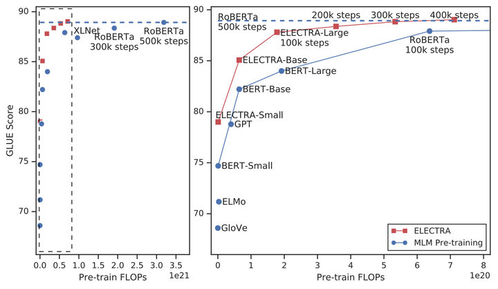

右边的图是左边的放大版，纵轴是GLUE分数，横轴是FLOPs (floating point operations)，Tensorflow中提供的浮点数计算量统计。从上图可以看到，同等量级的ELECTRA是一直碾压BERT的，而且在训练更长的步数之后，达到了当时的SOTA模型——RoBERTa的效果。从左图曲线上也可以看到，ELECTRA效果还有继续上升的空间。

ELECTRA 的创新点在于：

- 提出了新的模型预训练的框架，采用generator和discriminator的结合方式，但又不同于GAN
- 将Masked Language Model的方式改为了replaced token detection
- 因为masked language model 能有效地学习到context的信息，所以能很好地学习embedding，所以使用了weight sharing的方式将generator的embedding的信息共享给discriminator
- dicriminator 预测了generator输出的每个token是不是original的，从而高效地更新transformer的各个参数，使得模型的熟练速度加快
- 该模型采用了小的generator以及discriminator的方式共同训练，并且采用了两者loss相加，使得discriminator的学习难度逐渐地提升，学习到更难的token（plausible tokens）
- 模型在fine-tuning 的时候，丢弃generator，只使用discriminator

ELECTRA的论文指出，自己的模型效果能够达到state-of-the-art，但是在真正的GELU 榜单上，还是敌不过Roberta等模型。但是在小模型的表现上，我们可以发现ELECTRA的效果确实更加地好，所以ELECTRA的目前的作用主要：

- 可以利用这个框架，自己训练一个预训练模型，单个GPU就可以训练得到一个小的语言模型，然后在特定的领域可以得到更优的结果，然后再在这个领域下进行特定任务的finetuning。
- 使用小的ELECTRA模型，在不能使用GPU的场景，或者性能要求高的场景，可以得到好的结果
- ELECTRA的效果在多分类上不如Roberta，可能与预训练时采用的是二分类任务有关。

## **模型结构**

**NLP式的Generator-Discriminator**

BERT 在language model中取得了很多非常好的成就，具体参考[BERT讲解](https://zhuanlan.zhihu.com/p/103226488) ，但是

- BERT的MLM的实现，并不是非常高效的，只有15%的tokens对参数的更新有用，其他的85%是不参与gradients的update的
- 并且存在了预训练和fine-tuning的mismatch，因为在fine-tuning阶段，并不会有[MASK]的token。

ELECTRA提出了新的预训练任务和框架，把生成式的Masked language model(MLM)预训练任务改成了判别式的Replaced token detection(RTD)任务，判断当前token是否被语言模型替换过。那么问题来了，我随机替换一些输入中的字词，再让BERT去预测是否替换过可以吗？可以的，但效果并不好，因为随机替换**太简单了**。

那怎样使任务复杂化呢？。。。咦，咱们不是有预训练一个MLM模型吗？

于是作者就干脆使用一个MLM的G-BERT来对输入句子进行更改，然后丢给D-BERT去判断哪个字被改过，如下：

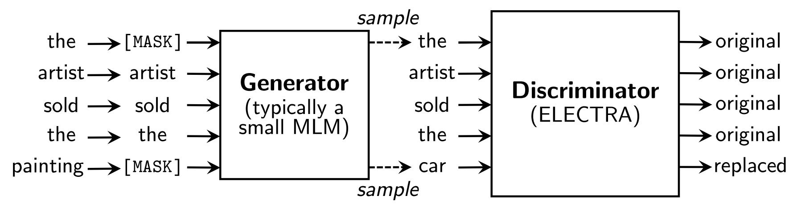

该模型由两部分组成，分别是generator以及discriminator，两个都是transformer的encoder结构，只是两者的size不同：

- generator：就是一个小的 masked language model（通常是 1/4 的discriminator的size），该模块的具体作用是他采用了经典的bert的MLM方式：

- - 首先随机选取15%的tokens，替代为[MASK]token，（取消了bert的80%[MASK],10%unchange, 10% random replaced 的操作，具体原因也是因为没必要，因为我们finetuning使用的discriminator)
  - 使用generator去训练模型，使得模型预测masked token，得到corrupted tokens
  - generator的目标函数和bert一样，都是希望被masked的能够被还原成原本的original tokens.如上图， token，`the` 和 `cooked` 被随机选为被masked，然后generator预测得到corrupted tokens，变成了`the`和`ate`

- discriminator：discriminator的接收被generator corrupt之后的输入，discriminator的作用是分辨输入的每一个token是original的还是replaced，注意：如果generator生成的token和原始token一致，那么这个token仍然是original的

- - 所以，对于每个token，discriminator都会进行一个二分类，最后获得loss

**Replaced Token Detection**

但上述结构有个问题，输入句子经过生成器，输出改写过的句子，因为句子的字词是离散的，所以梯度在这里就断了，判别器的梯度无法传给生成器，于是生成器的训练目标还是MLM（作者在后文也验证了这种方法更好），判别器的目标是序列标注（判断每个token是真是假），两者同时训练，但**判别器的梯度不会传给生成器**，目标函数如下：

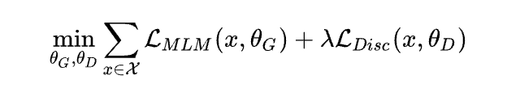

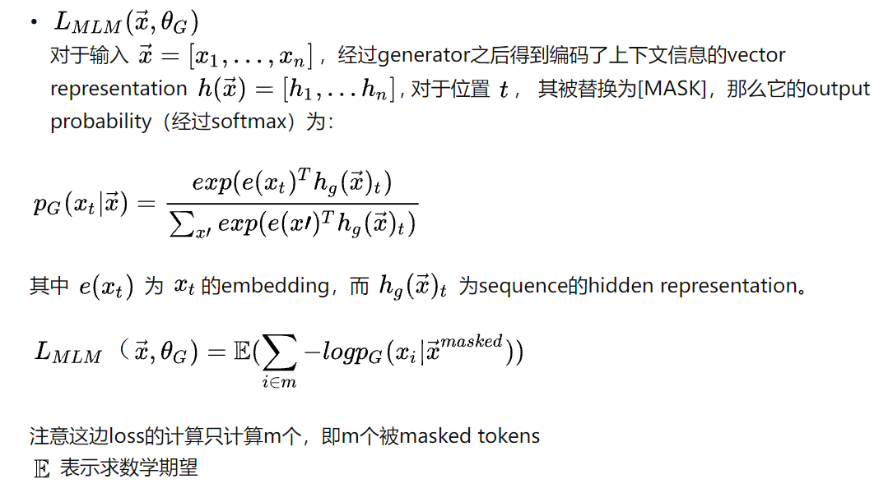

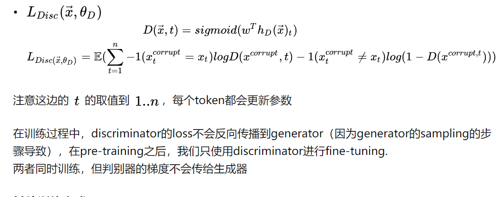

因为判别器的任务相对来说容易些，RTD loss相对MLM loss会很小，因此加上一个系数，作者训练时使用了50。

另外要注意的一点是，**在优化判别器时计算了所有token上的loss，而以往计算BERT的MLM loss时会忽略没被mask的token**。作者在后来的实验中也验证了在所有token上进行loss计算会提升效率和效果。

事实上，ELECTRA使用的Generator-Discriminator架构与GAN还是有不少差别，作者列出了如下几点：

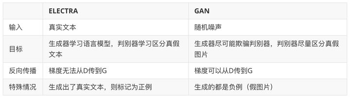

GAN 的训练是训练一个generator 产生结果，去骗过discriminator。所以generator的产生结果，在discriminator的都会认为是假的。

- 在我们的训练过程中，如果generator 产生的token和original token一样，discriminator应该认为这个token是real的
- generator是按照最大似然训练的，和discriminator 并没有交互
- generator 不是用来fool discriminator。
- generator的输入是真实文本，而GAN的输入是随机噪声
- discriminator的梯度不会传到generator，而GAN的梯度是会从discriminator传到generator的

[GAN 参考资料](https://link.zhihu.com/?target=https%3A//nbviewer.jupyter.org/github/hscspring/AI-Methods/blob/master/Gan-Tutorial/Gan.ipynb)

## **实验及结论**

### **Weight Sharing**

生成器和判别器的权重共享是否可以提升效果呢？作者设置了相同大小的生成器和判别器，在不共享权重下的效果是83.6，只共享token embedding层的效果是84.3，共享所有权重的效果是84.4。作者认为**生成器对embedding有更好的学习能力**，因为在计算MLM时，softmax是建立在所有vocab上的，之后反向传播时会更新所有embedding，而判别器只会更新输入的token embedding。最后作者只使用了embedding sharing。

generator和discriminator的weight 存在共享，但是并不是所有的参数都共享，如果是这样的话，那需要两者的size一样，所以模型采用了共享generator的embedding 权重。

为什么会选择共享embedding 权重呢，主要的原因是generator采用的MLM的方式训练，MLM根据token周围的context预测该token，可以很好地学习到embedding的表示。discriminator 只更新input或者被 generator sample 的tokens（因为2分类），而generator的softmax over vocabulary 会更新所有的token embeddings。然而在此基础上，replaced token detection 从所有的input tokens都做更新，所以参数更新的更有效率。两者结合，就产生了更好的结果。

### **Smaller Generators**

从权重共享的实验中看到，生成器和判别器只需要共享embedding的权重就足矣了，那这样的话是否可以缩小生成器的尺寸进行训练效率提升呢？作者在保持原有hidden size的设置下减少了层数，得到了下图所示的关系图：

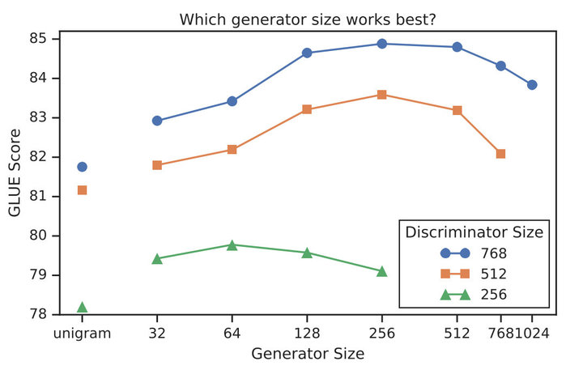

可以看到，**生成器的大小在判别器的1/4到1/2之间效果是最好的**。作者认为原因是**过强的生成器会增大判别器的难度**（判别器：小一点吧，我太难了）。

### **Training Algorithms**

实际上除了MLM loss，作者也尝试了另外两种训练策略：

1. Adversarial Contrastive Estimation：ELECTRA因为上述一些问题无法使用GAN，但也可以以一种对抗学习的思想来训练。作者将生成器的目标函数由最小化MLM loss换成了最大化判别器在被替换token上的RTD loss。但还有一个问题，就是新的生成器loss无法用梯度上升更新生成器，于是作者用强化学习Policy Gradient的思想，最终优化下来生成器在MLM任务上可以达到54%的准确率，而之前MLE优化下可以达到65%。
2. Two-stage training：即先训练生成器，然后freeze掉，用生成器的权重初始化判别器，再接着训练相同步数的判别器。

对比三种训练策略，得到下图：

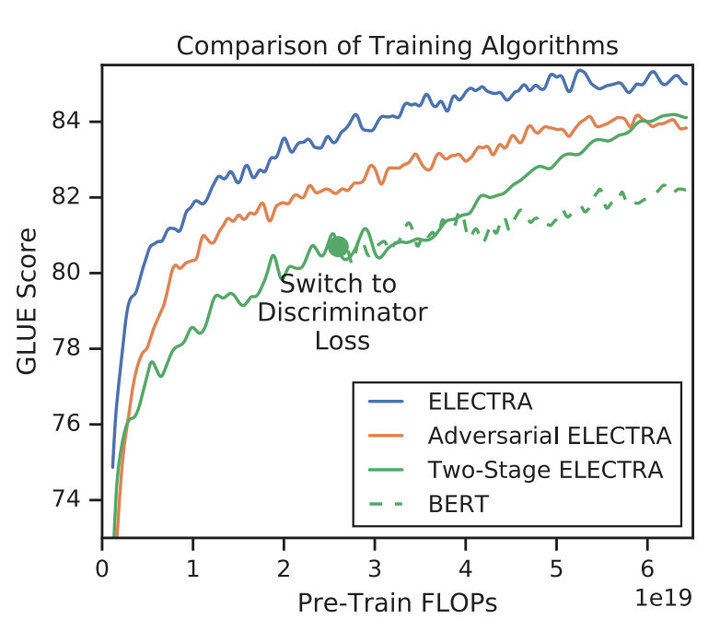

可见“隔离式”的训练策略效果还是最好的，而两段式的训练虽然弱一些，作者猜测是生成器太强了导致判别任务难度增大，但最终效果也比BERT本身要强，进一步证明了判别式预训练的效果。因为如果generator非常强，那么预测出来的token都非常好，即都是original tokens，那么discrinator 并不需要如何学习就收敛，因为它只需要把所有二分类都认为是1就行（假设1代表real）。

> joint learning algorithm
>
> 我们可以分析，为什么共同训练会使得模型得到好的效果？其实我们形象地理解，就是我们把generator当作是出题人，discriminator当作是答题者。模型在训练过程中，出题人出的题越来越有水平，答题者也随着积累，越来越厉害。而不是刚开始出题人出的题目就非常复杂，答题人根本没办法学习。
>
> 我们在bert中，mask是随机的，很容易会出现mask的token是非常简单的，而在electra中，corrupted tokens 是有一定难度的，而不是简单的mask，所以就使得discriminator能更好的学习。
>
> 比如说，输入是：一个聪明的模型，如果随机mask之后是：`一[MASK]聪明[MASK]模型`， 那么就很对模型来说很简单。而 `一个[MASK][MASK]的模型`，则对于模型来说就更复杂了。根据高质量的mask，那么我们的模型能学得更好discriminator 的二分类模型，将MLM连接在一起，而且它不需要考虑到每个position的数据分布，能够达到更高效训练的成果。
>
> 比如小时候学习语文，老师为了加深你对汉语的理解，总是给出一段话，把一些词去掉(当然老师会有目的性的选词，bert是随机的)，让你根据上下文来填写空缺词。我们可能会很快的根据上下文或者常识填好空缺词。(MLM)
>
> 这时，语文老师加大了难度，会给你一段话，让你挑出这段话中哪里用词不当。这就是electra 判别器的预训练任务。(RTP)

### **Small model? Big model？**

这两节真是吊打之前的模型，作者重申了他的主要目的是提升预训练效率，于是做了GPU单卡就可以愉快训练的ELECTRA-Small和BERT-Small，接着和尺寸不变的ELMo、GPT等进行对比，结果如下：

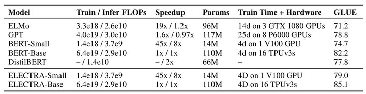

数据简直优秀，仅用14M参数量，以前13%的体积，在提升了训练速度的同时还提升了效果。

小ELECTRA的本事我们见过了，那大ELECTRA行吗？直接上图：

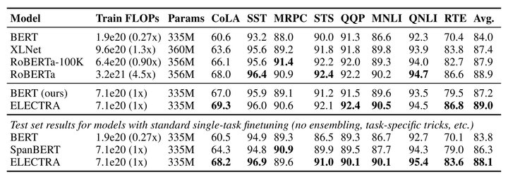

上面是各个模型在GLUE dev/text上的表现，可以看到ELECTRA仅用了1/4的计算量就达到了RoBERTa的效果。而且作者使用的是XLNet的语料，大约是126G，但RoBERTa用了160G。由于时间和精力问题，作者们没有把ELECTRA训练更久（应该会有提升），也没有使用各种榜单Trick，所以真正的GLUE test上表现一般（现在的T5是89.7，RoBERTa是88.5，没看到ELECTRA）。

### **Efficiency Analysis**

前文中提到了，BERT的loss只计算被替换的15%个token，而ELECTRA是全部都计算的，所以作者又做了几个实验，探究哪种方式更好一些：

1. ELECTRA 15%：让判别器只计算15% token上的损失
2. Replace MLM：训练BERT MLM，输入不用[MASK]进行替换，而是其他生成器。这样可以消除这种pretrain-finetune直接的diff。
3. All-Tokens MLM：接着用Replace MLM，只不过BERT的目标函数变为预测所有的token，而不是只预测15%的token，比较接近ELECTRA。

三种实验结果如下：

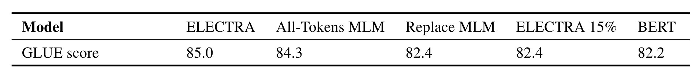

可以看到：

1. 对比ELECTRA和ELECTRA 15%：在所有token上计算loss确实能提升效果
2. 对比Replace MLM和BERT：[MASK]标志确实会对BERT产生影响，而且BERT目前还有一个trick，就是被替换的10%情况下使用原token或其他token，如果没有这个trick估计效果会差一些。
3. 对比All-Tokens MLM和BERT：如果BERT预测所有token 的话，效果会接近ELECTRA
4. all-token MLM比ELECTRA效果差，说明了ELECTRA的 replace token detection比MLM更高效。

另外，作者还发现，ELECTRA体积越小，相比于BERT就提升的越明显，说明fully trained的ELECTRA效果会更好。另外作者推断，**由于ELECTRA是判别式任务，不用对整个数据分布建模，所以更parameter-efficient**。

## **总结**

无意中发现了这篇还在ICLR盲审的ELECTRA，读完摘要就觉得发现了新大陆，主要是自己也试过Replaced Token Detection这个任务，因为平时任务效果的分析和不久前看的一篇文章，让我深刻感受到了**BERT虽然对上下文有很强的编码能力，却缺乏细粒度语义的表示**，我用一张图表示大家就明白了：

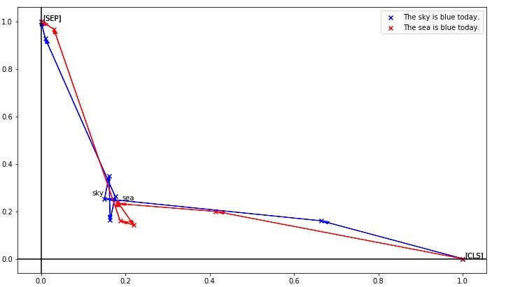

这是把token编码降维后的效果，可以看到sky和sea明明是天与海的区别，却因为上下文一样而得到了极为相似的编码。细粒度表示能力的缺失会对真实任务造成很大影响，如果被针对性攻击的话更是无力，所以当时就想办法加上更细粒度的任务让BERT去区分每个token，不过同句内随机替换的效果并不好，弱鸡的我也没有再往前想一步，不然就也ICLR了。相信这个任务很多人都想到过，不过都没有探索这么深入，这也告诫我们，idea遍地都是，往下挖才能有SOTA。

**ELECTRA是BERT推出这一年来我见过最赞的idea，它不仅提出了能打败MLM的预训练任务，更推出了一种十分适用于NLP的类GAN框架**。毕竟GAN太牛逼了，看到deepfake的时候我就想，什么时候我们也能deepcheat，但听说GAN在NLP上的效果一直不太好（只懂皮毛，要学起来了，轻拍），这次ELECTRA虽然只用了判别器，但个人认为也在一定程度上打开了潘多拉魔盒。

## 参考资料

[ELECTRA: 超越BERT, 19年最佳NLP预训练模型](https://zhuanlan.zhihu.com/p/89763176)

[ELECTRA 详解](https://zhuanlan.zhihu.com/p/118135466)