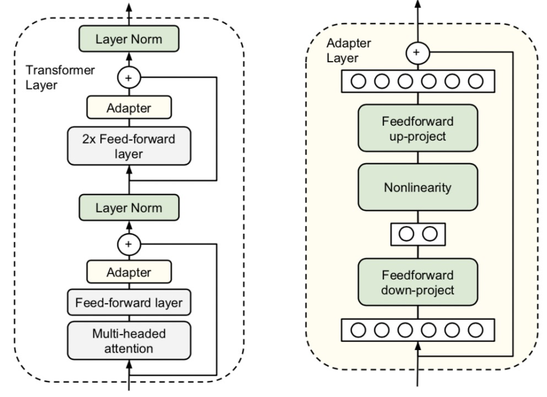
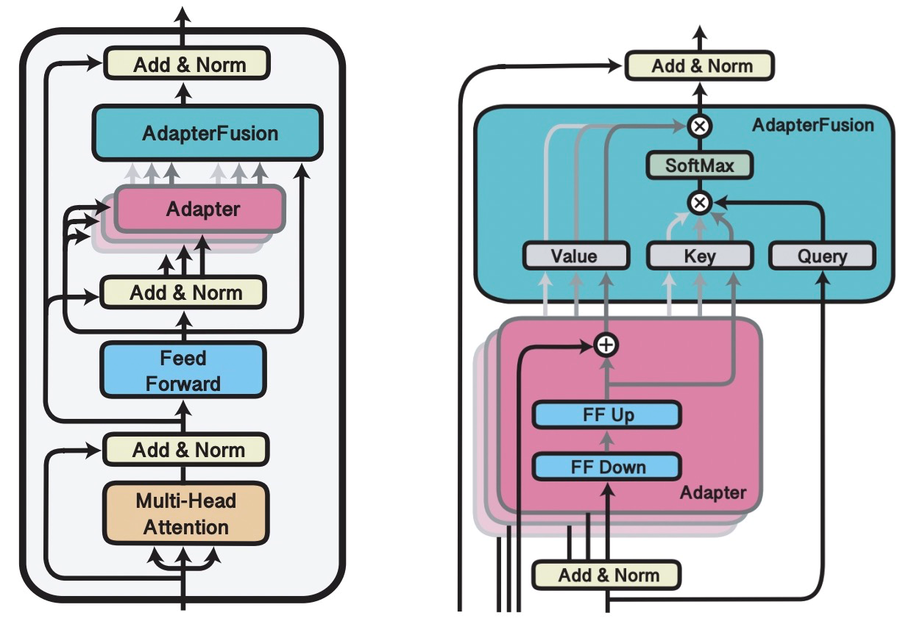
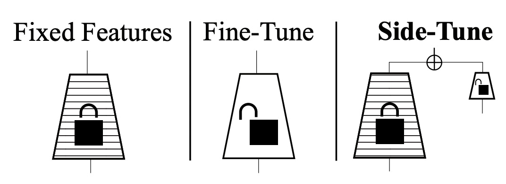
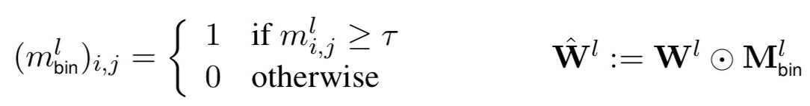
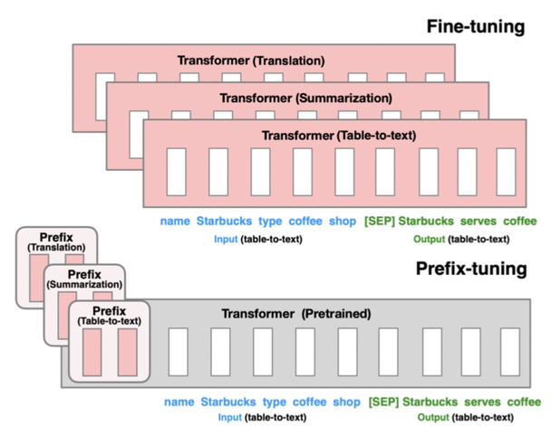

Finetune将原来的模型在下游任务上进行训练，而feature-based方法使用预训练模型产出的词、句子等embedding作为输入，接下游一个独立的模型进行预测。

## Adapter-tuning

***Parameter-Efficient Transfer Learning for NLP（ICML 2019）***提出，只需要finetune少量参数就能达到和finetune整个模型不相上下的效果。

具体做法为，在原来的Bert模型的每层中间加入两个adapter，adapter首先通过全连接对原输入进行降维进一步缩小参数量，经过内部的NN后再将维度还原，形成一种bottleneck的结构。在finetune过程中，原预训练Bert模型的参数freeze住不更新，只更新adapter的参数，大大减少了finetune阶段需要更新和保存的参数量。

***AdapterFusion: Non-Destructive Task Composition for Transfer Learning（2021）***在Adapter Finetune的基础上，提出当下游存在多个任务的时候，使用两阶段的Finetune。第一阶段和Adapter Finetune的思路一样，在预训练大模型基础上加上每个任务的adapter进行finetune，大模型参数freeze。在第二阶段，继续freeze预训练模型，同时freeze住第一阶段训练的adapter模型参数，学习一个AdapterFusion模型，这个模块的作用是融合各个adapter的信息，实现下游多个任务之间的信息共享。AdapterFusion部分的思路是，利用当前样本在FF层的输出和各个任务的adapter输出做Attention，实现从多个Adapter产出信息中的选择和融合。这样模型实现了根据每个样本选择合适的adapter输出，综合了多任务的adapter信息。 

## Side-Tuning

***Side-tuning: A baseline for network adaptation via additive side networks（ECCV 2019）***提出了一种side-tuning的方法。如下图，side-tune是在原来的预训练模型基础上，增加一个小的side network，然后将预训练模型的输入和side-network的输出进行融合。融合的方法文中提出使用一个可学习的参数α进行加权融合就能取得比较的效果。在训练过程中，预训练模型不会进行更新，只更新side-network部分的参数。Side模型的尺寸和复杂度也可以根据任务的难易程度进行调整。Side-tuning和adapt-tuning有相似之处，都是利用一个附属的小模型对原预训练大模型的表示进行更精细化的针对下游任务的调整。

## Mask-tuning

***Masking as an efficient alternative to finetuning for pretrained language models（2020）***提出一种简单的mask方法实现高效finetune。相比一般的finetune，该方法在finetune阶段不对参数进行调整，而是学习一个mask矩阵。对于每一个Transformer层，都会学习一个0-1的矩阵，然后用这个矩阵对该层所有全连接权重进行缩放。公式如下，m表示矩阵中某一个元素，根据一个阈值设置为1或0，再用这个矩阵和每层的全连接参数相乘进行对应元素的缩放。

Mask-tuning的出发点为，在预训练模型finetune的过程中，其实不需要finetune那么多参数，只要finetune一些关键参数就能达到较好的效果，减少finetune阶段计算的冗余性。在***How fine can fine-tuning be? Learning efficient language models（2020）***一文中也提出了类似的思路。

## Prefix-tuning

***REFORMER: THE EFFICIENT TRANSFORMER（ICLR 2020）***提出了采用局部敏感哈希的方法提升Transformer效率。当序列较长时，QK^T的维度[batch_size, L, L]的计算量和存储开销会非常大，但是由于我们关注的是softmax后的结果，并不关注QK^T本身是什么，而softmax只关注值最大的几个元素，因此我们可以只选择k<<L个有最大概率和query最相似的key来计算QK^T即可近似实现目标。那么如果找到有最大概率和query相似的k个key呢？Reformer采用了局部敏感哈希的方法。局部敏感哈希指的是，将每个元素进行hash编码，hash前离得近的元素hash后大概率在一个桶里，那么这种hash就是局部敏感哈希。下图左侧是一个一般的hash，会把元素随机hash，而右侧的局部敏感哈希，哈希前相邻的元素大概率会分到同一个桶里。

***Prefix-Tuning: Optimizing Continuous Prompts for Generation（2021）***提出的方法只finetune 0.1%的参数就取得和finetune相当的效果，并且在少样本任务上效果优于finetune。本文提出针对自然语言生成任务（如摘要生成、table-to-text等任务）的迁移预训练大模型的方法。基于Language models are few-shot learners（2020，GPT3）等文章中提出的Prompt思路，只要能给模型一个合适的上下文信息context，预训练的语言模型不需要修改参数就能很好的解决下游问题。例如当我们想生成Obama这个词，只要上下文信息给Barack，模型就可有可能生成Obama，因为模型在预训练阶段已经学到了这些信息。

该方法的具体实现为，将预训练的Transformer模型参数整体Freeze住，当正常输入文本序列的时候，在最前端添加几个prefix id，每一个prefix id都对应一个随机初始化的embedding，不同的任务有不同的prefix id。这样在模型中，prefix之后每个时刻的表示都会受到prefix的影响，prefix代表某个对应具体任务的上下文信息。在Finetune过程中，模型的其他参数都Freeze，只finetune prefix的embedding，以及prefix后面接的一些全连接层，Finetune参数量只占整体模型的0.1%，远小于其他的Finetune方法。该方法核心思想利用了prefix embedding去学习对于某个任务来说，需要从预训练语言模型中提取什么样的信息。

