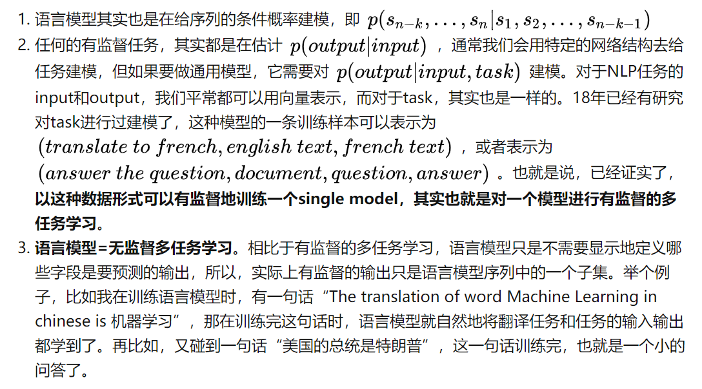

## 概览

GPT (117M parameters; Radford et al., 2018.6) 
- Transformer decoder with 12 layers. 
- Trained on BooksCorpus: over 7000 unique books (4.6GB text).

GPT-2 (1.5B parameters; Radford et al., 2019.2) 
- paper: **Language Models are Unsupervised Multitask learners**
- Same architecture as GPT, just bigger (117M -> 1.5B) 
- But trained on much more data: 4GB -> 40GB of internet text data (WebText) 
- Scrape links posted on Reddit w/ at least 3 upvotes (rough proxy of human quality)
- 涌现出zero-shot的能力，在没有特定任务finetune的情况下打败了语言模型benchmark的SOTA

GPT-3 (175B parameters; Brown et al., 2020.5) 
- paper: **Language Models are Few-Shot Learners**
- Another increase in size (1.5B -> 175B) 
- data (40GB -> over 600GB), 预训练语料来源：Common Crawl, WebText2, Books1, Books2, and Wikipedia。原始数据有45T，从中过滤出来一部分。 
- In-context learning:在任务之前添加示例
- Few-Shot learning是model scale下涌现的能力

GPT-3.5
- 用GPT3微调过的模型，包括很多，看openai官网介绍 

**关键词:** 单向信息，NLU的pretrain-finetune差异

优化目标是单向(从左到右或者从右到左)建模序列的联合概率，是传统意义上的语言模型，后预测的词以先预测的词为条件，比较适合文本生成任务，但是缺陷是只使用了单向的语言表征信息，无法获取双向上下文信息表征，而文本理解任务中经常需要用到双向的上下文信息(比如，完形填空)，因此，这就带来了pre-train阶段和下游任务的不一致。

## GPT

GPT 采用两阶段过程，第一个阶段是利用语言模型进行预训练（无监督形式），第二阶段通过 Fine-tuning 的模式解决下游任务（监督模式下）。

GPT 的预训练过程其实和 ELMO 是类似的，主要不同在于两点：

1. 特征抽取器不是用的 RNN，而是用的 Transformer，它的特征抽取能力要强于 RNN，这个选择很明显是很明智的；
2. ELMO使用上下文对单词进行预测，而 GPT 则只采用 Context-before 这个单词的上文来进行预测，而抛开了下文。

GPT 使用 Transformer 的 Decoder 结构，并对 Transformer Decoder 进行了一些改动，原本的 Decoder 包含了两个 Multi-Head Attention 结构，GPT 只保留了 Mask Multi-Head Attention

GPT 在第二阶段如何使用。

1. 对于不同的下游任务来说，本来你可以任意设计自己的网络结构，现在不行了，你要**向** **GPT 的网络结构看齐**，把任务的网络结构改造成和 GPT 的网络结构是一样的。
2. 在做下游任务的时候，利用第一步预训练好的参数初始化 GPT 的网络结构，这样通过预训练学到的语言学知识就被引入到你手头的任务里来了，这是个非常好的事情。再次，你可以用手头的任务去训练这个网络，对网络参数进行 Fine-tuning，【类似图像领域预训练的过程】

举例说明
1. 对于分类问题，不用怎么动，加上一个起始和终结符号即可；
2. 对于句子关系判断问题，比如 Entailment，两个句子中间再加个分隔符即可；
3. 对文本相似性判断问题，把两个句子顺序颠倒下做出两个输入即可，这是为了告诉模型句子顺序不重要；
4. 对于多项选择问题，则多路输入，每一路把文章和答案选项拼接作为输入即可。这种改造还是很方便的，不同任务只需要在输入部分施工即可。

## GPT2
GPT2的核心思想就是认为**可以用无监督的预训练模型去做有监督任务**。GPT2模型的结构还是和GPT一样，它所适用的任务恰好是语言模型，这是大家再熟悉不过的公式。那为什么这个就能做有监督任务呢？平常的套路难道不是语言模型预训练+微调吗？

## GPT3

GPT-3 的训练过程与 GPT-2 类似，但对模型大小、数据集大小与多样性、训练长度都进行了相对直接的扩充。关于语境学习，GPT-3 同样使用了与 GPT-2 类似的方法，不过 GPT-3 研究团队系统地探索了不同的语境学习设定。

OpenAI 团队明确地定义了用于评估 GPT-3 的不同设定，包括 zero-shot、one-shot 和 few-shot。

- Fine-Tuning (FT)：微调是近几年来最为常用的方法，涉及在期望任务的特定数据集上更新经过预训练模型的权重；
- Few-Shot (FS)：在该研究中指与 GPT-2 类似的，在推理阶段为模型提供少量任务演示，但不允许更新网络权重的情形；
- One-Shot (1S)：单样本与小样本类似，不同的是除了对任务的自然语言描述外，仅允许提供一个任务演示；
- Zero-Shot (0S)：零次样本除了不允许有任何演示外与单样本类似，仅为模型提供用于描述任务的自然语言指示。

## 参考资料

[OpenAI GPT2原理解读（李rumor）](https://zhuanlan.zhihu.com/p/57251615)

[NLP：NLP领域没有最强，只有更强的模型——GPT-3的简介、安装、使用方法之详细攻略](https://blog.csdn.net/qq_41185868/article/details/107897654)

[【NLP-14】GPT模型（Generative Pre-Training）](https://www.cnblogs.com/yifanrensheng/p/13167796.html)

[万字拆解！追溯ChatGPT各项能力的起源](https://mp.weixin.qq.com/s/VYv8BRgGnp9ZTuXxaSuFwg)

